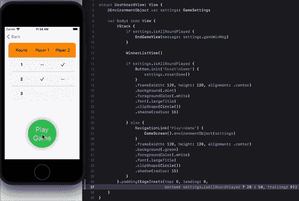

# SwiftUI:井字游戏完整指南

> 原文：<https://medium.com/globant/swiftui-complete-guide-with-tic-tac-toe-game-ae2fea4f980e?source=collection_archive---------1----------------------->

如果您渴望学习 SwiftUI，并希望获得一些关于如何完全使用 SwiftUI 开发完整应用程序的实际经验，请查看这些使用 SwiftUI 开发井字游戏的文章。每篇文章都深入介绍了 SwiftUI 的组件和特性。

[简介](/globant/dive-into-amazing-world-of-swiftui-f35a25c5e9ce)

[属性包装](/globant/swiftui-property-wrappers-explained-in-simplest-way-28cb580c6408)

[文本视图样式](/@roy11manisha/swiftui-text-view-styling-lets-play-tic-tac-toe-game-7987909584fb)

[按钮](/@roy11manisha/swiftui-tic-tac-toe-game-button-154a35997bc)

[导航](/@roy11manisha/swiftui-navigation-tic-tac-toe-game-d05d52cf4636)

[形状](/@roy11manisha/swiftui-shapes-tic-tac-toe-game-376073b11102)

[图纸](/@roy11manisha/swiftui-drawing-tic-tac-toe-game-71fae0d46381)

[数据流](/@roy11manisha/swiftui-data-flow-tic-tac-toe-game-bace4fbeb3ac)

[列表](/@roy11manisha/swiftui-list-tic-tac-toe-game-8ad7aaa4050)

[动画](/@roy11manisha/swiftui-animation-tic-tac-toe-game-4ffe37aba0b8)

> 如果你喜欢这篇文章，请用掌声和评论来欣赏它。这会鼓励我多写！！！！