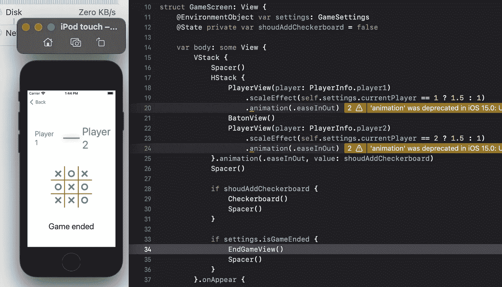
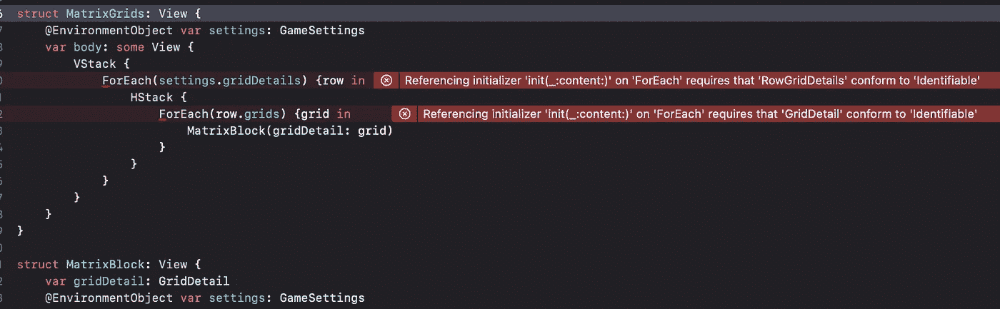
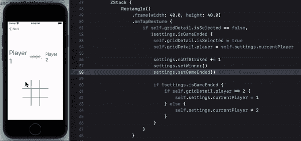

# SwiftUI |数据流|井字游戏

> 原文：<https://medium.com/globant/swiftui-data-flow-tic-tac-toe-game-bace4fbeb3ac?source=collection_archive---------1----------------------->

这是井字游戏[系列](/globant/swiftui-complete-guide-with-tic-tac-toe-game-ae2fea4f980e)的第 6 部分。在本文中，我们将学习 SwiftUI 中的数据流动，并为我们的游戏“井字游戏”添加一些规则。SwiftUI 用法[属性包装器](/globant/swiftui-property-wrappers-explained-in-simplest-way-28cb580c6408)用于在整个应用程序中传递数据和管理它们的状态。

第一个规则检查游戏是否已经结束。如果所有的格子都被选中或者宣布了获胜者，游戏就结束了。我们将首先关注网格选择，因为我们有一个标志 *noOfStrikes* 在 *GameSettings* 中，它跟踪双方玩家点击的次数。

> 请参考 SwiftUI [图纸](/@roy11manisha/swiftui-drawing-tic-tac-toe-game-71fae0d46381)文章获取最新代码。

跳回 MatrixBlock 视图内矩形的*on tagesture*。这里，我们将在更新 gridDetail 后增加 *noOfStrikes* :

```
...
self.gridDetail.player = self.settings.currentPlayersettings.noOfStrikes += 1
...
```

我们在 GameSettings 中增加了一个标志 is gamed，它发布了对观察视图的更新。在 GameSettings 中添加一个函数 setGameEnded，它将更新这个标志。

```
func setGameEnded() {
   if noOfStrikes == 9 {
      isGameEnded = true
   }
}
```

我们的棋盘上有 9 个格子，这就是为什么 9 个好球会结束游戏。我们将使用 isGameEnded publisher 的状态在棋盘下方显示 EndGameView。

创建一个新的 SwiftUI 文件，命名为 EndGameView，在这里用**游戏结束替换文本视图的内容。**代码将如下所示:

```
struct EndGameView: View {
   var body: some View {
      Text(“Game ended”)
         .multilineTextAlignment(.center)
         .font(.largeTitle)
   }
}
```



比赛已经结束，但还没有决定谁是赢家。井字游戏有以下决定赢家的规则:

*   同一个玩家在一条线上玩。
*   同一个运动员在一个纵队里比赛。
*   同一个玩家打对角。

在上面的截图中，我们可以看到玩家 2 是一个赢家，因为他/她在对角线上标记了 X。

为了决定赢家，我们需要跟踪玩家玩过的每个格子。MatrixBlock 有 GridDetail，它存储了足够多的网格细节来决定获胜者。但问题是，由于 MatrixGrids 正在使用 *ForEach 绘制直接的 3*3 矩阵块，因此无法跟踪这个单独的 GridDetail 来实现上述规则。*让我们首先把 GridDetail 实例放在一个地方，这样它们的数据就可以很容易地被访问，并且总是同步的。

创建一个新的结构 RowGridDetails，它将为单个行存储 GridDetail 的集合。我们将在 GameSettings 中保存这个 RowGridDetails 实例，因为这个 3*3 的棋盘属于游戏设置。

```
struct RowGridDetails {
   var grids: [GridDetail]
}class GameSettings: ObservableObject {
   var gridDetails: [RowGridDetails] = [
      RowGridDetails(grids: [GridDetail(), GridDetail(), GridDetail()]), RowGridDetails(grids: [GridDetail(), GridDetail(), GridDetail()]), RowGridDetails(grids: [GridDetail(), GridDetail(), GridDetail()])]
...
```

> 这将允许我们有一个 n*n 或 n*m 大小的棋盘。

现在遍历这个网格细节来创建 MatrixGrids。



更新代码后，您将看到以下错误:

*在“ForEach”上引用初始值设定项“init(_:content:)”要求“RowGridDetails”符合“identified”*

要修复此错误，我们需要确认 RowGridDetails 结构的可识别协议。确认后，您将被建议实施

```
var id: ObjectIdentifier
```

*id* 创建唯一标识给定类实例的实例。SwiftUI 将使用它来确定要更新/删除哪个视图等。 *id* 也可以是 Int。如果在没有初始化的情况下声明了 *id* ,那么这将导致在初始化 RowGridDetails 实例时传递一个额外的参数。有两种方法可以避免这种额外的争论。首先，在声明的时候用某个随机的整数值初始化它，这将导致所有的 RowGridDetails 都有相同的值，因此唯一性受到了损害。另一种方法建议用 UUID 初始化它，这样可以修复第一个错误，同时保持唯一性。

```
var id = UUID()
```

为了修复第二个错误，我们需要修改 GridDetail，但是在那里我们不会被要求添加 *id* ，因为它的类类型和类都有唯一的 id。

```
 class GridDetail: Identifiable {
   var isSelected = false
   var player = 0
}
```

运行代码后，我们将看到与显示“游戏结束”时相同的结果。现在，让我们开始添加寻找获胜者的规则。

```
private func isWinner(player: Int) -> Bool {
   for row in gridDetails {
      if row.grids.filter({$0.player == player}).count == 3 {
         return true
      }
   }...
```

一个玩家编号作为参数被传递，我们希望知道它的获胜状态。首先，我们遍历棋盘的行，并为每个网格过滤玩家的详细信息。因为我们有一个 3*3 的网格，如果所有三个网格都是由同一个玩家选择的，则返回 true。

```
...
for index in 0..<gridDetails.count {
   if gridDetails.filter({$0.grids[index].player == player}).count == 3 {
      return true
   }
}
```

这是遍历棋盘的列，如果计数为 3，再次返回 true。

```
if gridDetails[0].grids[0].player == player,
gridDetails[1].grids[1].player == player,
gridDetails[2].grids[2].player == player {
   return true
}if gridDetails[0].grids[2].player == player,
gridDetails[1].grids[1].player == player,
gridDetails[2].grids[0].player == player {
   return true
}return false
```

它将从左上角到右下角对角检查，如果没有找到获胜者，则从右上角到左下角对角检查。最后，如果 4 个条件都不满足，它将返回 false。这是针对一个玩家的，所以我们需要像这样对两个玩家调用两次来决定谁是赢家:

```
func setWinner() {
   if isWinner(player: PlayerInfo.player1.rawValue) {
      winner = PlayerInfo.player1.rawValue
   } if isWinner(player: PlayerInfo.player2.rawValue) {
      winner = PlayerInfo.player2.rawValue
   }
}
```

我们将在 MatrixBlock 的*on tagesture*中调用这个方法:

```
settings.noOfStrikes += 1
settings.setWinner()
settings.setGameEnded()
```

我们的赢家已经确定，但游戏还没有结束。要在决定赢家后结束游戏，只需在 setGameEnded 函数中添加对赢家状态的检查:

```
if winner != 0 || noOfStrikes == 9 {
```

显示谁赢了比赛不是个好主意？我们通过修改 EndGameView 来实现吧。

```
struct EndGameView: View {
   var winner: Int
   var body: some View {
      VStack {
         Text(“Game ended”)
         let message = winner == 0 ? “It’s a tie!!” : “Player \(winner) isa  winner”
         Text(“\(message)”)
            .foregroundColor(PlayerInfo.init(rawValue:   winner)?.getPlayerColor())
            .bold()
      }.multilineTextAlignment(.center)
       .font(.largeTitle)
   }
}
```

只是运行它，玩游戏。您将能够看到赢家的详细信息或比赛平局信息。一旦决定了获胜者，限制玩家继续玩，因为在执行任何操作之前添加 is gamed 标志。



为我们干杯！！！我们有自己的井字游戏，功能太全了。

**一定要看看我在这个系列中的其他文章:**

[文本视图样式](/@roy11manisha/swiftui-text-view-styling-lets-play-tic-tac-toe-game-7987909584fb)

[按钮](/@roy11manisha/swiftui-tic-tac-toe-game-button-154a35997bc)

[导航](/@roy11manisha/swiftui-navigation-tic-tac-toe-game-d05d52cf4636)

[形状](/@roy11manisha/swiftui-shapes-tic-tac-toe-game-376073b11102)

[绘画](/@roy11manisha/swiftui-drawing-tic-tac-toe-game-71fae0d46381)

[列表](/@roy11manisha/swiftui-list-tic-tac-toe-game-8ad7aaa4050)

[动画](/@roy11manisha/swiftui-animation-tic-tac-toe-game-4ffe37aba0b8)

> 如果你喜欢这篇文章，请用掌声和评论来欣赏它。这会鼓励我多写！！！！