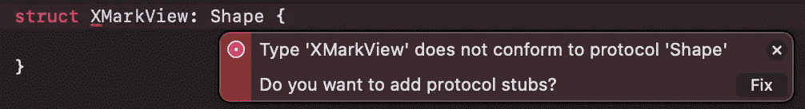
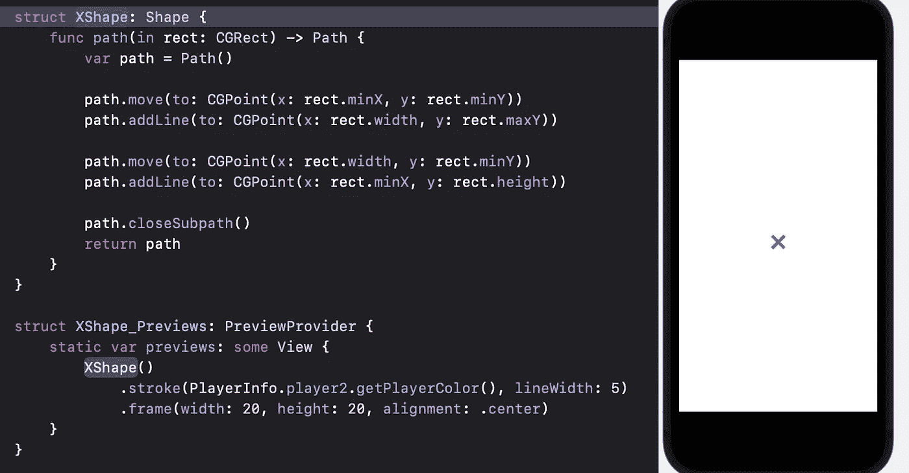
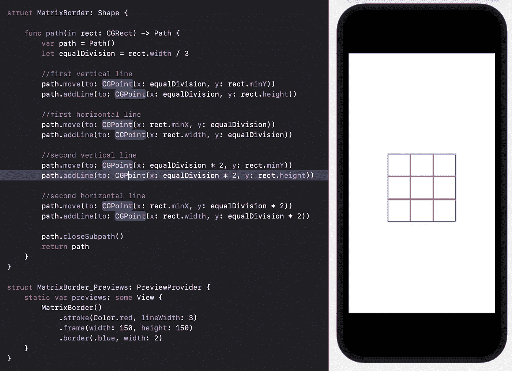
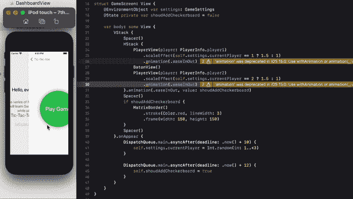
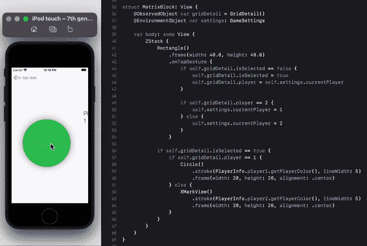
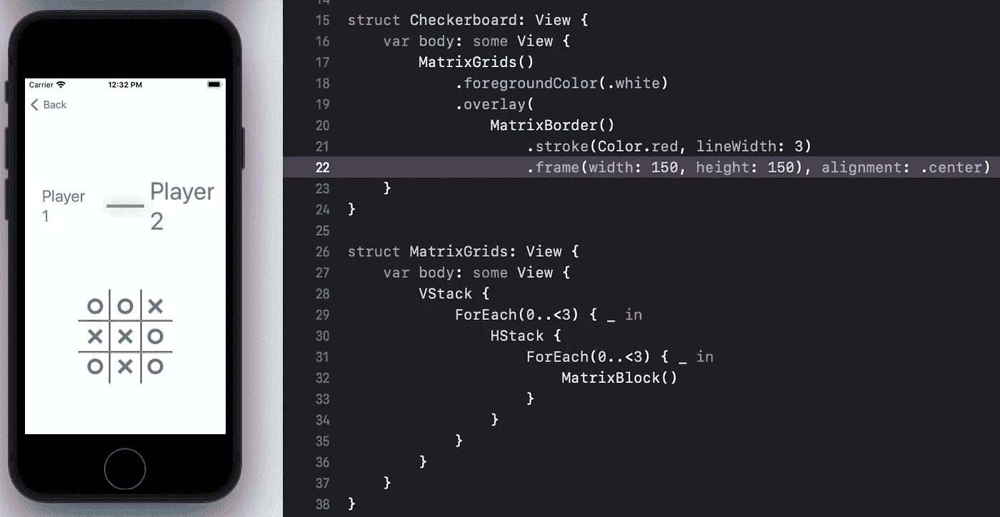

# SwiftUI |绘图|井字游戏

> 原文：<https://medium.com/globant/swiftui-drawing-tic-tac-toe-game-71fae0d46381?source=collection_archive---------0----------------------->

这是井字游戏[系列](/globant/swiftui-complete-guide-with-tic-tac-toe-game-ae2fea4f980e)的第 5 部分。在本教程中，我们将学习 SwiftUI 绘图，并为我们的游戏创建一个棋盘。

SwiftUI 有一个形状协议，我们需要在绘制自定义路径时确认该协议。形状协议有一个 path(in:)方法，该方法接受 CGRect 并返回路径。使用形状协议，我们可以绘制 SwiftUI 内置的形状，如矩形，圆形等。幸运的是，我们也可以在 SwiftUI 中使用 CGPath 或 UIBezierPath 重用我们以前绘制的路径。

我们将使用自定义路径绘制 X 标记。为此，我们将创建一个新的 SwiftUI 文件，并将其命名为 XMarkView。请注意，视图接受形状类型，这就是为什么我们将进行如下更改:



这里我们需要实现一个强制方法，path(in rect: CGRect) -> Path。创建并初始化一个路径变量，并从该方法返回它来解决这个构建时错误。

要画 X，我们需要两条对角线的线/路径。让我们把第一条线画成:

```
path.move(to: CGPoint(x: rect.minX, y: rect.minY))
path.addLine(to: CGPoint(x: rect.width, y: rect.maxY))
```

移动到左上角，然后会从左上角到右下角画一条线

```
path.move(to: CGPoint(x: rect.width, y: rect.minY))
path.addLine(to: CGPoint(x: rect.minX, y: rect.height))
```

我们需要移动到新的点，右上角，因为我们的线不是连续的。之后会从右上到左下划一条新的线。

预览时什么也看不到，因为我们需要给笔画或铅笔颜色以及绑定的细节，否则它将占据整个屏幕/父视图的尺寸。最终的外观将是这样的:



一旦绘制完成，我们将在返回新计算的形状之前添加 closeSubpath()，这样图形将开始绘制新的路径，而不需要调用 *move(to:)* 。

> 对于 O，使用 SwiftUI 内置圆形。

我们的 X 和 O 标记准备好了。接下来，我们需要使用 Path 设计一个棋盘。

创建一个新的 SwiftUI 文件，将其命名为 Shape 类型的 MatrixBorder，就像我们对 XMarkView 所做的那样。下面的例子说明了棋盘是如何绘制的。



一旦随机选择一个玩家开始游戏，我们将展示这个棋盘。返回 GameScreen 并创建一个状态变量 shoudAddCheckerboard，该变量最初为 false，一旦接力棒动画完成并选择了一个玩家，该变量将被设置为 true:

```
DispatchQueue.main.asyncAfter(deadline: .now() + 12) {
   self.shoudAddCheckerboard = true
}
```

我们将有条件地在游戏画面*主体中添加矩阵边界。*

```
if shoudAddCheckerboard {
   MatrixBorder()
      .stroke(Color.red, lineWidth: 3)
      .frame(width: 150, height: 150)
}
```

在更多的改动之后，我们将能够在游戏屏幕上看到这一点。



我们的棋盘 UI 已经准备好了，但是它没有执行任何点击操作。因为棋盘只是一个包含 4 条路径/线的形状。为了使玩家的行动变得棘手，我们需要添加一个 3*3 块的网格，每个块将根据玩家的回合画出 X 或 O。

通过命名 MatrixBlock 创建一个结构。这个视图会和玩家互动。

```
struct MatrixBlock: View {
   var body: some View {
      Rectangle()
         .frame(width: 40.0, height: 40.0)
         .foregroundColor(.white)
   }
}
```

这是玩家将点击的格子，X 或 O 将按照玩家的回合被抽取。为了存储网格细节，例如谁选择了该网格以及该网格是否已经被选择，我们需要一个对象模型:

```
class GridDetail: ObservableObject {
   @Published var isSelected = false
   var player = 0
}
```

在矩形上添加一个页面，用于在玩家点击时更新网格细节。

```
if self.gridDetail.isSelected == false {
   self.gridDetail.isSelected = true
   self.gridDetail.player = self.settings.currentPlayer
}
```

首先，检查这个特定的网格是否已经被选中。如果没有，那么选择它，并设置哪个玩家在上面玩过。要了解当前玩家的详细信息，我们将使用环境对象游戏设置。

> settings 是一个环境对象，因此我们不需要再次初始化它来访问数据。

网格细节已更新，但没有反映在设置中。第一次更新当前玩家详细信息:

```
if self.gridDetail.player == 2 {
   self.settings.currentPlayer = 1
} else {
   self.settings.currentPlayer = 2
}
```

一旦数据被更新，如果被玩家 1 选中，将会画出圆圈，否则将会画出 X。并添加以下代码:

```
if self.gridDetail.isSelected == true {
   if self.gridDetail.player == 1 {
      Circle()
         .stroke(PlayerInfo.player1.getPlayerColor(), lineWidth: 5)
         .frame(width: 20, height: 20, alignment: .center)
   } else {
      XMarkView()
         .stroke(PlayerInfo.player2.getPlayerColor(), lineWidth: 5)
         .frame(width: 20, height: 20, alignment: .center)
   }
}
```

到目前为止，我们已经设计了我们自己的网格，但我们需要 3*3 个网格，所以让我们将它安排在 MatrixGrids 结构中，如下所示:

```
struct MatrixGrids: View {
   var body: some View {
      VStack {
         ForEach(0..<3) { _ in
            HStack {
               ForEach(0..<3) { _ in
                  MatrixBlock()
               }
            }
         }
      }
   }
}
```

内部 for 循环将水平排列 3 个网格，然后外部 for 循环将绘制包含它们的 3 个垂直网格。

```
struct Checkerboard: View {
   var body: some View {
      MatrixGrids()
         .foregroundColor(.red)
   }
}
```

只需添加这些代码并调用 Checkerboard 而不是 MatrixBorder。

```
...
if shoudAddCheckerboard { Checkerboard()
...
```



在这里，我们有红色的网格和白色的棋盘边界，但我们希望它以另一种方式。要实现它，使用我们的 MatrixBorder 并将其添加为 MatrixGrids 上的覆盖图。



我们已经绘制了自己的功能性井字游戏，这难道不令人惊讶吗？但是等等，我们仍然需要添加一些规则来结束游戏并选择获胜者。

请务必查看我在这个系列中的其他文章:

[文本视图样式](/@roy11manisha/swiftui-text-view-styling-lets-play-tic-tac-toe-game-7987909584fb)

[按钮](/@roy11manisha/swiftui-tic-tac-toe-game-button-154a35997bc)

[导航](/@roy11manisha/swiftui-navigation-tic-tac-toe-game-d05d52cf4636)

[形状](/@roy11manisha/swiftui-shapes-tic-tac-toe-game-376073b11102)

[数据流](/@roy11manisha/swiftui-data-flow-tic-tac-toe-game-bace4fbeb3ac)

[列表](/@roy11manisha/swiftui-list-tic-tac-toe-game-8ad7aaa4050)

[动画](/@roy11manisha/swiftui-animation-tic-tac-toe-game-4ffe37aba0b8)

> 如果你喜欢这篇文章，请用掌声和评论来欣赏它。这会鼓励我多写！！！！