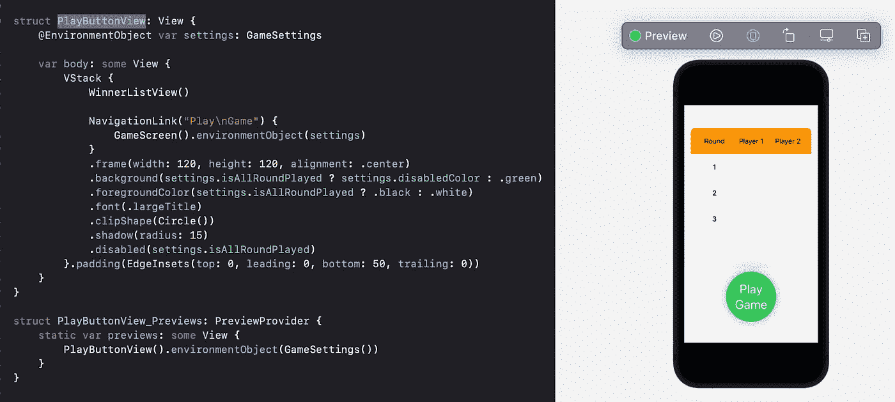
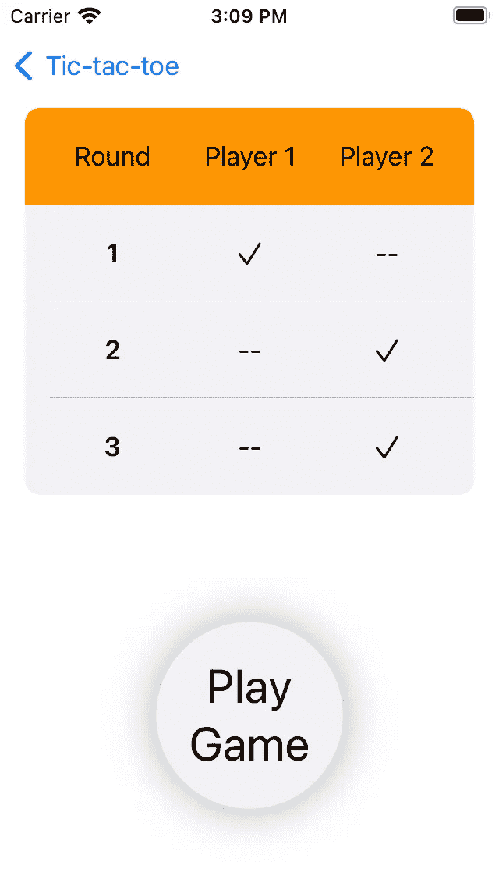
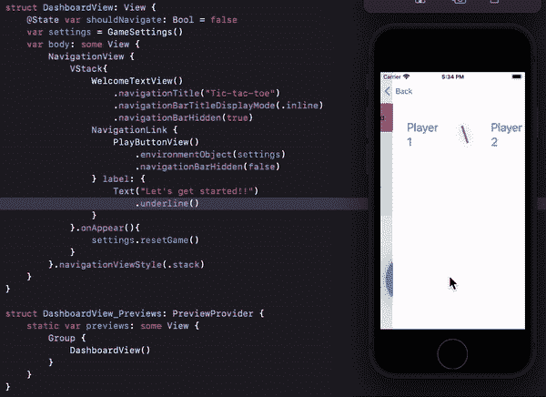

# SwiftUI | List |井字游戏

> 原文：<https://medium.com/globant/swiftui-list-tic-tac-toe-game-8ad7aaa4050?source=collection_archive---------0----------------------->

这是井字游戏[系列](/globant/swiftui-complete-guide-with-tic-tac-toe-game-ae2fea4f980e)的第 7 部分。到目前为止，我们创造了一个单轮井字游戏来决定赢家。让我们进行 3 轮游戏，获胜者将是赢得最多回合数的人。此外，我们将探索用于设计分数表的列表视图，以显示谁赢了哪一轮。

创建一个新的 ObservableObject 类，并将其命名为 RoundWinnerInfo。我们只需要跟踪两个属性，这一轮和这一轮的赢家。为了设计列表行，遍历该类的实例时也要使其可识别。

```
class RoundWinnerInfo: Identifiable, ObservableObject {
   var id = UUID()
   var round: Int
   @Published var winnerPlayer: Int = -1
   init(round: Int) {
      self.round = round
   }
}//Update GameSettings@State var rounds: [RoundWinnerInfo] = []init() {
   rounds = [RoundWinnerInfo(round: 1), RoundWinnerInfo(round: 2), RoundWinnerInfo(round: 3)]
   setupGridDetails()
}
```

我们将使用*回合*来设计我们的比分表。创建一个新的 SwiftUI 文件，并将其命名为 WinnerListView。创建一个名为 WinnerListRow 的新结构，它将是列表/表格视图的行。

```
@Binding var round: RoundWinnerInfo
```

WinnerListRow 将有一个 RoundWinnerInfo 实例，该实例将与@State 属性包装类型的 all rounds 数组绑定。每行有三列:回合数、玩家 1 和玩家 2 的详细信息。

```
var body: some View {
   HStack {
      Text(“\(round.round)”)
         .bold()
         .modifier(WinnerListRowModifier())
      if round.winnerPlayer != -1 {
         if round.winnerPlayer == 1 {
            Image(systemName: “checkmark”)
               .modifier(WinnerListRowModifier())
         } else {
           Text(“ — “).modifier(WinnerListRowModifier())
         } if round.winnerPlayer == 2 {
            Image(systemName: “checkmark”)
               .modifier(WinnerListRowModifier())
         } else {
            Text(“ — “).modifier(WinnerListRowModifier())
         }
      }
   }.multilineTextAlignment(.center)
}
```

如果进行了一轮游戏，我们会向获胜玩家显示复选标记，并向其他玩家显示。可以创建 ViewModifier 类型的结构，并且可以将修饰符组合在一起用于多个视图，WinnerListRowModifier 就是这种情况的一个例子。

```
struct WinnerListRowModifier: ViewModifier {
   func body(content: Content) -> some View {
      content
         .frame(width: 80, height: 50, alignment: .center)
   }
}
```

行已经准备好了，但是最好还有标题来完善比分表的外观。

```
struct WinnerListHeader: View {
   var body: some View {
      HStack {
         Text(“Round”).modifier(WinnerListRowModifier())
         Text(“Player 1”).modifier(WinnerListRowModifier())
         Text(“Player 2”).modifier(WinnerListRowModifier())
         Spacer()
      }.multilineTextAlignment(.center)
   }
}
```



我们可以看到 UI 中有一些小故障。我们不需要列表视图产生的这种灰色。目前 SwiftUI 没有内置的修改器来改变/移除这种颜色，但是我们可以使用 Swift 代码来处理表格外观。在列表视图上添加此修饰符:

```
...
.onAppear{
   UITableView.appearance().backgroundColor = .clear
}.padding(EdgeInsets(top: -30, leading: 0, bottom: 0, trailing: 0))
...
```

坚持住！！屏幕上的一切都是白色的。让我们将行颜色改为浅灰色，以区别于父视图。

```
WinnerListRow(round: round).listRowBackground(settings.disabledColor)
```



Score table with dummy data

我们的用户界面已经准备好了，但我们需要更新每一轮的获胜者，以实现上述结果。为此，我们将在游戏设置中添加更多属性:

```
var currentRound = 0func setCurrentRound() {
   currentRound = rounds.filter({$0.winnerPlayer == -1}).first?.round ?? 0
}func updateRoundDetails() {
   var _ = rounds.filter { round in
      if round.round == currentRound {
         round.winnerPlayer = winner
      }
      return true
   }
}
```

将在 GameScreen 的 onAppear()上调用 setCurrentRound()。每当决定了获胜者或者游戏以平局结束时，我们将调用 updateRoundDetails()来设置当前回合的获胜者。

我们需要限制球员在 3 轮后比赛。为此，我们将在 GameSettings 中添加一个新属性 isAllRoundPlayed，该属性将返回 true 或 false，如下所示:

```
var isAllRoundPlayed: Bool {
   return rounds.filter({$0.winnerPlayer != -1}).count == 3
}
```

此标志将用在“玩游戏”按钮上，以决定残疾情况:

```
...
.disabled(settings.isAllRoundPlayed)
...
```

因此，每当玩家玩完所有三轮游戏时，此按钮会变成灰色，并且不会执行任何操作。但是如果你回到 DashboardView，然后再回来，那么所有的数据都会在那里。我们需要在应用程序的某个地方重置游戏设置。

每当推送或弹出一个新视图时，PlayButtonView 的 onDisappear()都会被调用，因此在这里重置设置并不是一个好的选择。另一种选择是使用 DashboardView 的 onAppear()，因为当弹出 PlayButtonView 时将调用它。

```
...
.onAppear(){
   settings.resetGame()
}
...
```



请务必查看我在这个系列中的其他文章:

[文本视图样式](/@roy11manisha/swiftui-text-view-styling-lets-play-tic-tac-toe-game-7987909584fb)

[按钮](/@roy11manisha/swiftui-tic-tac-toe-game-button-154a35997bc)

[导航](/@roy11manisha/swiftui-navigation-tic-tac-toe-game-d05d52cf4636)

[形状](/@roy11manisha/swiftui-shapes-tic-tac-toe-game-376073b11102)

[图纸](/@roy11manisha/swiftui-drawing-tic-tac-toe-game-71fae0d46381)

[数据流](/@roy11manisha/swiftui-data-flow-tic-tac-toe-game-bace4fbeb3ac)

[动画](/@roy11manisha/swiftui-animation-tic-tac-toe-game-4ffe37aba0b8)

> 如果你喜欢这篇文章，请用掌声和评论来欣赏它。这会鼓励我多写！！！！