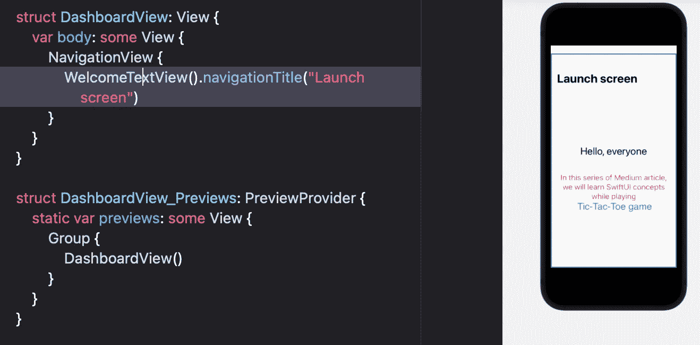
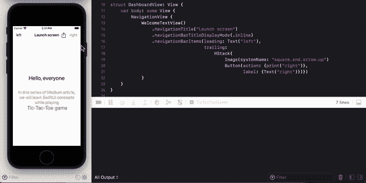
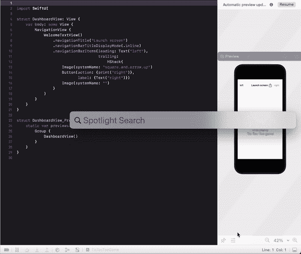
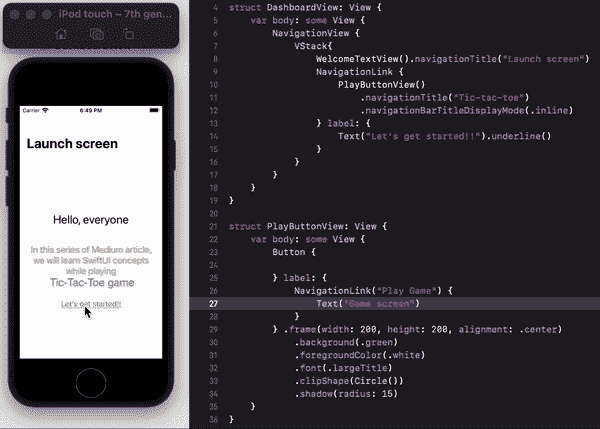
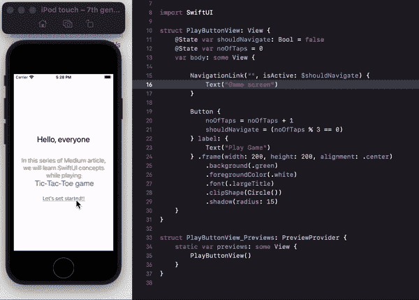

# SwiftUI |导航|井字游戏

> 原文：<https://medium.com/globant/swiftui-navigation-tic-tac-toe-game-d05d52cf4636?source=collection_archive---------1----------------------->

这是井字游戏[系列](/globant/swiftui-complete-guide-with-tic-tac-toe-game-ae2fea4f980e)的第 3 部分。到目前为止，我们已经探索了 SwiftUI 中的文本和按钮视图，下面我们将学习 SwiftUI 中的导航。SwiftUI 提供 NavigationView 和 NavigationLink，用于在应用程序的视图中漫游。

## 导航视图

NavigationView 是最重要的组件之一，它提供了一个容器视图，用于在导航堆栈中推送、弹出和呈现视图。

访问**仪表板视图**文件请参见[这篇](/globant/swiftui-text-view-styling-lets-play-tic-tac-toe-game-7987909584fb)文章。将所有代码从**仪表板视图**移动到 **WelcomeTextView** 并更新**仪表板视图**如下:

```
struct DashboardView: View {
   var body: some View {
      NavigationView {
         WelcomeTextView()
      }
   }
}
```

UI 将看起来一样，因为在屏幕级别没有更新任何东西，只是我们添加了 NavigationView 作为父容器，允许我们在视图中漫游。

**导航标题**

我们可以使用 navigationTitle 修饰符为导航视图添加一个标题。

> 请注意，与导航相关的修饰符应该应用于 NavigationView 的子级，而不是 NavigationView。



我们可以看到“*Launch screen”*作为大模式下的导航标题。如果你想让它内嵌到导航栏中，那么使用*navigationBarTitleDisplayMode*修饰符，它有三种内嵌模式，大和自动。

```
WelcomeTextView().navigationTitle(“Launch screen”)
   .navigationBarTitleDisplayMode(.inline)
```

隐藏导航栏 *(navigationBarHidden)* 和后退按钮*(navigationBarBackButtonHidden)*有修改器。

**导航栏项目**

使用 SwiftUI 在 iOS 应用程序开发中添加导航栏项目及其用法是最简单的事情之一。navigationBarItems 修饰符提供了在导航栏的开头和结尾添加视图的选项，其中任何一个都是可选的。



这里，文本视图添加在导航栏的左侧，而 HStack 用于在右侧添加两个视图。

> 请通过[苹果文档](https://developer.apple.com/sf-symbols/)学习和下载 SF 符号。

下面是 SF 符号在 mac 上安装后如何使用的一个小演示。您甚至可以根据需要定制这些图标，然后下载 SVG 并将其导入 Xcode 项目。



## 导航链接

到目前为止，我们已经为我们的应用程序添加了一个导航视图，现在我们将添加一个导航链接，以转到一个新的视图。导航链接提供了三种初始化器:

**纯文本导航链接**

```
NavigationView {
   VStack{
      WelcomeTextView().navigationTitle(“Launch screen”)
      NavigationLink(“Let’s get started!!”) {
         PlayButtonView()
      }
   }
}
```

在这里，NavigationLink 将使用提供的字符串创建一个文本视图，并在其点击播放按钮视图将被推。导航的后退按钮将标题作为“启动屏幕”。

**非纯文本导航链接**

在“让我们开始吧！!"对于纯文本初始值设定项是不可能的。为了解决这个问题，还有一个初始化器，它把视图作为一个标签，可以根据需要定制。



*   PlayButtonView 既有导航标题又有后退按钮，这就是为什么后退按钮的标题是“后退”而不是“启动屏幕”。
*   导航栏外观自动从以前视图的详细信息中获取值，除非它们被其他视图更改。

> 将 NavigationView 放在视图堆栈的顶部是一个很好的做法，这样可以避免导航问题，例如:

```
var body: some View {
   VStack{
      WelcomeTextView().navigationTitle(“Launch screen”)
      NavigationView {
         NavigationLink {
.....
```

*   主屏幕上缺少导航标题。
*   WelcomeTextView 下面将跟随导航堆栈。

> 总是将 NavigationView 放在 TabView 内部。

**有条件导航**

以上两种导航链接在用户点击时执行操作，但是如果我们希望在满足特定条件时执行导航，那么只需在上面的初始化器中添加 *isActive* 参数，我们就可以开始了。

> isActive 接受绑定属性包装。为 SwiftUI 属性包装器检查[这个](/globant/swiftui-property-wrappers-explained-in-simplest-way-28cb580c6408)。

下面的截图详细说明了每当用户点击按钮三次时导航是如何执行的。



**一定要看看我在这个系列中的其他文章:**

[文本视图样式](/@roy11manisha/swiftui-text-view-styling-lets-play-tic-tac-toe-game-7987909584fb)

[按钮](/@roy11manisha/swiftui-tic-tac-toe-game-button-154a35997bc)

[形状](/@roy11manisha/swiftui-shapes-tic-tac-toe-game-376073b11102)

[绘图](/@roy11manisha/swiftui-drawing-tic-tac-toe-game-71fae0d46381)

[数据流](/@roy11manisha/swiftui-data-flow-tic-tac-toe-game-bace4fbeb3ac)

[列表](/@roy11manisha/swiftui-list-tic-tac-toe-game-8ad7aaa4050)

[动画](/@roy11manisha/swiftui-animation-tic-tac-toe-game-4ffe37aba0b8)

> 如果你喜欢这篇文章，请用掌声和评论来欣赏它。这会鼓励我多写！！！！