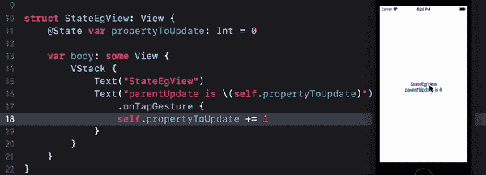
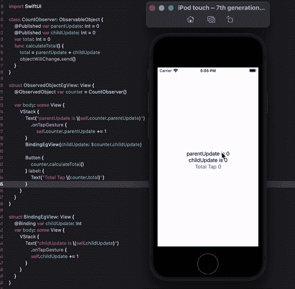
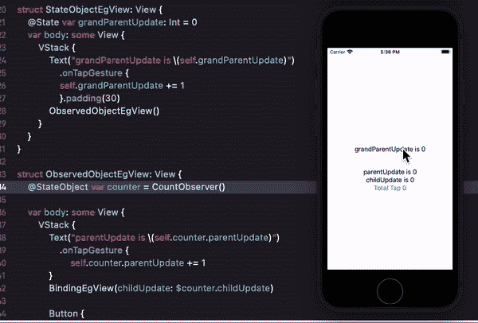

# SwiftUI:用最简单的方式解释属性包装器

> 原文：<https://medium.com/globant/swiftui-property-wrappers-explained-in-simplest-way-28cb580c6408?source=collection_archive---------0----------------------->



> **注**:请查看[这篇](/globant/dive-into-amazing-world-of-swiftui-f35a25c5e9ce)文章，了解 SwiftUI 简介

引入属性包装器的主要目的是用逻辑包装属性，这些逻辑可以提取到独立的结构或类中，以便在整个代码库中重用它。我们知道我们所有的视图都是结构，这意味着它们不能被改变，但是因为属性包装器是由 SwiftUI 管理的，每当属性包装器值改变时，视图就使其外观无效并重新计算主体。

SwiftUI 为我们提供了大量的属性包装器，其中一些是 State、Binding、ObservedObject、EnvironmentObject 和 Environment Property Wrappers。所以让我们试着去理解它们之间的区别，以及什么时候，为什么，我们必须使用哪一个。

## **@状态**

*   @State 对于属于特定视图的简单属性非常有用，并且永远不会在该视图之外使用，因此将这些属性标记为私有非常重要，以强调这种状态是专门设计的，永远不会脱离它的视图。
*   当我们使用@State 来声明一个属性时，我们将对它的控制权交给 SwiftUI，这样只要视图存在，它就会在内存中保持持久。

```
struct StateEgView: View {
   var propertyToUpdate: Int = 0
   var body: some View {
      VStack {
         Text(“StateEgView”)
         Text(“parentUpdate is \(self.propertyToUpdate)”)
         .onTapGesture {
            self.propertyToUpdate += 1
         }
      }
   }
}
```

我们希望在一些点击手势上更新 propertyToUpdate 属性，但这里我们将得到错误“变异操作符的左边不是可变的:‘self’是不可变的”

为了使它可变，我们需要在这里使用 *SwiftUI 属性包装器*。因为 propertyToUpdate 需要在它的所有者视图中更新，所以我们可以像这样使用@State 属性包装器，一切都会像预期的那样工作。

```
*@State* ***var*** *propertyToUpdate: Int = 0*
```

> 如果我们将 propertyToUpdate 传递给子节点，那么接收属性将自动调整状态行为。

## **@绑定**

*   @Binding 为值类型提供了类似访问的引用。有时我们需要使视图的状态对其子视图是可访问的。但我们不能简单地传递该值，因为它是值类型，Swift 将传递该值的副本。这就是我们可以使用@Binding 属性包装器的地方。
*   我们还使用$来传递绑定引用，因为没有$ Swift 将传递值的副本，而不是传递可绑定的引用

> 绑定不支持声明时的值。

```
***struct*** *ParentView: View {
   @State* ***var*** *propertyToUpdate: Int = 0* ***var*** *body:* ***some*** *View {
      VStack {
         Text(“StateEgView”)
         Text(“parentUpdate is \(****self****.propertyToUpdate)”)
         Spacer()
         BindingEgView(childUpdate: $propertyToUpdate)
      }
   }
}****struct*** *BindingEgView: View {
   @Binding* ***var*** *childUpdate: Int* ***var*** *body:* ***some*** *View {
         VStack {
            Text(“BindingEgView”)
            Text(“childUpdate is \(****self****.childUpdate)”)
            .onTapGesture {* ***self****.childUpdate += 1
             }
         }
     }
}*
```

此处，propertyToUpdate 在 ParentView 中声明为 State，并初始化为 0，同时 BindingEgView 将 childUpdate 属性作为绑定。现在，当 BindingEgView 作为 ParentView 的子视图添加时，它需要在构造函数中传递值，因此我们传递$ propertyToUpdate。现在，我们已经建立了这样的关系，每当 childUpdate 被修改时，它都会向父视图发送确认，因此父视图也会更新它的外观。

## **@ObservedObject**

*   ObservedObject 类似于 State，但是当您想要使用可能具有多个属性和方法的自定义类型，或者可能在多个视图之间共享时，您应该使用@ObservedObject。
*   无论您在@ObservedObject 中使用什么类型，都应该符合 ObservableObject 协议。当你在可观察对象上创建属性时，你可以决定对每个属性的修改是否应该强制视图刷新。通常会，但这不是必需的。
*   被观察对象有几种方法通知视图重要数据已经更改，但是最简单的方法是使用@Published 属性包装器。

> ObservedObject 只能与类一起使用，因为 ObservableObject 协议只支持类



在这里，我们可以看到 CountObserver 有两个已发布的属性包装器 *parentUpdate* 和 *childUpdate* ，它们将在值发生变化时更新视图(**自动动作**)，而 *total* 是一个普通属性。 *calculateTotal()* 在计算用户执行的总点击的按钮动作上被调用。现在这个函数有了*objectwillchange . send()*，它向视图发送手动信号，指示已经计算了*总计*，它们可以更新视图。

## **@StateObject**

*   StateObject 属性包装器的工作方式类似于 ObservedObject，但它们的生命周期不同。让我们首先通过像这样修改上面的 eg 来理解相似性

```
struct StateObjectEgView: View {
   @State var grandParentUpdate: Int = 0
   var body: some View {
      VStack {
         Text(“grandParentUpdate is \(self.grandParentUpdate)”)
         .onTapGesture {
             self.grandParentUpdate += 1
         }.padding(30)
         ObservedObjectEgView()
      }
   }
}struct ObservedObjectEgView: View {
   @ObservedObject var counter = CountObserver()
   var body: some View {
……
```

*   在这里，我们将 ObservedObjectEgView 作为 StateObjectEgView 的子视图，因此每当 StateObjectEgView 的属性强制视图更新其外观时，计数器*就会复位。*

ObservedObject 属性在包含它们的视图结构重绘后被销毁，而 StateObject 不会被销毁。只需查看下面的代码片段，其中我们只将 ObservedObject 替换为 StateObject，并且*计数器*不会被重置。



## **@环境对象**

*   假设有多个层次视图，因为 lowerView 是 middleView 的子视图，middle view 是 topView 的子视图。如果我们希望每当从 topView 更新 propertyA 时更新 lowerView，反之亦然。这可以通过 State 和 ObservedObject 来实现，但唯一的问题是我们必须将 propertyA 声明为 topView，并将其绑定到两个较低的视图，然后在它们的构造函数中发送 propertyA。即使 middleView 不访问 propertyA，它也必须拥有它。为了解决这个问题，我们有了下一个属性包装器，即 EnvironmentObject。
*   EnvironmentObject 在应用程序级别创建和存储。这是共享数据，每个视图都可以读/写
*   由于所有视图都指向同一个模型，如果一个视图改变了模型，所有视图都会立即更新——不会有应用程序的不同部分不同步的风险。

## **@环境**

*   通过用@Environment 属性包装器标记我们的属性，我们可以访问和订阅系统范围设置的更改
*   @Environment 非常适合于读取诸如核心数据管理对象上下文、设备是处于黑暗模式还是明亮模式、视图呈现的大小级别等信息——来自系统的固定属性

很难在这里列出所有的属性包装器并使它们保持最新。找到它们的最好方法是进入 [*文档主题。*](https://developer.apple.com/documentation/swiftui/state-and-data-flow)

> 如果你喜欢这篇文章，请用掌声和评论来欣赏它。这真的会鼓励我多写！！！！