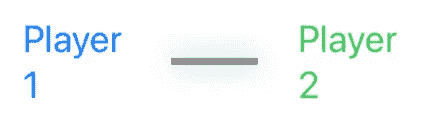
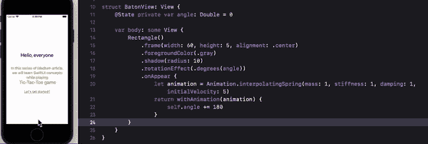
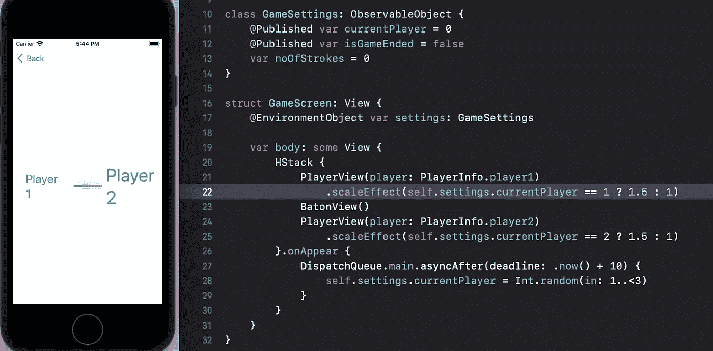

# SwiftUI |形状|井字游戏

> 原文：<https://medium.com/globant/swiftui-shapes-tic-tac-toe-game-376073b11102?source=collection_archive---------0----------------------->

这是井字游戏[系列](/globant/swiftui-complete-guide-with-tic-tac-toe-game-ae2fea4f980e)的第 4 部分。在这里，我们将了解更多 SwiftUI 提供的内置形状，并设计一个接力棒来选择第一个玩游戏的玩家。

## 形状

SwiftUI 为我们提供了五种常用的内置形状:矩形、圆角矩形、圆形、椭圆形和胶囊形。我们可以用一个例子来演示所有选项:

```
VStack {
   Rectangle()
      .fill(.red)
      .frame(width: 200, height: 200) RoundedRectangle(cornerRadius: 15)
      .fill(.orange)
      .frame(width: 150, height: 175) Capsule()
      .fill(.yellow)
      .frame(width: 125, height: 150) Ellipse()
      .fill(.green)
      .frame(width: 100, height: 75) Circle()
      .fill(.blue)
      .frame(width: 25, height: 50)
}
```

*   *矩形*绘制精确尺寸为 200*200 的正方形。
*   *RoundedRectable* 用给定的尺寸画矩形，除了现在你可以用某个值来圆角。
*   *Capsule* 也绘制一个给定尺寸的矩形框，但它的两条边将被倒圆，这取决于哪个轴的值更低。上面的例子是有一个 125*150 的尺寸，这就是为什么它会有顶部和底部圆角边缘。
*   *日蚀*绘制给定尺寸的日蚀。
*   *圆*画圆形日蚀，以高度和宽度中较小的尺寸为半径。上面的例子有一个 25*50 的尺寸，但是它需要 25，并画一个 25*25 的日蚀。

> 在这里，我们使用了 VStack 来排列我们的形状，只需用 ZStack 替换它，看看它的神奇之处。

我们将抽签决定哪个运动员先上场。创建一个新的 SwiftUI 文件，并将其命名为 GameScreen。创建 PlayerInfo 枚举用于访问球员信息，如球员姓名和他们的罢工颜色:

```
enum PlayerInfo: Int {
   case player1 = 1
   case player2 func getPlayerName() -> String {
      switch self {
         case .player2:
            return “Player 2”
         default:
            return “Player 1”
      }
   } func getPlayerColor() -> Color {
      switch self {
         case .player2:
            return .green
         default:
            return .blue
      }
   }
}
```

接下来，创建一个 PlayerView 来显示玩家的详细信息。

```
struct PlayerView: View {
   var player: PlayerInfo
   var body: some View {
      Text(player.getPlayerName())
         .foregroundColor(player.getPlayerColor())
         .padding(20)
         .font(.title)
   }
}
```

玩家的视角已经准备好了，但是我们还需要一根指挥棒。创建一个新的 SwiftUI 文件，将其命名为 BatonView，并使用以下修饰符添加一个矩形:

```
var body: some View {
   Rectangle()
      .frame(width: 60, height: 5, alignment: .center)
      .foregroundColor(.gray)
      .shadow(radius: 10)
```

回到 GameScreen 主体，水平添加 PlayerView 的两个实例，并在它们之间放置 BatonView。

```
HStack {
   PlayerView(player: PlayerInfo.player1)
   BatonView()
   PlayerView(player: PlayerInfo.player2)
}...
```



Updated GameScreen

让我们给我们的指挥棒添加一些动画，并随机选择第一个玩家来玩。



指挥棒在旋转，但同时 PlayerView 也在播放动画，我们稍后会解决这个问题，但首先要随机选择我们的第一个玩家。为此，我们将创建这样一个新模型:

```
class GameSettings: ObservableObject {
   @Published var currentPlayer = 0
   var noOfStrokes = 0
}
```

GameSettings 拥有游戏的详细信息，比如现在谁在玩游戏，以及两个玩家的击球次数。将代码更新为截图，一旦接力棒停止旋转，游戏将能够选择第一个玩家。



*   BatonView 有 10 秒钟的旋转动画，在它出现时自动开始。
*   因此我们在游戏屏幕上等待 10 秒钟来随机设置当前玩家。
*   一旦决定了 currentPlayer，整个视图就会按照上面的效果重新绘制。

请注意，我们需要在添加游戏屏幕时初始化环境对象设置，如下所示:

```
NavigationLink(“Play Game”) {
   GameScreen().environmentObject(GameSettings())
   ...
```

为了停止不必要的动画，只需将这个修改器添加到两个 PlayerView 实例中，我们就可以开始了:

```
.scaleEffect(self.settings.currentPlayer == 1 ? 1.5 : 1)
.animation(.easeInOut)
....
```

**一定要看看我在这个系列中的其他文章:**

[文本视图样式](/@roy11manisha/swiftui-text-view-styling-lets-play-tic-tac-toe-game-7987909584fb)

[按钮](/@roy11manisha/swiftui-tic-tac-toe-game-button-154a35997bc)

[导航](/@roy11manisha/swiftui-navigation-tic-tac-toe-game-d05d52cf4636)

[图纸](/@roy11manisha/swiftui-drawing-tic-tac-toe-game-71fae0d46381)

[数据流](/@roy11manisha/swiftui-data-flow-tic-tac-toe-game-bace4fbeb3ac)

[列表](/@roy11manisha/swiftui-list-tic-tac-toe-game-8ad7aaa4050)

[动画](/@roy11manisha/swiftui-animation-tic-tac-toe-game-4ffe37aba0b8)

> 如果你喜欢这篇文章，请用掌声和评论来欣赏它。这会鼓励我多写！！！！