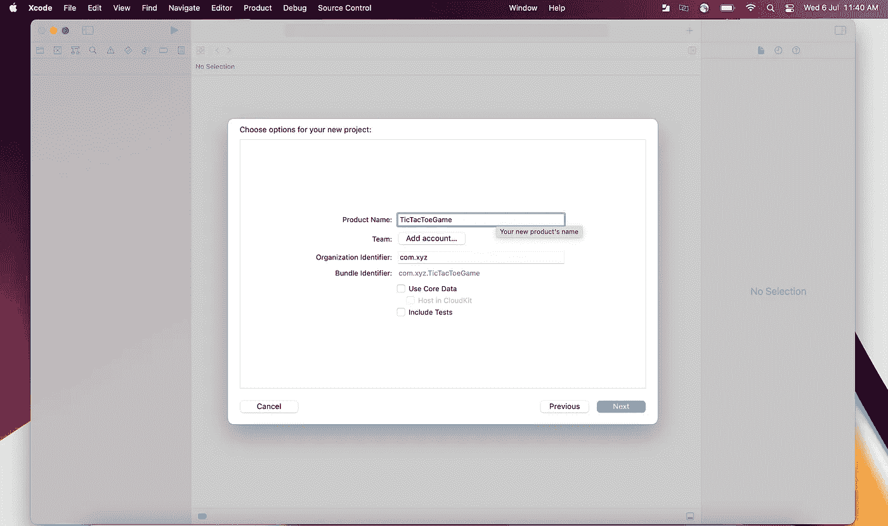
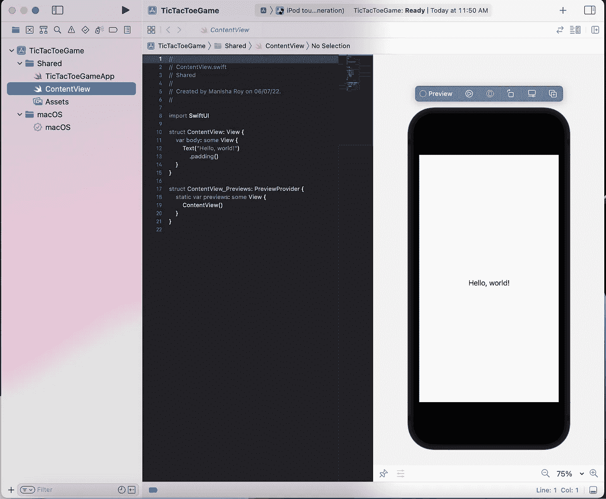
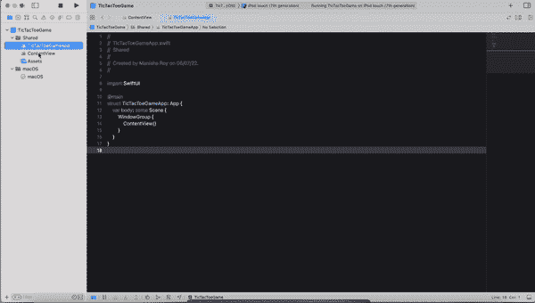
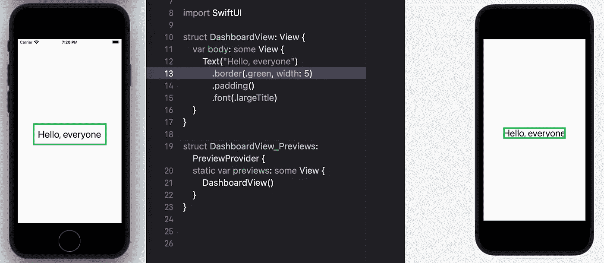
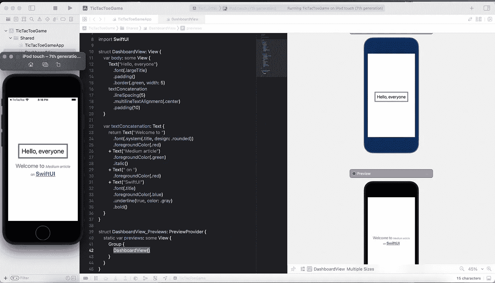
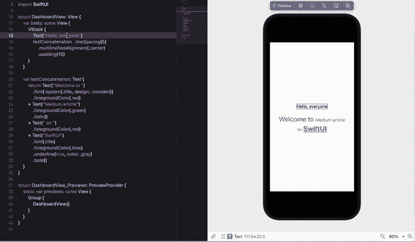
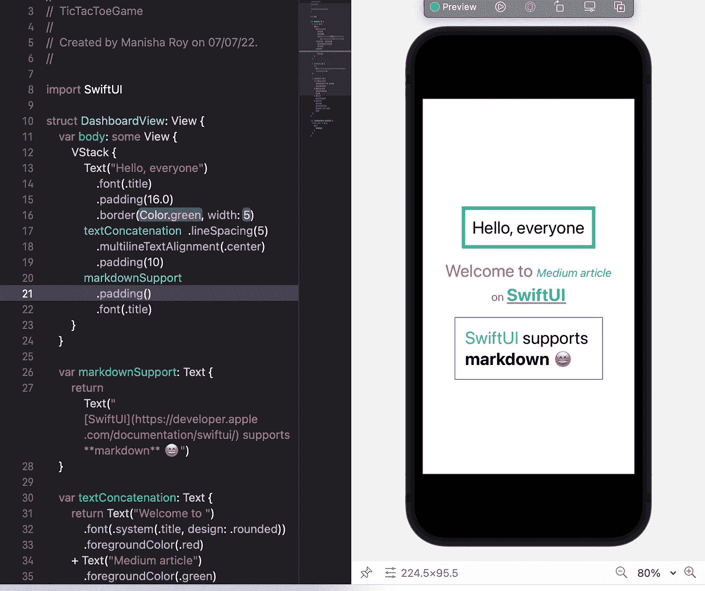
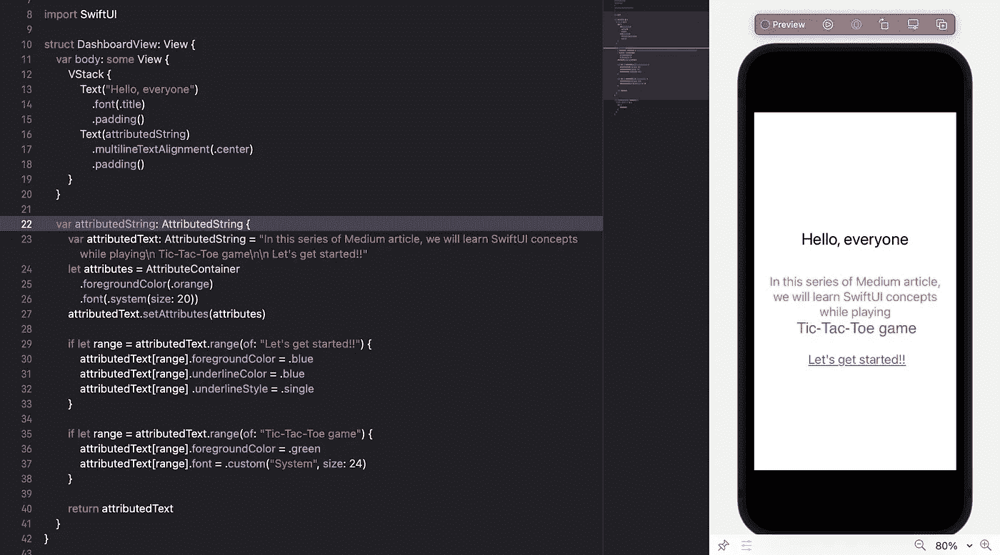

# SwiftUI |文本视图样式|井字游戏

> 原文：<https://medium.com/globant/swiftui-text-view-styling-lets-play-tic-tac-toe-game-7987909584fb?source=collection_archive---------1----------------------->

这是井字游戏[系列](/globant/swiftui-complete-guide-with-tic-tac-toe-game-ae2fea4f980e)的第一部分。我们将实现井字游戏，同时，我们将深入学习 SwiftUI 的用法。

> 如果你想知道 SwiftUI 是什么，请浏览 SwiftUI 的[介绍](/globant/dive-into-amazing-world-of-swiftui-f35a25c5e9ce)并漫游这个[维基](https://en.wikipedia.org/wiki/Tic-tac-toe)以了解更多关于井字游戏的信息。

创建一个新项目，命名为 **TicTacToeGame。**发射成功，我们将能看到**’***你好，世界！在模拟器上。在本文中，我们将为我们的应用程序设计一个启动屏幕，并探索 ***文本视图*** 。*



Xcode 为 us**<project name>App**(TicTacToeGameApp)和 **ContentView 创建两个 SwiftUI 文件。**swift ui 项目的默认结构表示:

```
@main
struct TicTacToeGameApp: App {
   var body: some Scene {
      WindowGroup {
         ContentView()
      }
   }
}
```

*   @main 表示应用程序的入口点。
*   *TicTacToeGameApp* 是确认 *App* 协议的 App 结构，需要实现一个强制属性*体*。
*   返回一个或多个显示在主窗口上的内容。

```
struct ContentView: View {
   var body: some View {
      Text(“Hello, world!”)
         .padding()
    }
}
```

*   ContentView struct 确认*视图*协议，实现强制属性*主体*。
*   这里， *body* 返回一个文本视图，显示“Hello，world！”。

要设计启动屏幕，按照以下简单步骤创建一个名为 *DashboardView* 的新 SwiftUI 文件:



## 样式文本视图

文件创建后， *DashboardView* 的代码与我们在 *ContentView 中看到的代码相同。*文本视图添加了*填充*修改器，默认值为四边 16 磅。

> SwiftUI 使用修改器来改变任何视图的外观。我们应用修饰语的顺序很重要。

例如，让我们更改文本内容并添加修饰符来更改字体和边框:

```
struct DashboardView: View {
   var body: some View {
   Text("Hello, everyone")
      .font(.largeTitle)
      .padding()
      .border(.green, width: 5)
   }
}
```

这里，首先将应用填充，然后将绘制宽度为 5 个像素的绿色边框。如果我们改变修改器的顺序，那么它们的顺序也会被交换。

> 字体修饰符将对任何时候添加的文本产生相同的影响。SwiftUI 在[苹果文档](https://developer.apple.com/documentation/swiftui/text)中有大量可用的修改器列表。



应用于任何视图的修饰符都会反映在它的整个内容中。SwiftUI 提供了类似于 swift 中字符串连接的文本视图连接。我们可以使用文本视图连接来设置子字符串的样式，如下所示:

```
var textConcatenation: Text {
   return Text(“Welcome to “)
      .font(.system(.title, design: .rounded))
      .foregroundColor(.red)
   + Text(“Medium article”)
      .foregroundColor(.green)
      .italic()
   + Text(“ on “)
      .foregroundColor(.red)
   + Text(“SwiftUI”)
      .font(.title)
      .foregroundColor(.blue)
      .underline(true, color: .gray)
      .bold()
}
```



*   我们只需要在可呈现视图的主体内添加*文本连接*。
*   像行距、多行文本对齐和填充这样的修饰符将应用于*文本拼接的所有 4 个文本视图。*
*   可以看到几何体文本视图的每个实例的多个预览，而模拟器显示的是预期的结果。
*   添加 VStack 以实现预览时的模拟器行为。

```
struct DashboardView: View {
   var body: some View {
      VStack {
         Text(“Hello, everyone”)
         ...
```

## **SwiftUI 督察**

你想知道 xcode Inspector 在哪里吗？？别担心，SwiftUI 有它的检查器，使用起来更容易，因为你可以同时看到应用的修改器。



SwiftUI inspector

在上面的视频中，我们可以看到，只需点击几下，就可以达到同样的效果。我们只需要在代码面板或预览中点击文本视图，然后我们将得到该特定视图的修饰符的建议列表。*是不是很神奇！！！*

## 降价支持

想知道什么是 markdown，下面是直接来自 markdown org 的定义:

> Markdown 是一种轻量级标记语言，可以用来向纯文本文档添加格式元素。如果你想了解更多关于 markdown 的信息，请访问他们的网站。

```
var markdownSupport: Text {
   return Text(“[SwiftUI](https://developer.apple.com/documentation/swiftui/) supports **markdown** 😄”)
}
```



我们甚至可以在 markdown 上应用 SwiftUI 修饰符，从而获得两者的好处。在上面的例子中，首先计算 markdown 文本，然后应用 SwiftUI 修饰符。

## 属性字符串

如果你喜欢使用 range 的样式字符串，不要灰心，因为 SwiftUI 也支持 AttributedString。

> AttributedString 支持 Markdown 和 NSAttributedString 的所有键。

```
var attributedText: AttributedString = “In this series of Medium article, we will learn SwiftUI concepts while playing\n Tic-Tac-Toe game\n\n Let’s get started!!”let attributes = AttributeContainer
   .foregroundColor(.orange)
   .font(.system(size: 20))attributedText.setAttributes(attributes)
```

首先， *attributedText* 用纯文本声明为 AttributedString 类型。我们有设置文本颜色和字体的属性，SwiftUI 有属性容器。这些属性用 *setAttributes(_)* 函数设置为 attributedText。要样式化子字符串，我们可以捕获它的范围，然后将属性应用于它，如下所示:

```
if let range = attributedText.range(of: “Let’s get started!!”) {
   attributedText[range].foregroundColor = .blue
   attributedText[range].underlineColor = .blue
   attributedText[range] .underlineStyle = .single
}
```



**一定要看看我在这个系列中的其他文章:**

[按钮](/@roy11manisha/swiftui-tic-tac-toe-game-button-154a35997bc)

[导航](/@roy11manisha/swiftui-navigation-tic-tac-toe-game-d05d52cf4636)

[形状](/@roy11manisha/swiftui-shapes-tic-tac-toe-game-376073b11102)

[图纸](/@roy11manisha/swiftui-drawing-tic-tac-toe-game-71fae0d46381)

[数据流](/@roy11manisha/swiftui-data-flow-tic-tac-toe-game-bace4fbeb3ac)

[列表](/@roy11manisha/swiftui-list-tic-tac-toe-game-8ad7aaa4050)

[动画](/@roy11manisha/swiftui-animation-tic-tac-toe-game-4ffe37aba0b8)

> 如果你喜欢这篇文章，请用掌声和评论来欣赏它。这会鼓励我多写！！！！