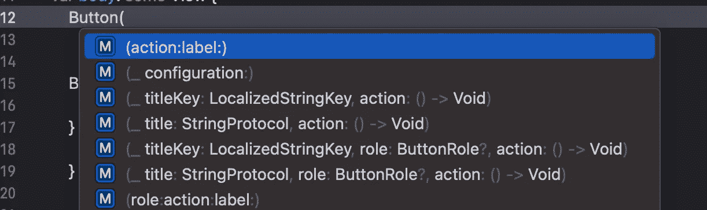
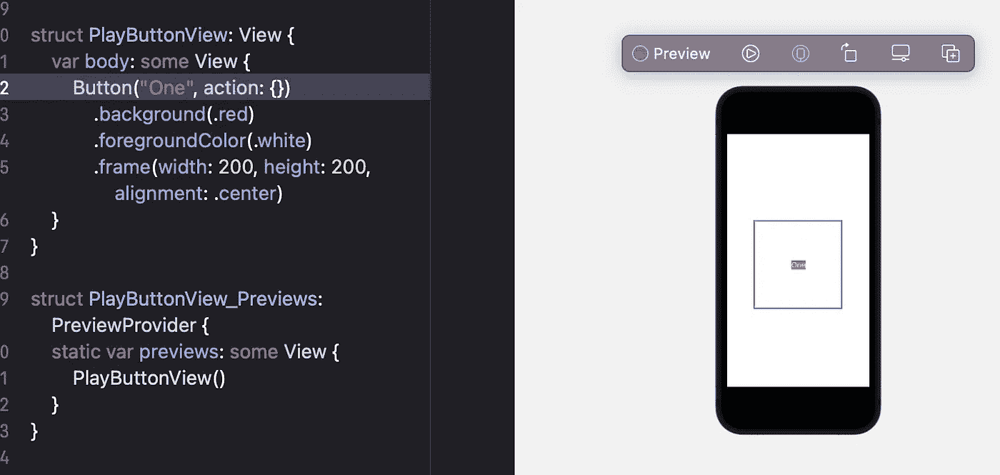
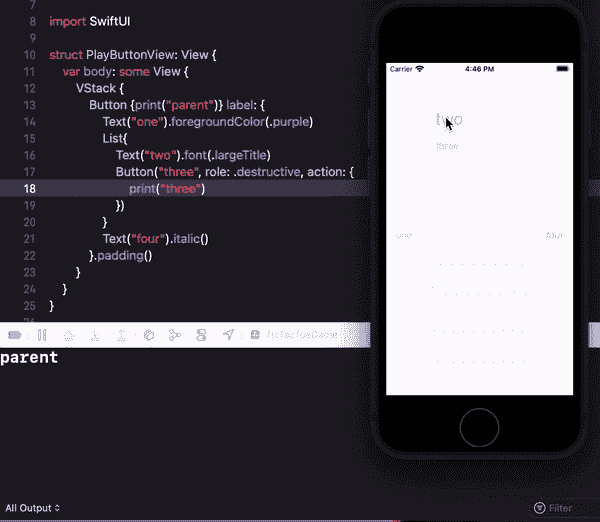

# SwiftUI | Button |井字游戏

> 原文：<https://medium.com/globant/swiftui-tic-tac-toe-game-button-154a35997bc?source=collection_archive---------1----------------------->

这是井字游戏[系列](/globant/swiftui-complete-guide-with-tic-tac-toe-game-ae2fea4f980e)的第二部分。在[第 1 部分](/@roy11manisha/swiftui-text-view-styling-lets-play-tic-tac-toe-game-7987909584fb)中，我们创建了一个新项目，并了解了 SwiftUI 项目的基本结构。在那里，我们为我们的应用程序设计了一个启动屏幕，并探索了不同的方式来设计文本视图。在本文中，我们将了解更多关于 SwiftUI 按钮视图的信息。

创建一个名为 *PlayButtonView 的新 SwiftUI 文件，该文件将用于按钮*视图浏览。许多初始化器/构造器可用于按钮视图，我们将详细探讨它们。



Constructors for Button view

## 1.纯文本按钮

对于采用普通字符串或本地化字符串键的纯文本按钮，有两个可用的初始值设定项:

***(_ title: StringProtocol，action: () - > Void)*** 和***(_ title key:localized string key，action: () - > Void)***

**标题**:标题是一个普通的字符串

**动作**:当用户点击一个按钮时执行某个动作，或者如果没有预期的动作，它可以保持为空闭合。

```
Button(“First”, action: {})
```

*   可以看到一个标题为“第一个”的按钮，但它不执行任何操作。因为空关。
*   标题是一个普通的字符串，很少有修饰词可以用来更新它的外观。

***按钮角色***

SwiftUI 为纯文本按钮提供了一个按钮角色，可根据角色调整外观。一旦某个角色被指定为破坏性角色，按钮将显示“删除 UI”。这个参数保存了我们应用字体、颜色等的多行代码。

```
Button(“Delete”, role: .destructive) {}
```

> 目前只有两个角色:SwiftUI 提供的取消和破坏，但我们希望在未来看到更多。

我们在这里得到的最基本的限制之一是我们不能根据需要更新帧。



## 2.非纯文本按钮

***(动作:标签:)***

这是非纯文本按钮的初始值设定项，其中:

**动作**:当用户点击一个按钮时执行某个动作，或者如果没有预期的动作，它可以保持为空闭合。

**标签**:按钮的可见属性，可以在屏幕上看到。它还会在触发操作时更新或更改按钮的外观。

> 这个标签允许我们根据需要拥有一个按钮外观。

同上，eg 可改为:

```
Button {} label: {
   Text(“One”)
      .frame(width: 200, height: 200, alignment: .center)
}.background(.red)
 .foregroundColor(.white)
```

*标签*支持所有视图类型，如文本、列表、VStack、HStack 等。我们也可以有一个按钮，但是子视图的动作会与父按钮动作冲突。



让我们利用对 SwiftUI 按钮的这种理解来设计**玩游戏**按钮。

```
Button {} label: {
   Text(“Play Game”)
}
```

向其添加修改器以进行更新:

*   框架为 200*200 像素。
*   背景为绿色。
*   文本颜色变为白色。
*   字体，这样会更有吸引力。
*   使其成为一个半径为 15 像素的圆形阴影。

```
Button {} label: {
   Text(“Play Game”)
} .frame(width: 200, height: 200, alignment: .center)
  .background(.green)
  .foregroundColor(.white)
  .font(.largeTitle)
  .clipShape(Circle())
  .shadow(radius: 15)
```

请务必查看我在这个系列中的其他文章:

[文本视图样式](/@roy11manisha/swiftui-text-view-styling-lets-play-tic-tac-toe-game-7987909584fb)

[导航](/@roy11manisha/swiftui-navigation-tic-tac-toe-game-d05d52cf4636)

[形状](/@roy11manisha/swiftui-shapes-tic-tac-toe-game-376073b11102)

[图纸](/@roy11manisha/swiftui-drawing-tic-tac-toe-game-71fae0d46381)

[数据流](/@roy11manisha/swiftui-data-flow-tic-tac-toe-game-bace4fbeb3ac)

[列表](/@roy11manisha/swiftui-list-tic-tac-toe-game-8ad7aaa4050)

[动画](/@roy11manisha/swiftui-animation-tic-tac-toe-game-4ffe37aba0b8)

> 如果你喜欢这篇文章，请用掌声和评论来欣赏它。这会鼓励我多写！！！！