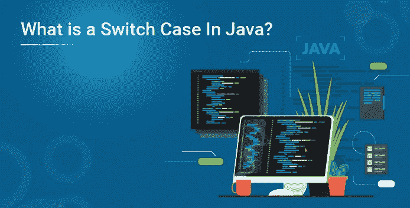
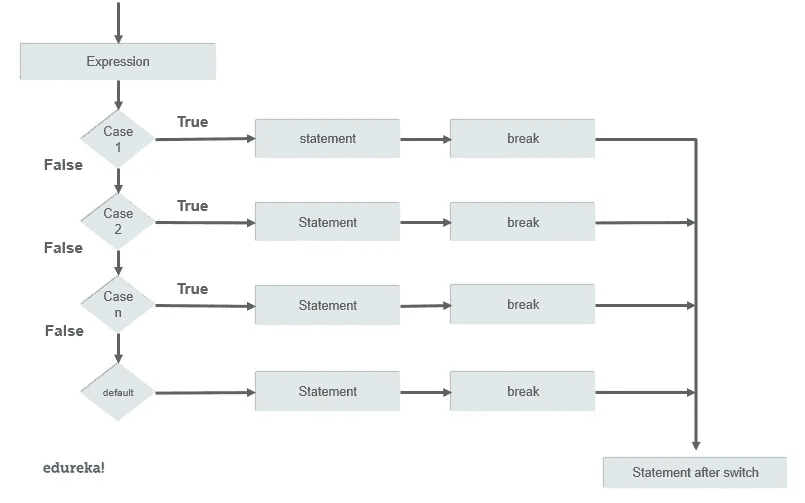

# Java 中的 Switch Case 是什么？

> 原文：<https://medium.com/edureka/switch-case-in-java-177da3560c5a?source=collection_archive---------0----------------------->



Java 编程语言有条件和控制语句，可以在编写程序时优化逻辑。使用开关盒的自由逻辑构建提高了效率。在处理多个测试表达式时，在 java 中使用 switch case 可以优化代码的可读性。在本文中，您将通过各种示例了解 java 中的 switch case。以下是本文中讨论的主题:

*   Java 中的 Switch Case 是什么？
*   要记住的规则
*   流程图
*   例子

1.  开关情况下的 Break 语句

2.嵌套开关盒

3.跌落式开关盒

4.开关情况下的枚举

5.开关盒中的字符串

# Java 中的 Switch Case 是什么？

Java switch 语句类似于一个条件语句，它测试多个值并给出一个输出。这些被测试的多个值被称为案例。它就像一个多分支语句。在 java 7 发布后，我们甚至可以在案例中使用字符串。下面是在 Java 中使用 switch case 的语法。

```
switch(expression)
{
case value:
      //statement
      break;
case value n :
     //statement
     break;
default:
     //statement
}
```

# 要记住的规则

在 java 中声明 switch case 时，必须记住一些规则。以下是用 java 编写切换用例时需要记住的一些要点。

1.  在 switch 情况下，我们不能声明重复的值。
2.  大小写中的值和切换大小写中变量的数据类型必须相同。
3.  case 中不允许有变量，它必须是常量或文字。
4.  break 语句实现了在执行过程中终止序列的目的。
5.  没有必要包含 break 语句，如果缺少 break 语句，执行将移到下一条语句。
6.  default 语句也是可选的，它可以出现在块中的任何地方。

# 流程图



# 例子

## 开关情况下的 Break 语句

Break 语句用于控制执行流程，一旦表达式得到满足，执行就会移出 switch case 块。

```
public class Example{
public static void main(String args[]){
int month= 7;

switch(month){
case 1 :
      System.out.println("january");
      break;
case 2:
      System.out.println("february");
      break;
case 3:
      System.out.println("march");
      break;
case 4:
      System.out.println("april");
      break;
case 5:
      System.out.println("may");
      break;
case 6:
      System.out.println("june");
      break;
case 7:
      System.out.println("july");
      break;
case 8:
      System.out.println("august");
      break;
case 9:
      System.out.println("september");
      break;
case 10:
      System.out.println("October");
      break;
case 11:
     System.out.println("november");
     break;
case 12:
     System.out.println("december");
     break;
default:
     System.out.println("not valid");
}
}
}
```

**产量:**七月

## 嵌套开关盒

嵌套开关盒将另一个开关盒合并到现有开关盒中。下面是一个显示嵌套开关情况的示例。

```
public class Example{
public static void main(String args[]){
int tech = 2;
int course = 2; 

switch(tech){
case 1:
      System.out.println("python");
      break;
case 2: 
      switch(course){
      case 1:
             System.out.println("J2EE");
             break;
      case 2:
            System.out.println("advance java");
             }
  }
}
}
```

**输出:**进阶 java

## 开关盒脱落

只要 switch case 块中没有 break 语句。即使满足测试表达式，也会执行所有语句。下面是一个开关脱落的例子。

```
public class Example{
public static void main( String args[])
{
int courses = 2;

switch(courses){
case 1:
      System.out.println("java");
case 2:
      System.out.println("python");
case 3:
      System.out.println("Devops");
case 4:
      System.out.println("Automation testing");
case 5:
      System.out.println("Hadoop");
case 6:
      System.out.println("AWS");
default:
      System.out.println("check out edureka.co for more");
}
}
}**Output:** java
              python
              Devops
              Automation testing
              Hadoop
              AWS
              check out edureka.co for more
```

## 开关情况下的枚举

开关盒也允许枚举。 [Enum](https://www.edureka.co/blog/enumeration-in-java/) 基本上是一个命名常量的列表。下面是在开关情况下使用 enum 的示例。

```
public class Example{
public enum day { s , m , t , w , th, fr, sa };
public static void main(String args[]){
course[] c = day.values();
 for(day today : c)
{
  switch (today){
 case s :
        System.out.println("Sunday");
        break;
case m:
        System.out.println("Monday");
        break;
case t:
        System.out.println("Tuesday");
        break;
case w:
        System.out.println("Wednesday");
        break;
case th:
        System.out.println("Thursday");
        break;
case fr:
        System.out.println("Friday");
        break;
case sa:
        System.out.println("Saturday");
        break;
     }
  }
}
}**Output:** Sunday
               Monday
               Tuesday
               Wednesday
               Thursday
               Friday
               Saturday
```

## 开关盒中的字符串

Java 7 发布后，switch case 可以有字符串作为 case。下面是在 switch 语句中使用 string 作为 cases 的示例。

```
public class Example{
public  static void main(String args[]){
String player = "batsmen";

switch(player){
case "batsmen":
       System.out.println(" Batsmen are players who plays with a bat");
       break;
case "bowler":
       System.out.println("who throws the ball");
       break;
case "wicket-keeper":
       System.out.println("who keeps the ball behind the wickets");
       break;
case "fielder":
       System.out.println("who fields in the ground");
       break;
default:
       System.out.println("no entry present");
}
}
}**Output:** Batsmen are players who play with a bat
```

在本文中，我们已经通过各种例子讨论了如何在 java 中使用 switch case。通过使用条件语句，一次测试多个条件变得更加容易，并且还可以生成相当困难问题的优化解决方案。如果你想查看更多关于人工智能、DevOps、道德黑客等市场最热门技术的文章，你可以参考 Edureka 的官方网站。

请留意本系列中解释 Java 其他各方面的其他文章。

> *1。* [*面向对象编程*](/edureka/object-oriented-programming-b29cfd50eca0)
> 
> *2。*[*Java 中的继承*](/edureka/inheritance-in-java-f638d3ed559e)
> 
> *3。*[*Java 中的多态性*](/edureka/polymorphism-in-java-9559e3641b9b)
> 
> *4。*[*Java 中的抽象*](/edureka/java-abstraction-d2d790c09037)
> 
> *5。* [*Java 字符串*](/edureka/java-string-68e5d0ca331f)
> 
> *6。* [*Java 数组*](/edureka/java-array-tutorial-50299ef85e5)
> 
> *7。* [*Java 收藏*](/edureka/java-collections-6d50b013aef8)
> 
> *8。* [*Java 线程*](/edureka/java-thread-bfb08e4eb691)
> 
> *9。*[*Java servlet 简介*](/edureka/java-servlets-62f583d69c7e)
> 
> *10。* [*Servlet 和 JSP 教程*](/edureka/servlet-and-jsp-tutorial-ef2e2ab9ee2a)
> 
> *11。*[*Java 中的异常处理*](/edureka/java-exception-handling-7bd07435508c)
> 
> *12。* [*高级 Java 教程*](/edureka/advanced-java-tutorial-f6ebac5175ec)
> 
> *13。* [*Java 面试题*](/edureka/java-interview-questions-1d59b9c53973)
> 
> *14。* [*Java 程序*](/edureka/java-programs-1e3220df2e76)
> 
> *15。*[*kot Lin vs Java*](/edureka/kotlin-vs-java-4f8653f38c04)
> 
> 16。 [*依赖注入使用*](/edureka/what-is-dependency-injection-5006b53af782)
> 
> 17。 [*堪比 Java 中的*](/edureka/comparable-in-java-e9cfa7be7ff7)
> 
> 18。 [*十大 Java 框架*](/edureka/java-frameworks-5d52f3211f39)
> 
> *19。* [*Java 反射 API*](/edureka/java-reflection-api-d38f3f5513fc)
> 
> 20。[*Java 中的 30 大模式*](/edureka/pattern-programs-in-java-f33186c711c8)
> 
> *21。* [*核心 Java 备忘单*](/edureka/java-cheat-sheet-3ad4d174012c)
> 
> *二十二。*[*Java 中的套接字编程*](/edureka/socket-programming-in-java-f09b82facd0)
> 
> *23。* [*Java OOP 备忘单*](/edureka/java-oop-cheat-sheet-9c6ebb5e1175)
> 
> *24。*[*Java 中的注释*](/edureka/annotations-in-java-9847d531d2bb)
> 
> *25。*[*Java 中的库管理系统项目*](/edureka/library-management-system-project-in-java-b003acba7f17)
> 
> *26。*[*Java 中的树*](/edureka/java-binary-tree-caede8dfada5)
> 
> *27。*[*Java 中的机器学习*](/edureka/machine-learning-in-java-db872998f368)
> 
> *28。*[*Java 中的顶级数据结构&算法*](/edureka/data-structures-algorithms-in-java-d27e915db1c5)
> 
> *29。* [*Java 开发者技能*](/edureka/java-developer-skills-83983e3d3b92)
> 
> 三十。 [*前 55 名 Servlet 面试问题*](/edureka/servlet-interview-questions-266b8fbb4b2d)
> 
> *31。*[](/edureka/java-exception-handling-7bd07435508c)*[*顶级 Java 项目*](/edureka/java-projects-db51097281e3)*
> 
> **32。* [*Java 字符串备忘单*](/edureka/java-string-cheat-sheet-9a91a6b46540)*
> 
> **33。*[*Java 中的嵌套类*](/edureka/nested-classes-java-f1987805e7e3)*
> 
> *34。 [*Java 合集面试问答*](/edureka/java-collections-interview-questions-162c5d7ef078)*
> 
> *35。[*Java 中如何处理死锁？*](/edureka/deadlock-in-java-5d1e4f0338d5)*
> 
> *36。 [*你需要知道的 50 大 Java 集合面试问题*](/edureka/java-collections-interview-questions-6d20f552773e)*
> 
> **37。*[*Java 中的字符串池是什么概念？*](/edureka/java-string-pool-5b5b3b327bdf)*
> 
> *38。[*C、C++和 Java 有什么区别？*](/edureka/difference-between-c-cpp-and-java-625c4e91fb95)*
> 
> *39。[*Java 中的回文——如何检查一个数字或字符串？*](/edureka/palindrome-in-java-5d116eb8755a)*
> 
> *40。 [*你需要知道的顶级 MVC 面试问答*](/edureka/mvc-interview-questions-cd568f6d7c2e)*
> 
> **41。*[*Java 编程语言的十大应用*](/edureka/applications-of-java-11e64f9588b0)*
> 
> **42。*[*Java 中的死锁*](/edureka/deadlock-in-java-5d1e4f0338d5)*
> 
> **43。*[*Java 中的平方和平方根*](/edureka/java-sqrt-method-59354a700571)*
> 
> **44。*[*Java 中的类型转换*](/edureka/type-casting-in-java-ac4cd7e0bbe1)*
> 
> **45。*[*Java 中的运算符及其类型*](/edureka/operators-in-java-fd05a7445c0a)*
> 
> **46。*[*Java 中的析构函数*](/edureka/destructor-in-java-21cc46ed48fc)*
> 
> **47。*[*Java 中的二分搜索法*](/edureka/binary-search-in-java-cf40e927a8d3)*
> 
> **48。*[*Java 中的 MVC 架构*](/edureka/mvc-architecture-in-java-a85952ae2684)*
> 
> **49。* [*冬眠面试问答*](/edureka/hibernate-interview-questions-78b45ec5cce8)*

**原载于 2019 年 7 月 3 日*[*https://www.edureka.co*](https://www.edureka.co/blog/switch-case-in-java/)*。**