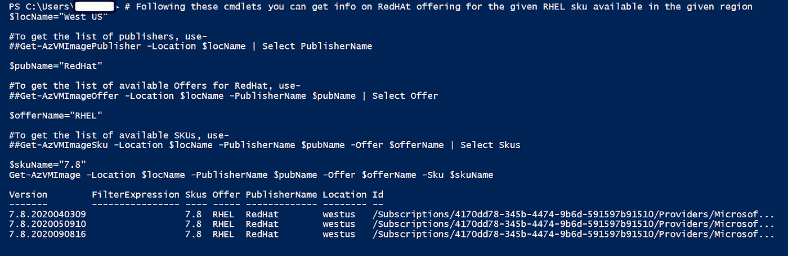

# 在 EUS 和非 EUS Azure RHEL 虚拟机仓库之间切换

> 原文：<https://medium.com/globant/switching-between-eus-non-eus-azure-rhel-vm-repositories-964ce90b41b8?source=collection_archive---------0----------------------->

# 关于文章

在这篇文章中，你将了解 Azure RHEL VM——更新行为、关联存储库和切换存储库(EUS 和非 EUS)。

阅读本文后，您将学会:

*   确定 RHEL 虚拟机映像的关联存储库
*   通过锁定-解锁功能修复 RHEL 虚拟机映像版本问题，并更新服务器
*   根据需要在存储库之间切换

在使用 Linux 服务器时，需要使用 *sudo* *yum update* 命令多次更新服务器。无论您需要安装任何新的软件包还是更新现有的软件包，都建议您在安装前或安装后更新服务器。以下是与 RHEL 更新流程相关的两个场景:

*   使用***yum update****命令更新服务器，同时也更新了最终用户不希望的 RHEL 镜像版本。*
*   *安装/更新任何软件包/应用程序时，它会停止并显示以下消息:*

***此服务器未连接到 Red Hat Subscription manager 或卫星服务器***

*这篇文章主要倾向于给出一瞥，以了解上述问题和解决方案来修复它。*

*这将涵盖以下主题:*

*   *Azure Red Hat 更新基础架构(RHUI)简介*
*   *选择 RHEL 图像类型前请三思*
*   *RHEL 图像更新行为*
*   *存储库类型和标识
    —非 EUS 回购
    — EUS 回购*
*   *RHEL EUS — RHEL 虚拟机版本锁*
*   *为什么我们需要版本锁定和解锁？*
*   *切换
    —将 RHEL 虚拟机切换到 EUS 回购
    —将 RHEL 虚拟机切换回非 EUS 回购*

# *Azure RHUI 简介*

*red Hat Update infra structure(**RHUI**)在 Azure cloud 中预配置了预付费( **PAYG** )映像。这意味着，使用 Azure PAYG 映像不需要任何额外的配置就可以从 RHUI 仓库获得最新的更新。*

*对于其他自定义和黄金图像(称为**BYOS**——自带订阅)，它需要连接到红帽订阅管理器( **RHSM** )或卫星服务器来接收更新。*

*RHUI 支持在 Azure 中创建的 RHEL PAYG 虚拟机，以镜像 Red-Hat 托管的存储库内容，从而创建具有 Azure 特定内容的自定义存储库。*

*如果您在 Azure cloud 中提供 RHEL PAYG 映像，它会预配置为访问 azure RHUI。它也不需要任何额外的配置。一旦您的 RHEL 虚拟机实例被提供，只需运行***sudo yum update***命令就可以获得最新的更新。使用本服务的费用包含在 RHEL PAYG 软件费用中。*

*Azure 基于功能、存储、性能和工作负载提供了广泛的 RHEL PAYG 虚拟机系列。虚拟机的定价和可用性可能因所选地区和操作系统/软件而异。*

*请参考以下链接了解定价详情:*

*[https://azure . Microsoft . com/en-us/pricing/details/virtual-machines/red-hat/](https://azure.microsoft.com/en-us/pricing/details/virtual-machines/red-hat/)*

# *选择 RHEL 图像类型前请三思*

*Azure 中调配的 RHEL PAYG 虚拟机已预配置为访问 RHUI。但是，这并不限制您向 Subscription Manager (RHSM)或卫星或任何其他来源注册此虚拟机。但是，如果你注册 PAYG 虚拟机与其他来源的更新，这将导致间接重复计费。*

*让我们通过以下细节来理解这一点:*

*访问 Azure 托管的 RHUI 的费用包含在 RHEL PAYG 图像价格中。向另一个更新源注册同一个虚拟机可能会产生双重费用。首先，您将被收取 Azure RHEL 软件费用，第二次为红帽订阅。*

*如果您从 Azure hosted RHUI 注销 RHEL PAYG 虚拟机，它不会将您的虚拟机转换为 BYOL(自带许可证)类型的虚拟机。相反，您需要调配另一个 BYOL 类型的虚拟机。*

*如果您的要求是始终使用其他来源获取更新，请为虚拟机配置 RHEL BYOS 映像。*

# *RHEL 图像更新行为*

*当您运行 ***sudo yum update*** 来获取最新的 RHEL 映像更新时，它的行为会根据您提供的 RHEL 映像而有所不同。这是因为不同的图像由不同的存储库处理。*

*Azure 提供了两种类型的 RHEL 图像，这些图像与以下任一项相关联:*

*   *扩展更新支持(EUS)*
*   *常规非 EUS 存储库*

*在 Azure 中，可以使用下面的 Azure CLI 命令列出可用的 RHEL 映像:*

```
****az vm image list –publisher redhat -all****
```

*输出:*

**

*或者，使用 PowerShell cmdlets*

```
*# e.g. Below cmdlets let you get the info on RedHat offerings for the given RHEL sku available in the given region*$locName=”West US”*#To get the list of publishers, use-#Get-AzVMImagePublisher -Location $locName | Select PublisherName*$pubName=”RedHat”*#To get the list of available Offers for RedHat, use-#Get-AzVMImageOffer -Location $locName -PublisherName $pubName | Select Offer*$offerName=”RHEL”*#To get the list of available SKUs, use-#Get-AzVMImageSku -Location $locName -PublisherName $pubName -Offer $offerName | Select Skus*$skuName=”7.8"**Get-AzVMImage -Location $locName -PublisherName $pubName -Offer $offerName -Sku $skuName**
```

*输出:*

**

# *存储库类型和标识*

*在根据更新基础架构的要求选择要调配的 RHEL 映像时，确定存储库类型非常重要。*

*RHEL 图像全名(URN)由四个部分组成(**发行商:报价:SKU:版本**)，它描述了关于图像的所有细节。*

*例如:*

```
*RedHat:RHEL:7-LVM:7.6.2019062414*
```

*这个骨灰盒指的是 2019 年 6 月 24 日建立的 RHEL 7.6 LVM 分区映像。*

```
*RedHat:RHEL:7.6:7.6.2019062116*
```

*图片发布于 2019 年 6 月 21 日，连接到 EUS*

*让我们详细了解 EUS 和非 EUS 连接的 RHEL 图像。*

## *非 EUS 存储库*

*如果您在从连接到非 EUS 存储库的 RHEL 映像供应的 RHEL 虚拟机上运行 ***sudo yum update*** ，它会将虚拟机更新到最新的 RHEL 次版本。*

*为了理解这一点，我们举个例子。*

*如果您在 Azure 上提供 RHEL 虚拟机 7.5 PAYG 映像并运行***sudo yum update****，*这将升级到 RHEL 7.7 虚拟机并更新其他包。RHEL 7.7 是 RHEL 7 家族的最新次要版本。*

*下图是连接到非 EUS 的 RHEL 图像的示例:*

*在下图中，SKU ( **第三个元素，见粗体- *斜体*** )不包含次要版本。映像版本(URN 的第 4 个元素)表示次要版本。*

```
*RedHat:RHEL:***7-LVM***:7.4.2018010506RedHat:RHEL:***7-RAW***:7.4.2018010506*
```

## *EUS 知识库*

*如果您在连接到 EUS 存储库的 RHEL 虚拟机上运行 ***sudo yum 更新*** ，它将不会升级到最新的 RHEL 次要版本。这是因为连接到 EUS 资料库的 RHEL 图像被版本锁定了。*

*连接到 EUS 存储库的 RHEL 图像示例:*

```
*RedHat:RHEL:***7.4***:7.4.2019062107RedHat:RHEL:***7.5***:7.5.2019062018RedHat:RHEL:***7.6***:7.6.2019062116*
```

*在上面的图像中，SKU(第三元素)包含一个次要版本。*

# *RHEL EUS — RHEL 虚拟机版本锁定*

*每当你在 Azure 上提供 RHEL 虚拟机时，客户可能会要求将该虚拟机锁定到任何特定的 RHEL 次要版本。这意味着客户不希望在已调配的 RHEL 虚拟机上运行 *sudo yum update* 命令时升级。*

*EUS 存储库提供一种服务，在供应之后将 RHEL 虚拟机锁定到某个 RHEL 次要版本。也可以通过这种版本锁定操作来反转。*

*EUS 对 RHEL <= 7.5 from April 30,2020.*

*EUS will support RHEL 7.6 till May 31,2021*

*EUS will support RHEL 7.7 till Aug 30,2021*

# *Why do we need version-lock-unlock?*

*If you have provisioned a RHEL VM connected to EUS repositories and you want to install a package which is available from RHEL extras, you won’t be able to do so. Because EUS does not support the RHEL extras channel.*

*To achieve this, you would need to switch this VM to non-EUS.*

# *Switching*

## *Switch a RHEL VM to EUS (Apply version-lock)*

*Please follow the below steps to lock your RHEL VM to current minor release or to a particular minor release version. All commands should be executed as *根*的支持已经结束。*

*禁用非 EUS 回购:*

```
**yum –disablerepo=’*’ remove ‘rhui-azure-rhel7’**
```

*添加 EUS 回购:*

```
**yum –config=’https://rhelimage.blob.core.windows.net/repositories/rhui-microsoft-azure-rhel7-eus.config’ install ‘rhui-azure-rhel7-eus’**
```

*将 releasever 变量锁定到当前次要版本*

```
**echo $(. /etc/os-release && echo $VERSION_ID) > /etc/yum/vars/releasever**
```

*更新 RHEL 虚拟机*

```
**sudo yum update**
```

*这些步骤会将 RHEL 次要版本锁定到当前次要版本。意味着张贴这些步骤运行 ***须藤百胜更新*** 不会升级到 RHEL 最新的次要版本。*

*如果您希望将 RHEL 虚拟机升级并锁定到特定的次要发布版本。*

*例如，您的 RHEL 虚拟机当前的次要版本是 7.2，您希望将其升级到 7.5 并锁定。*

*执行:*

```
**echo 7.5 > /etc/yum/vars/releasever**
```

*并运行:*

```
**sudo yum update**
```

*这将首先将当前次要版本升级到 7.5，并锁定该版本以防进一步升级。*

## *将 RHEL 虚拟机切换回非 EUS 模式(移除版本锁定)*

*如果您需要将 RHEL 虚拟机连接到非 EUS 存储库来执行某些操作。例如，如果你想从 Red Hat extras 安装一个软件包。*

*首先，您需要移除 RHEL 虚拟机上的版本锁定。*

*遵循以下步骤(以 root 用户身份运行):*

*删除 releasever 文件以删除版本锁定:*

```
**rm /etc/yum/vars/releasever**
```

*禁用 EUS 回购:*

```
**yum –disablerepo=’*’ remove ‘rhui-azure-rhel7-eus’**
```

*添加非 EUS 回购(配置 RHEL 虚拟机):*

```
**yum –config=’https://rhelimage.blob.core.windows.net/repositories/rhui-microsoft-azure-rhel7.config’ install ‘rhui-azure-rhel7’**
```

*正在更新 RHEL 虚拟机:*

```
**sudo yum update**
```

*按照上述步骤，您可以根据需要在 EUS 和非 EUS 之间切换。*

# *结论*

*本文旨在说服您关于 RHEL 映像更新行为，并向您展示识别和选择与正确存储库相关联的正确 RHEL 映像的正确方法。它还包括在存储库之间切换的正确方法。*

*希望这篇文章对你有帮助。*

*感谢阅读。干杯😊*