# 将自定义日历与 Salesforce 中的 Google 日历同步

> 原文：<https://medium.com/globant/sync-custom-calendar-with-google-calendar-in-salesforce-39531b72396d?source=collection_archive---------1----------------------->

Sync calendar with google calendar

我叫泰比尔·辛格。我是有 6 年经验的高级销售人员。我在销售云、社区云以及 salesforce 与外部系统的集成方面拥有专业知识。

本博客将解释如何使用 fullcalendar 库创建自定义日历，以及如何在 salesforce 中将它与 Google calendar 同步。

**按照以下步骤在 salesforce 中实施自定义日历:**

1.在静态资源中存储 fullcalendar.js、fullcalendar.css、moment.js、jQuery。这些文件可以在[这里](https://github.com/tejbir92/fullCalendar)找到。

2.将 fullcalendar.js、fullcalendar.css、moment.js 和 jQuery 包含到 lightning 组件中。

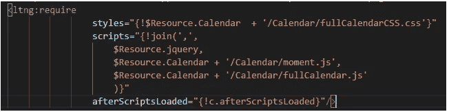

3.在 lightning 组件中包含 below div。

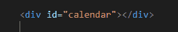

4.脚本加载后初始化完整日历。

实施上述步骤后，日历将如下所示:

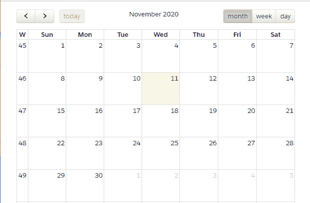

**现在，第二个重要步骤是获取 google 日历事件，并在日历中显示它们。**按照以下步骤成功连接 Salesforce 和 Google 日历:

1.在 Google API 控制台中创建新项目。

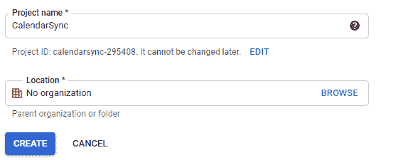

2.使用 OAuth 同意屏幕完成应用程序的注册。

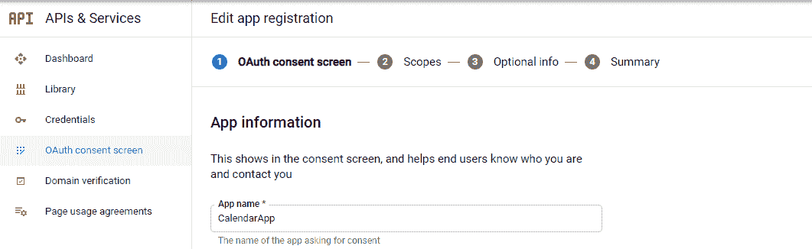

3.使用 OAuth 客户端 ID 创建凭据。

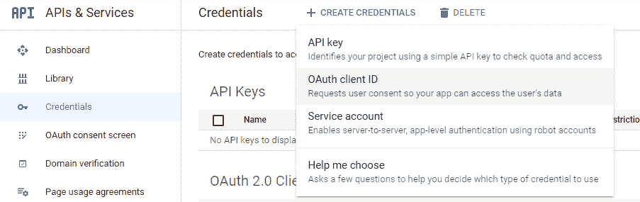

4.添加应用程序类型并重定向 URI。授权码将被附加在重定向 URI 的末尾。为重定向 URI 创建一个闪电应用程序。

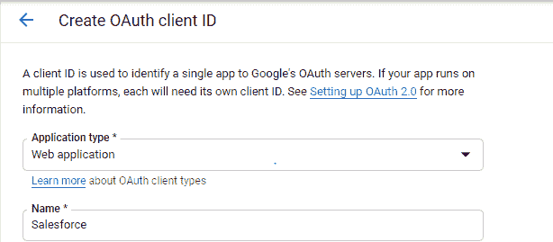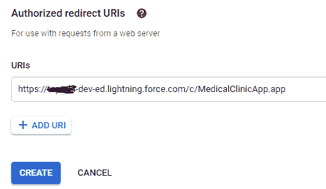

5.创建 OAuth 客户端后，将客户端 Id 和客户端机密存储在自定义元数据类型中。

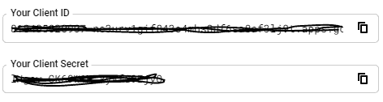

6.现在，对 google authentication URL 进行 HTTP 标注，以授予对 Google Calendar 的访问权限。

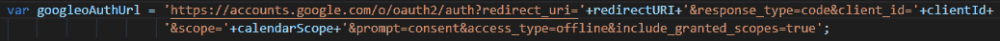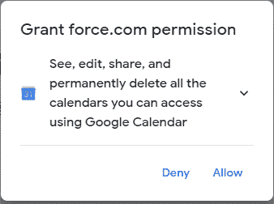

7.一旦许可被授予，它将被重定向到“重定向 URI”与授权代码附加在它的结尾。

8.使用 auth code、client_id 和 client_secret 进行 HTTP 标注，以获取访问令牌，存储访问令牌并在自定义设置中刷新令牌。

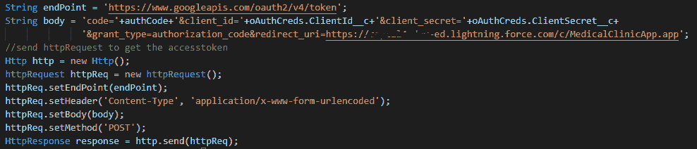

9.现在使用访问令牌获取日历事件，并在 salesforce 的自定义日历中显示这些事件。

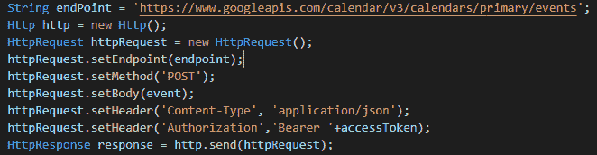

作为响应，google calendar API 将发送所有日历事件。解析响应并在 salesforce 的日历中显示它们。类似地，可以通过 salesforce 在 google calendar 中创建活动。

实施上述步骤后，google 日历事件将显示在 salesforce 的日历中。

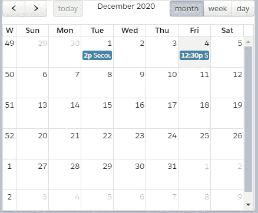