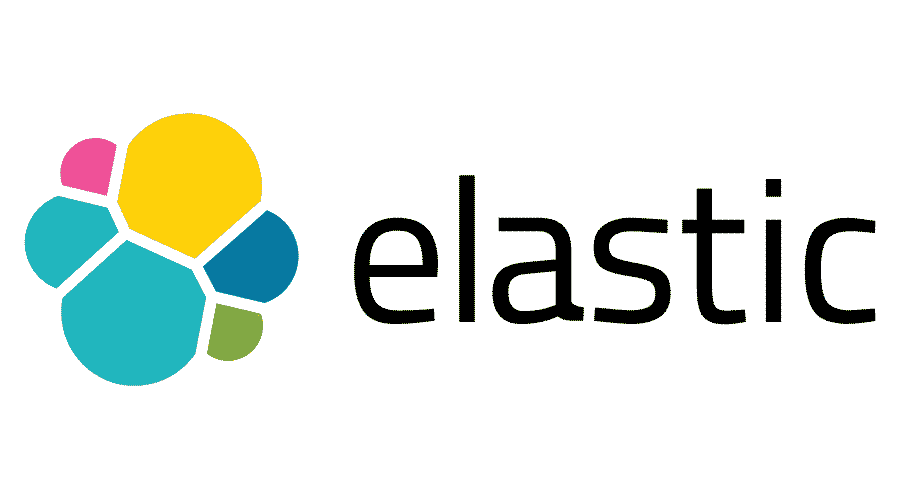
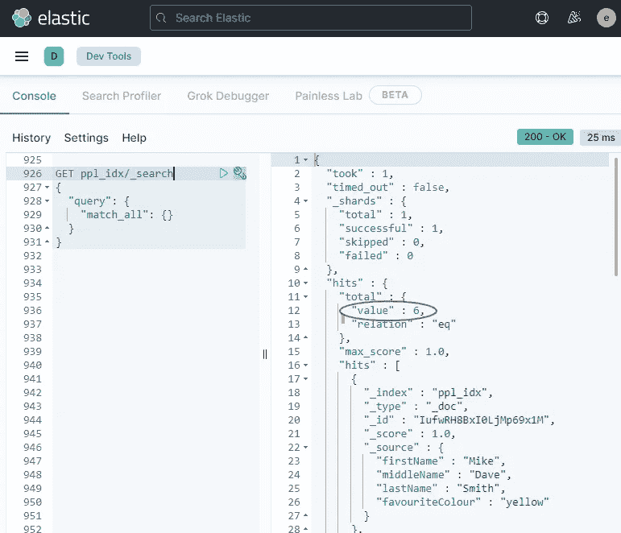
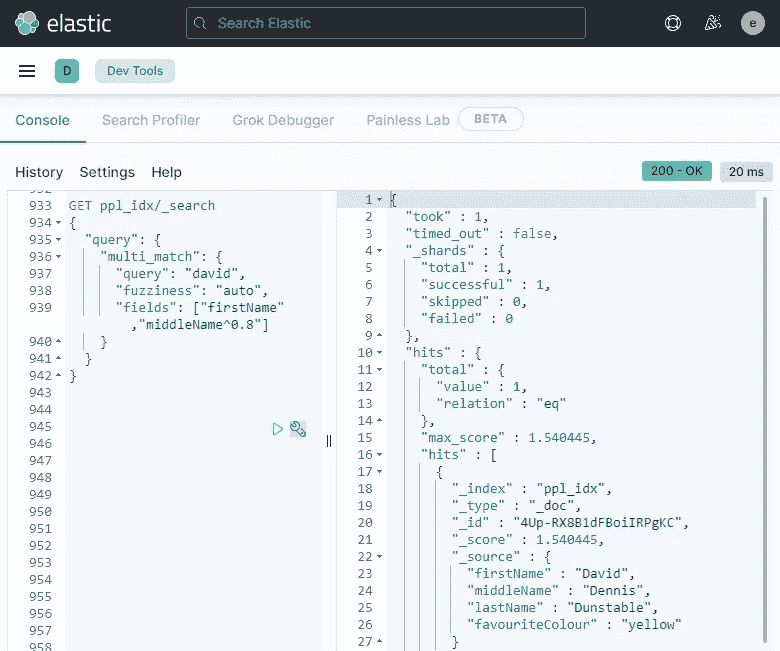
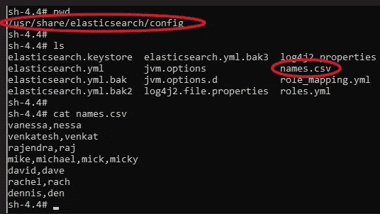
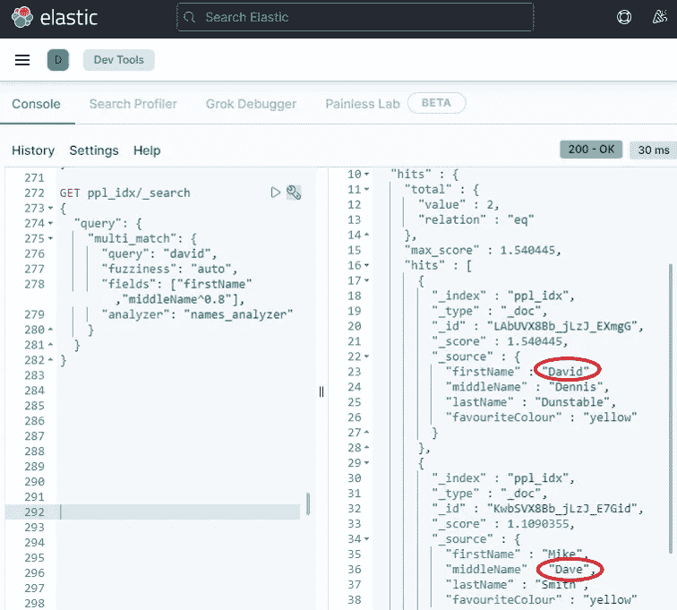
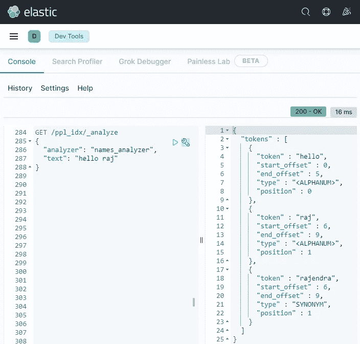

# Elasticsearch 中的同义词

> 原文：<https://medium.com/version-1/synonyms-in-elasticsearch-c527280ba8a5?source=collection_archive---------0----------------------->



**同义词—** 意思与另一个词完全或几乎相同的词。

在这篇短文中，我们将演示如何在 Elasticsearch 中实现名字的同义词，例如，当我们搜索“Ann”时，匹配名为“Anne”的人。

我们还将介绍一些弹性搜索的基础知识。

**TL；博士**

如何在 Elasticsearch 中使用同义词:

*   获取或创建每行包含一组同义词的 CSV 文件，例如 beverly、bev
*   将 CSV 文件上传到**配置**目录下的所有 Elasticsearch 索引节点。
*   将同义词文件名作为**分析器中的**标记过滤器**添加到索引中。**
*   将分析器添加到您想要实现这些同义词的任何搜索中。

**弹性同义词—简介**

在搜索应用程序中，同义词并不是一个“好东西”。用户理所当然地期望，如果他们搜索名为“Anne”的人，结果也将包括名为“Ann”的人；或者当我们搜索" Raj "时找到" Rajendra"。

如果您想运行演示，您需要一个运行 Elasticsearch 索引节点的 Elasticsearch 实例&一个 Kibana 服务器——我们将全程使用 [Kibana 开发控制台](https://www.elastic.co/guide/en/kibana/current/console-kibana.html),并通过 Linux 终端与 Elasticsearch 配置进行交互。

如果你没有弹性集群，弹性 [Docker](https://www.elastic.co/guide/en/elasticsearch/reference/current/docker.html) 图片是一个很好的起点。

**步骤 1 —创建弹性搜索指数&添加一些数据**

Elasticsearch 中的**索引**大致类似于数据库——也就是说，它是相关数据的容器。

我们将创建一个小索引，并使用 Elasticsearch dev 控制台添加一些关于人们及其最喜欢的颜色的数据。

下面的代码将向名为 ***ppl_idx，*** 的新索引中添加六条记录。注意，当我们添加第一条记录时，该索引是隐式创建的。复制&粘贴代码到开发控制台&执行…

```
POST ppl_idx/_doc
{
  "firstName": "Mike",
  "middleName": "Dave",
  "lastName": "Smith",
  "favouriteColour": "yellow"
}POST ppl_idx/_doc
{
  "firstName": "Vanessa",
  "middleName": "",
  "lastName": "Jones",
  "favouriteColour": "white"
}POST ppl_idx/_doc
{
  "firstName": "Venkatesh",
  "middleName": "Rajendra",
  "lastName": "Kumar",
  "favouriteColour": "blue"
}POST ppl_idx/_doc
{
  "firstName": "David",
  "middleName": "Dennis",
  "lastName": "Dunstable",
  "favouriteColour": "yellow"
}POST ppl_idx/_doc
{
  "firstName": "Nessa",
  "middleName": "Cloe",
  "lastName": "White",
  "favouriteColour": "Teal"
}POST ppl_idx/_doc
{
  "firstName": "Rachel",
  "middleName": "Lisa",
  "lastName": "Topaz",
  "favouriteColour": "blue"
}
```

我们可以查询索引来检查数据是否已经加载好:

```
GET ppl_idx/_search
{
  "query": {
    "match_all": {}
  }
}
```

这个对弹性 API 的调用使用了 ***搜索*** 方法，并简单地返回所有记录。如果一切顺利，我们将看到六次点击，记录返回为 JSON:



Search command in the left pane, results in the right-hand pane

**第二步——尝试一些搜索**

所以现在，让我们试着搜索几个人，我们会聪明一点，使用弹性的 ***多重匹配*** 来搜索不止一个字段:无论是**第一个**还是**中间的**名字，只要有人叫“大卫”。默认情况下，搜索不区分大小写，以防您想知道…

```
GET ppl_idx/_search
{
  "query": {
    "multi_match": {
      "query": "david", 
      "fuzziness": "auto",
      "fields": ["firstName","middleName^0.8"]
    }
  }
}
```

此外，请注意“中间名”旁边的 **^0.8** ，这是一个简单的*权重，而*意味着中间名的匹配只有名字匹配的 80%重要。因此，在我们的结果中，名字搜索结果会出现在中间名之前。

**模糊性**也设置为自动-这使得弹性搜索可以执行模糊匹配，并可能捕捉到几乎匹配的搜索词，如打字错误。

在这种情况下，这将只返回一条记录-*大卫·丹尼斯·邓斯特布尔*，所有的 D！



但是“迈克·戴夫·史密斯”增加了一张唱片；用户会期望搜索工具理解 Dave 和 David 是一回事，并在搜索结果中返回两个记录。

同义词上…

**第 3 步-创建一个同义词 csv 并上传到弹性搜索**

所以我们现在需要告诉弹性搜索关于名字的同义词，我们在索引中添加了以下可能有同义词的名字:

迈克·戴夫·史密斯
凡妮莎·琼斯
文卡特什·拉杰德拉·库马尔
大卫·丹尼斯·邓斯特布尔
妮莎·克洛伊·怀特
瑞秋·丽莎·托帕斯

这里有几个同义词，例如“文卡特什”可以缩写为“文卡特”，凡妮莎和妮莎也是同义词。我们可以创建一个简单的文件来列出这些，并保存为 csv 文件；我会叫我的——***名字。csv***

```
vanessa,nessa
venkatesh,venkat
rajendra,raj
mike,michael,mick,micky
david,dave
rachel,rach
dennis,den
```

请注意，一行中可以有任意多的同义词，例如“mike”有四个条目。

现在我们将 csv 文件上传到**各**弹性索引节点上的配置目录中:



names.csv synonyms file in the elastic config directory

现在我们需要创建一个弹性搜索**分析器**来实现我们的同义词列表…

**什么是弹性研究分析仪？**

在高层次上，分析器控制弹性搜索对文档进行索引的方式。例如，您可以添加一个带有“ [Ascii 折叠](https://www.elastic.co/guide/en/elasticsearch/reference/current/analysis-asciifolding-tokenfilter.html)”**令牌过滤器**的分析器，它将把像“似曾相识”这样的重音字符转换成基本的拉丁 Unicode 字符——“似曾相识”

因此，当您搜索时，您仍然可以匹配重音字符——请注意，分析器可以包含多个执行不同行为的字符和令牌过滤器。此[弹力博客帖子](https://www.elastic.co/blog/found-text-analysis-part-1)更详细。

继续我们的例子…

**步骤 4 -创建弹性分析仪**

我们需要一个分析器来引用我们的同义词文件。以下对 Elasticsearch 的调用将一个名为 ***names_analyser*** 的新分析器添加到我们名为 ***ppl_idx*** 的索引中。

```
PUT /ppl_idx
{
  "settings": {
    "analysis": {
      "analyzer": {
        "**names_analyzer**": {
          "tokenizer": "standard",
          "filter": [
            "lowercase",
            "names_synonyms"
          ]
        }
      },
      "filter": {
        "names_synonyms": {
          "type": "synonym",
          "synonyms_path": "names.csv",
          "updateable": true
        }
      }
    }
  }
}
```

那么我们在这里做了什么？我们来分解一下…..

```
PUT /ppl_idx
```

很简单，一个对 http PUT 方法的 REST 调用，有效载荷是下面的 JSON 文档…

```
"settings": {
    "analysis": {
      "analyzer": {
```

这些元素告诉 Elastic 我们想要对分析设置进行设置更改，特别是一个分析器…

```
 "names_analyzer": {
          "tokenizer": "standard",
          "filter": [
            "lowercase",
            "names_synonyms"
```

在这里我们定义我们的分析器，我们给它一个名字: ***names_analyzer***

然后我们设置**记号赋予器**，它告诉 Elastic 如何将搜索文本分解成离散的部分(**术语**)，在我们的例子中，标准记号赋予器就可以了。点击查看更多关于记号赋予器[的信息。](https://www.elastic.co/guide/en/elasticsearch/reference/current/analysis-tokenizers.html)

接下来，我们告诉分析器要使用的令牌过滤器，我们定义内置的**小写**过滤器来将所有搜索文本设置为小写——这是因为我们随后的同义词过滤器执行**精确匹配，**所以大小写很重要，因为 **names.csv** 都是小写。

然后，我们还指定了一个名为 **names_synonyms，**的令牌过滤器，接下来定义的是

```
"filter": {
        "names_synonyms": {
          "type": "synonym",
          "synonyms_path": "names.csv",
          "updateable": true
```

快到了！这是我们之前在分析器中引用的 **names_synonyms** 过滤器。 **Type** 告诉 Elastic 要执行的行为— **synonym** ，查找所有具有相同含义的单词(例如 rachel，rach)并将所有单词添加到搜索中。

**synonyms_path** 告诉 Elastic 在检查同义词时在哪里找到要匹配的搜索词列表。

**可更新** —当设置为 true 时，这允许我们更新我们的同义词文件并重新加载分析器，而不需要使我们的索引离线。

我们现在准备尝试我们的同义词分析器…

**步骤 5——在搜索中实现我们的同义词分析器**

对！所有的部分都准备好了，我们只需要对我们的搜索负载做一个小小的修改，通过添加**“analyzer”:“names _ analyzer”**到搜索中来实现我们的新分析器。

我们会像文章开头一样搜索“大卫”,但希望这次我们会找到两个匹配项——同时添加“迈克·戴夫·史密斯”…

```
GET ppl_idx/_search
{
  "query": {
    "multi_match": {
      "query": "david", 
      "fuzziness": "auto",
      "fields": ["firstName","middleName^0.8"],
      **"analyzer": "names_analyzer"**
    }
  }
}
```



Ta-Da! Two Hits, Two Dave’s

运行该查询，我们现在得到两个匹配项，返回了 David 和 Mike Dave，他们都有相同的最喜欢的颜色！谁知道呢？

**步骤 5.1 —测试同义词**

还有另一种快速测试新分析器的方法——***_ analyze***方法。

下面，我们可以通过输入“hello raj”作为测试文本，并告诉 Elastic 使用我们的新分析器进行分析，来测试 raj 同义词是否有效。然后我们可以看到 Elastic 如何分解搜索并处理令牌…



结果标记显示了我们的搜索文本和同义词查找“rajendra”的两个字母数字标记，作为 names.csv 文件中的第三个标记。这三个都将在搜索中匹配。

**结论**

在这篇文章中，我们在 Elasticsearch 中创建了一个小型搜索索引，包含姓名和最喜欢的颜色的数据:-)

然后我们上传了一个名字的同义词查找文件&将其添加到一个**分析器**中作为一个**令牌过滤器**。然后，我们将**分析器**添加到我们的**索引**中。

最后，我们修改了我们的搜索请求以使用这个分析器，结果不仅返回被搜索的名字，还返回该名字的任何同义词。所以搜索“David”也会返回任何叫“Dave”的人。

**最终想法—偏差&集群**

从来都不简单，是吗？

同义词的查找文件在我们的搜索系统中很有可能存在偏见。仅限于西方姓名或女性姓名质量更高的查找文件可能会导致搜索偏向这些群体。

另一种方法可能是考虑语音搜索，根据*发音*相似来匹配单词，这对于我们的“anne”对“ann”的例子来说应该很好，但是对于名字的缩写版本来说会有效吗？

Elasticsearch [语音分析插件](https://www.elastic.co/guide/en/elasticsearch/plugins/current/analysis-phonetic.html)实现了这一行为。如果我有机会尝试，我一定会写一篇关于我的发现的帖子。

此外，如果我们有一个多节点的 Elasticsearch 集群，我们需要在所有节点上保持同义词查找文件**相同**——任何差异都意味着相同的搜索每次都可能返回不同的结果！

**最终，最终字**

我并不自称是 Elasticsearch 方面的专家，但我努力寻找清晰的文档来让同义词发挥作用，这篇文章是我阅读的许多文档和文章的混合体。希望对少数人有帮助。

如果你确实找到了更好\更容易做到这一点的方法，请在下面留下评论，我很乐意了解更多。


**关于作者:**

Mike Knee 是第 1 版的 Azure 数据开发人员。