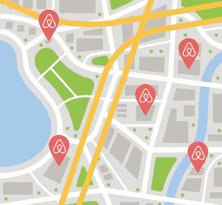

# 系统设计面试:Airbnb 或类似的在线住宿市场

> 原文：<https://medium.com/double-pointer/system-design-interview-airbnb-or-similar-online-marketplace-for-lodging-a0cd6ddd9edd?source=collection_archive---------1----------------------->

[**上一张**](https://bit.ly/33VqCgA) **|** [**首页**](https://bit.ly/3tVGgRY) **|** [**下一张**](https://bit.ly/3Hk85bD)

***别忘了买一本*** [***设计数据密集型应用***](https://amzn.to/3HWOSPm) ***，这是系统设计面试准备中最重要的一本书！***[***uda city***](https://bit.ly/3JIpvl4)***|***[***Coursera***](https://imp.i384100.net/zaYBB0)***|***[***plural sight***](https://pluralsight.pxf.io/Ao7GGK)***。***

> 查看 [**字节跳动的**](https://bytebytego.com?fpr=datajek34) 热门 [**系统设计面试课程**](https://bytebytego.com?fpr=datajek34)