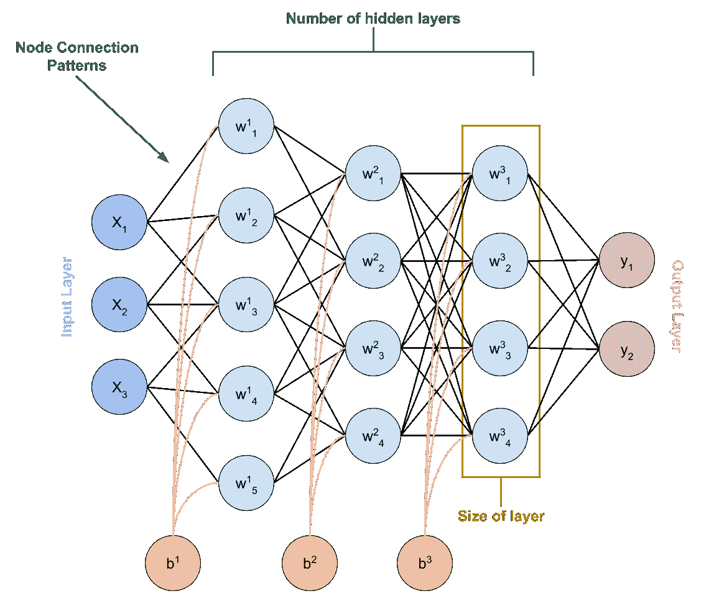
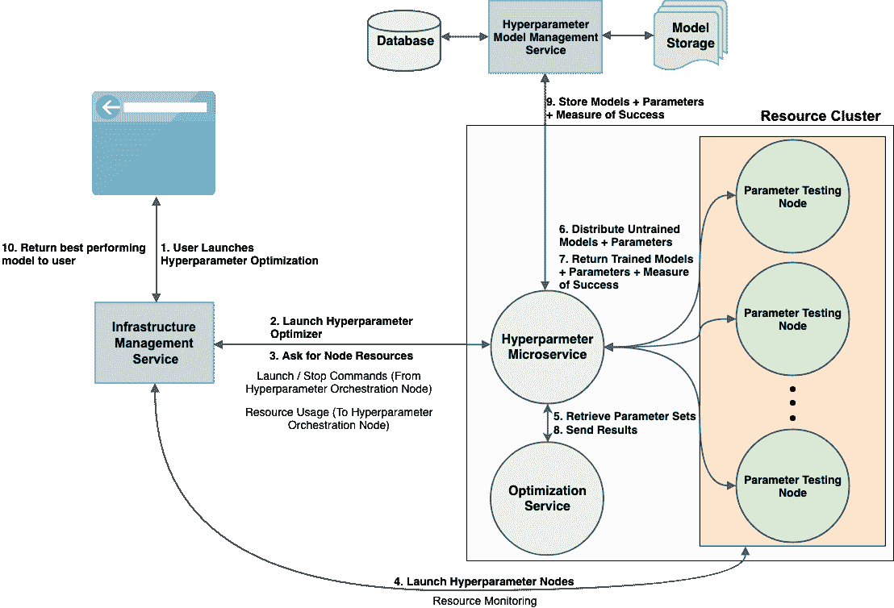
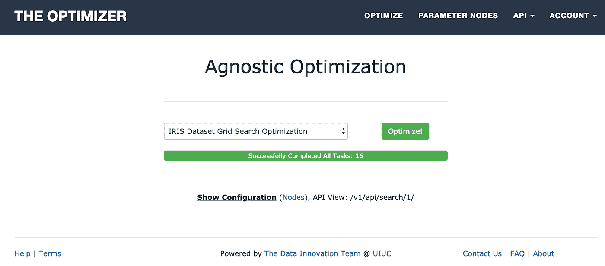
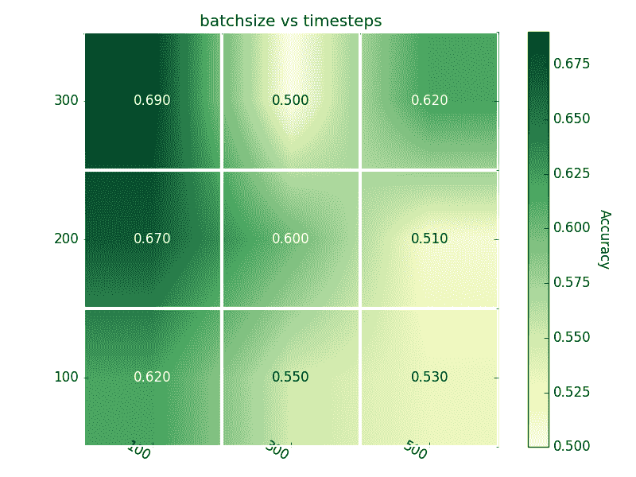

# 与系统和语言无关的大规模超参数优化

> 原文：<https://medium.com/capital-one-tech/system-language-agnostic-hyperparameter-optimization-at-scale-and-its-importance-for-automl-92d9f9add416?source=collection_archive---------7----------------------->

## **及其对 AutoML 的重要性**


近年来，新的机器学习架构的开发出现了爆炸式增长，这些架构实现了曾经对人工智能来说深不可测的任务。虽然这篇文章可能会没完没了地谈论这些令人兴奋的发展，但它将是关于帮助人工智能超越人类思维界限的必要框架。无聊？也许吧。但是想象一个微服务可以优化任何 ML 模型，因为它对语言、基础设施和结果/模型存储需求是不变的。在 Capital One，我很自豪能够帮助构建一个基于云、不受系统和语言限制的超参数优化框架，帮助我们实现了最先进的结果。

在开始之前，了解在 AWS 上的 Capital One 开发和部署环境中进行开发的目的和注意事项非常重要。

# **什么是超参数优化？**

在 ML 模型的训练阶段，例如图像对象分类，我们迭代地优化模型的参数(权重和偏差)以满足期望。这样的参数被称为模型参数，它独立于另一类称为超参数的参数，这是本文的重点。从最基本的意义上来说:

**超参数**——改变模型学习完成其任务的方式
(即优化方法、批量标准化等)。)或模型的学习
能力(模型本身的结构，即隐藏层的数量、层的大小
等。).

**模型参数** —在训练模型
时迭代学习的参数(模型权重和偏差)。

例如，如果我想教动物一个新的技巧，一些超参数可能是:动物类型/品种/年龄；我如何训练动物；训练中使用的零食；培训次数等。因为这些要么影响他们的大脑结构，要么影响他们的学习过程；然而，训练动物的过程优化了动物的大脑，模型参数。



*Figure 1: Neural network with labeled hyperparameters and model parameters. Model parameter weights,* ***wij****, and biases,* ***bi****, are contained within the hidden layers of the neural network. The hyperparameters number of hidden layers, layer size, and node connection patterns control the architecture of this neural network.*

最终，超参数优化的目的是调整训练方法和模型架构，直到模型在给定可用训练、开发和测试数据的情况下实现其最佳性能。

# **缩放的重要性**

根据驱动超参数调整的优化技术，可以同时选择多组超参数。给定模型的每组超参数都可以独立训练，这使得模型训练成为一个非常并行的过程。例如，来自[网格或随机搜索](/rants-on-machine-learning/smarter-parameter-sweeps-or-why-grid-search-is-plain-stupid-c17d97a0e881)(非学习优化器)的每个超参数集是彼此独立确定的，而[贝叶斯优化](https://towardsdatascience.com/a-conceptual-explanation-of-bayesian-model-based-hyperparameter-optimization-for-machine-learning-b8172278050f)(学习优化器)需要之前的结果来确定下一个最佳超参数集。因此，非学习优化器可以很容易地并行化，而学习优化器可能需要一些技巧。

# **不可知论的重要性**

最先进的模型开发和优化技术变化非常快。因此，理想的框架必须是模块化的，以便轻松地转换到最新的功能。对于超参数优化，这需要三个主要的不可知组件:

1.  程序设计语言
2.  优化库
3.  模型管理服务

此外，对于可移植性或安全性，有以下三个次要的不可知要求:

1.基础设施

2.可部署性/集装箱化

3.可通过 RESTful APIs 配置/控制

# **Capital One 的超参数优化**

## **笔记本电脑上的本地开发**

如今的 ML 功能使得普通用户可以相当直接地下载最新的数据科学包(即 scikit-learn 等)。)并开始在当地开发模型。然而，对于模型来说，最优地执行是相当不可能的，并且局部超参数优化可能不可扩展，这取决于被优化的模型的大小、被评估的超参数空间的大小、被应用的优化技术和/或模型训练数据。这些限制源自超参数任务的内存和 CPU 速度/并行化的本地限制。

## ***手动控制云优化***

Capital One 在云基础设施上投入了大量资金，这意味着启动虚拟机或容器来并行化超参数任务相对容易。这些都可以在云中控制，也可以通过远程访问在本地控制。然而，管理结果和向每个容器/虚拟机部署新的超参数搜索需要大量的 DevOps 背景。此外，安全限制可能不允许这种通信发生。

## *自动化云优化*



*Figure 2: Communication diagram of the hyperparameter optimization framework. The hyperparameter microservice is constantly determining new hyperparameter sets from the optimization service, sending individual hyperparameter sets to each parameter testing node, and sending the results to the model management service.*

这是事情变得令人兴奋的地方。与其自己管理优化，为什么不让服务来处理呢？我很幸运地制造了这样一个产品，它只有两个开始训练的要求:

1.  GitHub 回购和你的模型
2.  一个简短的 JSON 配置脚本。

以下是发送到超参数调整微服务的示例脚本:

```
```{
 “code_github”: “https://github.com/.../optimizer_example",
  “command”: “python model_script.py”, # This could be running java, c++, etc.
  “dir”: “path/in/repo/to/script”,
  “install_script”: “install.sh”, # pre installation script o setup the environment
  “primary_result_key”: “accuracy”, # what we are optimizing
  “backend”: “aws”, # service we are deploying our infrastructure within
  “resources”: {
     “instance_count”: 10,
     “instance_type”: “p3.8xlarge”
  },
  “optimizer”: {
    # In here we specify the optimizer service type and any optimizer setup specifics
  },
  “search”: {
       # In here, we add the configuration sent to the optimizer service
       # For instance, with SVM we could search kernel and penalty
  },
  “model_storage”:{ # where we store our model after running a hyperparameter set
    “type”: “s3”,
    “bucket”: “<YOUR_S3_BUCKET_S3://>”
    “model_dir”: “saved_model”,
     “clean_model_dir_flag”: true
  }
}```
```

一旦超参数微服务收到脚本，它将启动参数节点，测试它从优化器服务获得的每组参数，直到它从优化器收到停止命令或不再有搜索参数。在评估超参数集时，完整的训练结果将同时发送到优化器和模型管理服务，该服务可以存储模型和结果以供以后检索。



*Figure 3: Front-end of the hyperparameter optimization microservice. Once the configuration script is sent to the microservice, the user can submit the configuration for optimization and track its completion status.*

这种超参数优化框架可以轻松实现:

1.  提交要使用工程师期望的优化技术进行调整的模型
2.  存储训练好的模型
3.  存储数据集的相关超参数、结果和源

虽然前两点是必要的/有用的，但是对于 AutoML 来说，模型训练历史是至关重要的，这一点我将在下面介绍。

# **对 AutoML 的重要性和应用**

最终，目标是允许服务用有限的人力来构建模型。只需指向数据，并允许服务自动生成模型(AutoML)。然而，如果没有不成功/成功的模型架构的知识集，新的模型将不得不从零开始构建，而不使用从构建先前的模型中获得的知识。

相反，AutoML 服务可以建立在先前尝试的架构和结果(如上所述)的目录上，以基于先前的搜索来预测什么架构可能工作得最好。换句话说，这允许模型基于以前架构的知识集进行训练，并基于所有以前的历史而不仅仅是在训练当前模型时完成的历史，尝试预测我们在架构搜索中的下一步。

# **当前和未来的应用**

在很大程度上，这种微服务主要应用于深度学习模型的调优。一个用例包括我的同事在他的帖子“[为什么你不一定需要数据科学的数据](/capital-one-tech/why-you-dont-necessarily-need-data-for-data-science-48d7bf503074)”中提到的模型由于数据中的键/值对之间的依赖性，这些模型，尤其是 GANs，本质上可能是脆弱的。利用这项服务，结构化和非结构化合成数据生成的成功率提高了 30%,同时将手动模型处理时间从数周/数月缩短到不到一天。



*Figure 4: Example 2D mapping of accuracy in relation to batch size and number of time steps for an RNN when utilizing the hyperparameter microservice. For this case, A larger batch size increased accuracy; however, increasing the amount of time steps decreased accuracy.*

正如我提到的，希望能够为给定模型绘制超参数空间，并使用所述信息来预测未来模型的理想架构。为了构建所述预测器，需要大量的数据来进行这样的预测，但是随着 challenger 模型生成和存储每个超参数迭代的结果、模型和元数据的简单性，这种可能性正在变成现实。

*伊利诺伊大学第一首都大学厄巴纳-香槟分校实验室的数据创新团队。感谢编辑:Anh Truong、*[*Mark Watson*](http://markwatson.com/)*、Reza Farivar 和*[*Austin Walters*](https://austingwalters.com/)*。*

*以上观点为作者个人观点。除非本帖中另有说明，否则 Capital One 不隶属于所提及的任何公司，也不被其认可。使用或展示的所有商标和其他知识产权都是其各自所有者的所有权。本文为 2019 首都一。*