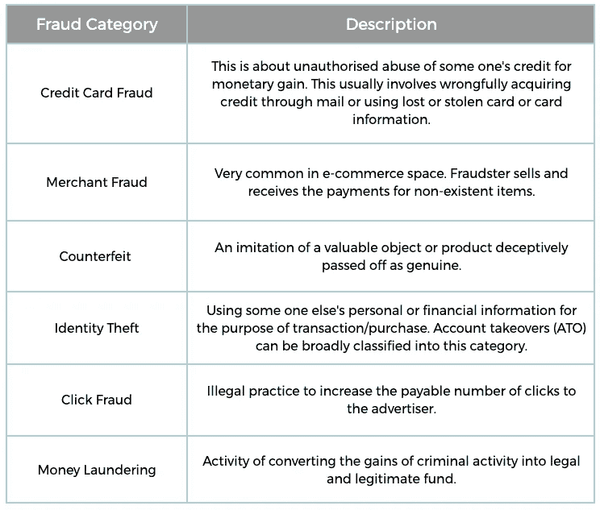
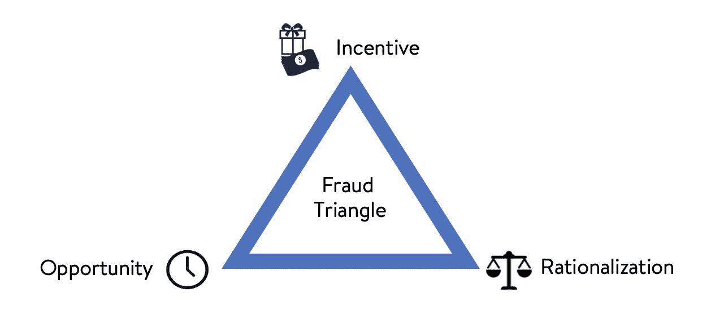
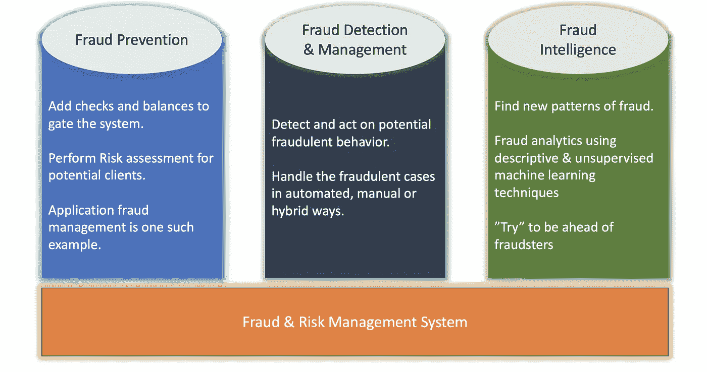

# 欺诈的系统观点—简介

> 原文：<https://medium.com/walmartglobaltech/system-view-of-fraud-introduction-516ccf3eb705?source=collection_archive---------0----------------------->

*[注意:本文是全面欺诈分析系列文章的第一篇&欺诈检测和防范策略。]*

***“我们制造欺诈的能力现在已经超过了我们检测欺诈的能力。”***

*~西蒙·阿尔·帕西诺(2002 )*

Image by [u_lxme1rwy](https://pixabay.com/users/u_lxme1rwy-15218555/?utm_source=link-attribution&utm_medium=referral&utm_campaign=image&utm_content=4839031) from [Pixabay](https://pixabay.com/?utm_source=link-attribution&utm_medium=referral&utm_campaign=image&utm_content=4839031)

那么什么是欺诈呢？按词义(剑桥词典)走，诈骗是— *通过欺骗人获得金钱的犯罪* **。**然而， [Investopedia](https://www.investopedia.com/terms/f/fraud.asp) 给出了一个更好、更通用的解释，如下所示:

> 诈骗是**故意** **欺骗性**行为，旨在为**犯罪者**提供**非法收益**或**否认**受害者的权利**。**

上述定义的核心要点:

*   欺诈是故意的——欺诈行为不是偶然的，而是经过精心策划和组织的。
*   欺诈具有欺骗性——欺诈行为具有欺骗性。这是对真相的隐瞒或扭曲，从而导致误导性的结果或欺骗。
*   **欺诈有肇事者** —欺诈从来都不是偶然的。因为它总是故意的，所以在行为背后总是有一个犯罪者——以个人、团体或组织的形式。
*   **欺诈有受害者** —成功的欺诈行为会给犯罪者带来非法/不道德的收益。这种收益是以某人为代价的，而一个预定的受害者(个人、企业或组织)为此付出代价；更多的是用金钱来衡量。欺诈是一种社会现象。
*   **欺诈是非法的** —欺诈行为是非法的。大多数政府都有将欺诈定为犯罪的法律。

# **欺诈类型**

欺诈有多种形式和类型，发生在许多不同的环境中。以下是基于发生频率和货币影响的欺诈类别的非详尽列表:

Common Fraud Types

以上列表只是冰山一角。还有其他各种各样的欺诈，如*网络钓鱼、保险欺诈、医疗欺诈、退款欺诈、逃税、剽窃*等，这些都很常见。

# **欺诈三角**

那么欺诈为什么会发生呢？这可以用所谓的欺诈三角来最好地描述。

The Fraud Triangle

上述框架概述了导致欺诈风险的三个因素:1)动机，2)机会，3)合理化。

1.  **激励**是舞弊发生的主要动机。这可能是想赚更多钱的个人动机，也可能是迫使实施欺诈的外部压力或恐惧。
2.  **机会**是关于允许欺诈发生的环境。只有当个人有机会以隐蔽或隐藏的方式进行未经授权的活动时，才可能存在欺诈活动。
3.  **合理化**是关于一个人对欺诈行为的辩护。这就是为什么欺诈者不回避实施欺诈，并认为这是可以接受的。

# 欺诈成本

如上所述，欺诈是一种社会现象；也就是说，欺诈者的收益是以牺牲受害者为代价的。

*   根据来自 www.crowe.com[的 2019 年报告，欺诈每年给全球经济造成超过 5 万亿美元的损失。](https://www.crowe.com/global/news/fraud-costs-the-global-economy-over-us$5-trillion#:~:text=Fraud%20is%20costing%20businesses%20and,at%20the%20University%20of%20Portsmouth.)
*   根据 www.acfe.com 的早期报告，一个典型的组织每年会因为欺诈损失超过 5%的收入。
*   根据[www.lexology.com](http://www.lexology.com)[报告](https://www.lexology.com/library/detail.aspx?g=69615b55-444f-42bb-a1c1-40275b9289f8)，仅在美国，欺诈性保险索赔每年就造成约 400 亿至 800 亿美元的损失。

上述数字确实表明了欺诈的影响以及任何组织将打击和预防欺诈作为其战略的重要性。

# **打击欺诈**

对于任何从事对外交易的组织或企业，或者任何直接或间接涉及金钱的地方，欺诈问题都是显而易见的。这也是一个独特的挑战，因为欺诈作为一个问题空间是动态的，并且在不断发展。企业认为这是一个需要解决的首要问题，因为否认这一问题或处理欺诈风险的错误方法可能会导致客户对产品和企业品牌的信任破裂，以及法规遵从性问题。

从高层次来看，欺诈管理战略可以分为以下 3 个方面:

Fraud Management Strategy

全面的反欺诈解决方案需要框架的所有上述组件。总的来说，欺诈解决方案从基于人工**审计**的系统发展到成熟的自动化**决策支持系统**。大多数企业解决方案(构建为专用的独立反欺诈解决方案或构建在现有业务中的解决方案)发展并提供欺诈管理解决方案的混合模型，其中决策&执行可以尽可能自动化以防止和遏制欺诈，但也有手动审查或覆盖方法，因为永远无法保证 100% **假阳性**或**假阴性**。

*(在以后的文章中，我将详细介绍所有 3 个组件的系统&设计方法。敬请关注&如果你有什么特别想知道的，请在评论中提出建议。)*

# **放在一起**

欺诈和风险管理是在任何商业&企业中建立**信任&安全**的广阔领域和核心部分。随着不断发展的技术空间、更多的数字交易和开放的市场，欺诈的类型和频率增加了许多倍。规划和建立欺诈管理战略越早越好。

随着大数据、机器学习和数据科学的技术发展，欺诈分析和智能已经成为可能。

# *参考文献&演职员表:*

1.  *使用描述性、预测性和社交网络技术的欺诈分析【图书】*
2.  [*https://corporatefinanciensinstitute . com/resources/knowledge/accounting/fraud-triangle/*](https://corporatefinanceinstitute.com/resources/knowledge/accounting/fraud-triangle/)
3.  [*https://towards data science . com/fraud-detection-unsupervised-anomaly-detection-df43d 81 FCE 67*](https://towardsdatascience.com/fraud-detection-unsupervised-anomaly-detection-df43d81fce67)
4.  *统计分析与数据挖掘应用手册【全书】*