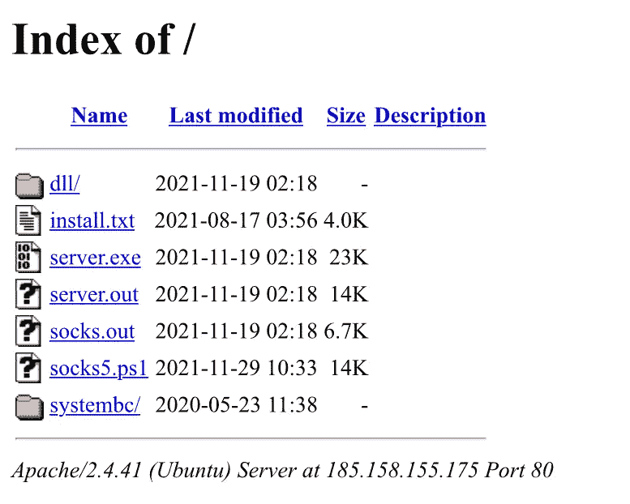
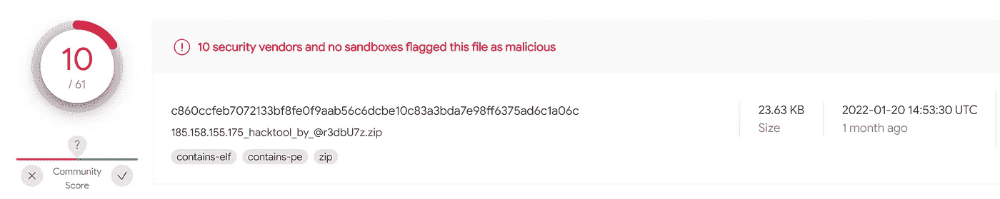
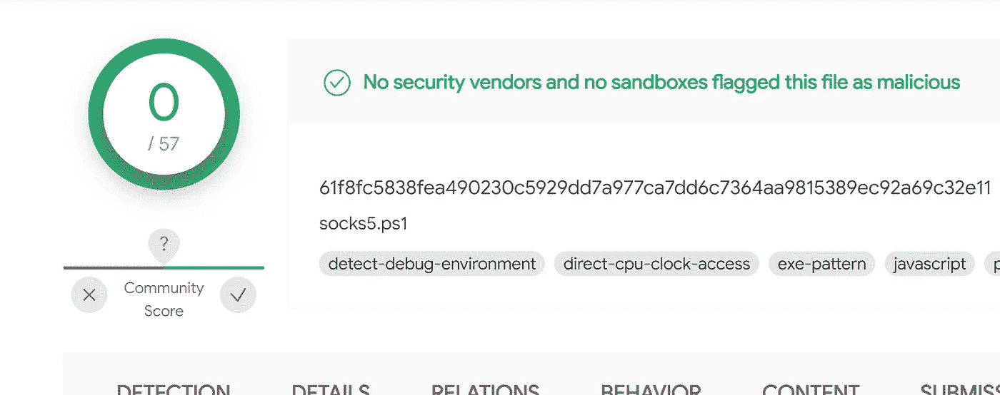
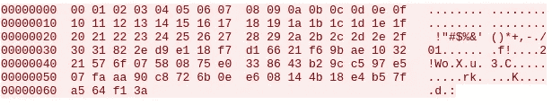

# SystemBC，PowerShell 版本

> 原文：<https://medium.com/walmartglobaltech/systembc-powershell-version-68c9aad0f85c?source=collection_archive---------2----------------------->

作者:杰森·里维斯和约书亚·普拉特


过去几年中，针对企业环境的一些最有效的恶意软件已经结合了脚本。基于脚本的恶意软件的反病毒检测在历史上落后于基于二进制的检测。我们之前概述的 SystemBC 恶意软件即服务[1]已经被大量犯罪软件集团利用，这些犯罪软件集团参与针对企业的勒索软件操作[1，3，4，5]。今年早些时候，twitter 上的一名研究人员[2]发现并上传了一个包含 SystemBC 包的开放目录的副本，该包包含 SystemBC 包的元素以及一个有趣的 powershell 文件:



上传的软件包可以在 VirusTotal 上找到:



Ref: [https://www.virustotal.com/gui/file/c860ccfeb7072133bf8fe0f9aab56c6dcbe10c83a3bda7e98ff6375ad6c1a06c/details](https://www.virustotal.com/gui/file/c860ccfeb7072133bf8fe0f9aab56c6dcbe10c83a3bda7e98ff6375ad6c1a06c/details)

PowerShell 脚本“socks5.ps1”没有检测到:



Ref: [https://www.virustotal.com/gui/file/61f8fc5838fea490230c5929dd7a977ca7dd6c7364aa9815389ec92a69c32e11/details](https://www.virustotal.com/gui/file/61f8fc5838fea490230c5929dd7a977ca7dd6c7364aa9815389ec92a69c32e11/details)

powershell 脚本有一个包含 C2 服务器和端口号的头，然后设置一个名为“xordata”的 50 字节块，稍后将传递给“Rc4_crypt”函数

```
$xordata = New-Object byte[] 50For ($i=0; $i -ne 50; $i++) { $xordata[$i] =  $i }
```

使用来自 VirusTotal 的流量示例:



解密:

```
>>> a = '000102030405060708090a0b0c0d0e0f101112131415161718191a1b1c1d1e1f202122232425262728292a2b2c2d2e2f3031822ed9e118f7d16621f69bae103221576f07580875e0338643b29cc597e507faaa90c8726b0ee608144b18e4b57fa564f13a'
>>> import binascii
>>> b = binascii.unhexlify(a)
>>> b
'\x00\x01\x02\x03\x04\x05\x06\x07\x08\t\n\x0b\x0c\r\x0e\x0f\x10\x11\x12\x13\x14\x15\x16\x17\x18\x19\x1a\x1b\x1c\x1d\x1e\x1f !"#$%&\'()*+,-./01\x82.\xd9\xe1\x18\xf7\xd1f!\xf6\x9b\xae\x102!Wo\x07X\x08u\xe03\x86C\xb2\x9c\xc5\x97\xe5\x07\xfa\xaa\x90\xc8rk\x0e\xe6\x08\x14K\x18\xe4\xb5\x7f\xa5d\xf1:'
>>> from Crypto.Cipher import ARC4
>>> len(b)
100
>>> b[:50]
'\x00\x01\x02\x03\x04\x05\x06\x07\x08\t\n\x0b\x0c\r\x0e\x0f\x10\x11\x12\x13\x14\x15\x16\x17\x18\x19\x1a\x1b\x1c\x1d\x1e\x1f !"#$%&\'()*+,-./01'
>>> rc4 = ARC4.new(b[:50])
>>> rc4.decrypt(b[50:])
'\xb1\x1d\x00\x01PS\x00\x00\x00\x00\x00\x00\x00\x00\x00\x00\x00\x00\x00\x00\x00\x00\x00\x00\x00\x00\x00\x00\x00\x00\x00\x00\x00\x00\x00\x00\x00\x00\x00\x00\x00\x00\x00\x00\x00\x00\x00\x00\x00\x00'
```

第一个词是 Windows 的内部版本号:

```
 $osn = [system.environment]::osversion.version.build

                 $os0 = $osn -band 0x000000ff
                 $os1 = [math]::Floor(($osn -band 0x0000ff00) * [math]::Pow(2,-8))

                 $buffer0[50] = $os0 -as[byte]
                 $buffer0[51] = $os1 -as[byte]
```

在我们的解密示例中，这是“7601”，下一个字值是位校验:

```
 $int64 = 0

                 if ([IntPtr]::Size -eq 8) {$int64 = 1}

                 $buffer0[53] = $int64 -as[byte]
```

PS 值是硬编码的:

```
 $buffer0[54] = 0x50 -as[byte]
                 $buffer0[55] = 0x53 -as[byte]
```

在登记之后，bot 接收 IP 和端口号，并且每个 IP 和端口号被分配给它们自己在池线程中的工作，该线程将处理代理流量。

```
[void]$ps.AddScript($new_connection)
[void]$ps.AddParameter("stream", $stream)
[void]$ps.AddParameter("writer", $writer)
[void]$ps.AddParameter("reader", $reader)
[void]$ps.AddParameter("SocketArray", $SocketArray)
[void]$ps.AddParameter("ebx", $ebx)                [void]$ps.AddParameter("domain", $domain)                  [void]$ps.AddParameter("port_", $port_)             [void]$ps.AddParameter("xordata_", $xordata)          [void]$ps.AddParameter("Rc4_crypt", $Rc4_crypt)
    $jobs[$i] = [PSCustomObject]@{
        PowerShell = $ps
        AsyncResult = $ps.BeginInvoke()
    }
```

使用开发人员选择的当前方法(硬编码密钥生成)，我们可以假设这个版本仍然处于开发阶段。这使得网络和端点检测暂时更容易。

# IOCs

Powershell 版本:

c 860 cc feb 7072133 BF 8 Fe 0 f 9 aab 56 c 6 dcbe 10 c 83 a3 BDA 7 e 98 ff 6375 ad 6 C1 a 06 c

185.158.155[.]175

SystemBC 完整 C2 列表:

```
185.61.138.59
172.106.86.12
sweetcloud.link
asdfghjkl.host
bitdesk.online
ordercouldhost.com
hcwakententx2.com
proxybro.top
195.123.241.38
92.53.90.70
bmwsocksmozg.top
fmk7kux2dsxowkks.onion
rarlabarchiver.ru
servx278x.xyz
cp.nod32clients.com
dwuhpii.bit
108.61.245.154
masonksmith.me
193.109.69.17
165.227.204.91
185.222.202.66
march-socat01.xyz
tvtmhltd.org
5.132.191.105
185.215.113.78
179.43.178.96
protoukt.com
socksbswfjhofnbu.onion
admex175x.xyz
185.70.184.5
194.5.250.151
91.213.50.135
generalnetworking.net
185.215.113.32
5.34.178.172
soks5.icu
178.20.41.173
94.103.95.115
sadfsdfjj4838377aa.cc
amendingnoum.xyz
efydniaemviuxkfo.onion
mydomain47294.xyz
46.166.161.93
45.156.26.59
predatorhidden.xyz
usmostik.com
185.125.230.131
kvarttet.com
vpnstart.chickenkiller.com
s2.avluboy.xyz
fahrrados.de
socks5.in
137.74.151.42
rastreio-correios.com
188.212.22.165
arbetfrolli.pw
reserveupdate.com
statistiktrafiktrubest.net
tbueguicsrwo64i7.onion
[www.bullioncdn.com](http://www.bullioncdn.com)
176.123.6.150
farfisada.ga
80.66.88.165
146.70.44.168
proxysteu5m36rdt.onion
srv1619541516.hosttoname.com
e6rldxwjc4jeb72c.onion
s1.freesocksvpn.xyz
66.42.91.161
217.182.46.152
138.197.141.150
systemhomeupdate.com
core-networking.com
74.125.46.143
109.201.140.54
verguliosar.com
xxxxxxtnuhffpbep.onion
185.193.91.234
37.49.229.138
fresher.at
45.86.162.14
maka.bit
79.141.160.156
188.209.52.188
cashnet-server.com
tik-tak.club
jjj.rop.dev
bljxlgj4h4yuxkju.onion
45.141.87.60
63bwf6zdrgsmagpt.onion
92.63.197.143
fragrant.digital
infodialsxbz.com
78.47.64.46
91.212.150.113
artkalyan.shop
you.bit
95.217.132.79
217.8.117.18
108.62.141.227
jmlor.com
upteambuilding.com
140.82.16.134
45.77.65.72
dragonfire.ac.ug
proxybum.xyz
74.125.112.7
coinupdater.bit
qtrader.club
maniodaris.com
95.216.118.223
tdsstats.mooo.com
45.134.26.93
h4yk5u554epyhhen.onion
system.proredirector.com
s1.freevpnsocks.xyz
scserv2.info
hcwakentent.com
185.209.30.232
172.105.16.113
217.8.117.24
31337.hk
gambinos.space
ns2.vic.au.dns.opennic.glue
data.servicestatus.one
gosigoji.bit
manillarout.com
mydomain47267.xyz
5.132.191.104
194.61.24.117
185.159.82.73
master-socks.cc
139.60.161.58
23hfdne.xyz
brabulco.ac.ug
80.233.248.109
4renewdmn.biz
5.206.224.199
ncordercreatetest.com
socks5.eu
sdkfjjkfasdjfiu435dzz.cc
74.125.74.6
5.188.60.95
tik-tak-super-puper.xyz
135.181.37.144
93.187.129.249
185.197.74.227
lisnm.com
scserv1.info
s.avluboy.xyz
217.8.117.65
149.28.201.253
t6xhk2j3iychxc2n.onion
shellcon.pro
criminal-records.life
185.191.32.191
aitchchewcdn.online
176.111.174.63
ns1.vic.au.dns.opennic.glue
joiasbella.com.br
78.141.210.78
dktigsgquxihyrik.onion
coinsdoctor.bit
3q5d4sgdxdxkkzhl.onion
185.119.57.126
92.163.33.248
23.249.163.103
199.247.25.132
prorequestops.com
arbetfroll.pw
r55q2zj8sb89b33k.bit
31337r.hk
whatimnot.sc.ug
23hfdne.com
statistiktrafiktrubest.com
arhi-lab.com
jlayxnzzin5y335h.onion
zghiexdgwfzi44b5.onion
84.38.129.162
masonksmith.tech
46.166.176.247
37.1.204.96
93.114.128.189
socks5v7v2snlwr7.onion
206.189.120.27
35.246.186.86
199.19.225.233
149.248.18.56
march-socat01.com
45.153.186.243
5.79.124.201
fhaaaggs.ml
176.123.8.226
217.8.117.42
adobeupd.host
huxere.xyz
37.1.220.248
gigabitsolutions.pw
jjj2.rop.dev
31.184.218.251
bc.fgget.top
173.255.208.126
annaweber.fun
ssl.virtualpoolnet.com
213.159.213.225
hfbplsny55xcsgbn.onion
213.227.155.220
45.138.172.144
91.142.77.52
proxyshmoxy.xyz
gambinos.club
93.187.129.252
45.77.65.71
dfhg72lymw7s3d7b.onion
91.217.137.44
example.com
109.201.142.17
annaklein.fun
62.210.54.235
cleanerwors.com
65.21.93.53
185.254.121.121
fastconnectionbit.xyz
dealsbestcoupons.com
microsoftmirror.ac.ug
185.33.84.190
95.181.152.152
91.218.114.16
212.114.52.149
185.235.244.244
cheakendinner.xyz
45.145.67.170
149.28.145.240
92.53.90.84
185.233.2.50
185.215.113.114
whatshoetowear.com
80.66.88.139
185.158.155.175
91.212.150.133
185.70.186.170
23.82.141.176
134.195.14.192
buffalostores.cc
mobinetworks.xyz
185.209.30.180
23.106.223.52
195.2.73.44
5.255.97.23
185.70.184.3
185.198.56.2
185.215.113.101
185.70.184.41
91.243.44.5
mainscpnl.xyz
backpscpnl.xyz
146.70.41.133
185.118.167.155
85.25.207.68
moscow11.icu
5.39.221.47
162.33.179.20
195.133.40.103
142.132.185.13
carnessanjuanmedina.com
190.2.145.98
207.32.216.202
5.183.95.197
91.234.254.128
62.113.255.16
89.39.105.111
62.113.255.11
193.29.56.71
185.186.245.37
89.43.107.126
45.56.102.245
23.152.0.38
107.155.124.13
5.101.78.2
146.70.78.22
polidestar.com
mokkotapia.com
ctldl.com
194.93.56.214
69.61.107.218
62.113.255.29
146.0.77.21
```

# 探测

端点:

```
Run key:
"HKCU:\SOFTWARE\Microsoft\Windows\CurrentVersion\Run" - socks5_powershell 
```

网络:

```
alert tcp $HOME_NET any -> $EXTERNAL_NET any ( msg:"SystemBC Powershell bot registration"; dsize:100; content: "|00 01 02 03 04 05 06 07 08 09 0a 0b 0c 0d 0e 0f 10 11 12 13 14 15 16 17 18 19 1a 1b 1c 1d 1e 1f 20 21 22 23 24 25 26 27 28 29 2a 2b 2c 2d 2e 2f 30 31|"; offset: 0; depth: 50; classtype:trojan-activity; sid:9000011; rev:1;)
```

# 参考

1:[https://medium . com/walmartglobaltech/inside-the-system BC-malware-as-a-service-9aa 03 AFD 09 c 6](/walmartglobaltech/inside-the-systembc-malware-as-a-service-9aa03afd09c6)

2:【https://twitter.com/r3dbU7z 

3:[https://news . sophos . com/en-us/2020/10/14/inside-a-new-ryuk-ransomware-attack/](https://news.sophos.com/en-us/2020/10/14/inside-a-new-ryuk-ransomware-attack/)

4:[https://twitter.com/vk_intel/status/1234891766924484609?lang=en](https://twitter.com/vk_intel/status/1234891766924484609?lang=en)

5:[https://blogs . blackberry . com/en/2021/06/threat-Thursday-system BC-a-rat-in-the-pipeline](https://blogs.blackberry.com/en/2021/06/threat-thursday-systembc-a-rat-in-the-pipeline)