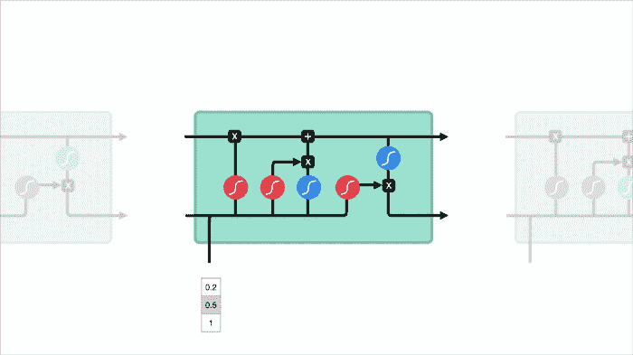
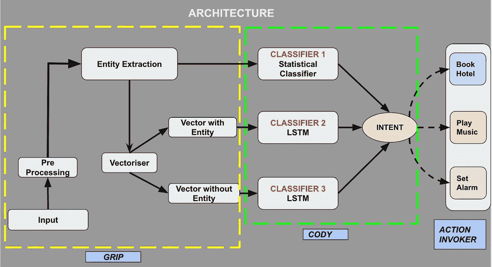

# 聊天机器人的创造者

> 原文：<https://medium.com/walmartglobaltech/t%C3%AAte-%C3%A0-t%C3%AAte-the-chatbot-creator-56a5b9b36c2?source=collection_archive---------0----------------------->


[Image Source](https://in.pinterest.com/pin/507921664221914259/)

我相信，在本世纪末，词语的使用和普通的教育观点将会有如此大的改变，以至于人们可以谈论机器思维而不会被反驳 

*~艾伦·图灵*

**你好世界！随着年龄的增长，钢铁侠曾经是我最喜欢的超级英雄(现在仍然是)，我不能忽略贾维斯在与伟大的托尼·斯塔克拯救世界中的重要贡献。他只需要告诉贾维斯该做什么，然后…噗…“任务完成，史塔克先生”。**


Ironman with JARVIS ([Image Source](https://techaeris.com/2013/11/07/new-google-now-update-easter-egg-reported/))

维基百科对聊天机器人的定义是:

> 聊天机器人是一种软件应用程序，用于通过文本或文本到语音进行在线聊天，而不是提供与真人代理的直接联系。

从定义上，你一定猜到了 JARVIS 是一个 **MCU** (对于非千禧一代的 MCU 是**漫威电影宇宙**)夸张的智能聊天机器人。我知道你在想什么，真的有可能制造出如此精密的机器吗？我将用*奥斯卡·王尔德-* 的话来回答这个问题

***“拍月亮。即使你错过了，你也会在群星中着陆***

聊天机器人的起源可以追溯到 20 世纪 60 年代，当时伊莱扎 T20 是在麻省理工学院开发的。接下来是**帕里**模仿做精神分裂症患者。 **Jabberwacky** 、**斯拜索博士**、**爱丽丝**、 **SmarterChild** 、 **Siri** 、 **Google Now** 、 **Cortana** 等等，从那时起就披上了不同的长袍，以各种方式为我们服务。

今天，聊天机器人甚至更聪明，可以主动和被动地采取行动，甚至可以模仿真人(在智力和情感方面)。

在过去的几年里，聊天机器人已经成为非常老练的谈判者。这些不仅仅是断言。随着我们的移动，这里有一些雄心勃勃的聊天机器人使用统计数据需要记住:

*   聊天机器人可以削减高达 30%的运营成本。
*   到 2021 年，85%的客户交互将在没有人类代理的情况下处理。
*   50%的企业计划在聊天机器人上的支出超过在移动应用上的支出。

我们为什么需要聊天机器人？

```
- **Case Deflection**: Chatbots can answer commonly asked questions resulting in fewer cases getting logged.- **Reduced wait times**: Customers spend less time waiting in the queue. They get commonly answered questions in a chat window instead of a call, waiting for an email or any other channel.- **Saved time for agents**: As chatbots are deflecting common questions, agents can spend time in complex issues.- **Intelligent responses through NLU (Natural Language Understanding)**: Using NLU, bots can learn how to respond to customers in humanly way.
```

微软的路易斯、谷歌的 [Dialogflow](https://dialogflow.cloud.google.com/#/login) 和 [IBM Watson](https://www.ibm.com/in-en/cloud/watson-natural-language-classifier) 是市场上其他一些成熟的聊天机器人创造者。在开源领域， [RASA](https://rasa.com/) 一马当先。

创造*tête-à-tête*的动机是帮助组织和人们，生产和操作机器人，而不是由数据科学劳动力/知识支持。这将有助于大规模建造机器人。

我已经说得够多了。*一对一机器人*，请继续…..

```
***Tête-à-Tête bot****:* Hi! I am here to tell you about my creator. Go!
```


[Image Source](https://in.pinterest.com/pin/31877109849322638/)

# 迫切的问题

# 什么是面对面？

> *Tête-à-Tête* 是一个自然语言理解平台，有助于创建和优化人工智能驱动的交互式聊天机器人。控制台将能够以即插即用的方式生成所需的组件及其部署模型。

*“tête-à-tête”*字面意思是两个人之间的私人谈话。该平台将能够为商业和个人需求建立持续的伙伴关系。

# 面对面是做什么的？

*   设计一种新颖的架构/管道，用于智能处理和简化聊天机器人创建过程中的数据流。
*   交付一个工具来无缝地构建机器人，而不必与后端架构进行交互。
*   比较多种架构的性能，并推荐工具中最有前途的架构。

# 基本术语

[**实体**](https://www.helpshift.com/glossary/entity-in-chatbot/) 是指用户用来描述他们问题的修饰语，意图才是他们真正的意思。实体描述用户文本中的关键细节，如位置、时间、姓名等。

[**意图**](https://www.helpshift.com/glossary/intent-in-chatbot/) 是指我们试图通过聊天机器人实现的目标。它通常封装了一类要执行的任务。

# 体系结构

该平台由 3 个主要组件组成-

1Grip:该组件主要处理**预处理流水线**、**实体提取**、**矢量化。**

**预处理**包括去除[噪声](https://en.wikipedia.org/wiki/Noisy_data)，去除[停用词](https://en.wikipedia.org/wiki/Stop_word)、[词干](https://en.wikipedia.org/wiki/Stemming)、[词条满足](https://en.wikipedia.org/wiki/Lemmatisation)等。

**实体提取器**将通过组织原始输入帮助获取基本信息，这将导致对话语形态丰富性的理解。

在**向量化**中，输入话语被转换成待由神经网络处理的单词嵌入序列。

2 **Cody:** 这个组件是决策者，将话语分类到特定的意图。

*   根据由包括所识别的实体的短语形成的向量对意图进行分类
*   根据由短语形成的向量对意图进行分类，而不包括所识别的实体
*   基于所识别的实体集合的意图识别(非结构化分类器)
*   该组件还将从上述分类器预测的意向置信度值的加权平均值中识别最终意向



LSTM cells ([Image Source](https://towardsdatascience.com/illustrated-guide-to-lstms-and-gru-s-a-step-by-step-explanation-44e9eb85bf21))

分类器 1 是一个统计分类器，它将基于识别的实体集进行预测。

分类器 2 和分类器 3 是 RNN(递归神经网络)。递归神经网络存在短期记忆的问题。如果一个序列足够长，它们将很难将信息从较早的时间步骤传递到较晚的时间步骤。LSTM 有一种叫做“门”的内部机制，可以控制信息的流动。分类器 2 被馈送以具有包括实体的表征的张量，而分类器 3 被馈送以不考虑实体的张量。

包装投票分类器考虑从这三个分类器获得的结果，并预测最终意图。

3 每个意图都映射到一个响应或要执行的动作。它可能是单个字符串响应，也可能是复杂的事务。



Architecture

## 每个人都以自己的方式是独一无二的。让我来说说我的特殊品质:

*   使用训练样本释义的辅助数据生成
*   即插即用方法，包括任何种类的预处理器、实体提取器和分类器，使其高度可定制和个性化成为可能
*   支持像 BERT 这样的变形金刚
*   专门针对常见问题的特殊摄取方法，消除了注释数据的需要，使系统能够立即启动并运行
*   通过维护上下文，既可用作状态机，也可用作无状态机
*   神经网络结构中的动态层生成以避免维数灾难并提取完整的本质

# 总结

聊天机器人每天都在发展，为新的维度打开了大门，并将在我们从未想过可以自动化的情况下派上用场。有一个巨大的未使用的公用事业潜力，组织正在熟悉它，必须加以利用，使这个世界成为一个更美好的地方。

是时候打破这篇文章的循环了。这篇博客谈到了面对面的直觉部分。在下一篇文章中，我们将带来该项目的实现以及 GitHub 库，帮助大家编写代码。

***再见！！朋友*** ( *聊天机器人*在睡觉…zzzzz)

# 推荐人和证明人:

[https://en.wikipedia.org/wiki/Chatbot](https://en.wikipedia.org/wiki/Chatbot)

[](https://onlim.com/en/the-history-of-chatbots/) [## 聊天机器人的历史

### 什么是聊天机器人？本质上是一个和你聊天的人工智能程序。它可以通知你…

onlim.com](https://onlim.com/en/the-history-of-chatbots/) [](https://towardsdatascience.com/illustrated-guide-to-lstms-and-gru-s-a-step-by-step-explanation-44e9eb85bf21) [## LSTM 和 GRU 的图解指南:一步一步的解释

### 嗨，欢迎来到长短期记忆(LSTM)和门控循环单位(GRU)的图解指南。我是迈克尔…

towardsdatascience.com](https://towardsdatascience.com/illustrated-guide-to-lstms-and-gru-s-a-step-by-step-explanation-44e9eb85bf21) [](/datadriveninvestor/top-10-best-ai-chatbots-f68705a8f559) [## 十大最佳人工智能聊天机器人

### 聊天机器人几乎是在线商务的未来。你的项目清单上有一号楼吗？不确定您应该如何…

medium.com](/datadriveninvestor/top-10-best-ai-chatbots-f68705a8f559)