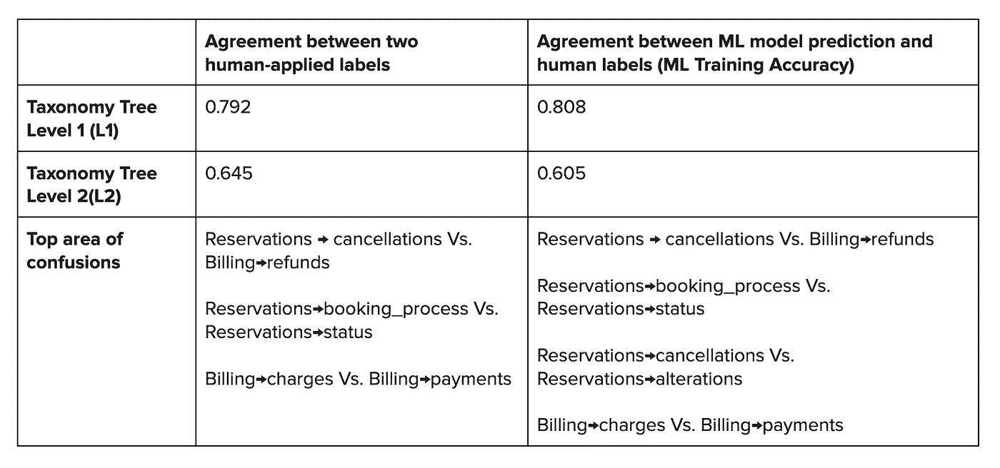
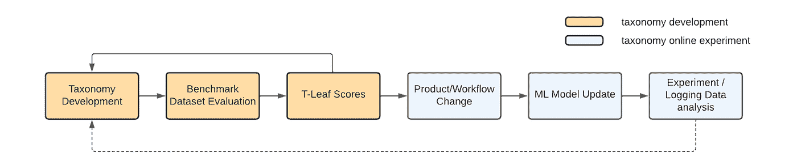

# T-LEAF:分类学习和评估框架

> 原文：<https://medium.com/airbnb-engineering/t-leaf-taxonomy-learning-and-evaluation-framework-30ae19ce8c52?source=collection_archive---------3----------------------->

**我们如何应用定性学习、人类标记和机器学习来迭代开发 Airbnb 的社区支持分类法。**

**By:** [米娅赵，](/@cenzhao06) [佩姬邵](https://www.linkedin.com/in/peggyshao)，[麦琪汉森](https://www.linkedin.com/in/maggiekhanson/)，[王鹏](/@wangpengcqb)，[博曾](https://www.linkedin.com/in/bo-zeng-71915624)

# 背景

分类法是用于分类和组织信息的知识组织系统。分类法使用单词来描述事物，而不是数字或符号，并使用层次结构将事物分成类别。分类法的结构表达了这些事物之间的关系。例如，*超级主机*是一种*主机*而*主机*是一种 Airbnb *用户*。分类法提供了重要的术语控制，并使下游系统能够导航信息和分析一致的结构化数据。

Airbnb 在前端产品中使用分类法来帮助客人和主人发现令人兴奋的住宿或体验，以及鼓舞人心的内容和客户支持产品。Airbnb 还在后台工具中使用分类法来结构化数据，组织内部信息，并支持机器学习应用程序。

对 Airbnb 社区成员面临的问题类型进行分类至关重要，原因如下:

*   **主人和客人**需要能够向 Airbnb 描述问题，以便获得相关的帮助建议或获得最佳支持。
*   **支持大使** (Airbnb 的社区支持专家)需要快速便捷地访问工作流程，帮助他们为客人和主人解决问题。
*   Airbnb 业务部门需要了解客人和主人在哪里以及为什么会遇到问题，这样我们才能改进我们的产品，让 Airbnb 体验更好。

联系原因分类是一种新的、整合的问题分类，支持所有这些使用案例。在联系原因之前，社区支持部门为来宾和主持人、支持大使和机器学习模型建立了孤立的分类法，每种分类法都使用不同的词和结构对相同的问题进行分类，并依赖手动映射来保持同步。

将脱节的问题分类整合到联系原因中是 Airbnb 的首个此类项目。这种新分类法的开发需要迭代学习:由分类学家创建/修订分类法；推广培训 ML 模型、产品和服务；评估分类法的质量，并确定需要改进的地方。在这项工作之前，没有评估分类法开发或性能的系统化过程，迭代大多是主观的和定性的。为了加速迭代开发并对分类法的质量进行更加量化和客观的评估，我们创建了 T-LEAF，a ***T*** *轴突图* ***L*** *收益图和****E****valu****A****T****F****图框*

# 评估新分类法的挑战

在 Airbnb 社区支持领域，在我们拥有真实世界的数据或明确的下游工作流应用程序之前，通常需要创建新的分类法或分类法节点。如果没有一个一致的量化评估框架来生成输入指标，那么在将一个新的分类法(或者一个分类法版本)直接应用到下游应用程序时，很难衡量它的质量。

# 缺乏定量评估框架

分类法通常是通过以定性为中心的方法开发的。当我们开始建立新分类法的原型时，我们评估了现有用户的反馈，并招募了嘉宾和主持人进行几轮用户研究，以产生见解。虽然像领域专家评审这样的定性评估有助于识别高层次的挑战和机会，但由于样本量小以及参与研究的用户可能存在样本偏差，因此不足以提供大规模的评估。

# 分类法发布的漫长而反复的产品周期

开发和启动分类法可能是一个漫长的迭代过程，需要几个季度的使用才能获得实质性的可靠的定量反馈。典型的流程包括:

*   **基于产品需求或数据驱动分析的分类发现和开发**
*   **生产变更**集成后端环境和前端表面，包括必要的设计和内容更新
*   **ML 模型**(重新)标注培训数据、再培训和部署
*   **用户反馈的记录和数据分析**

Figure 1\. Typical taxonomy development iteration cycle.

在 T-LEAF 之前，分类法开发过程仅仅依靠输出指标来衡量一个新分类法的有效性，这意味着:1)重大的改变需要很长时间的实验和测试；2)像添加或更新新节点这样的小变化没有经过测试。这两个痛点可以用 T-LEAF 框架通过一致和定期的评分来解决。

T-LEAF 的开发是为了在分类开发中包含更多的定量评估，并解决上述两个棘手问题，以加速分类开发迭代。

# 分类学学习和评估框架(T-LEAF)

# 分类法的质量

T-LEAF 框架从三个方面衡量分类法的质量:1)覆盖率，2)有用性和 3)一致性。

Figure 2\. T-LEAF Structure

# 新闻报道

覆盖率表明分类法对现实世界对象范围的分类有多好。在联系原因中，coverage score 评估分类法在多大程度上捕捉了客人和主人联系 Airbnb 社区支持团队的原因。当“覆盖率”较低时，许多用户问题(数据对象)将不会被分类覆盖，而变成“其他”或“未知”。

> 覆盖率得分= 1 -归类为“其他”或“未定义”的数据的百分比

# 有用

有用性显示了对象如何在分类法结构中均匀地分布到有意义的类别中。如果分类太粗糙，即节点或类别太少，有限数量的选项可能不足以区分所描述的对象。另一方面，如果分类法过于细化，它可能无法解释对象之间的相似性。

在 T-LEAF 中，对于具有 n 个示例(例如，不同的用户问题)的基准数据集，我们假设具有 sqrt(n)个节点的分类法在“太粗糙”和“太细粒度”之间取得了良好的平衡。对于任何输入 *x* ，我们从(0，1)计算一个分割分数来评估“有用性”:

我们想通过假设正态分布来评估数据偏差。例如，对于 100 个不同的用户问题，如果我们分成 1 个(“太粗”)或 100 个类别(“太细”)，有用性得分将接近 0；如果我们分成 10 个类别，有用性得分是 1。

# 协议

在给定分类的情况下，一致性捕获了评分者间的可靠性。我们提出两种方法来评估协议。

## 人类标签评分者间协议

多个人类注释者根据分类法定义注释相同的数据，并且我们使用 Cohen 的 Keppa 在[-1，1]范围内计算评价者间的可靠性:

## ML 模型训练精度

让多个人类评价人注释一个数据集可能是昂贵的。实际上，大多数数据都是由一个人来注释的。在 Airbnb 的社区支持中，每个客户问题/票据由一个代理处理，代理根据分类标记票据的问题类型。我们基于这种单评分者标记的训练数据来训练 ML 模型，然后将该模型应用于训练数据以测量训练准确度。如果分类定义良好(即高度“一致”)，那么相似的问题(数据点)应该有相似的标签，即使这些标签来自不同的代理。在高度一致的训练数据集上训练的 ML 模型应该具有高的训练精度。

我们已经做了实验来比较多标签评分者间协议方法和最大似然训练在单一评分训练数据上的准确性。

结果如表 1 所示。我们观察到这两种方法:1)分类的最高两级的准确性相似(L1 和 L2 问题将在下一节中定义);2)这两种方法都有相似的混淆之处。如果分类节点足够清晰，人们可以执行标记，那么一致性比率会增加，并且模型可以更好地捕捉人们的意图。反之亦然；如果最终用户对选项感到困惑或无法选择正确的类别，模型训练的准确性会受到负面影响。

1 名分析师和 9 名注释者花了大约一个月的时间来创建多名评核人数据集。相比之下，一个 ML 工程师花了一天的时间在单一评级数据上训练 ML 模型并计算训练精度。如表 1 所示，最大似然训练精度提供了对分类法“一致性”质量的类似评估。

Table 1\. Comparison between multi-rater labeling approach and ML-model over single-rater training data.

# 使用 T-LEAF 开发联系原因分类

联系原因分类由近 200 个节点组成，分布在从第 1 级(l 1)的宽泛类别到第 2 级(l 2)的较窄类别再到第 3 级(l 3)的特定问题的层次结构中。例如:

*   您的预订有问题(L1)
*   清洁和健康问题(L2)
*   列表中的烟雾或其他气味(L3)

虽然旧的分类具有不可预测的粒度级别，但根据部分的不同，Contact Reasons 具有一致的三级结构，可以更好地支持我们的持续评估框架。我们在从旧分类到新分类(联系原因)的过渡中利用了 T-LEAF，以实现更快的反馈循环，并在将新分类发布到生产环境之前提供量化的质量控制(图 3)。

Figure 3\. Iterative process of taxonomy development, evaluation, and deployment with T-LEAF.

首先，我们向 Airbnb 社区支持实验室(CS Labs)发送了一个真实世界的数据集，用于人工注释。CS Labs 是一个由技术娴熟的终身支持大使组成的团体。然后，我们使用 T-LEAF 分数作为分类法开发过程的输入。使用该输入，核心机器学习(CoreML)工程团队和分类团队合作，在生产中运行实验之前，显著提高了 T-LEAF 分数。

为了评估联系原因分类在其中一个生产环境中的表现，我们回顾了它在 Airbnb bot 中的表现。Airbnb bot 是社区支持的核心产品之一，帮助客人和主人自我解决问题，并在必要时联系支持大使。我们发现，通过 T-LEAF 的覆盖率、有用性和一致性指标衡量的联系原因分类的改进也转化为问题覆盖率、自我解决有效性和问题预测准确性的实际改进。

Table 2\. T-LEAF scores between old and new taxonomies

# 较高的 T-LEAF 覆盖率分数导致生产中更大的问题覆盖率

启动联系原因分类后，我们检查了 4 个月的生产数据，发现 1.45%的问题被标记为“这是其他问题”，比旧分类少 5.8%。这与 T-LEAF 覆盖率得分的提高是一致的(比以前的版本多 5.3%的覆盖率)。

# 有用性得分越高，通过自助服务解决的问题越多

例如，在新的分类法中，有两个新的节点叫做“*取消和退款>取消您预订的预订>帮助主人取消预订*和“*取消和退款>取消您正在主持的预订>帮助客人取消预订。*“旧的分类法仅具有用于“*预订>取消>主机发起的*”和“*预订>取消>客户发起的*”的节点，其没有粒度来确定寻求支持的客户或主机何时不是请求取消的那个。

通过新的节点，我们开发了一个机器学习模型，可以将流量驱动到定制的取消 workflows⁴.这确保了客人获得适当的退款，并且仅在相关情况下才适用取消主机处罚，而无需联系 Airbnb 支持大使。

Figure 4\. Airbnb Chatbot self-solve solutions

# 较高的 T 形叶协议分数导致更准确的问题预测

与基于旧分类的问题预测模型相比，基于新分类的模型准确性提高了 **9%。**这意味着 ML 模型预测的问题类别更有可能与支持大使选择的类别相匹配。

Figure 5\. User/Agent and ML Model Agreement

# 结论

评估分类的量化框架支持更快的迭代，并降低启动主要分类转换的风险，这对我们所有的受众都有积极的影响:客人、主人、支持大使和 Airbnb 业务。T-LEAF 框架在覆盖率、有用性、一致性方面对分类的质量进行评分，现在已经应用于社区支持中的生产分类，结果表明使用这种方法进行定量分类评估可以导致更好的模型性能和更大的问题覆盖率。

作为分类进化的持续改进框架的一部分，开发、试验和建立 T-LEAF 是跨团队的协作努力。CoreML 团队与分类、产品和 CS 实验室紧密合作，为问题分类和预测的迭代开发创建了这个新模型。在试行了这种处理联系原因的新方法后，我们相信，随着我们继续将 T-LEAF 方法应用于未来的分类计划，我们将会看到更多积极的结果

[1]: Szopinski，d .，Schoormann，t .，& Kundisch，D. (2019)。因为你的分类法是值得的:走向分类法评估框架。 *ECIS* 。【https://aisel.aisnet.org/ecis2019_rp/104/ 号

[2]:卡莱斯，j .，&布鲁索，K. (2012)。RSQRT:一种估计要报告的集群数量的启发式方法。电子商务研究与应用，11(2)，152–158。【https://doi.org/10.1016/j.elerap.2011.12.006 

[3]:智能自动化平台:在 Airbnb 为对话式 AI 及其他应用提供支持。[https://medium . com/Airbnb-engineering/intelligent-automation-platform-empowering-conversatile-ai-and-beyond-at-Airbnb-869 c 44833 ff2](/airbnb-engineering/intelligent-automation-platform-empowering-conversational-ai-and-beyond-at-airbnb-869c44833ff2)

[4]:Airbnb 客服中面向任务的对话式 AI。[https://medium . com/Airbnb-engineering/task-oriented-conversatile-ai-in-Airbnb-customer-support-5 ebf 49169 EAA](/airbnb-engineering/task-oriented-conversational-ai-in-airbnb-customer-support-5ebf49169eaa)

有兴趣在 Airbnb 工作吗？查看这些开放的角色:

[社区支持平台高级员工数据架构师](https://careers.airbnb.com/positions/3919138/)

[社区体验产品高级产品经理](https://careers.airbnb.com/positions/4044524/)

[产品经理，理赔经验](https://careers.airbnb.com/positions/3887689/)

# 感谢

感谢 CS 实验室对现有和新分类法的标签支持！

感谢 Pratik Shah、Rachel Lang、Dexter Dilla、、Zhiheng Xu、Alex Zhou、、Zhenyu Zhao、Jerry Hong、Gavin Li、Kristen Jaber、Aliza Hochsztein、Naixin Zhang、Gina Groom、Robin、Parag Hardas、Zhiying Gu、Kevin Jungmeisteris、李子俊-On Wing、Danielle Martin、Bill Selman、Hwanghah Jeong、、Lindsey Oben、Chris Enzaldo、Jijo George、Ravish Gadhwal 和马本对我们成功启动 CS 分类学和工作流相关应用程序的支持！

感谢 Joy Zhang、Andy Yasutake、Jerry Hong、、Susan Stevens、Evelyn Shen、Axelle Vivien、Lauren Mackevich、Cynthia Garda 审阅、编辑了这篇博文并提出了很好的建议！

最后但同样重要的是，我们感谢 Joy Zhang、Andy Yasutake、Raj Rajagopal、Tina Su 和 Cynthia Garda 的领导支持！