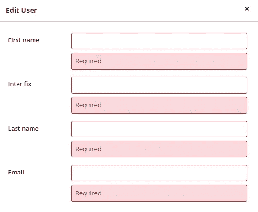
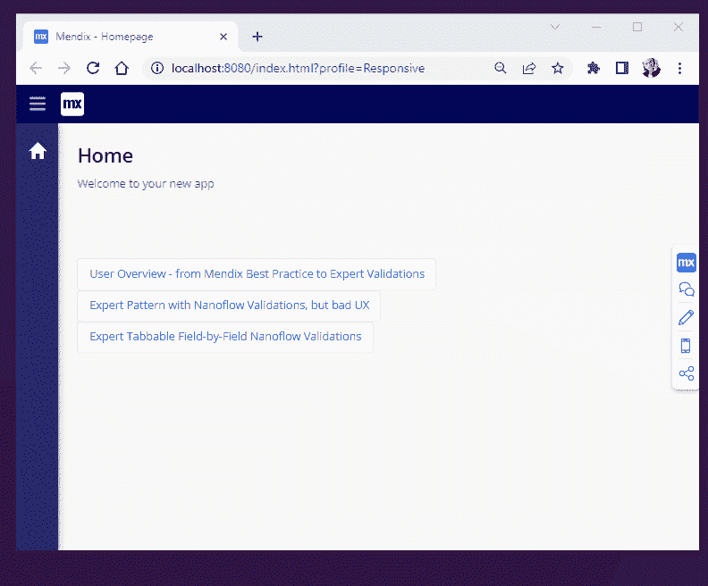
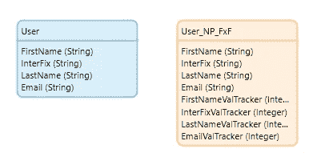
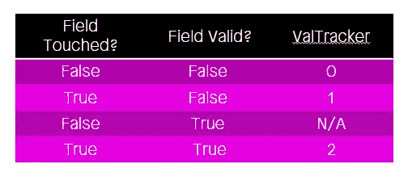
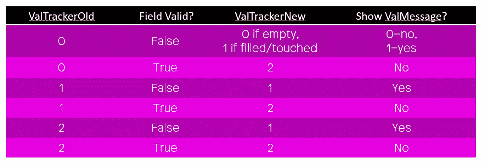
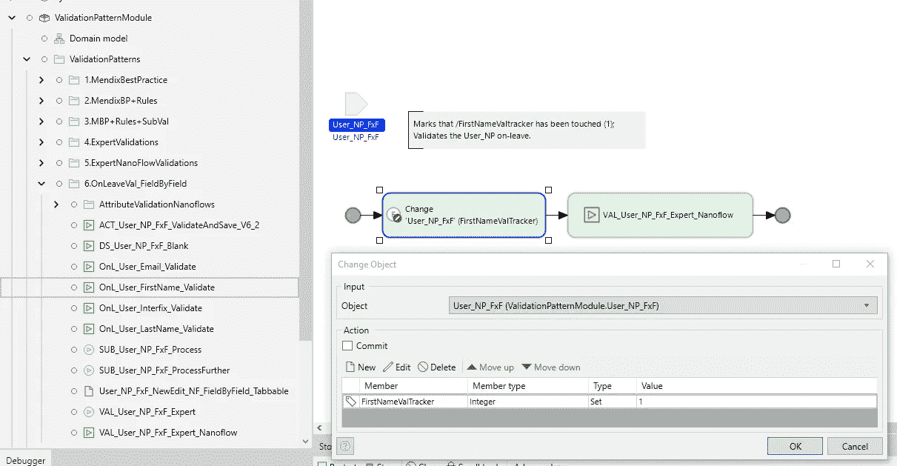
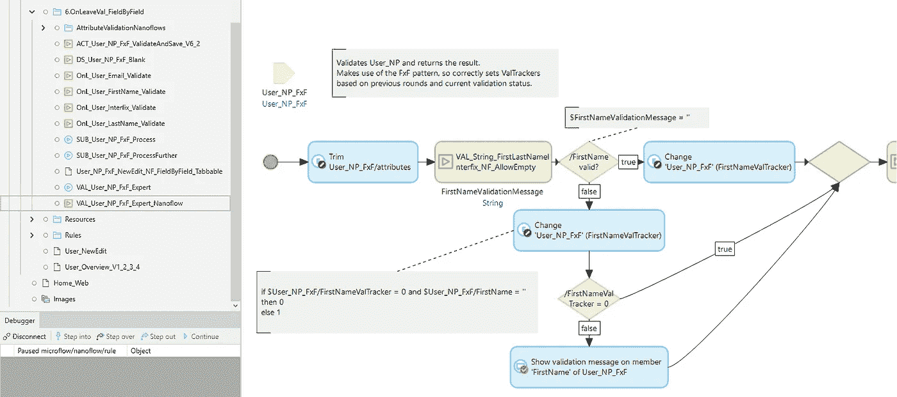
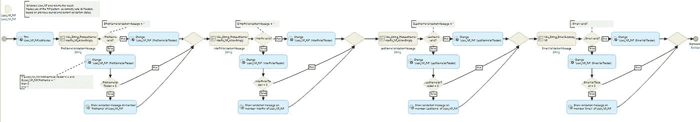
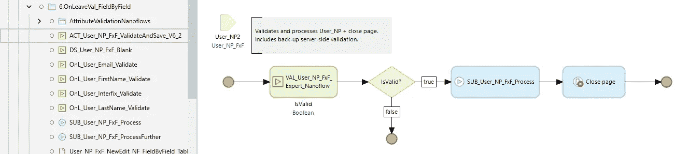
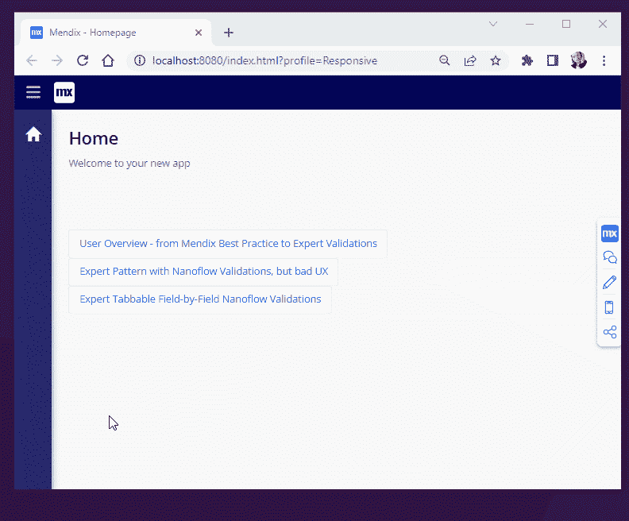

# Mendix 中的表格式逐字段纳流验证

> 原文：<https://medium.com/mendix/tabbable-field-by-field-nanoflow-validations-in-mendix-dfb0395a424d?source=collection_archive---------3----------------------->

## 一种提高已验证表单 UX 的模式

Tabbable Field-by-Field Nanoflow Validations in Mendix

## 假设您正在填写一个长表单，在填写完一个字段后，您意外地按下了“enter”你认为 UX 会发生什么？您希望在所有未触及的字段上看到大量验证消息吗？或者你会期待一只更温柔的引导之手？

An example of bad UX — after a single “enter” the user gets feedback on the entire form

这个博客将提供一种用户友好的验证表单的方式，它建立在我去年 10 月概述的专家验证模式之上。它允许您逐个字段地浏览表单，并使用纳流和微流进行验证。这需要一点深度，但它是非常容易维护的。这是它实际运行的样子:

Tabbable, field-by-field nanoflow validations

# 为什么要使用纳流验证？那不是不安全吗？

在我们深入研究如何操作之前，你可能会想:为什么要使用纳流？答案是速度。首先也是最重要的一点，**纳流运行在客户端**中，这意味着浏览器或手机，而微流运行在 Mendix 服务器上。因此，Mendix 服务器计算微流验证结果的压力可以通过使用 nanoflows 大大降低，特别是当预计许多用户同时触发验证时。基本思想是，我们首先在客户机内进行所有必要的检查，当表单完成并准备发送到 Mendix 服务器(微流)时，我们在处理或提交之前进行一次最终的微流检查。这最后的检查是非常重要的，因为我们应该始终小心从客户端接收的数据；假设，来自客户端的所有东西都是潜在不安全的。

同时使用微流和纳流进行验证的一个缺点是会导致一些重复；纳流不能从微流中触发，这意味着我们在纳流中设置的相同验证检查也必须在微流中设置/复制。然而，通过坚持[专家验证](/mendix/expert-validations-in-mendix-10e1bdfc7bc0)模式，增加的维护可以再次大大减少；**可以为一家公司**定义一组可重复使用的纳米流和微流验证 **，可以跨多个实体/模块甚至应用程序使用。**

根据经验，如果您的应用程序有一个大的用户群，并且预计会有多个并发验证，那么使用纳流验证和微流验证。类似地，如果您的应用程序是原生移动应用程序，那么使用纳流验证和微流是一个先决条件。

# 跟踪字段有效性

构建可制表的、逐字段验证的关键问题之一是跟踪哪个字段已经被触及。理想情况下，只有用户访问过的字段才会收到验证消息。基于与[专家验证](/mendix/expert-validations-in-mendix-10e1bdfc7bc0)文章中相同的想法，我们假设有一个名为“User”的实体，它有四个主要属性:**、/名字、/Interfix、/姓氏和/电子邮件**，所有这些都必须经过验证。我们将使用一个非持久的实体来临时存放用户提供的值，直到我们知道数据是有效的并准备好存储在$User 中。

Persistable $User, with its non-persistable form helper

任何主要属性字段都可以被触摸(真/假)和有效(真/假)，导致四种可能的状态(2*2)。原则上，在用户输入/FirstName 字段之前，它将是 **touched = false** ，并且 **valid = false** 。目前，我们还不想显示验证消息。在**用户输入一个字段并离开**后，该字段变为 **touched = true** ，字段内容本身可能有效也可能无效。在后一种情况下，我们现在希望显示一条验证消息。当字段已经被**触摸=真，并且 valid =真**时，我们也不想显示验证消息。这导致了三种可能的字段状态(0/1/2 ),我们将它们存储在为每个主属性保留的 ValTracker 属性中。

Possible ValTracker states: 0 (untouched), 1 (invalid) or 2 (valid)

我们现在有了一种方法来跟踪每个主要属性的状态，同样，我们可以决定何时显示验证消息。然而，有一个复杂的因素:属性会随着时间而变化。下表中的关键要点是第一行:

> 当一个未被触摸的字段(0)被触摸并且无效(1)时，它现在应该得到一个验证消息；当它为空且未被触及时，它不应该(0)。如果它已经达到状态 1 或 2，它将永远不会回到状态 0。

Tracking states over time, where ValTrackerOld was the earlier state, and ValTrackerNew is the new state.

# 实现可维护的 ValTracking

我们的 User_NP 表单中的每个主属性字段都有一个**On-Leave nano flow**；每个场都有一个独特的纳流，它首先将相应场的 ValTracker 设置为 1，表示该场已被触摸。随后，我们调用一个通用的 Val_User_NP_FxF 流，它在每个休假流中被重用。这就是休假流程的样子。

The OnL_User_FirstName_Validate flow, which first sets /FirstNameValTracker to 1 (touched).

如上图所示，**四个主要属性字段**中的每一个都有一个单独的 On-Leave nanoflow，并且在其中设置了各自的 ValTrackers。为了能够跟踪每个字段的触摸状态，这是必不可少的。随后更深的 Val_User_NP 流检查整个实体的一般有效性。在我们看这个流程之前，这是一个善意的提醒，提醒读者先看看[专家验证](/mendix/expert-validations-in-mendix-10e1bdfc7bc0)模式，如果不熟悉的话，可能会感到困惑。

VAL_User_NP_FxF_Expert_Nanoflow — first section that trims, and validates /FirstName

与专家模式一致，**我们首先在所有主字符串属性**上使用一个有效的 trim()，它也初始化任何空字符串。然后，我们使用一个子流来验证/FirstName，将/FirstName 属性中包含的原始字符串值传递给它。第二个 VAL 活动的结果是一个 ValidationMessage，当它是一个空字符串“”时，意味着该字段是有效的，这意味着我们可以将/FirstNameValtracker 设置为 2(有效)。如果不是，流程继续设置/FirstNameValTracker 的正确状态(0 或 1)。如果/FirstNameValTracker 为 0，并且现在存储在/FirstName 中的值是空字符串“”，则/FirstNameValtracker 被设置为未接触状态(0)，这意味着不会显示任何验证消息。在任何其他情况下，/FirstNameValtracker 将获得无效(1)状态，这意味着将显示 FirstNameValidationMessage。

这里要记住的关键是，当磁场未被触及时，有可能进入向下的流动(0) 。在这种情况下，FirstNameValidationMessage 将用“Required”填充，但是，由于存储在/FirstNameValTracker 中的值为 0，因此不会显示实际的验证消息。在建立了这个模式之后，只需要复制和粘贴就可以了；相同的模式可以用于所有后续的主属性/字段。

VAL_User_NP_FxF_Expert_Nanoflow shown in its entirety

剩下唯一要做的就是创建一个 ACT_User_NP_ValidateAndSave 流。这将调用处理经过验证的实体的微流。不要忘记给处理微流程添加一个适当的验证子微流程。

ACT_User_NP_FxF_ValidateAndSave_V6 validates theuser and calls on a microflow to process it further

# 状态跟踪的美妙之处

在本文中，我展示了如何建立快速、可维护且健壮的可制表的逐字段纳米流验证。这种模式最初可能会让人感觉有些不舒服，因为所有的状态跟踪在经典的 Mendix 验证中都不是标准的。然而，在实际表单中拥有跟踪状态属性的一个好处是，我们现在还可以在字段被正确填充时给用户积极的反馈。基于 ValTracker，只需在字段中添加一些条件样式；例如，如果值为 2，我们可以给字段一个绿色轮廓。这是一个交互的例子。

Filling out the tabbable form and getting positive feedback as well.

如果你想尝试这种验证字段的方式，我准备了一个项目，可以从 [Mendix 应用商店](https://marketplace.mendix.com/link/component/119733)下载。我期待听到您的批评性想法和建议，以使这些验证工作做得更好！

*#关于:Wouter Penris
Wouter 是凯捷的 Mendix MVP 和软件工程师，拥有教育(英语&音乐)和音乐(爵士声乐&钢琴)背景；多潜能者。作为一名教师，他花了数年时间完善尽可能简单易懂地指导学生的艺术，现在他非常喜欢使用同样的技能来构建具有直观和易于理解的用户体验的高科技产品。他是一个极具创造性的问题解决者，将研究、技术和美学融入实际的商业价值和建议中。*

## 阅读更多

 [## 设置数据验证

### 描述如何使用 Studio Pro 设置必需的和高级的数据验证。

docs.mendix.com](https://docs.mendix.com/howto/data-models/setting-up-data-validation/)  [## 创建基本数据层

### 描述如何创建实体和属性、添加枚举、创建关联以及配置删除…

docs.mendix.com](https://docs.mendix.com/howto/data-models/create-a-basic-data-layer/)  [## 反规范化数据以提高性能

### 描述如何在 Studio Pro 中反规范化数据并保持反规范化数据同步。

docs.mendix.com](https://docs.mendix.com/howto/data-models/denormalize-data-to-improve-performance/) 

*来自发布者-*

*如果你喜欢这篇文章，你可以在我们的* [*媒体页面*](https://medium.com/mendix) *找到更多类似的文章。对于精彩的视频和直播会话，您可以前往*[*MxLive*](https://www.mendix.com/live/)*或我们的社区*[*Youtube PAG*](https://www.youtube.com/c/MendixCommunity/community)*e .*

*希望入门的创客，可以注册一个* [*免费账号*](https://signup.mendix.com/link/signup/?source=direct) *，通过我们的* [*学苑*](https://academy.mendix.com/link/home) *获得即时学习。*

*有兴趣加入我们的社区吗？加入我们的* [*松弛社区频道*](https://join.slack.com/t/mendixcommunity/shared_invite/zt-hwhwkcxu-~59ywyjqHlUHXmrw5heqpQ) *。*