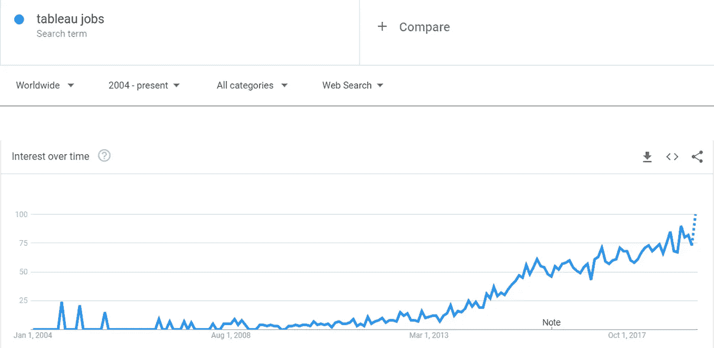
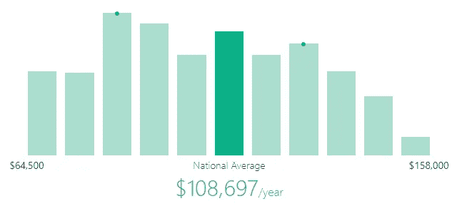
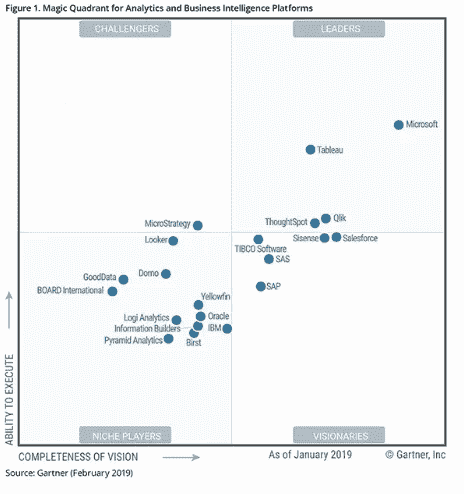

# 学习 Tableau 的 5 个理由——深入了解 Tableau 的职业机会！

> 原文：<https://medium.com/edureka/tableau-career-opportunities-55cd969eb66e?source=collection_archive---------1----------------------->

Tableau 正在成为 2021 年商业智能领域最热门的趋势之一。数据可视化工具在大大小小的公司里越来越受欢迎，因此，Tableau 职业已经非常流行。看看 google trends，似乎没有比“现在”更好的时机来获得 Tableau 认证，并在商业智能和数据分析领域建立职业生涯。

所以，如果你正在寻找开始学习 Tableau 的理由，不要担心。我们给你五分钟！

*   **对 Tableau 专业人员的需求激增**
*   **奖励 Tableau 职业**
*   **顶级公司提供有利可图的职业**
*   **提供多种工作角色**
*   **Tableau 职业的未来**

# 1.对 Tableau 专业人员的需求激增

根据国际数据公司(IDC)的一项研究，到 2021 年，世界将产生前 10 年 50 倍的数据量。面对如此海量的数据和真实的业务影响，世界各地的商业组织都需要交互式、易于使用的工具来分析数据并从中获得可操作的见解。Tableau 帮助组织做到这一点！

因此，Tableau 的受欢迎程度有望一飞冲天。

以下趋势显示了对 Tableau 专家的需求是如何达到顶峰的。

谷歌趋势中 Tableau 职位的上升趋势证明了对 Tableau 专业人士需求的增长。

# 2.奖励 Tableau 职业

不仅对 Tableau 专家有很大的需求，而且也有丰厚的回报。截至 2019 年 5 月 6 日，Tableau 开发人员的平均年薪为 108697 美元。平均工资也呈上升趋势，最近的平均工资高达 158，000 美元。

印度和美国的薪资趋势都在急剧上升，而且在不久的将来还会进一步上升。

# 3.顶级公司提供利润丰厚的舞台生涯

快速浏览当前的职位空缺可以发现，相当多的顶级公司都在寻找 Tableau 人才。这些公司包括脸书、戴尔、应用系统、博思艾伦、NetJets、加州大学、Groupon、通用汽车、索尼电子、Sunguard、美国银行、毕马威、威瑞森等。因此，如果你渴望为行业内的知名人士工作，Tableau 的职业生涯是实现这一目标的途径。

# 4.提供多种工作角色

Tableau 职业生涯的最大好处是，你有各种各样的工作角色可供选择，并且处于职业生涯的各个阶段。以下是 Tableau 专业人士最热门的职位。

*   **Tableau 顾问**
*   **数据分析师**
*   **商业分析师**
*   **商业智能分析师**
*   **商业智能开发者**
*   **商业智能经理**

# 5.Tableau 职业的未来

Tableau 连续 7 次被 Gartner Research 评为数据可视化和商业智能市场的“领导者”，截至 2019 年 2 月，已优雅地降至第二位。如果我们比较它的“执行能力”,它是竞争对手中遥遥领先的。如果你考虑“视觉的完整性”，Tableau 也是一个强有力的竞争者。这只是表明 Tableau 的未来是非常光明和安全的。

你还在等什么？许多商业智能专业人士已经意识到这一趋势，并一直忙于掌握 Tableau 来提升自己的技能。不要落后；立即学习 Tableau，跟上数据可视化的潮流！如果你想查看更多关于人工智能、DevOps、道德黑客等市场最热门技术的文章，你可以参考 Edureka 的官方网站。

请留意这个系列中的其他文章和视频，它们会帮助你理解 Tableau 的各种概念。

> *1。* [*Tableau 教程*](/edureka/tableau-tutorial-37d2d6a9684b)
> 
> *2。* [*什么是 Tableau？*](/edureka/what-is-tableau-1d9f4c641601)
> 
> *3。* [*画面功能*](/edureka/tableau-functions-ce794b10e588)
> 
> *4。* [*画面仪表盘*](/edureka/tableau-dashboards-3e19dd713bc7)
> 
> *5。*[*Tableau 中的 LOD 表达式*](/edureka/tableau-lod-2f650ca1503d)
> 
> *6。* [*画面技巧*](/edureka/tableau-tips-and-tricks-a18bf8991afc)
> 
> *7。* [*循序渐进指导学习 Tableau 公共*](/edureka/tableau-public-942228327953)
> 
> *8。* [*Tableau 桌面 vs Tableau 公共 vs Tableau 阅读器*](/edureka/tableau-desktop-vs-tableau-public-vs-tableau-reader-fbb2a3aa0bac)
> 
> *9。* [*如何在 Tableau 中创建和使用参数？*](/edureka/parameters-in-tableau-ac552e6b0cde-ac552e6b0cde)
> 
> *10。* [*Tableau 图表*](/edureka/tableau-charts-111758e2ea97)
> 
> *11。*
> 
> *12。 [*圆环图中的 Tableau*](/edureka/donut-chart-in-tableau-a2e6fadf6534)*
> 
> **13。*[*2020 年你必须准备的 50 大 Tableau 面试题*](/edureka/tableau-interview-questions-and-answers-4f80523527d)*
> 
> **14。* [*如何以及何时使用不同的 Tableau 图表*](/edureka/tableau-charts-111758e2ea97)*

**原载于 2020 年 1 月 8 日 https://www.edureka.co***。***