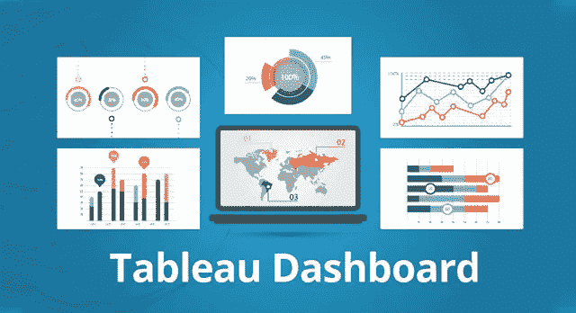
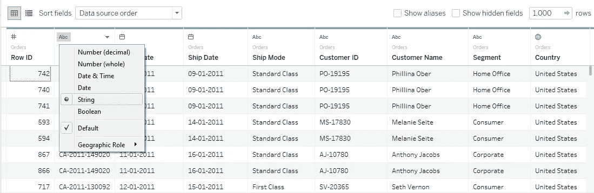
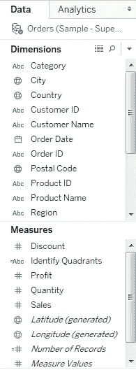
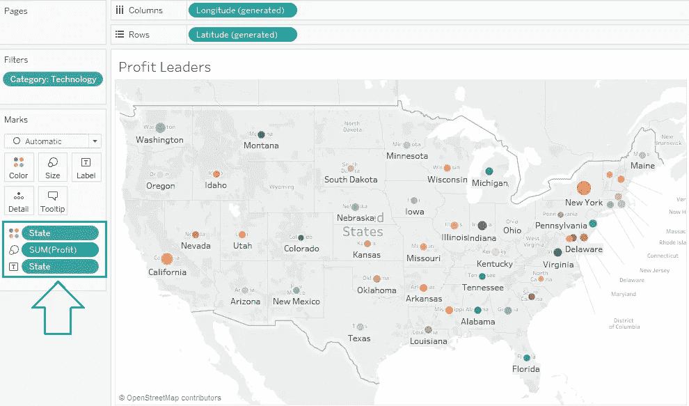
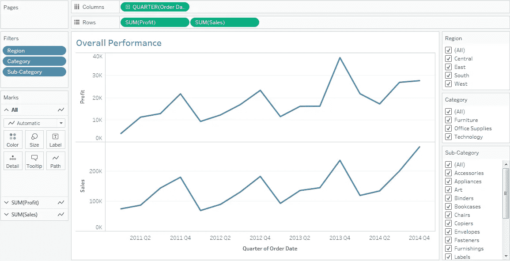
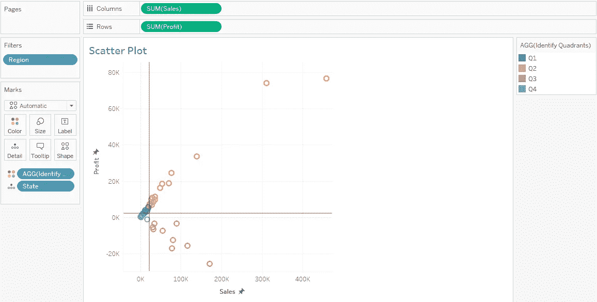
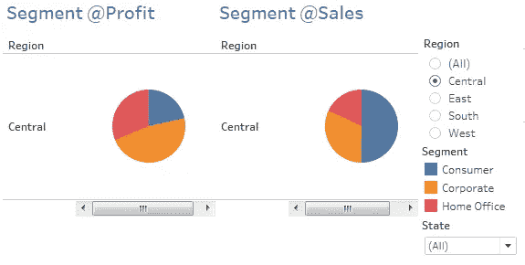
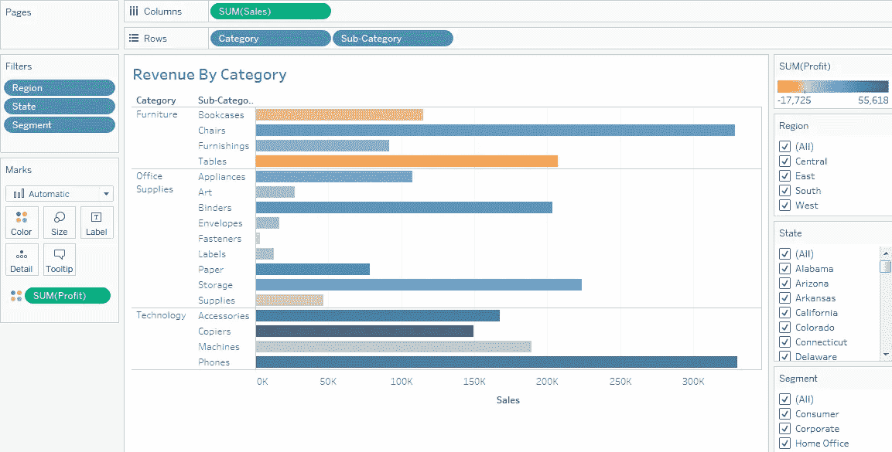
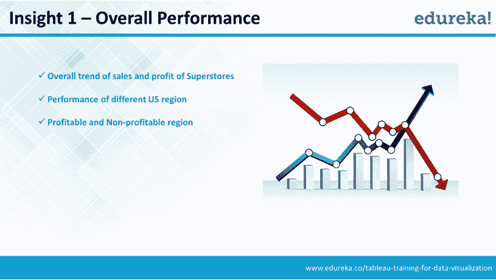
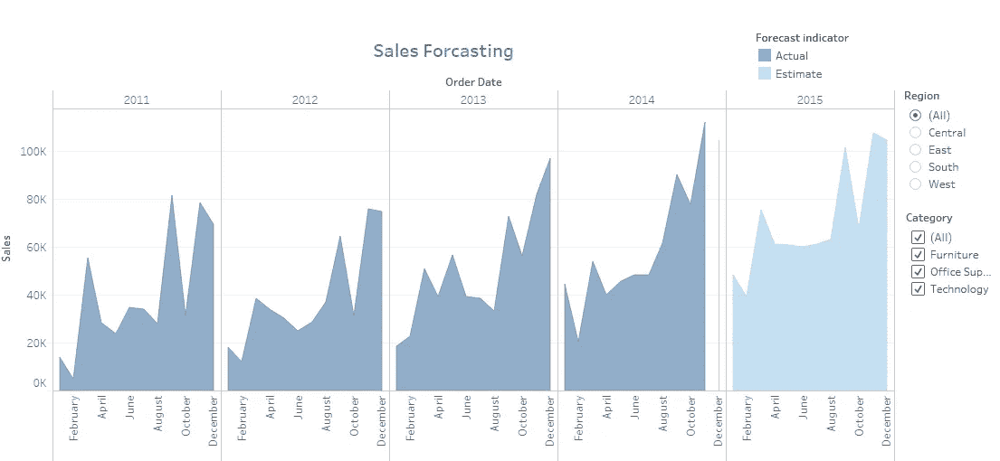

# Tableau 仪表板—重新定义数据可视化

> 原文：<https://medium.com/edureka/tableau-dashboards-3e19dd713bc7?source=collection_archive---------0----------------------->

Tableau Dashboard — Edureka

全球超过 35，000 家公司真正改变了从其拥有的数据中发掘洞察力的方式。多亏了 Tableau Dashboard，数据可视化变得灵活、简单且可扩展。如今，从不同来源的不同形式的数据中发掘洞察力是任何企业的基本需求。尽管有各种各样的商业智能工具可以帮助企业实现数据可视化，但在过去几年中，有一种工具一直占据主导地位。凭借其直观且用户友好的数据可视化方法，Tableau 如今已成为各种规模组织的热门选择。本文将帮助您了解 Tableau 如何帮助发现有价值的见解，以及 Tableau 仪表板如何允许您拖放数据元素以深入了解业务，以及预测和监控进展的能力。我们先来了解一下 Tableau 的演变，以及为什么它是当今市场上最好的数据可视化工具之一。

有了 Tableau，你和我现在可以与数据互动，并有一个探索的体验。您不再只是提供数据，而是获得能够改变您业务进程的智能见解。Tableau 允许您实时操作数据、修改计算和更改场景。与 Excel 相比，使 Tableau 与众不同的三大因素是:

1.  创建交互式仪表板的能力
2.  管理无限数据的能力
3.  随时改变数据源的灵活性

Tableau 的核心是 Tableau 仪表盘。有了 Tableau 仪表盘，你基本上可以拖放可视化元素，混搭数据组件，瞧，所有的数据突然变得有意义了。

# Tableau 仪表板—Tableau 的核心

我给你一个非常简单的方法来理解 Tableau 的组成部分。Tableau 本质上有三个部分——工作表**、**仪表板**和**布局容器**。Tableau dashboard 是所有工作表的综合显示。每个工作表都包含来自不同数据源或不同种类数据本身的可视化效果。布局容器允许您更改仪表板组件(如图形或图表)之间的关系。这些组件可以水平或垂直排列。这里最重要的部分是 Tableau 仪表板，实际的魔法在这里发生，但是当您创建了多个工作表时，就可以理解了。在本文的下一部分，我将尝试说明如何构建一个工作表和一个相应的仪表板。更重要的是，它旨在帮助你理解如何使用不同种类的可视化来打开不同的洞察力。**

# **通过一个用例了解 Tableau 仪表板**

**通过一个例子可以很好地理解 Tableau 的工作原理，这个例子中有不同的数据类型，每种数据类型都有可能揭示有价值的业务洞察力。一个理想的用例可以是零售超市，在那里，您需要从区域销售、个体商店交易、产品类别、消费者细分、销售数字、折扣率、利润和许多其他数据中获得洞察力。企业需要了解哪个地区比其他地区更有利可图，应该关注哪个客户群，应该减少对哪个客户群的投资。每一种见解都需要以不同的方式处理数据，最终目的是提高企业生产力和盈利能力。现在，让我们了解一下我们可以从超市的不同类型数据中获得的洞察力的确切性质:**

1.  **超级商场的整体销售和业绩:第一个合理的步骤是了解超级商场在一段时间内的业绩。为此，我们需要每个季度不同地区的销售数据。我们还需要了解与其他地区相比，哪个地区更赚钱或更亏损。**
2.  ****不同州的表现:**了解了地区的利润和损失后，我们可以在州级创建一个销售与利润的矩阵——四象限矩阵，分别以销售和利润为 X 轴和 Y 轴，中点为中心趋势。4 个象限中的这些状态可以被映射以理解不同的场景。例如，企业可以决定在销售额较低但利润较高的州加大投资。如果销售额增加但利润下降，另一个州可能会亮起红灯。**
3.  ****不同客户群的表现:**对于企业来说，了解哪个客户群在不同地区推动销售和利润增长也是至关重要的。例如，带有客户细分和销售/利润视图的饼状图可以帮助企业制定未来战略——哪个细分市场应该是主要关注领域，例如 B2B 消费者细分市场可能会以非常少的销售数量获得最大利润——显然，在这个特定地区有巨大的机会扩展 B2B 细分市场。**
4.  ****按类别划分的收入:**在特定的地区和客户群中，我们可以获得特定产品类别的数据，以及它们之间的比较情况(在销售额和利润方面)。如果厨房电器比清洁设备产生更好的利润，这是一个有价值的洞察力，可以影响未来的计划。**
5.  ****预测销售额:**过去几个季度的销售额和利润趋势将有助于预测下一年未来几个季度的价值。企业还可以将其实际值映射到预测值，以衡量洞察行动点的影响。现在，让我们来详细了解一下这些场景。我用的是 Tableau 公开版。第一步是打开一个新工作表并连接到数据集。假设我们的超市数据在 Excel 中，我们选择相同的。Tableau 自动检测 Excel 中的各种数据类型，并将它们分类为字符串数据类型、日期数据类型、布尔数据类型等。**

****

**在这个阶段，理解两个概念很重要— **维度**和**度量**。根据 Tableau，测度是作为因变量的域，即其值是一个或多个变量的函数。更简单地说，Tableau 将任何包含数值(定量)的字段都归类为度量。定性、分类信息被自动视为一个维度。我们用一个简单的例子来理解这一点。假设您的年销售额为 1 亿美元，映射到客户、地区或商店的具体销售额是维度，而 1 亿美元是衡量标准。**

****

**下一步是理解 Tableau 中各种类型的可视化。条形图，箱线图，帕累托图…显然，世界上存在更多类型的图表，此时此刻我能给你的最好消息是 Tableau 不需要你了解它们。首先，Tableau 足够智能，可以建议哪种可视化适合您的数据类型；其次，如果您愿意，允许您手动更改它。对于我们的超市用例，如果我们要筛选利润领导者的数据，即查看哪些地区带来了最多的利润，您需要做的就是选择颜色、大小和标签，并将它们拖放到工作表中。你可以把颜色和尺寸联系起来，在更大的尺寸里看到更大的利润中心。Tableau 只需要你指定纬度和经度值，它会实时生成可视化效果。**

# **总销售额和利润**

**正如我们在下面的截图中看到的，Tableau 生成了一个“利润领导者”的符号图，本质上是特定州及其利润的可视化。**

****

**总体销售和绩效可以显示为一个线形图，从销售和利润两方面给出了区域绩效的概念。我们可以从这种可视化中获得见解，例如 2013 年第四季度的销售额和利润都比其他季度有所增长。虽然，Q2 2014 年的销售额略有增长，但与上个季度相比，该业务的利润有所下降。**

****

# **不同状态的性能**

**在下面的可视化中，我们创建了一个四象限矩阵，X 轴为销售额，Y 轴为利润，中点是销售额和利润轴的中心趋势(在本例中为中间值)。**

**这种可视化可以帮助我们将状态划分为三个主要的业务战略重点领域——保留、发展和撤资。右上角的高销售额和高利润的州目前处于有利地位，企业希望在未来保持这一地位。销售轴上方和利润轴附近的州可以被业务视为机会，其中销售的增加将有助于增加业务利润—制定战略。低销售额和低/负利润或高销售额但负利润的州绝对不是企业应该集中撤资的地区。这对于制定商业投资策略有很大帮助。**

****

# **不同客户群的表现**

**有了地区和州级别的可见性，我们现在可以了解哪个消费者细分市场正在推动销售和利润，并确定客户细分市场中的重点领域(客户、公司和家庭办公室)。**

**例如，我们可以看到，在中部地区，尽管消费者细分市场贡献了 50%的销售额，但该细分市场的利润份额较低。然而，企业部门的利润份额要高得多，但销售贡献却较低。毫无疑问，企业应该把重点放在增加企业销售贡献上，这可以影响企业的盈利能力。**

****

# **按类别划分的创收**

**下一个合乎逻辑的步骤是在产品类别级别获得洞察力。我们可以理解为哪种产品在特定区域和消费细分市场的销量和利润更高。或者各种产品类别在销售和利润方面的表现。**

**在 Tableau 中，您可以向数据中添加多个过滤器，以获得您想要的精确洞察力。对于我们的超市，假设我们需要了解分类收入，我们只需简单地添加地区、分类甚至子分类的过滤器。然后指定需要在行和列上显示的内容。正如您在下面的表格中看到的，销售总额用列表示，类别用行表示。数据按照地区、州和细分市场进行过滤，橙色代表低利润，蓝色代表高利润。**

****

**为了帮助您理解选择合适的过滤器和使用超级商店数据集创建自己的可视化效果所涉及的简单步骤，这里有一个快速的分步可视化指南:**

# **创建 Tableau 仪表板的分步视觉指南:**

****

**到目前为止，我们已经用 Tableau 介绍了数据可视化的基础知识。其余的魔术是这些概念的子集。下一个合乎逻辑的步骤是根据历史季度业绩趋势预测销售额和利润。企业可以稍后将实际销售和利润数字与预测值进行比较，以执行差距分析并衡量该季度采取的措施的影响。**

****

**我们可以从现有的数据中发掘出更多的洞见。我强烈建议您观看这个视频教程，它解释了如何从头开始创建 Tableau dashboard，在哪个场景中使用哪种可视化，以及如何从可视化仪表板中获得洞察力来推动业务战略决策。它使用我们相同的超级商店的例子，所以这将是一件轻而易举的事。继续，欣赏视频，告诉我你的想法。**

***这就是我们关于“Tableau 仪表盘”的文章的结尾。我希望这篇文章对你有所帮助，并增加了你的知识价值。***

**如果你想查看更多关于人工智能、DevOps、道德黑客等市场最热门技术的文章，那么你可以参考 [Edureka 的官方网站。](https://www.edureka.co/blog/?utm_source=medium&utm_medium=content-link&utm_campaign=tableau-dashboards)**

**请留意本系列中的其他文章，它们将解释 Tableau 的各个方面。**

> **1. [Tableau 教程](/edureka/tableau-tutorial-37d2d6a9684b)**
> 
> **2.[什么是 Tableau？](/edureka/what-is-tableau-1d9f4c641601)**
> 
> **3. [Tableau 功能](/edureka/tableau-functions-ce794b10e588)**
> 
> **4.[表格图表](/edureka/tableau-charts-111758e2ea97)**
> 
> **5.[Tableau 中的 LOD 表达式](/edureka/tableau-lod-2f650ca1503d)**
> 
> **6. [Tableau 提示和技巧](/edureka/tableau-tips-and-tricks-a18bf8991afc)**
> 
> **7.[循序渐进指导学习 Tableau 公共](/edureka/tableau-public-942228327953)**
> 
> **8. [Tableau 桌面 vs Tableau 公共 vs Tableau 阅读器](/edureka/tableau-desktop-vs-tableau-public-vs-tableau-reader-fbb2a3aa0bac)**
> 
> **9.[如何在 Tableau 中创建和使用参数？](/edureka/parameters-in-tableau-ac552e6b0cde-ac552e6b0cde)**
> 
> **10.[Tableau 中的集合是什么，如何创建它们](/edureka/sets-in-tableau-39befe9b7fa1)**
> 
> **11.[数据混合](/edureka/tableau-lod-2f650ca1503d)**
> 
> **12 .[Tableau 中的圆环图](/edureka/donut-chart-in-tableau-a2e6fadf6534)**
> 
> **13.[2020 年你必须准备的 50 大 Tableau 面试问题](/edureka/tableau-interview-questions-and-answers-4f80523527d)**
> 
> **14.[如何以及何时使用不同的 Tableau 图表](/edureka/tableau-charts-111758e2ea97)**

***原载于 2016 年 11 月 22 日*[*www.edureka.co*](https://www.edureka.co/blog/tableau-dashboards/)*。***