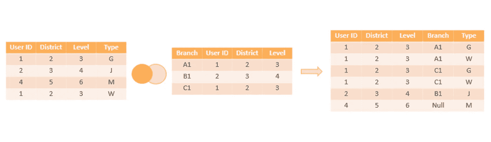
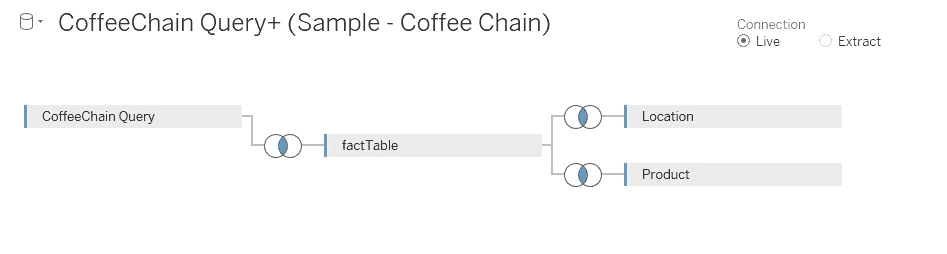
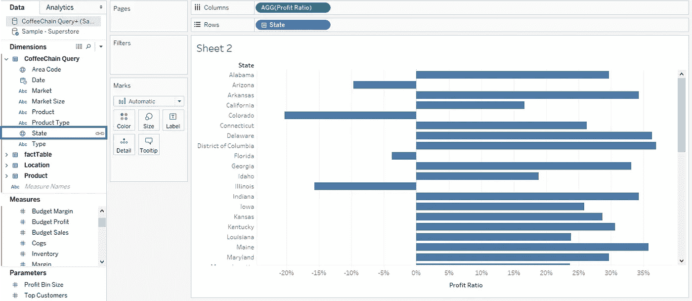

# 既然你已经可以加入 Tableau，为什么还要融合呢？

> 原文：<https://medium.com/edureka/tableau-data-blending-b0583f8a89bf?source=collection_archive---------1----------------------->

在一个每天产生和消耗 2.5 万亿字节数据的世界中，组织必然会寻找新的方法来转换和组合数据，以获得最佳效率。一种这样的组合数据的方法是***Tableau***中的数据混合。

现在，因为这在任何给定组织的数据周期中服务于如此重要的目的，所以它在 most 中成为非常重要的模块。在这篇博客中，我们将讨论以下概念:

*   Tableau 中为什么需要数据融合？
*   Tableau 中的数据融合是什么？
*   和数据连接有什么不同？
*   什么时候用接合代替混合？
*   在 Tableau 中混合您的数据
*   Tableau 中数据混合的局限性

# Tableau 中为什么需要数据融合？

假设您是一位，在 Salesforce 中存储了交易数据，在 Access 中存储了配额数据。您想要组合的数据存储在不同的数据库中，并且在两个数据源中每个表中捕获的数据的粒度是不同的，因此数据混合是组合这些数据的最佳方式。

数据混合在以下情况下很有用:

*   **您想要合并来自不同数据库的数据，而这些数据不受跨数据库连接的支持。** 跨数据库联接不支持连接到多维数据集(例如，Oracle Essbase)或某些仅提取连接(例如，Google Analytics)。在这种情况下，为要分析的数据设置单独的数据源，然后使用数据混合将数据源合并到单个工作表中。
*   **数据处于不同的详细程度。** 有时，一个数据集使用不同的 ***细节层次*** 获取数据，即，比另一个数据集更大或更小的粒度。例如，假设您正在分析事务数据和配额数据。事务性数据可能捕获所有事务。但是，配额数据可能会在季度级别聚合事务。因为事务值是在每个数据集中的不同细节级别捕获的，所以您应该使用数据混合来组合数据。

# Tableau 中的数据融合是什么？

数据混合是中非常强大的功能。当多个数据源中存在相关数据，并且您希望在单个视图中一起分析这些数据时，可以使用该视图。它是一种组合数据的方法，该数据补充了来自一个数据源的数据表和来自另一个数据源的数据列。

通常，您使用联接来执行这种类型的数据合并，但是有时，根据数据类型及其粒度等因素，使用数据混合会更好。

# 和数据连接有什么不同？

数据混合模拟传统的左连接。两者之间的主要区别是*当*关于聚合执行连接时。

## 左连接

当使用左联接来组合数据时，会向执行联接的数据库发送一个查询。使用左连接将返回左表中的所有行，以及右表中在左表中有相应行匹配的任何行。然后，连接的结果被发送回 Tableau 并由 Tableau 聚合。

例如，假设您有下列表格。如果公共列是**用户 ID** ，左连接将获取左表中的所有数据，以及右表中的所有数据，因为左表中的每一行都有相应的行匹配。

# 何时用接合代替混合

## 1.数据需要清理。

如果您的表在联接后没有正确匹配，请为每个表设置数据源，进行任何必要的自定义(即重命名列、更改列数据类型、创建组、使用计算等。)，然后使用数据混合将数据组合起来。

## 2.连接会导致重复数据。

连接后的重复数据是不同细节级别的数据的症状。如果您注意到重复的数据，不要创建连接，而是使用数据混合在一个公共维上混合。

## 3.你有很多数据。

通常，建议使用联接来组合来自同一个数据库的数据。连接由数据库处理，这允许连接利用数据库的一些本机功能。但是，如果您正在处理大型数据集，连接会给数据库带来压力，并显著影响性能。在这种情况下，数据混合可能会有所帮助。因为 Tableau 在数据聚合后处理数据的组合，所以需要组合的数据较少。通常，当需要合并的数据较少时，性能会提高。

# 在 Tableau 中混合您的数据

当您有不同数据源中的数据，并且希望在一个工作表中一起分析时，可以使用数据混合。Tableau 有两个名为 **Sample-superstore** 和 **Sample coffee chain.mdb** 的内置数据源，将用于演示数据混合。

**步骤 1:连接到您的数据并设置数据源**

*   连接到一组数据，并在数据源页面上设置数据源。内置数据源 **Sample coffee chain.mdb** ，这是一个 MS Access 数据库文件，将用于说明数据混合。
*   转到**数据** **>** 新建数据源，连接第二组数据。这个例子使用了**Sample-super store**数据源。然后设置数据源。
*   单击“工作表”选项卡开始构建视图。

**第二步:指定主数据源**

*   将至少一个字段从主数据源拖到视图中，将其指定为主数据源。在“数据”窗格中，单击要指定为主数据源的数据源。在这个例子中，样本咖啡连锁店选择。
*   下面的屏幕截图显示了文件中可用的不同表和连接。

**第三步:指定辅助数据源**

*   现在，您可以基于一个公共维度(在本例中为**状态**)集成来自两个源的数据。请注意，维度状态旁边会出现一个小链接图像。这表明了两个数据源之间的公共维度。
*   假设您创建了一个条形图，其中列货架上有**利润率**，行货架上有**州**，该图表显示了超市和咖啡连锁店中每个州的利润率是如何变化的。

# Tableau 中数据混合的局限性

1.  围绕非加性总量有一些数据混合限制，如**中位数**和 **RAWSQLAGG** 。
2.  数据混合牺牲了高粒度查询的速度。
3.  当您尝试按使用混合数据的计算字段排序时，该计算字段不会列在“排序”对话框的“字段”下拉列表中。
4.  多维数据集数据源只能用作 Tableau 中混合数据的主数据源。它们不能用作辅助数据源。

现在，我希望大家对这个博客中的 Tableau 中的**数据混合有一个公平的想法。如果你想查看更多关于人工智能、DevOps、道德黑客等市场最热门技术的文章，那么你可以参考 [Edureka 的官方网站。](https://www.edureka.co/blog/?utm_source=medium&utm_medium=content-link&utm_campaign=tableau-data-blending)**

请留意这个系列中的其他文章和视频，它们会帮助你理解 Tableau 的各种概念。

> *1。* [*画面教程*](/edureka/tableau-tutorial-37d2d6a9684b)
> 
> *2。* [*什么是 Tableau？*](/edureka/what-is-tableau-1d9f4c641601)
> 
> *3。* [*Tableau 功能*](/edureka/tableau-functions-ce794b10e588)
> 
> *4。* [*画面仪表盘*](/edureka/tableau-dashboards-3e19dd713bc7)
> 
> *5。* [*LOD 表情*](/edureka/tableau-lod-2f650ca1503d)
> 
> *6。* [*Tableau 小技巧*](/edureka/tableau-tips-and-tricks-a18bf8991afc)
> 
> 7 .*。* [*循序渐进引导学习画面公共*](/edureka/tableau-public-942228327953)
> 
> *8。* [*Tableau 桌面 vs Tableau 公共 vs Tableau 阅读器*](/edureka/tableau-desktop-vs-tableau-public-vs-tableau-reader-fbb2a3aa0bac)
> 
> *9。* [*如何在 Tableau 中创建和使用参数？*](/edureka/parameters-in-tableau-ac552e6b0cde-ac552e6b0cde)
> 
> *10。* [*画面图表*](/edureka/tableau-charts-111758e2ea97)
> 
> 11。 [*数据融合*](/edureka/tableau-lod-2f650ca1503d)
> 
> *12。* [*圆环图中的 Tableau*](/edureka/donut-chart-in-tableau-a2e6fadf6534)
> 
> *13。*[*2020 年你必须准备的 50 大 Tableau 面试题*](/edureka/tableau-interview-questions-and-answers-4f80523527d)
> 
> *14。* [*如何以及何时使用不同的 Tableau 图表*](/edureka/tableau-charts-111758e2ea97)

*原载于 2019 年 2 月 27 日*[*https://www.edureka.co*](https://www.edureka.co/blog/tableau-data-blending/)*。*