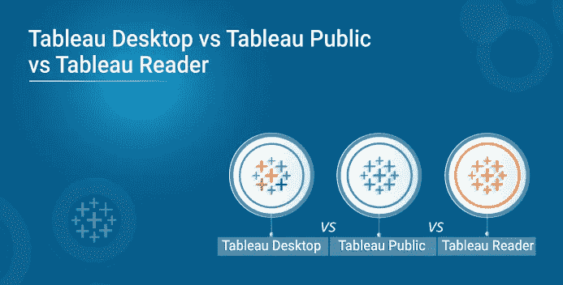
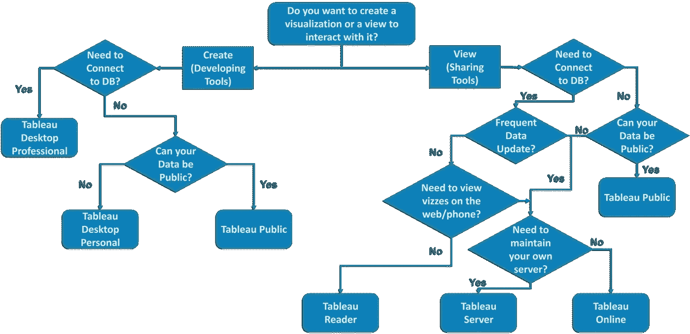
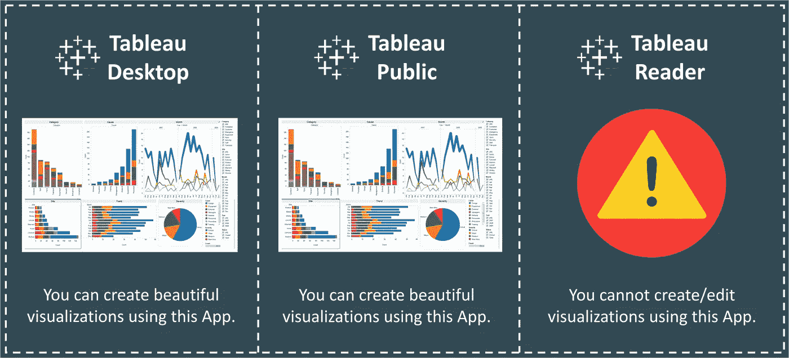
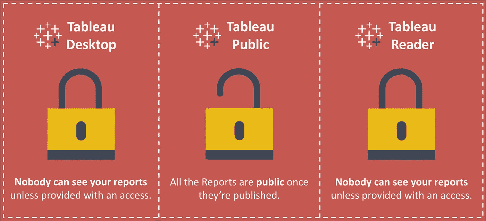
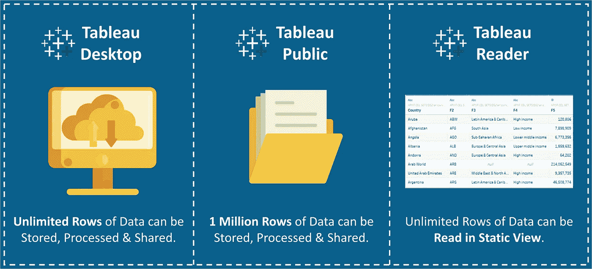
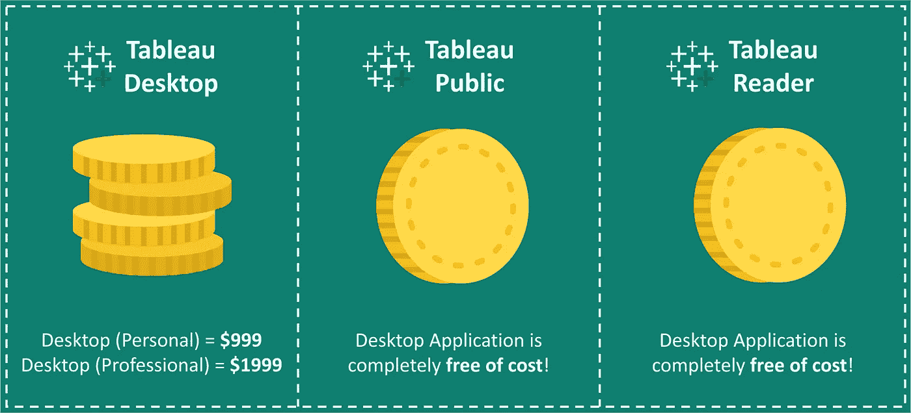
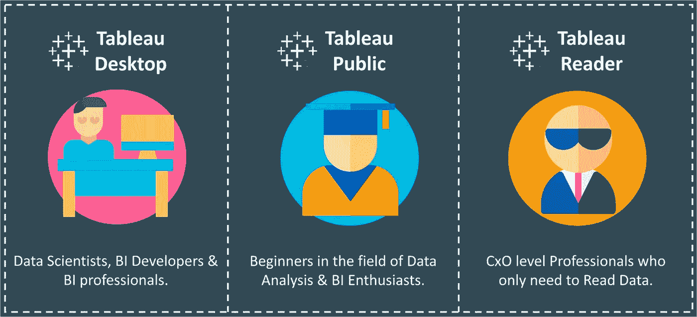

# Tableau 桌面 vs Tableau 公共 vs Tableau 阅读器

> 原文：<https://medium.com/edureka/tableau-desktop-vs-tableau-public-vs-tableau-reader-fbb2a3aa0bac?source=collection_archive---------2----------------------->

Tableau Desktop vs Tableau Public vs Tableau Reader — Edureka

许多人经常在寻找不同的软件选项时陷入两难境地。它们中的每一个都有一个不断增加的功能层。此外，您的意图也将决定您应该将什么软件版本合并到您的工作中。因此，我们决定通过对 ***Tableau 桌面版与 Tableau 公共版与 Tableau 阅读器*** 进行一点面对面的比较，让你的生活更简单。

因此，比较应基于以下类别。

*   你能创建一个可视化吗？
*   你能联系到什么资源？
*   您的数据有多安全？
*   你能储存多少数据？
*   这要花多少钱？
*   您的数据存储在哪里？
*   谁是目标人群？

但是首先，让我通过下面的流程图给你一个你可能需要的软件版本的基本概念。

***Tableau 桌面*** 是数据可视化软件，让你在几分钟内看到并理解数据。专业版可以转换、处理和存储海量数据，这些数据负责组织的所有数据驱动型决策。

Tableau Public**本质上是 Tableau 可视化软件的免费版本。它允许您使用大多数软件功能。您可以创建可视化效果并连接到 CSV、文本和 Excel 文档。但是，最大的区别是 Tableau Public 不允许您在本地保存工作簿。**

**Tableau 阅读器**允许您读取 Tableau 文件类型。如果要通过发送文件来共享工作簿，接收者需要 Tableau 阅读器来打开文档。那么，我们为什么需要读者呢？如果没有阅读器，您可能需要公开共享它或将工作簿转换为 PDF 格式。

# Tableau 桌面 vs Tableau 公共 vs Tableau 阅读器

## 你能创建一个可视化吗？

Creating Visualizations — Tableau Desktop vs Tableau Public vs Tableau Reader

**Tableau Desktop** 本质上使用一个基于 **AJAX** 的 JavaScript 应用程序来创建一个 viz。它可以让你抛弃幻灯片，转而使用你可以创建的、其他人可以探索的实时数据。

卓越的分析需要的不仅仅是漂亮的仪表盘。您还可以根据现有数据快速构建强大的计算，拖放参考线和预测，并查看统计汇总。

尽管是免费版本，Tableau Public 还是做了同样的事情。

但是 **Tableau Reader** 就像一个只读应用。它不支持创建/编辑故事或图表的功能。

## 你能联系到什么资源？

Data Sources — Tableau Desktop vs Tableau Public vs Tableau Reader

**Tableau Desktop** 可以连接到本地或云中的数据——无论是大数据、SQL 数据库、电子表格，还是 Google Analytics 和 Salesforce 等云应用。无需编写代码即可访问和组合不同的数据。超级用户可以透视、拆分和管理元数据，以优化数据源。

**Tableau 桌面公共版**处理来自微软 Excel、多种文本文件格式、统计文件、谷歌工作表和网络数据连接器的数据。

**Tableau Reader** 不需要连接到任何数据源，但它可以读取基于 Tableau 支持的任何和所有列出的数据源构建的报告。

## 您的数据有多安全？

Security — Tableau Desktop vs Tableau Public vs Tableau Reader

一旦你的报告发布到 ***Tableau 公共服务器上，你的数据就公开了。*** 对于其他两个选项，您需要一个访问链接来访问报告*。*

如果你想保护你的数据安全和隐私，你可以选择 **Tableau 服务器**。

*   它可以保护你私人服务器上的数据安全。
*   与 Tableau Mobile 配合使用，将数据带到任何地方。
*   允许来宾用户访问。

## 你能储存多少数据？

Limit — Tableau Desktop vs Tableau Public vs Tableau Reader

**Tableau Desktop** 对于它可以存储、处理或共享多少行数据没有限制，而**桌面公共**应用的限制最近已经更新为**一百万行**。

## 这要花多少钱？

Cost — Tableau Desktop vs Tableau Public vs Tableau Reader

虽然 Tableau Public 和 Reader 应用程序完全免费，但 Tableau Desktop 的价格如下:

*   tableau Desktop Personal =**$ 35**(含年度维护 **$999** )
*   tableau Desktop Professional =**$ 70**(含年度维护**$ 1999**)

## 您的数据存储在哪里？

对于 **Tableau Desktop** ，发布的报告可以保存在您的**本地驱动器**以及 **Tableau 服务器**上，而对于 **Tableau Public** ，发布的报告只能保存在 **Tableau 服务器**上。

使用**阅读器**无法发布报告。

## 谁是目标人群？

Target Audience — Tableau Desktop vs Tableau Public vs Tableau Reader

**Tableau Desktop** 是为从事 ***商业智能和数据仓库*** 的人准备的，比如分析师和 BI 专业人士。

**Tableau Public** 面向任何对理解数据感兴趣的人，并以数据可视化的形式与世界分享这些发现。记者、作家、博客作者、学生等等。

**Tableau Reader** 适用于只需要监控分析的人。组织的首席执行官&首席财务官不会为会议制作仪表板，但肯定会对**深入**并从数据中生成感兴趣。

总之，Tableau 产品成功地利用了人们快速识别视觉模式的天生能力。该软件有助于创建令人信服的叙述，并从实时数据中获取见解。

如果你想查看更多关于人工智能、DevOps、道德黑客等市场最热门技术的文章，那么你可以参考 [Edureka 的官方网站。](https://www.edureka.co/blog/?utm_source=medium&utm_medium=content-link&utm_campaign=tableau-desktop-vs-tableau-public-vs-tableau-reader)

请留意本系列中的其他文章，它们将解释 Tableau 的各个方面。

> 1. [Tableau 教程](/edureka/tableau-tutorial-37d2d6a9684b)
> 
> 2.[什么是 Tableau？](/edureka/what-is-tableau-1d9f4c641601)
> 
> 3. [Tableau 函数](/edureka/tableau-functions-ce794b10e588)
> 
> 4. [Tableau 仪表盘](/edureka/tableau-dashboards-3e19dd713bc7)
> 
> 5.[Tableau 中的 LOD 表达式](/edureka/tableau-lod-2f650ca1503d)
> 
> 6. [Tableau 提示和技巧](/edureka/tableau-tips-and-tricks-a18bf8991afc)
> 
> 7.[循序渐进指导学习 Tableau 公共](/edureka/tableau-public-942228327953)
> 
> 8. [Tableau 图表](/edureka/tableau-charts-111758e2ea97)
> 
> 9.[如何在 Tableau 中创建和使用参数？](/edureka/parameters-in-tableau-ac552e6b0cde-ac552e6b0cde)
> 
> 10.[Tableau 中的集合是什么，如何创建它们](/edureka/sets-in-tableau-39befe9b7fa1)
> 
> 11.[数据混合](/edureka/tableau-lod-2f650ca1503d)
> 
> 12 .[Tableau 中的圆环图](/edureka/donut-chart-in-tableau-a2e6fadf6534)
> 
> 13.[2020 年你必须准备的 50 大 Tableau 面试问题](/edureka/tableau-interview-questions-and-answers-4f80523527d)
> 
> 14.[如何以及何时使用不同的 Tableau 图表](/edureka/tableau-charts-111758e2ea97)

*原载于 2019 年 3 月 11 日*[*https://www.edureka.co*](https://www.edureka.co/blog/tableau-desktop-vs-tableau-public-vs-tableau-reader/)*。*