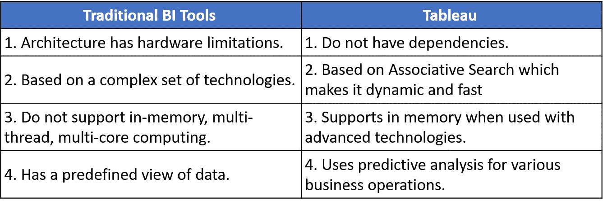
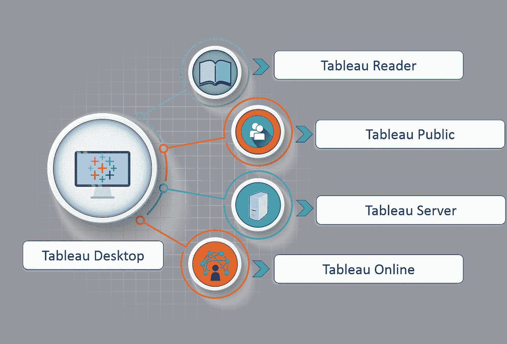
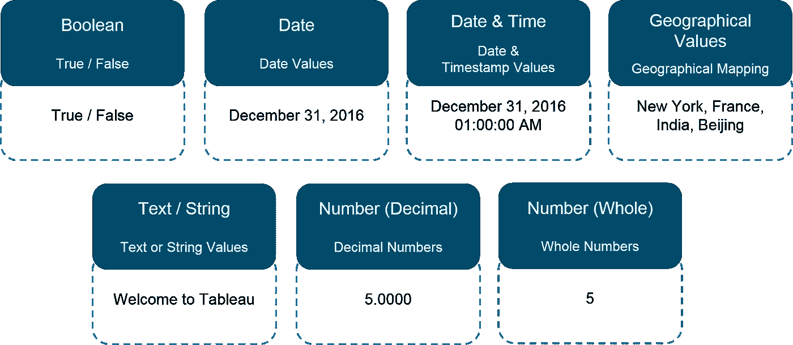
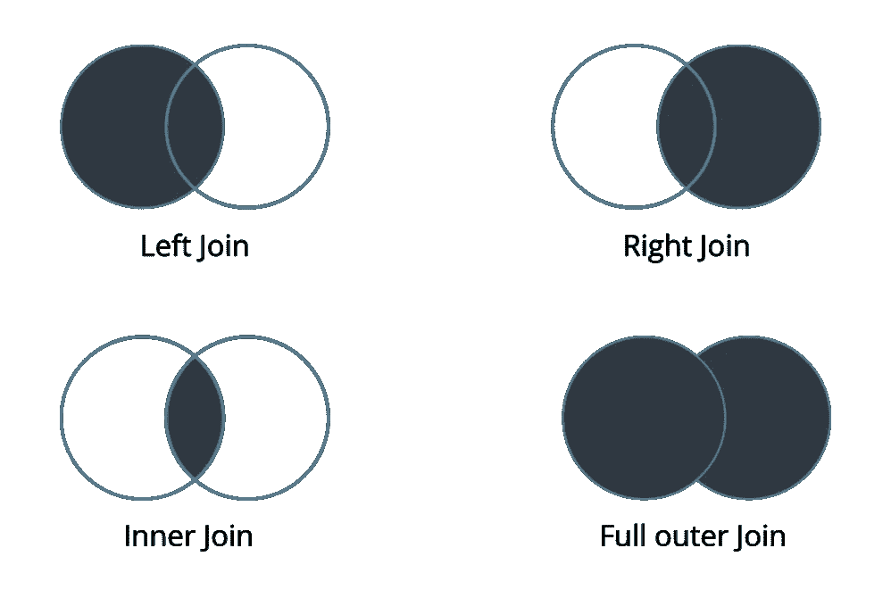
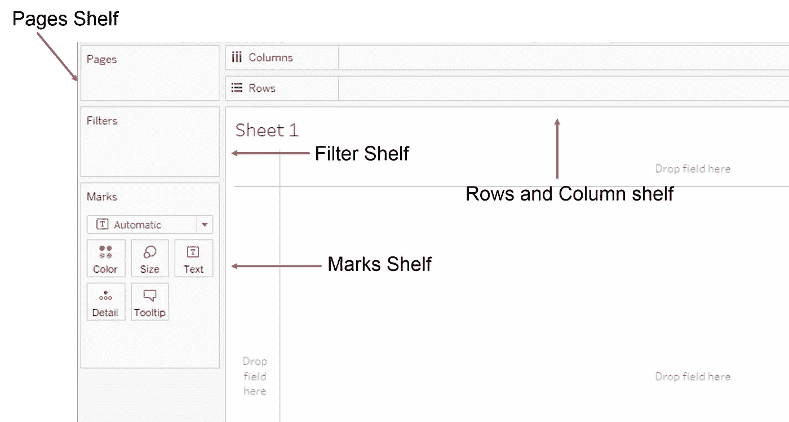
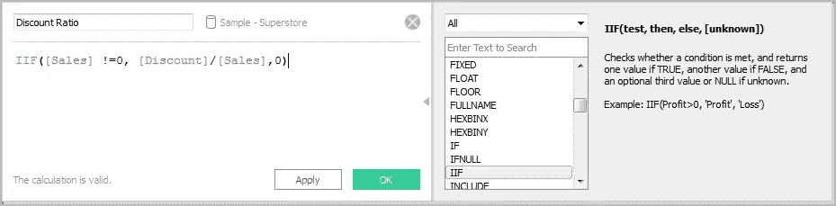
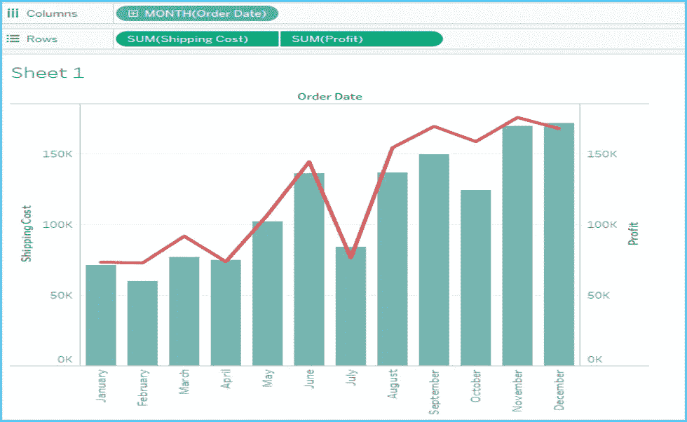
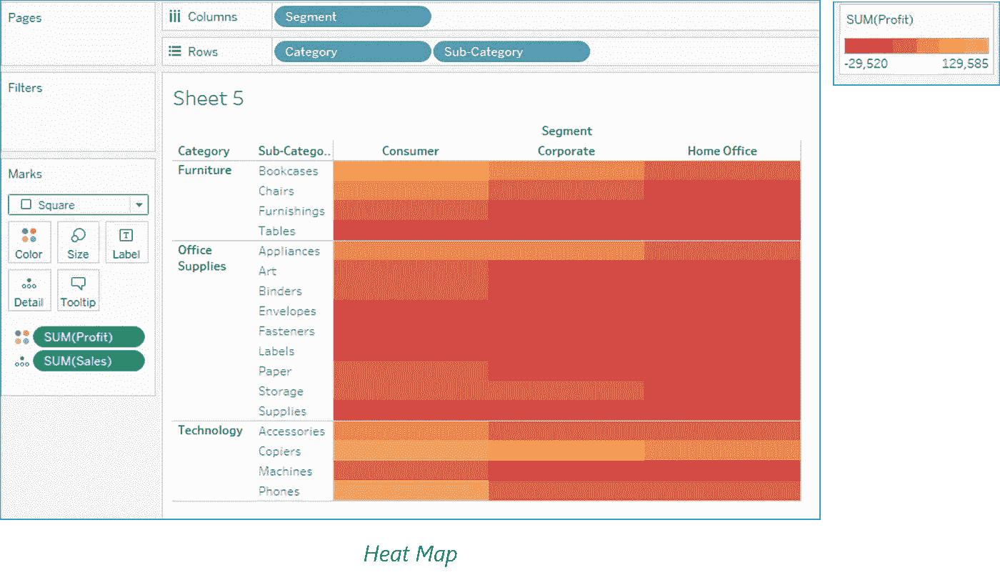
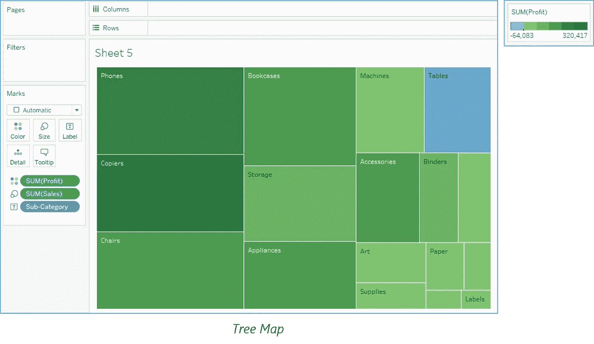

# 2021 年你必须准备的面试问题

> 原文：<https://medium.com/edureka/tableau-interview-questions-and-answers-4f80523527d?source=collection_archive---------2----------------------->


Tableau Interview Questions — Edureka

> “可视化数据的艺术和实践在弥合人机差距，以有意义的方式传递分析洞察力方面变得越来越重要。”―艾德·邓比尔

在这个 Tableau 面试问题博客中，我收集了面试官最常问的问题。这些问题是在咨询了数据分析和可视化领域的顶级行业专家后收集的。

如果你最近参加过 Tableau 面试，请把这些 Tableau 面试问题贴在评论区，我们会尽快回答。如果你在 Tableau 面试中有任何问题，你也可以在下面评论。

这个 Tableau 面试问题分为以下几个部分:

*   **初学者水平**
*   **中级**
*   **专家级**
*   **棘手的问题**

让我们先从初级水平的问题开始面试问题。

# 初学者水平 Tableau 面试问题

## 1.传统 BI 工具和 Tableau 有什么区别？



Traditional BI Tools vs Tableau

## 2.什么是 Tableau？

*   Tableau 是一款商业智能软件。
*   它允许任何人连接到各自的数据。
*   可视化并创建交互式、可共享的仪表板。


## 3.有哪些不同的 Tableau 产品，Tableau 的最新版本是什么？

这是 Tableau 产品系列。



***(一)Tableau 桌面:***

这是任何人都可以使用的自助式业务分析和数据可视化。它将数据图片转化为优化的查询。使用 tableau desktop，您可以直接连接到数据仓库中的数据，进行最新的数据分析。您还可以执行查询，而无需编写任何代码。将您的所有数据从多个来源导入 Tableau 的数据引擎&通过在一个交互式仪表板中组合多个视图来集成在一起。

***(二)Tableau 服务器:***

它更多的是企业级的 Tableau 软件。您可以使用 Tableau Desktop 发布仪表板，并使用基于 web 的 Tableau 服务器在整个组织中共享它们。它通过实时连接利用快速数据库。

***(三)Tableau Online:***

这是 Tableau server 的托管版本，有助于使商业智能比以前更快更容易。您可以使用 Tableau Desktop 发布 Tableau 仪表板，并与同事共享。

***(四)画面读者:***

这是一个免费的桌面应用程序，使您能够打开和查看内置的可视化 Tableau 桌面。您可以过滤、下钻数据，但不能编辑或执行任何类型的交互。

***(五)画面公:***

这是一个免费的 Tableau 软件，你可以用它来制作可视化效果，但是你需要将你的工作簿或工作表保存在 Tableau 服务器上，这样任何人都可以查看。

## 4.Tableau 中有哪些不同的数据类型？

Tableau 支持以下数据类型:



## 5.什么是度量和维度？

***措施***

度量是数据的数字度量或可测量的数量，可以通过维度表进行分析。度量值存储在一个表中，该表包含唯一引用关联维度表的外键。该表支持原子级别的数据存储，因此允许一次插入更多的记录。例如，一个销售表可以有产品键、客户键、促销键、售出的商品，引用一个特定的事件。

**尺寸 **

**维度**是每个属性的多个维度的描述性属性值，定义了多个特性。引用表中产品关键字的维度表可以包括产品名称、产品类型、尺寸、颜色、描述等。

## 6.有什么区别。twb 和。twbx 分机？

*   答。twb 是一个 XML 文档，包含您在 Tableau 工作簿中所做的所有选择和布局。它不包含任何数据。
*   答。twbx 是一个“压缩”档案，包含. twb 和任何外部文件，如摘录和背景图像。

## 7.Tableau 中有哪些不同类型的连接？

Tableau 中的联接与 SQL 联接相同。看看下图就明白了。



## 8.Tableau 中最多可以加入多少张桌子？

在 Tableau 中，您最多可以加入 32 个牌桌。

## 9.您可以使用数据集建立哪些不同的连接？

我们可以将 live 连接到我们的数据集，也可以将数据提取到 Tableau 上。

*   **Live:** 将 Live 连接到数据集利用了它的计算处理和存储。新的查询将进入数据库，并在数据中反映为新的或更新的。
*   **提取:**提取将生成数据的静态快照，供 Tableau 的数据引擎使用。数据快照可以作为一个整体定期刷新，也可以增量追加数据。设置这些时间表的一种方法是通过 Tableau 服务器。

Tableau extract 相对于 live connection 的优势在于，extract 可以在任何地方使用，而无需任何连接，并且您可以在不连接到数据库的情况下构建自己的可视化。

## 10.有哪些货架？

它们被命名为视图左侧和顶部的区域。通过将字段放置到工具架上来构建视图。某些工具架仅在选择某些标记类型时可用。



## 11.布景是什么？

**集合**是根据某些条件定义数据子集的自定义字段。一个**集合**可以基于一个计算的条件，例如，**集合**可以包含销售额超过某个阈值的客户。计算的**设置**随着数据的变化而更新。或者，**集合**可以基于视图中的特定数据点。

## 12.有哪些群体？

组是构成更高级别类别的维度成员的组合。例如，如果您正在使用按专业显示平均考试分数的视图，您可能希望将某些专业组合在一起以创建专业类别。

## 13.什么是分层字段？

tableau 中的分层字段用于向下钻取数据。这意味着在更精细的级别查看您的数据。

## 14.什么是 Tableau 数据服务器？

Tableau 服务器充当 Tableau 用户和数据之间的中间人。Tableau 数据服务器允许您上传和共享数据提取，保留数据库连接，以及重用计算和字段元数据。这意味着您对数据集、计算字段、参数、别名或定义所做的任何更改都可以保存并与其他人共享，从而实现安全、集中管理和标准化的数据集。此外，您可以利用服务器的资源对摘录运行查询，而不必首先将它们传输到本地机器。

# 中级 Tableau 面试问题

## 15.什么是 Tableau 数据引擎？

Tableau 数据引擎是 Tableau 中一个非常酷的特性。这是一个分析数据库，旨在实现即时查询响应、预测性能、无缝集成到现有数据基础架构中，并且不限于将整个数据集加载到内存中。

如果您处理大量数据，导入、创建索引和排序数据确实需要一些时间，但之后一切都会加速。Tableau 数据引擎并不是真正的内存技术。数据导入后存储在磁盘中，几乎不使用 RAM。

## 16.Tableau 中有哪些不同的滤镜，它们之间有什么不同？

在 Tableau 中，过滤器用于限制数据库中的数据。

Tableau 中的不同过滤器是:快速、上下文和普通/传统过滤器是:

*   ***普通过滤器*** 用于根据所选维度或度量限制数据库中的数据。只需将字段拖到“过滤器”架上，就可以创建传统的过滤器。
*   ***快速过滤器*** 用于查看过滤选项，过滤仪表板上的每个工作表，同时在运行期间动态更改值(在定义的范围内)。
*   ***上下文过滤器*** 用于过滤传送到每个单独工作表的数据。当工作表查询数据源时，它会创建一个用于计算图表的临时平面表。这个临时表包括自定义 SQL 或上下文过滤器没有过滤掉的所有值。

## 17.如何在 Tableau 中创建计算字段？

*   单击数据窗格上维度右侧的下拉菜单，然后选择“创建>计算字段”以打开计算编辑器。
*   命名新字段并创建一个公式。

看看下面的例子:



## 18.什么是双轴？

双轴是 Tableau 支持的一个很好的现象，它可以帮助用户在同一个图形中查看两个度量的两个尺度。许多网站，如 Indeed.com 和其他网站，利用双轴来显示两个指标之间的比较以及它们在一系列年份的增长率。双轴让您可以一次比较多个度量，两个独立的轴一个在另一个之上。它看起来是这样的:



## 19.树形图和热图有什么区别？

热图可以用来比较颜色和大小的类别。使用热图，您可以一起比较两种不同的度量。



树状图也做同样的事情，除了它被认为是一个非常强大的可视化工具，因为它可以用来说明分层数据和部分到整体的关系。



## 20.什么是数据的分解和汇总？

在更高和更概括的数据级别查看数值或度量的过程称为聚合。当您将一个度量放在架子上时，Tableau 会自动聚合数据，通常是通过求和。您可以很容易地确定应用于某个字段的聚合，因为当该函数被放置在工具架上时，它总是出现在字段名称的前面。例如，Sales 变成 SUM(销售额)。只能对关系数据源使用 Tableau 来聚合度量值。多维数据源仅包含聚合数据。在 Tableau 中，多维数据源仅在 Windows 中受支持。

根据 Tableau，分解数据使您可以查看数据源的每一行，这在您分析可能希望在视图中独立和相关使用的度量时非常有用。例如，您可能正在分析一项产品满意度调查的结果，其中一个坐标轴代表参与者的年龄。您可以合计年龄字段以确定参与者的平均年龄，或者分解数据以确定参与者对产品最满意的年龄。

## 21.Tableau 中的加入和融合有什么区别？

*   当您合并来自相同来源的数据时，例如，Excel 文件中的工作表或 Oracle 数据库中的表，会使用联接术语
*   而混合需要报表中有两个完全定义的数据源。

## 22.Tableau 服务器中的提取和调度是什么？

数据提取是原始数据源中实际数据的第一个副本或细分。使用数据提取而不是使用实时数据库连接的工作簿速度更快，因为提取的数据是在 Tableau 引擎中导入的。提取数据后，用户可以发布工作簿，该工作簿也会在 Tableau Server 中发布提取内容。但是，除非用户对提取应用计划刷新，否则工作簿和提取不会刷新。计划刷新是为数据提取刷新设置的计划任务，以便在发布包含数据提取的工作簿时自动刷新。这也消除了每次更新相关数据时重新发布工作簿的负担。

## 23.如何在 Tableau 中查看底层 SQL 查询？

在 Tableau 中查看底层 SQL 查询提供了两个选项:

*   **创建一个性能记录**来记录您与工作簿交互的主要事件的性能信息。用户可以在 Tableau 创建的工作簿中查看绩效指标。
    帮助- >设置和演奏- >开始演奏录音
    帮助- >设置和演奏- >停止演奏录音。
*   **查看位于 C: UsersMy DocumentsMy Tableau 存储库的 Tableau 桌面日志**。对于到数据源的实时连接，可以检查 log.txt 和 tabprotosrv.txt 文件。要获取摘录，请查看 tdeserver.txt 文件。

## 24.如何在 Tableau 中做性能测试？

性能测试也是实现 tableau 的一个重要部分。这可以通过用 TabJolt 加载 Testing Tableau Server 来完成，TabJolt 是一个为执行 QA 而创建的“点并运行”负载生成器。虽然 tableau 不直接支持 TabJolt，但是必须使用其他开源产品来安装它。

## 25.命名仪表板的组件。

*   **Horizontal** —水平布局容器允许设计者在页面上从左到右分组工作表和仪表板组件，并一次编辑所有元素的高度。
*   **垂直** —垂直容器允许用户从上到下对工作表和仪表板组件进行分组，并一次编辑所有元素的宽度。
*   **文本—** 所有文本字段。
*   **图像提取**—Tableau 工作簿为 XML 格式。为了提取图像，Tableau 应用一些代码来提取可以存储在 XML 中的图像。
*   **Web [URL 操作]**—URL 操作是指向网页、文件或 Tableau 之外的其他基于 Web 的资源的超链接。您可以使用 URL 操作链接到有关您的数据的更多信息，这些信息可能位于您的数据源之外。要使链接与您的数据相关，您可以将选择的字段值作为参数替换到 URL 中。

## 26.如何从 Tableau 自动过滤器中删除“所有”选项？

自动筛选提供了一种功能，只需单击自动筛选标题中的向下箭头，即可删除“所有”选项。您可以向下滚动到下拉列表中的“自定义”,然后取消选中“显示所有值”属性。可以通过再次检查该字段来激活它。

## 27.如何给 Tableau 添加自定义颜色？

添加自定义颜色是指 Tableau 中的一个强大工具。保存后重新启动 Tableau 桌面。tps 文件。从度量窗格中，将您想要添加颜色的一个拖到**颜色**中。从颜色图例菜单箭头，选择**编辑颜色**。当对话框打开时，选择调色板下拉列表，并根据需要进行自定义。

## 28.什么是 TDE 档案？

tde 是一个 Tableau 桌面文件，包含一个. TDE 扩展名。它是指包含从 MS Excel、MS Access 或 CSV 文件等外部来源提取的数据的文件。
TDE 设计的两个方面使其成为支持分析和数据发现的理想选择。

*   首先，TDE 是一个柱状商店。
*   第二个是它们是如何被构造的，这会影响它们如何被载入内存和被 Tableau 使用。这是 TDEs“架构感知”的一个重要方面。体系结构感知意味着 TDEs 使用计算机内存的所有部分，从 RAM 到硬盘，并使每个部分以最适合其特性的方式工作。

## 29.提及是否可以在 Tableau 中创建关系连接而无需创建新表？

是的，您可以在 tableau 中创建关系连接，而无需创建新表。

## 30.如何实现报表自动化？

您需要将报告发布到 tableau 服务器。在发布时，您会发现一个计划报告的选项。您只需要选择想要刷新数据的时间。

## 31.什么是假定引用完整性？

在某些情况下，可以通过从“数据”菜单中选择“假定参照完整性”选项来提高查询性能。使用此选项时，Tableau 仅在视图中的字段明确引用连接表时，才会在查询中包含该连接表。

## 32.解释在 Tableau 中什么时候使用连接和混合？

如果数据驻留在单个源中，使用连接总是可取的。当数据不在一个地方时，混合是创建左连接(如主数据源和辅助数据源之间的连接)的最可行的方法。

## 33.什么是默认数据混合连接？

数据混合是将来自多个数据源的数据放入一个 Tableau 视图的能力，而不需要任何特殊的编码。默认混合相当于左外连接。但是，通过切换哪个数据源是主数据源，或者通过过滤空值，可以模拟左连接、右连接和内连接。

## 34.你所理解的混合轴是什么？

在 Tableau 中，度量可以共享一个轴，因此所有标记都显示在一个窗格中。混合度量时，视图中只有一行或一列，而不是添加行和列，每个度量的所有值都沿一个连续轴显示。我们可以通过简单地将一个度量或轴拖放到现有的轴上来混合多个度量。

## 35.Tableau 中的故事是什么？

故事是一个包含一系列工作表或仪表板的工作表，这些工作表或仪表板协同工作以传达信息。您可以创建故事来展示事实之间的联系，提供背景，展示决策与结果之间的关系，或者简单地创建一个令人信服的案例。故事中的每一页都称为一个故事点。

## 36.Tableau 中离散和连续的区别？

Tableau 中有两种类型的数据角色—离散维和连续维。

*   离散数据角色是被视为不同和独立的值，并且只能取某个范围内的单个值。示例:工作表中的线程数、客户名称、行 ID 或州。离散值在架子上显示为蓝色药丸，在数据窗口中显示为蓝色图标。
*   连续数据角色用于度量连续数据，可以采用有限或无限区间内的任何值。例如:单价、时间、利润或订单数量。连续变量的行为方式类似，它们可以取任何值。连续值显示为绿色药丸。

## 37.如何在 Tableau 中创作故事？

有许多方法可以在 Tableau 中创建一个故事。每个故事点可以基于不同的视图或仪表板，或者整个故事可以基于相同的可视化，只是在不同的阶段看到，过滤了不同的标记并添加了注释。你可以用故事来制作一个商业案例，或者简单地叙述一系列事件。

*   单击“新建文章”选项卡。
*   在屏幕的左下角，为您的故事选取一个大小。从预定义的大小中选择一个，或以像素为单位设置自定义大小。
*   默认情况下，您的故事的标题来自其工作表名称。要编辑它，请双击标题。您还可以更改标题的字体、颜色和对齐方式。单击应用查看您的更改。
*   要开始构建您的故事，请从左侧的“故事”选项卡中拖动一个工作表，并将其放到视图的中央
*   单击添加标题以总结故事要点。
*   要为您的观众突出显示一个关键要点，请将一个文本对象拖到故事工作表中，然后键入您的注释。
*   为了进一步突出这个故事点的主要思想，您可以更改视图中某个字段的筛选器或排序，然后通过单击导航器框上方的 Update 保存您的更改。

## 38.什么是驱动程序方法？

Tableau Drive 是一种扩展自助服务分析的方法。驱动基于成功企业部署的最佳实践。该方法依赖于迭代、敏捷的方法，比传统的长周期部署更快、更有效。

这种方法的基础是业务和 IT 之间新的合作模式。

## 39.如何在计算字段中使用组？

通过将相同的计算添加到 SQL 查询中的“Group By”子句，或者在数据窗口中创建一个计算字段，并在需要对字段进行分组时使用该字段。

*   **在计算中使用组。**您不能在计算中引用临时组。
*   **使用在辅助数据源中创建的组混合数据:**如果组是在辅助数据源中创建的，则只有计算组可以用于数据混合。
*   **在另一个工作簿中使用组。**您可以通过复制和粘贴计算来轻松复制另一个工作簿中的组。

## 40.提到 Tableau 中发布的数据源和嵌入的数据源有什么区别？

发布数据源和嵌入数据源之间的区别在于，

*   **发布数据源**:包含独立于任何工作簿的连接信息，可以被多个工作簿使用。
*   **嵌入式数据源**:包含连接信息，与工作簿相关联。

## 41.提到什么是不同的 Tableau 文件？

不同的 Tableau 文件包括:

*   **工作簿:**工作簿包含一个或多个工作表和控制板
*   **书签**:它包含一个单独的工作表，这是一个快速分享你的工作的简单方法
*   **打包的工作簿:**它包含一个工作簿以及任何支持的本地文件数据和背景图像
*   **数据提取文件:**提取文件是一个子集或整个数据源的本地副本
*   **数据连接文件:**这是一个包含各种连接信息的小型 XML 文件

# 专家级 Tableau 面试问题

## 42.如何将视图嵌入网页？

您可以将交互式 Tableau 视图和仪表板嵌入到网页、博客、wiki 页面、web 应用程序和 intranet 门户中。嵌入式视图会随着基础数据的更改或其工作簿在 Tableau Server 上的更新而更新。嵌入式视图遵循 Tableau 服务器上使用的相同许可和权限限制。也就是说，要查看网页中嵌入的 Tableau 视图，访问该视图的人还必须拥有 Tableau Server 帐户。

或者，如果您的组织在 Tableau Server 上使用基于核心的许可证，则可以使用来宾帐户。这使您组织中的人员无需登录服务器即可查看嵌入在网页中的 Tableau 视图并与之交互。请与您的服务器或网站管理员联系，以确定您发布到的网站是否启用了来宾用户。

您可以执行以下操作来嵌入视图并调整其默认外观:

*   获取视图提供的嵌入代码:每个视图顶部的“共享”按钮包含嵌入代码，您可以将其复制并粘贴到您的网页中。(如果您在代码中将`showShareOptions`参数更改为`false`，共享按钮不会出现在嵌入式视图中。)
*   自定义嵌入代码:您可以使用控制工具栏、选项卡等的参数自定义嵌入代码。有关更多信息，请参见嵌入代码的参数。
*   使用 Tableau JavaScript API: Web 开发者可以在 Web 应用程序中使用 Tableau JavaScript 对象。要访问 API、文档、代码示例和 Tableau 开发人员社区，请参见 Tableau 开发人员门户。

## 43.在地图上设计一个视图，如果用户选择任何州，该州下的城市必须显示利润和销售额。

根据您的问题，您的数据集中必须有州、城市、利润和销售字段。

> **第一步:**双击状态字段
> 
> **第二步:**将城市拖放到 Marks 卡中。
> 
> **第三步:**拖动销售并将其放入大小。
> 
> **第四步:**拖动利润，滴入颜色。
> 
> **步骤 5:** 点击尺寸图例，增加尺寸。
> 
> **步骤 6:** 右键单击 state 字段，选择 show quick filter。
> 
> **步骤 7:** 现在选择任意状态，查看视图。

## 44.想象一下我正在使用 Tableau Desktop &与 Cloudera Hadoop 数据进行实时连接。我需要按 F5 来刷新可视化。有什么方法可以每隔“x”秒自动刷新可视化，而不是按 F5？

这是一个每 5 秒钟刷新一次仪表板的例子。

您所需要做的就是用您的 API src 和服务器 URL 替换它们。

```
<!DOCTYPE html>
<html lang="en">
<head>
<title>Tableau JavaScript API </title>
<script type="text/javascript" src="http://servername/javascripts/api/tableau_v8.js"></script>
</head>
<div id="tableau Viz"></div>
<script type='text/javascript'>
var placeholderDiv = document.getElementById("tableau Viz");
var url = "http://servername/t/311/views/Mayorscreenv5/Mayorscreenv2";
var options={
hideTabs:True,
width:"100%",
height:"1000px"
};
var viz= new tableauSoftware.Viz(placeholderDiv,url,options);
setInterval (function() {viz.refreshDataAsync()},5000);
</script>
</body>
</html>
```

# 一些额外的棘手的 Tableau 面试问题

## 45.假设我的许可证今天到期，用户能够查看我之前在服务器上发布的仪表板或工作簿吗？

如果您的服务器许可证今天到期，您在服务器上的用户名将具有“未经许可”的角色，这意味着您不能访问，但其他人可以。站点管理员可以将所有权更改给另一个人，这样提取就不会失败。

## 46.Tableau 软件适合战略收购吗？

是啊！毫无疑问。它为您提供了其他工具无法提供的数据洞察力。此外，它还可以帮助你计划和指出异常情况，并随机应变你的过程，以改善你的公司。

## 47.我们能否将一个 excel 文件放在一个共享位置，并用它来开发一个报告并定期刷新它？

是的，我们能做到。但是为了更好的性能，我们应该使用 Extract。

## 48.Tableau 可以安装在 macOS 上吗？

是的，Tableau Desktop 可以安装在 Mac 和 Windows 操作系统上。

## 49.Tableau 一次最多可以使用多少行？

Tableau 不受表中行数的限制。客户使用 Tableau 来访问数 Pb 的数据，因为它只检索回答您的问题所需的行和列。

## 50.在 Tableau online 上发布工作簿时，有时会出现需要提取的错误。为什么会偶尔发生？

当用户试图发布连接到内部服务器的工作簿或存储在本地驱动器(如公司网络中的 SQL server)上的文件时，就会发生这种情况。

我希望这个面试问题对你有所帮助。我很快会在 Tableau 上为大家提供更多的博客。如果你想查看更多关于人工智能、DevOps、道德黑客等市场最热门技术的文章，你可以参考 [Edureka 的官方网站。](https://www.edureka.co/blog/?utm_source=medium&utm_medium=content-link&utm_campaign=top-tableau-interview-questions-and-answers)

请留意这个系列中的其他文章和视频，它们会帮助你理解 Tableau 的各种概念。

> 1. [Tableau 教程](/edureka/tableau-tutorial-37d2d6a9684b)
> 
> 2.[什么是 Tableau？](/edureka/what-is-tableau-1d9f4c641601)
> 
> 3. [Tableau 功能](/edureka/tableau-functions-ce794b10e588)
> 
> 4. [Tableau 仪表盘](/edureka/tableau-dashboards-3e19dd713bc7)
> 
> 5.[Tableau 中的 LOD 表达式](/edureka/tableau-lod-2f650ca1503d)
> 
> 6. [Tableau 提示和技巧](/edureka/tableau-tips-and-tricks-a18bf8991afc)
> 
> 7.[循序渐进指导学习 Tableau 公共](/edureka/tableau-public-942228327953)
> 
> 8. [Tableau 桌面 vs Tableau 公共 vs Tableau 阅读器](/edureka/tableau-desktop-vs-tableau-public-vs-tableau-reader-fbb2a3aa0bac)
> 
> 9.[如何在 Tableau 中创建和使用参数？](/edureka/parameters-in-tableau-ac552e6b0cde-ac552e6b0cde)
> 
> 10.[Tableau 中的集合是什么，如何创建它们](/edureka/sets-in-tableau-39befe9b7fa1)
> 
> 11.[数据混合](/edureka/tableau-lod-2f650ca1503d)
> 
> 12 .[Tableau 中的圆环图](/edureka/donut-chart-in-tableau-a2e6fadf6534)
> 
> 13. [Tableau 图表](/edureka/tableau-charts-111758e2ea97)
> 
> 14.[如何以及何时使用不同的 Tableau 图表](/edureka/tableau-charts-111758e2ea97)

*原载于 2020 年 5 月 18 日*[*【https://www.edureka.co】*](https://www.edureka.co/blog/interview-questions/top-tableau-interview-questions-and-answers/)