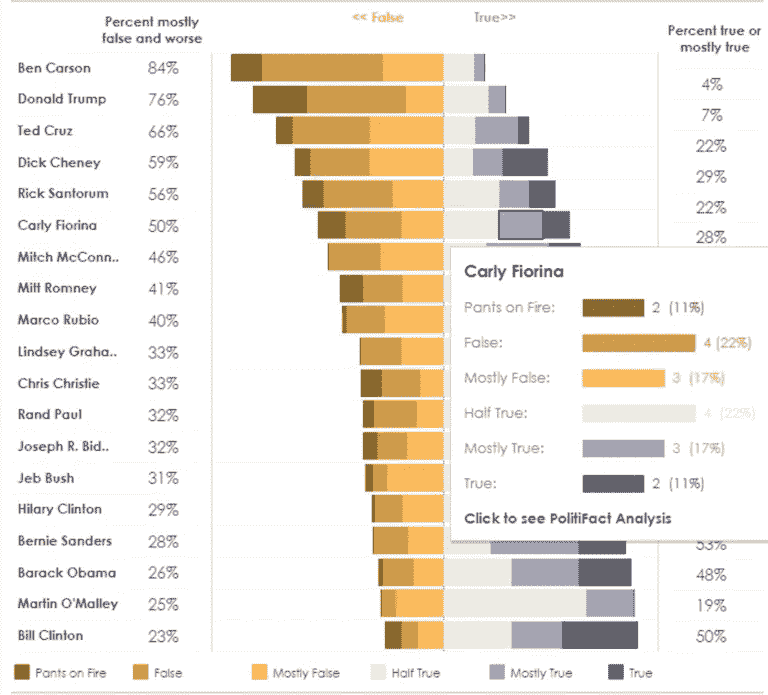
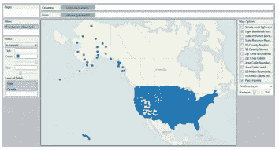
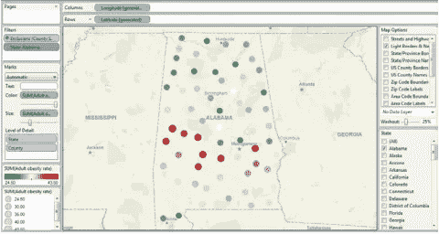
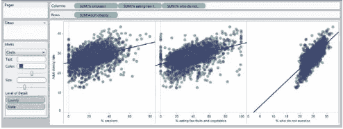
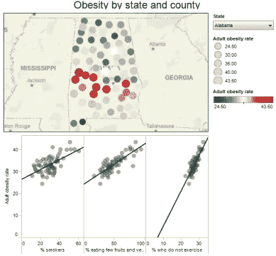
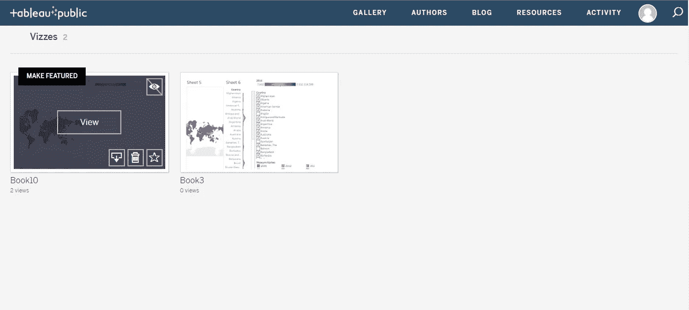

# 循序渐进指南学习 Tableau 公共

> 原文：<https://medium.com/edureka/tableau-public-942228327953?source=collection_archive---------2----------------------->

Tableau 是商业智能行业中使用的强大且增长最快的数据可视化工具之一。它有助于将原始数据简化为非常容易理解的格式。然而，对于一个刚刚开始探索这个工具的人来说，支付它所需要的钱是不现实的。因此，我们有 **Tableau Public**

在本文中，我们将讨论以下概念:

*   **Tableau Public**
*   **开放、创造和分享**
*   **Tableau vs Tableau Public**

# Tableau 公共

Tableau 的数据分析速度非常快，创建的可视化是仪表板和工作表的形式。组织中任何级别的专业人员都可以理解使用 Tableau 创建的数据。它甚至允许非技术用户创建定制的仪表板。

Tableau Public，很像 Tableau，是一个简单易用的工具，用于在网络上讲述视觉互动故事，唯一的例外是它完全免费！

比如,《纽约时报》在 2015 年 12 月发表了一篇文章，其中包含一张信息图，显示了政客说谎或说真话的倾向，该图基于 PolitiFact 的调查结果。我重新设计了图形，以更好地显示这些倾向，并添加了链接到 PolitiFact 调查结果的功能。

Tableau Public 非常擅长构建这样的可视化效果，我们只需几个简单的步骤就可以重新创建这个。

*   打开***USDA _ activity _ dataset . xls***。我将为你们所有人做广告。
*   该数据在近 100 列、3000 多行中详细描述了身体活动、肥胖和其他健康信息，美国每个县一行。

Tableau Public 非常擅长构建这样的可视化效果，我们只需几个简单的步骤就可以重新创建这个。

# 开放、创造和分享。

## 第一步:数据

*   打开***USDA _ activity _ dataset . xls***。我将把 [***源文件***](https://drive.google.com/file/d/1iWwoSkXVZ9Ufn2SME95QSQ07bIwYDUYe/view?usp=sharing) 全部放在给你。
*   该数据在近 100 列、3000 多行中详细描述了身体活动、肥胖和其他健康信息，美国每个县一行。

## 步骤 2:连接到数据源

*   将数据集拖放到桌面上的 **Tableau 公共图标**上以打开。
*   在对话框中点击**确定**进行连接。

Tableau 自动识别**分类字段**，如**“州”**，以及**“成人肥胖率”**等数值度量。

## 步骤 3:创建第一个视图

*   双击**【州】**和**【国家】**。Tableau Public 识别出它们是地理字段，**据此对它们进行地理编码**。您可能会收到一条警告消息；如果是这样，检查一下，这样就不会再看到了。

*   请注意，在经纬度 0 度处有一个点。这些是空值。通过单击点的一侧来选择它们，按住鼠标按钮在其上绘制一个矩形，然后松开。右键单击所选的空值，并选择**排除**。
*   右键单击过滤器中的排除项，并选择 **Make Global** ，以便将其应用于所有后续视图。现在您有了一张地图，其中显示了您有记录的每个县的点。
*   将**“成人肥胖率”**从测量面板拖动到**颜色**中，并复制到**大小**架中，根据这些值对各县进行编码。把颜色换成你喜欢的。
*   现在添加一个过滤器来选择各个州。单击并拖动“状态”到过滤器架，在对话框中单击确定。
*   右键点击**滤镜架**中的**“状态”**，选择**显示快速滤镜**。取消全选，然后选择**阿拉巴马**。
*   右键单击底部的选项卡，重命名工作表**“地图视图”**。第一个视图的完成状态如下所示。

## 步骤 4:添加第二个视图

*   添加新工作表。
*   将**【成人肥胖率】**拖到行上，将**、【吸烟者比例】**、**、【少吃水果蔬菜比例】**、**、【不运动者比例】**拖到列上。
*   将**【县】****【州】**拖入*。如果没有这一步，Tableau 的默认行为是对所有县和州的值求和，这将为每个图形提供单个数据点，而不是所需的散点图。*
*   *将**颜色**改为紫色，打开**【自动】**旁边的下拉菜单，选择**圆形**，然后向左移动下方的滑块，增加点的透明度。*
*   *在顶部菜单中选择分析并检查**趋势线**。*
*   *右键单击底部的选项卡，将工作表重命名为“散点图视图”。第二个视图的完成状态如下所示。*

**

## *步骤 5:创建一个包含两个视图的仪表板*

*   *双击每个视图，将两个视图都显示在仪表板上。选择**状态**滤镜>紧凑列表。*
*   *再次右击该过滤器，并选择 **Make Global** 。这将确保选择一个状态同时改变两个视图。*

**

*在这一步之后，剩下的都是你要做的自定义决定。*

*   *第三次右击该过滤器，选择**自定义**，取消选择**显示“全部”**值。这使得用户无法看到整个国家的全部数据。*
*   *右键单击每个视图的标题，然后选择隐藏标题。*
*   *将仪表板**重命名为“按州和县划分的肥胖度”**。*
*   *双击**对象**下的**标题**。仪表板现在应该是这样的。*

## *步骤 6:保存到 web*

*   *转到**尺寸>编辑**。*
*   *选择最适合您网站的大小和布局。*
*   *点击顶部菜单上的文件并选择**保存到网络**。*

*系统会提示您使用 tableau 公共凭据登录。如果您没有帐户，您可以点击此处免费创建一个。登录后，给你的工作簿命名，tableau public 将发布你的**可视化效果**你是如何在桌面上构建它的*

## *第七步:嵌入你的网站/文章*

*   *在已经打开的**保存到网络结果**窗口中，向下滚动到可视化下方，并点击**共享**。*
*   *将嵌入代码复制并粘贴到网页的 HTML 中。*

*这种可视化现在完全是实时的。*

*这意味着查看者可以看到工具提示、使用过滤器或您在仪表板中内置的任何其他功能。要分享我们的可视化效果，您可以使用**社交媒体按钮**或**分享**它们来获得您的仪表板的直接 URL。*

**

*您也可以通过将嵌入代码直接复制并粘贴到我们的网页中，将仪表板嵌入到我们的网站或文章中。这使得你的视觉效果可以紧邻任何图形或文本。*

# *Tableau vs Tableau Public*

*Tableau Desktop 和 Tableau Desktop Public 有一些比较。我将提到我认为最重要的:*

*   *Tableau 桌面公共允许您仅将**连接到本地数据**，并且您必须将**公共工作簿**提取到 **Tableau 服务器公共**。*
*   *Tableau 的付费版本在当前财年的定价如下。*
*   *Tableau 桌面个人版:35 美元*
*   *Tableau 桌面专业版:70 美元*
*   ***Tableau 服务器:$35***
*   *Tableau Online:42 美元*
*   *在旧模式下，一个许可证，加上年度维护，桌面个人版的费用为****999 美元，桌面专业版**的费用为**1999 美元** **。*****
*   ***Tableau desktop Public **不允许您将工作簿本地保存到您的 PC 上**，您必须将其保存到 Tableau server Public，而对于付费版本您可以这样做。***
*   ***您的数据源中的行数有限制，最近在 Tableau Public 上增加到了**100 万行**，对于 Tableau 的付费版本没有限制。***

***如果你想查看更多关于人工智能、DevOps、道德黑客等市场最热门技术的文章，你可以参考 [Edureka 的官方网站。](https://www.edureka.co/blog/?utm_source=medium&utm_medium=content-link&utm_campaign=tableau-public)***

***请留意本系列中的其他文章，它们将解释 Tableau 的各个方面。***

> ***1. [Tableau 教程](/edureka/tableau-tutorial-37d2d6a9684b)***
> 
> ***2.[什么是 Tableau？](/edureka/what-is-tableau-1d9f4c641601)***
> 
> ***3. [Tableau 函数](/edureka/tableau-functions-ce794b10e588)***
> 
> ***4.[画面仪表盘](/edureka/tableau-dashboards-3e19dd713bc7)***
> 
> ***5.[Tableau 中的 LOD 表达式](/edureka/tableau-lod-2f650ca1503d)***
> 
> ***6. [Tableau 提示和技巧](/edureka/tableau-tips-and-tricks-a18bf8991afc)***
> 
> ***7.[画面图表](/edureka/tableau-charts-111758e2ea97)***
> 
> ***8. [Tableau 桌面 vs Tableau 公共 vs Tableau 阅读器](/edureka/tableau-desktop-vs-tableau-public-vs-tableau-reader-fbb2a3aa0bac)***
> 
> ***9.[如何在 Tableau 中创建和使用参数？](/edureka/parameters-in-tableau-ac552e6b0cde-ac552e6b0cde)***
> 
> ***10.[Tableau 中的集合是什么以及如何创建它们](/edureka/sets-in-tableau-39befe9b7fa1)***
> 
> ***11.[数据混合](/edureka/tableau-lod-2f650ca1503d)***
> 
> ***12 .[Tableau 中的圆环图](/edureka/donut-chart-in-tableau-a2e6fadf6534)***
> 
> ***13.[2020 年你必须准备的 50 大 Tableau 面试问题](/edureka/tableau-interview-questions-and-answers-4f80523527d)***
> 
> ***14.[如何以及何时使用不同的 Tableau 图表](/edureka/tableau-charts-111758e2ea97)***

****原载于 2019 年 3 月 1 日*[*【https://www.edureka.co】*](https://www.edureka.co/blog/tableau-public/)*。****