# 数据可视化专家必须知道的顶级技巧和窍门

> 原文：<https://medium.com/edureka/tableau-tips-and-tricks-a18bf8991afc?source=collection_archive---------2----------------------->

Tableau Tips and Tricks — Edureka

你是为你公司的人建立杰出仪表板的人吗？如果是的话，那么我的朋友你已经爬到了正确的位置。在这篇文章中，我强调了一些惊人的“桌面技巧和窍门”,你可以马上应用它们，让你的仪表盘更有效地脱颖而出。

您知道吗，您可以在 tableau 中创建日历，甚至可以制作可视化动画。

> 成为鹤立鸡群的人——乔尔·奥斯坦

以下是给你的一些画面技巧和窍门:

1.在 Tableau 中创建日历

2.在字段之间切换

3.像专家一样融合！

4.大数字

5.动画可视化

# 1.Tableau 提示和技巧:Tableau 中的日历

这是一个简单而又新颖的技巧，你可以用它来打动你的同事。让我们来学习如何通过 4 个步骤创建日历！

## 步骤 1:为年份创建数据集:

首先，您需要一些包含日期的数据。对于这个博客，我简单地进入 Excel，输入 1/01/2018，然后下拉到 31/12/2018，将文件保存在。xls 格式并将数据集连接到 Tableau。

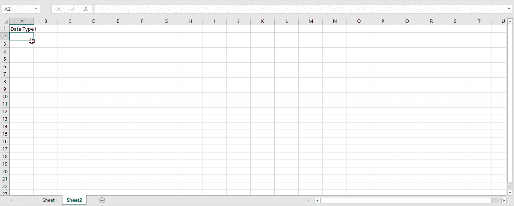

## 步骤 2:向列架添加日期

将“订单日期”添加到列架，并将其更改为(“月/年”)自定义日期格式

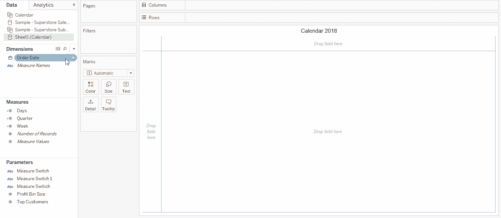

## 步骤 3:向行和列货架添加周和工作日

将“订单日期”更改为工作日和周数，并将其添加到货架的列和行中。

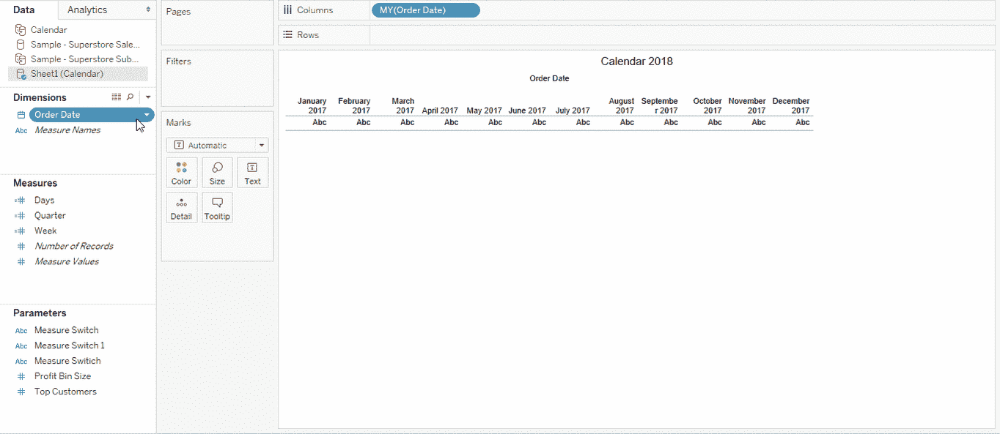

## 第 4 步:添加过滤器和标记，以最终建立日历

使用筛选器和标记来显示月历

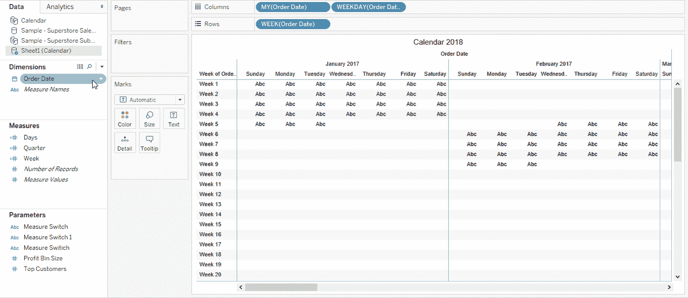

## 最终日历:

嗯，这是你最后会得到的最终日历。仅供参考，您还可以添加其他参数，如销售额或利润，并获得它们的日历视图。

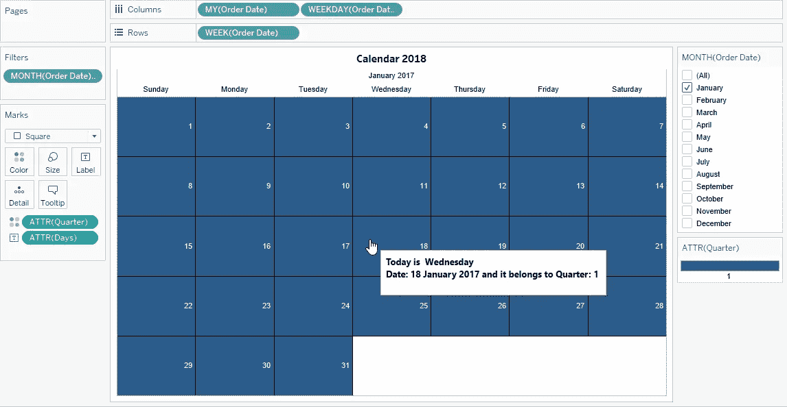

# 2.Tableau 提示和技巧:在字段之间切换

让我们学习 tableau 的另一个技巧，并学习如何使用一个参数让最终用户能够在不同的指标之间切换。

## 步骤 1:创建参数

创建一个字符串参数“测量开关”。为了能够在不同的度量之间切换，让我们创建一个参数列表。在左侧的值列表中，我们有参数的实际值，在右侧，我们有一个名称，用户单击参数将会看到该名称。所以让我们用下面的方式来填写它。

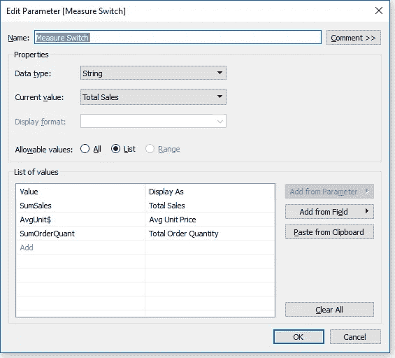

## 步骤 2:创建计算字段

接下来的步骤是创建计算字段。我们的计算字段将检查参数，并基于该值选择一个可视化并显示该可视化。它看起来是这样的:

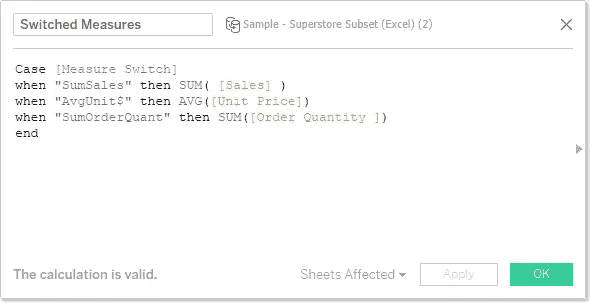

## 步骤 3:创建可视化 I

创建完计算字段了吗？让我们继续创建一个可视化，将“区域”添加到行中，将“部门”添加到列中。此外，将新创建的计算字段“切换度量值”添加到该列中。最后，将相同的计算字段添加到颜色和文本架中。

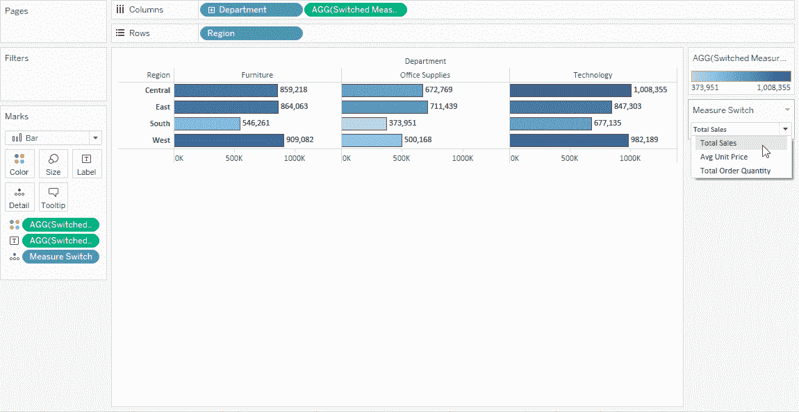

## 步骤 4:创建可视化 II

1.在一张新纸上，将标记更改为“填充地图”，并将“状态”添加到详细信息中。

2.我们最终将创建一个双轴地图，所以在行架上添加纬度。

3.在标记架上，将我们创建的参数“测量开关”添加到颜色架。

4.现在点击下面的地图，将我们制作的计算字段“转换度量”添加到文本和颜色架中。

5.最后，右键单击第二个药丸的行本身，并设置为双轴。它看起来是这样的:

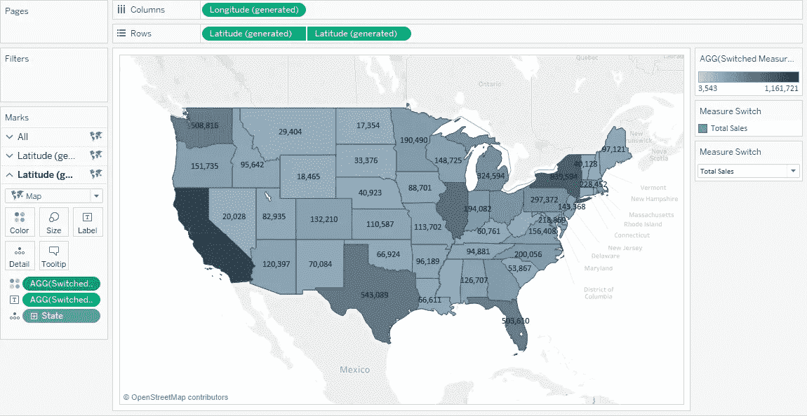

# 3.Tableau 提示和技巧:像专业人士一样融合！

数据混合是一种将来自一个数据源的数据与来自另一个数据源的数据列相结合的方法。

通常，您可以使用连接来组合数据，但有时需要考虑数据类型及其粒度等因素，在这种情况下，最好使用数据混合。

例如，假设您有一部分数据存储在 Salesforce 中，其余数据存储在 Excel 工作簿中。现在，由于要合并的数据存储在两个不同的数据库中，并且每个表中捕获的数据的粒度在两个数据源中也不同，因此数据混合是合并这些数据的最佳方式。

# 4.Tableau 提示和技巧:大数字

这是一个快速但有趣的学习技巧。这是一个非常简单的技巧，但是可以给你的仪表板增加更好的美感。让我给你看一个仪表板的例子:

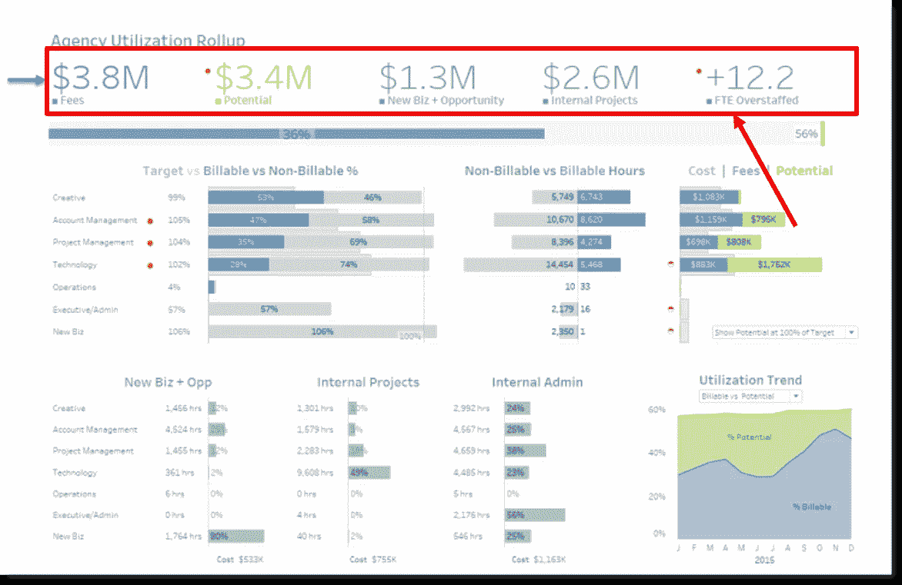

挺有意思的！！对吗？让我演示给你看，这是一个非常简单的把戏。

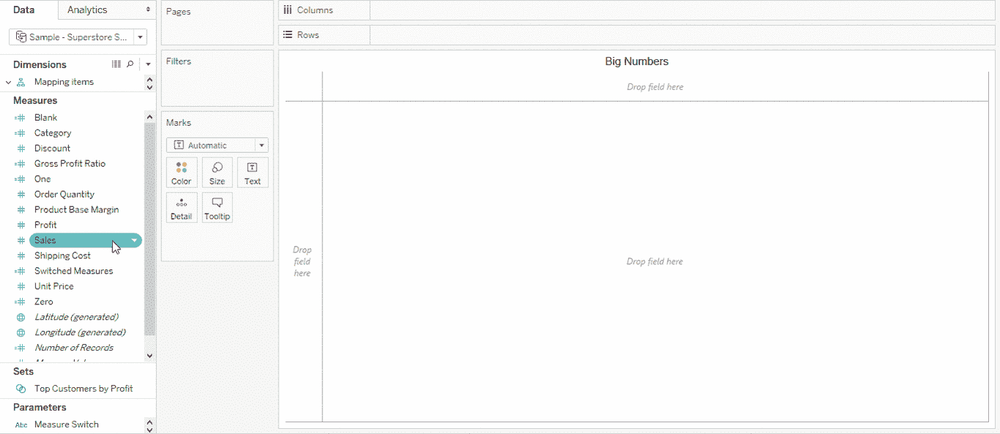

# 5.Tableau 提示和技巧:动画可视化

是啊！你没听错，你可以在你的可视化中添加动画。让我们想象一下在过去的 200 年里世界人口是如何增长的。听起来很酷吧！这就是 Tableau 的页架出现的原因。让我们把日期加到书架上，看看粗出生率是如何逐年下降的。

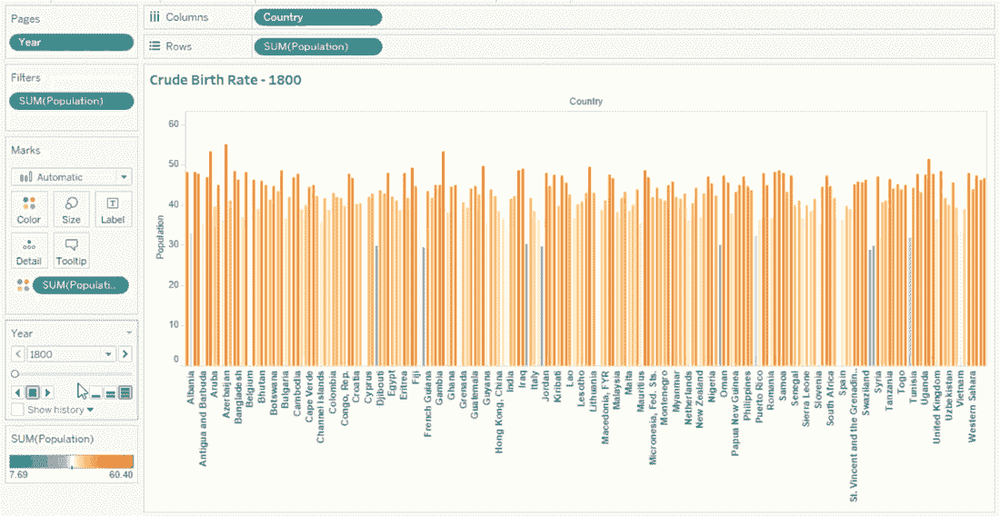

我希望你喜欢我的博客，并发现一些 Tableau 隐藏的功能。仅仅阅读不会让你成为一个画面绝地，来吧，开始探索画面。

如果你想查看更多关于人工智能、DevOps、道德黑客等市场最热门技术的文章，你可以参考 Edureka 的官方网站。

请留意这个系列中的其他文章和视频，它们会帮助你理解 Tableau 的各种概念。

> 1. [Tableau 教程](/edureka/tableau-tutorial-37d2d6a9684b)
> 
> 2.[什么是画面？](/edureka/what-is-tableau-1d9f4c641601)
> 
> 3. [Tableau 函数](/edureka/tableau-functions-ce794b10e588)
> 
> 4. [Tableau 仪表盘](/edureka/tableau-dashboards-3e19dd713bc7)
> 
> 5.[Tableau 中的 LOD 表达式](/edureka/tableau-lod-2f650ca1503d)
> 
> 6.[表格图表](/edureka/tableau-charts-111758e2ea97)
> 
> 7.[循序渐进指导学习 Tableau 公共](/edureka/tableau-public-942228327953)
> 
> 8. [Tableau 桌面 vs Tableau 公开 vs Tableau 阅读器](/edureka/tableau-desktop-vs-tableau-public-vs-tableau-reader-fbb2a3aa0bac)
> 
> 9.[如何在 Tableau 中创建和使用参数？](/edureka/parameters-in-tableau-ac552e6b0cde-ac552e6b0cde)
> 
> 10.[Tableau 中的集合是什么以及如何创建它们](/edureka/sets-in-tableau-39befe9b7fa1)
> 
> 11.[数据混合](/edureka/tableau-lod-2f650ca1503d)
> 
> 12 .[Tableau 中的圆环图](/edureka/donut-chart-in-tableau-a2e6fadf6534)
> 
> 13.[2020 年你必须准备的 50 大 Tableau 面试问题](/edureka/tableau-interview-questions-and-answers-4f80523527d)
> 
> 14.[如何以及何时使用不同的表格图](/edureka/tableau-charts-111758e2ea97)

*原载于 2018 年 2 月 13 日*[*https://www.edureka.co*](https://www.edureka.co/blog/tableau-tips-and-tricks/)*。*