# Tableau 教程-使用 Tableau 学习数据可视化

> 原文：<https://medium.com/edureka/tableau-tutorial-37d2d6a9684b?source=collection_archive---------2----------------------->

Tableau Tutorial — Edureka

当你谈到数据可视化时，你想到的第一个词是——Tableau。我猜这就是为什么你可能在这里阅读这个 Tableau 教程，因为你已经听说了 Tableau 的优势。

你来对地方了。在本 Tableau 教程中，您将学习以下主题:

*   数据可视化的重要性
*   数据可视化工具
*   为什么是 Tableau？
*   什么是 Tableau？
*   Tableau 产品系列
*   更多了解 Tableau
*   形象化
*   用例—数据力学

让我们首先从理解数据可视化背后的概念开始这个 Tableau 教程。

# 数据可视化的重要性

数据可视化是数据分析最重要的部分之一。以一种可理解的、视觉上吸引人的格式呈现数据一直是很重要的。数据可视化是数据科学家为了更好地与最终用户沟通而必须掌握的技能之一。

这里的数据就是这个词。

让我首先给你一个我们正在处理的数据的种类和数量的概念。根据 SiliconAngle 的数据，2012 年全球存储的数据量为 2.5 兆字节，到 2017 年底将超过 50 兆字节。客观地看，这些数据主要是由网站和跨平台交易产生的。此外，到 2020 年底，总共将有 200 亿台“智能”设备连接到互联网，这个数字可能会令人困惑！

数据可视化允许数据科学家与其最终用户进行交流。对于不直接处理数据的人来说，数据分析的结果并不容易理解。数据可视化弥合了这一鸿沟，让人们意识到数据分析的可能性。

让我们考虑下面的例子来理解这一点:

下图显示了要绘制在图表上的不同点的 x 和 y 坐标。数字看起来几乎一样，不是吗？也许当我们在图上画出每个集合后，这些线看起来会很相似。

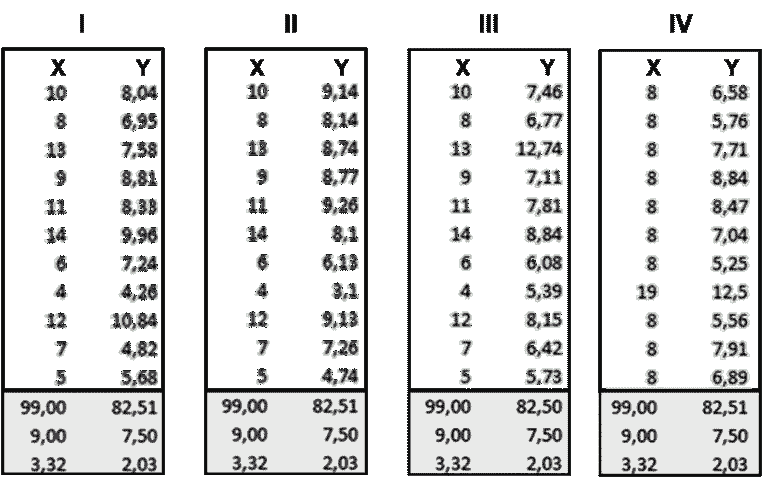

现在，当我们在图表中绘制这些点时，请看下图:

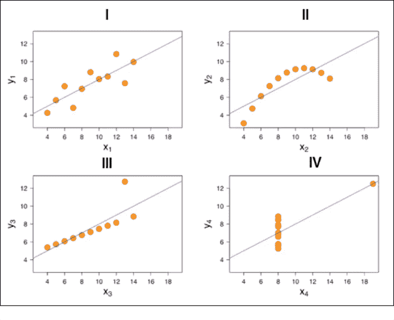

当你真正想象时，你会发现它们看起来是多么的不同。在我们把它可视化之前，我们不可能弄清楚每条线的本质。

# 数据可视化工具简介

以下是在商业智能中广泛使用的五大数据可视化工具:

1.  （舞台上由人扮的）静态画面
2.  Qlikview
3.  多莫
4.  Microsoft power BI
5.  擅长

让我们对它们都有一点了解。

## **画面:**

Tableau 数据可视化工具的基本版是免费的，可以执行常规任务，例如:

*   销售数据分析
*   用户密度监控
*   消费者细分
*   跟踪预算费用
*   对数据进行分类和子分类

## **Excel:**

实际上，你可以用 Excel 做一些非常复杂的事情，从单元格的“热图”到散点图。作为入门级工具，它可以是快速浏览数据或创建供内部使用的可视化效果的好方法，但有限的默认颜色、线条和样式集使其难以创建可用于专业出版物或网站的图形。

## **微软 Power BI:**

Microsoft Power BI 是一种基于云的商业智能和分析服务，可全面概述您最重要的数据。

Power BI 连接到您的所有数据源，通过可扩展的仪表板、交互式报告、嵌入式视觉效果等简化数据评估和共享。

## **Domo:**

Domo 旨在为所有业务用户提供服务，不管他们的技术专长如何，以帮助他们做出更好的业务决策。

Domo 最近推出了业务云，这是世界上第一个运行整个组织的开放式自助服务平台。业务云汇集了用户需要的数据、人员和洞察力，以找到关键业务问题的答案，并做出更快、更明智的决策来提高性能。

## **Qlikview:**

QlikView business discovery platform 是 Qlik 提供的少数可视化分析工具之一。QlikView 无法创建其他工具提供的同样优雅的可视化效果，但该软件的动态模型意味着您可以快速分析多维数据。此外，QlikView 能够处理内存中的数据，而不是磁盘上的数据，从而实现实时操作的 BI 环境(如监控财务交易)。

QlikView 能够处理各种数据源，包括 SAP、Oracle、Salesforce.com 和其他传统数据文件，如 Excel 电子表格。此外，QlikView 可以将这些不同的数据源整合到一个可视化或仪表板中。

但是现在最大的问题是你应该选择哪种工具？嗯，我说用**画面**吧。看看下面就知道为什么了。

# 为什么是 Tableau？

下面是 Tableau 的一些优点或特点，会让你马上开始使用它！

## **画面特点:**

**1。Apt 可视化:**

Tableau 连接到许多不同的数据源，可以可视化比 Power BI 更大的数据集。一旦进入 Tableau，就会有一个仪表板显示用户的基本数据。然后，用户可以通过下载工作表来深入研究数据集。从那里，他们可以应用各种可视化数据。

在 Tableau 中，您可以选择数据并在可视化效果之间动态切换。在 Tableau 中，在可视化效果之间切换更容易。

Tableau 从一开始就将数据可视化，让您立即看到其重要性。Tableau 使用颜色、大小、标签和形状来区分相关性，当您在粒度级别上向下钻取和探索时，为您提供上下文。

**2。发现深度:**

Tableau 的特性为用户提供了在研究数据可视化时回答问题的方法。该解决方案可以将基本趋势显示为预测，使用“如果”查询来假设性地调整数据，并动态地可视化数据的组成部分以进行比较。

**3 .实施:**

Tableau 提供各种实施和咨询服务。对于企业级部署，有一个跨越数周的四步过程；对于较小规模的部署，有快速启动选项，可以在数小时内完成设置。

Tableau 提供各种实施和咨询服务。对于企业级部署，有一个四步流程:

*   **第一阶段**——该阶段包括 IT 规划、架构咨询、安装前检查、服务器安装及验证、安全配置验证。
*   **第 2 阶段** —第 2 阶段涉及数据和数据迁移，包括数据建模、数据挖掘、数据提取、数据源和业务工作流。
*   **第 3 阶段**——第 3 阶段为时两天的课堂培训，包括 Tableau、动手高级指导以及构建和格式化可视化。
*   **第 4 阶段** —该最后阶段帮助公司在其业务中扩展 Tableau 的使用。它包括实施研讨会，讨论诸如评估行动计划和定义可衡量的结果等主题。

**4 .自动化功能:**

Tableau 在创建流程和计算时更加直观。例如，以表格格式创建计算时，公式可以键入一次，作为字段存储，并应用于引用该源的所有行。这使得创建和应用重复流程变得更加容易。Tableau 的灵活性还允许用户创建大多数工具都不具备的自定义公式。

**5。数据源连接器:**

Tableau 提供了数百个本机连接器，几乎可以从任何来源轻松提取、清理和关联数据，而无需创建自定义代码。

Tableau 使用两种不同的方法:Live Connection 和 In-memory，从数据源中提取大型数据集，以进行快速、专门的分析。两者都适应您的本地数据库，并根据大小和容量，通过将相关数据提取到查询中来快速同步数据。它还有一个通用的开放数据库连接(ODBC)连接，用于任何没有提供本机连接器的连接。

# Tableau 产品系列

## **Tableau 桌面:**

这是一个自助式业务分析和数据可视化，任何人都可以使用。它将数据图片转化为优化的查询。使用 tableau desktop，您可以直接连接到数据仓库中的数据，进行实时的最新数据分析。您还可以执行查询，而无需编写任何代码。将您的所有数据从多个来源导入 Tableau 的数据引擎&通过在一个交互式仪表板中组合多个视图来集成在一起。

## **Tableau 服务器:**

它更像是一个企业级的 Tableau 软件。您可以使用 Tableau Desktop 发布仪表板，并使用基于 web 的 Tableau server 在整个组织中共享它们。它通过实时连接利用快速数据库。

## **Tableau Online:**

这是 Tableau server 的托管版本，有助于使商业智能比以前更快更容易。您可以使用 Tableau Desktop 发布 Tableau 仪表板，并与同事共享。

## **画面阅读器:**

这是一个免费的桌面应用程序，使您能够打开和查看可视化是建立在 Tableau 桌面。您可以过滤、向下钻取数据，但不能编辑或执行任何类型的交互。

## **Tableau Public:**

这是一个免费的 Tableau 软件，你可以用它来制作可视化效果，但是你需要将你的工作簿或工作表保存在 Tableau 服务器上，这样任何人都可以查看。

# 了解 Tableau

让我们先来看看 Tableau 支持的数据类型。请参考下图，其中显示了 Tableau 的所有兼容数据类型。

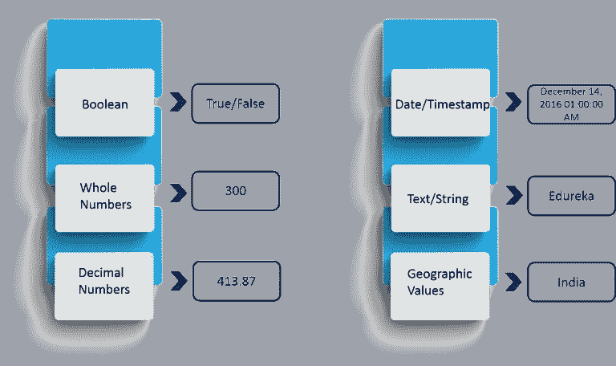

上图通过相应的例子向您展示了 Tableau 支持的数据类型。

现在，我们正在处理的数据类型也可以大致分为两类，它们是:

*   措施
*   规模

请参考下图，了解维度和度量之间的差异。

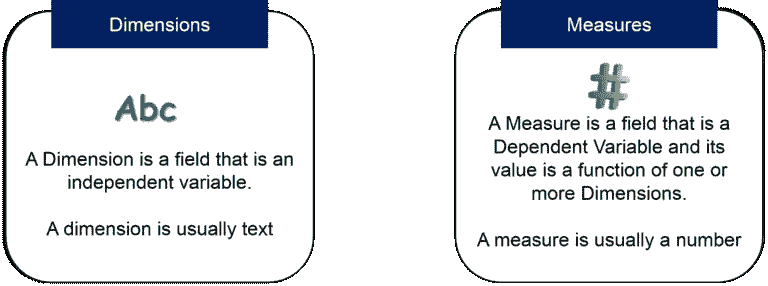

为了让您更容易理解，维度用于添加更多细节来描述您的数据。

# 如何使用 Tableau？

你只需要遵循下面的 3 步咒语来使用 Tableau:

1.  连接到数据
2.  体验用户界面
3.  创建可视化效果

## **连接到数据**

在 Tableau 中要做的第一件事是连接到您的数据。主要有两种类型的连接-

连接到本地文件或连接到服务器。

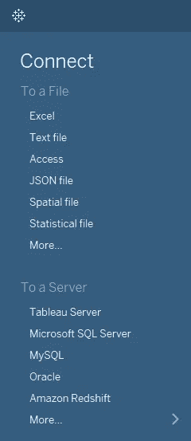

Tableau 可以连接到任何本地文件或数据库，如-

*   擅长
*   文本文件
*   接近
*   统计文件，或
*   其他数据库文件。

本地连接提供了最高的数据处理速度。

Tableau 也可以连接到你的数据服务器。它可以连接到几乎任何类型的数据服务器。以下是 Tableau 可以连接的一些最受欢迎的数据库:

*   Tableau 服务器
*   谷歌分析
*   谷歌大查询
*   Hortonworks Hadoop 配置单元
*   MapR Hadoop 配置单元
*   IBM DB2
*   IBM BigInsights
*   IBM Netezza
*   Microsoft SQL Server
*   Microsoft Analysis Services
*   神谕
*   Oracle Essbase
*   关系型数据库
*   一种数据库系统
*   精力

在 Tableau 上工作时，数据可以实时连接，源数据中的任何更改都将在 Tableau 中自动更新。另一方面，可以将数据提取到 Tableau 存储库中，这样这里所做的任何更改都不会影响原始的源数据。

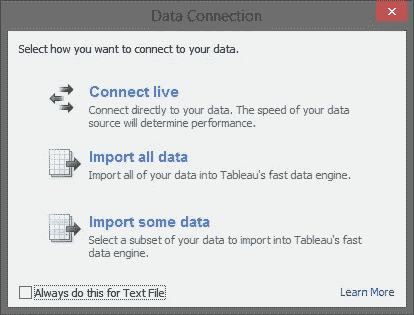

**数据连接**

您还可以将不同的数据集整合在一起，以连接和产生更好的见解。连接数据集有不同的方法。参考下面的图表来理解它们。

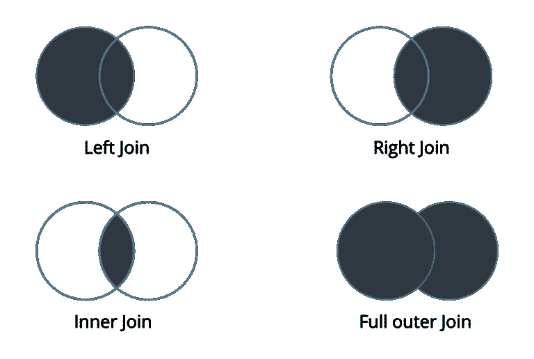

上图显示了 Tableau 中可用的四个数据集连接选项。

## **摆弄 UI**

这是用户界面的外观:

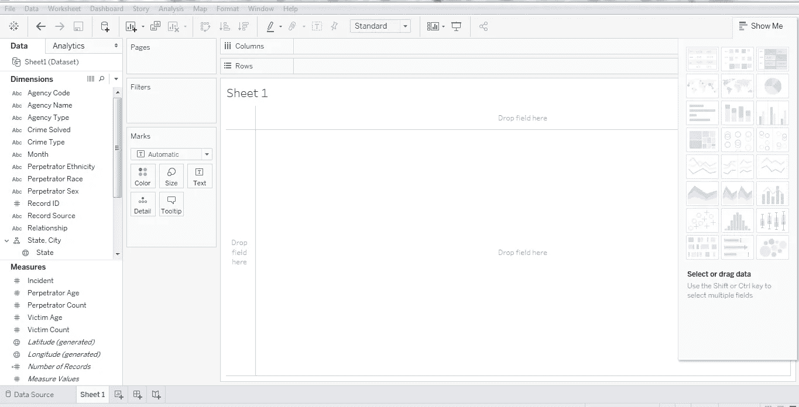

**UI-显示数据**

这是您可以用来创建可视化效果的窗格。您可以创建不同的可视化来表示您的数据集。下图显示了“演示”数据窗格:

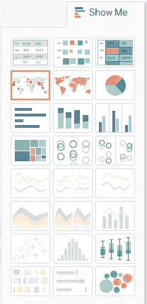

由于数据集不兼容，某些可视化有时可能不可用。

以下是 Tableau 中广泛使用的最流行的可视化效果:

***树形图***

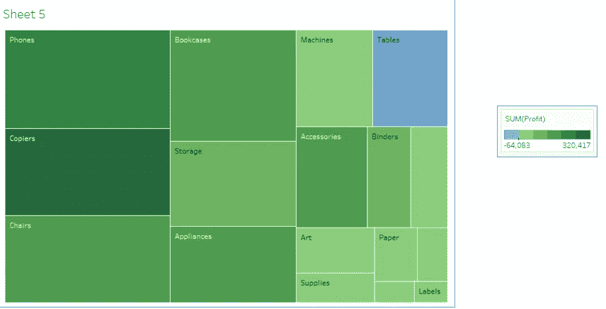

***热图***

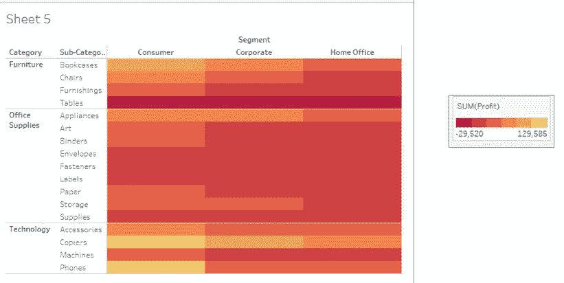

***不同类型的图形***

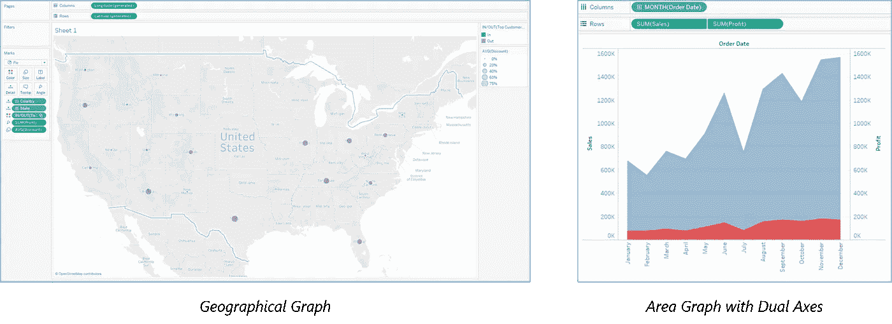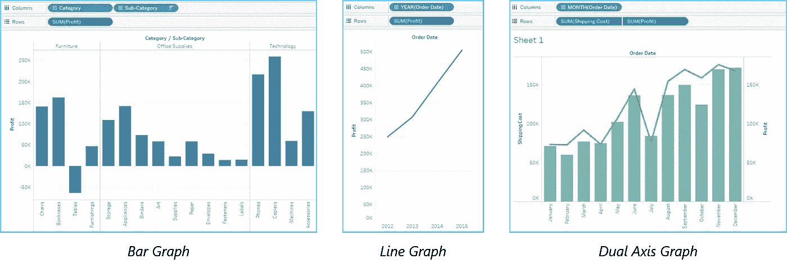

现在让我们探索一下 UI 中更多的可用选项。

**菜单**

Tableau 中的菜单栏包含编辑可视化的各种选项。让我带你一个一个地看。

**文件菜单**

此菜单用于创建新的 Tableau 工作簿，并从本地系统和 Tableau 服务器打开现有工作簿。该菜单中的重要功能包括:

*   **工作簿区域设置**设置报告中使用的语言。
*   **粘贴工作表**将从另一个工作簿复制的工作表粘贴到当前工作簿中。
*   **导出打包工作簿选项**用于创建将与其他用户共享的打包工作簿。

**数据菜单**

此菜单用于创建新的数据源，以获取用于分析和可视化的数据。它还允许您替换或升级现有的数据源。

该菜单中的重要功能如下:

*   **新数据源**查看所有可用的连接类型并从中进行选择。
*   **刷新所有提取**刷新数据表单源。
*   **编辑关系选项**用于定义多个数据源中的字段进行链接。

**工作表菜单**

此菜单用于创建新的工作表以及各种显示功能，如显示标题和题注等。

该菜单中的重要功能如下:

*   **显示汇总**查看工作表中使用的数据汇总，如计数等..
*   **工具提示**悬停在各种数据字段上方时显示工具提示。
*   **运行更新选项**用于更新工作表数据或使用的过滤器。

**仪表盘菜单**

此菜单用于创建一个新的仪表板以及各种显示功能，如显示标题和导出图像等..

该菜单中的重要功能如下:

*   **格式**用于根据仪表板的颜色和部分设置布局。
*   **动作**将仪表板表链接到外部 URL 或其他表。
*   **导出图像选项**用于导出仪表板的图像。

**故事菜单**

此菜单用于创建一个新故事，该故事包含许多带有相关数据的工作表或仪表板。

该菜单中的重要功能如下:

*   **格式**用于根据故事的颜色和章节设置布局。
*   **运行更新**以使用最新的数据表单源更新故事。
*   **导出图像选项**用于导出故事的图像。

**分析菜单**

该菜单用于分析工作表中的数据。Tableau 提供了许多开箱即用的功能，如计算百分比和做预测等..

该菜单中的重要功能如下:

*   **预测**显示基于可用数据的预测。
*   **趋势线**显示 s 系列数据的趋势线。
*   **创建计算字段选项**用于基于现有字段的某种计算创建附加字段。

**地图菜单**

此菜单用于在 Tableau 中构建地图视图。您可以为数据中的字段分配地理角色。

该菜单中的重要功能如下:

*   **地图层**隐藏和显示地图层，如街道名称和国家边界，并添加数据层。
*   **地理编码**创建新的地理角色，并将其分配给数据中的地理字段。

**格式菜单**

此菜单用于应用各种格式选项，以增强所创建仪表板的外观。它提供了诸如边框、颜色、文本对齐等功能..

该菜单中的重要功能如下:

*   **边框**将边框应用于报告中显示的字段。
*   **标题和说明**为报告指定标题和说明。
*   **单元格大小**自定义显示数据的单元格的大小。
*   **工作簿主题**将主题应用到整个工作簿。

**服务器菜单**

服务器菜单用于登录 Tableau 服务器(如果您有访问权限)并发布您的结果以供他人使用。它还用于访问其他人发布的工作簿。

该菜单中的重要功能如下:

*   **发布工作簿**将工作簿发布到服务器供他人使用。
*   **发布数据源**发布工作簿中使用的源数据。
*   **创建用户过滤器**在工作表上创建过滤器，供不同用户访问报告时应用。

## **创建可视化效果**

在上面这个 Tableau 教程中，你已经看到了不同之处。下表告诉您如何从众多可用选项中为数据集选择正确的可视化方式。

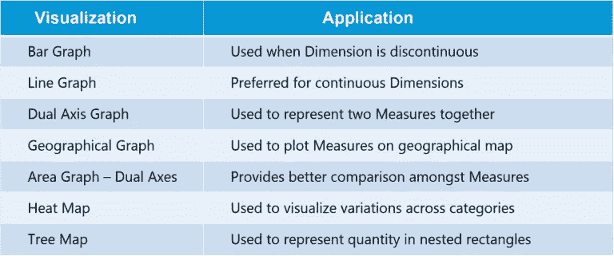

现在，让我们看一个案例研究，了解 Tableau 如何帮助解决现实生活中的业务问题。

# 数据数学

Datamatics 是世界上市值最大的银行的子公司，从事证券和股票投资。它提供所有主要投资领域的服务，如股票、IPO、衍生品、共同基金、保险等。

## **业务需求:**

作为一个极其活跃的行业的一部分，跟踪最微小的市场发展对客户来说是重中之重。他们需要一个能够对不断变化的市场趋势做出快速反应的解决方案。一个能够生成轻松、安全的临时报告的解决方案，能够提供准确的数据可视化。

## **挑战:**

由于无法对市场发展和监管要求做出快速反应，现有系统的周转时间很长，从而延迟了整个决策过程。

受限且不灵活的数据可视化报告导致数据解释不佳。系统在安全方面存在问题，并且高度依赖 IT 支持。缺乏有效的通用性，无法从多个角度进行即席分析。

## **解决方案:**

Datamatics 选择了 Tableau，这是市场上领先的数据可视化 BI 工具。根据收集的需求，为不同级别设计了不同的仪表板和报告。请参考下图，了解 Datamatics 如何利用 Tableau:

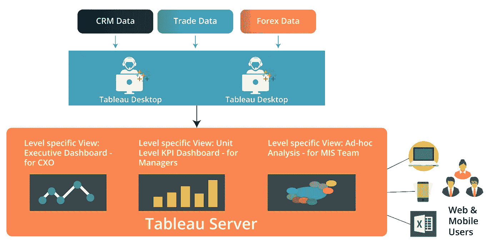

Tableau 与本组织现有的数据库相连接。为组织中不同级别的人员开发了独特且相关的可视化仪表板和报告，以满足不同部门的日常需求。

## **结果:**

*   生成分析报告/管理信息系统所需的时间减少到 1-2 天，并且没有数据丢失。
*   将 excel 和其他基于平面文件的数据与结构化数据有效集成，以创建深入而多样的分析见解。
*   轻松优化的数据可视化选项，可对报告进行切片和切块，以便进行更有意义和全面的查看。
*   基于角色的访问增强了安全功能。
*   最大程度地方便分发和共享报告，即使是在扩大的团队成员之间。
*   最大限度地减少了对 IT 团队或外部供应商生成报告的依赖。
*   简化解决方案与现有系统的安装和集成。
*   客户的总拥有成本促进了交叉销售和追加销售机会的识别。

这就是 Tableau 如何帮助 Datamatics 的，并且一直在帮助世界上许多其他公司。

*这就把我们带到了“Tableau 教程”这篇文章的结尾。我希望这篇文章对你有所帮助，并增加了你的知识价值。*

如果你想查看更多关于人工智能、DevOps、道德黑客等市场最热门技术的文章，那么你可以参考 [Edureka 的官方网站。](https://www.edureka.co/blog/?utm_source=medium&utm_medium=content-link&utm_campaign=tableau-tutorial)

请留意本系列中的其他文章，它们将解释 Tableau 的各个方面。

> 1. [Tableau 教程](/edureka/tableau-tutorial-37d2d6a9684b)
> 
> 2. [Tableau 仪表盘](/edureka/tableau-dashboards-3e19dd713bc7)
> 
> 3. [Tableau 功能](/edureka/tableau-functions-ce794b10e588)
> 
> 4.[表格图表](/edureka/tableau-charts-111758e2ea97)
> 
> 5.[Tableau 中的 LOD 表达式](/edureka/tableau-lod-2f650ca1503d)
> 
> 6. [Tableau 提示和技巧](/edureka/tableau-tips-and-tricks-a18bf8991afc)
> 
> 7.[循序渐进指导学习 Tableau 公共](/edureka/tableau-public-942228327953)
> 
> 8. [Tableau 桌面 vs Tableau 公共 vs Tableau 阅读器](/edureka/tableau-desktop-vs-tableau-public-vs-tableau-reader-fbb2a3aa0bac)
> 
> 9.[如何在 Tableau 中创建和使用参数？](/edureka/parameters-in-tableau-ac552e6b0cde-ac552e6b0cde)
> 
> 10.[Tableau 中的集合是什么，如何创建它们](/edureka/sets-in-tableau-39befe9b7fa1)
> 
> 11.[数据混合](/edureka/tableau-lod-2f650ca1503d)
> 
> 12 .[Tableau 中的圆环图](/edureka/donut-chart-in-tableau-a2e6fadf6534)
> 
> 13.[2020 年你必须准备的 50 大 Tableau 面试问题](/edureka/tableau-interview-questions-and-answers-4f80523527d)
> 
> 14.[如何以及何时使用不同的 Tableau 图表](/edureka/tableau-charts-111758e2ea97)

*原载于 2017 年 5 月 8 日*[*【www.edureka.co】*](https://www.edureka.co/blog/tableau-tutorial/)*。*