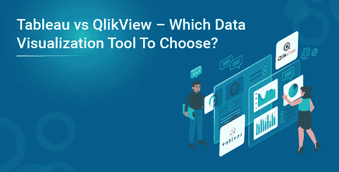
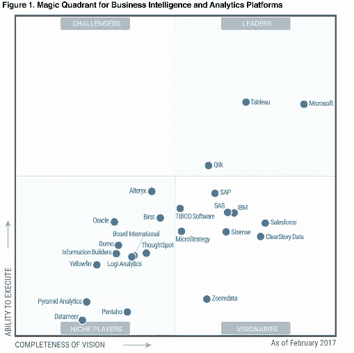
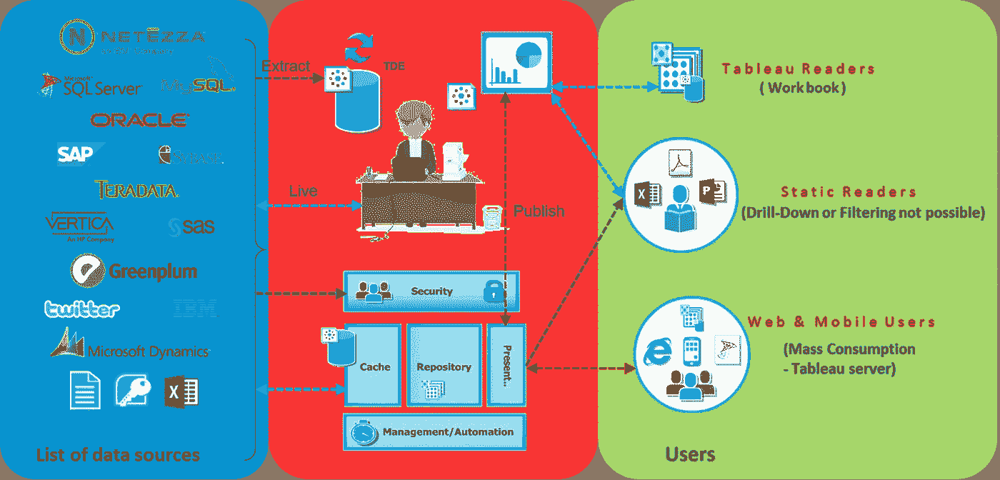
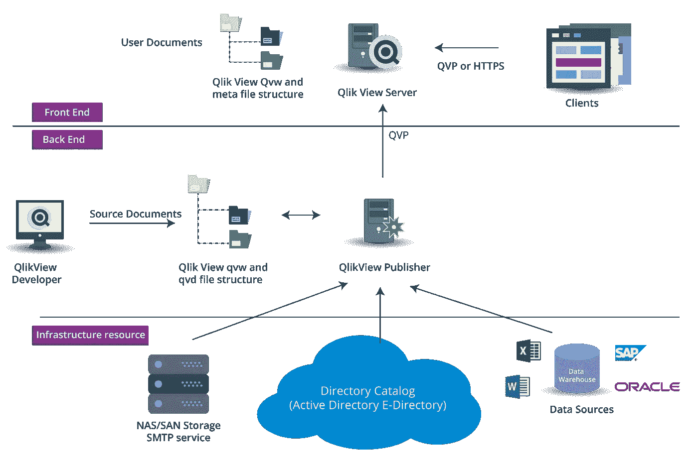
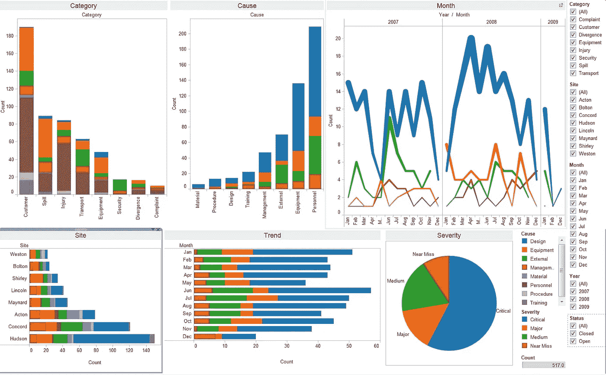
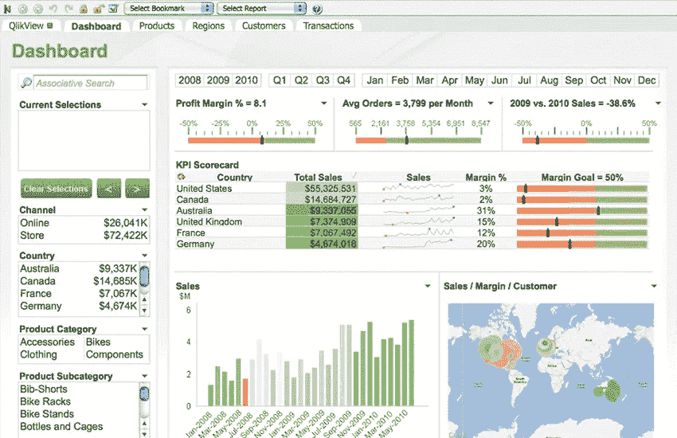

# Tableau 与 QlikView —选择哪种数据可视化工具？

> 原文：<https://medium.com/edureka/tableau-vs-qlikview-which-data-visualization-tool-to-choose-d1e12bf08b2e?source=collection_archive---------5----------------------->

# Tableau 与 QlikView

当我们谈到数据可视化工具时，我们的脑海中肯定会蹦出两个名字——Tableau 和 QlikView。但在两者中选择哪一个工具一直是个两难的问题。这两个工具之间一直有一场无声的战斗——Tableau vs QlikView。这两种工具都在 Gartner 的 BI 工具魔力象限的领导者象限中。请看下图:

为了决定使用哪种工具进行数据可视化，了解这两种工具非常重要。只听口碑，只随多数是不对的。你永远是更好的法官。

所以，我会告诉你所有你需要知道的关于 Tableau 和 QlikView 的信息，你可以在下面的评论区告诉我你认为哪个工具最好，为什么。够公平吗？；)

既然我们在讨论数据可视化工具，那就让我们从 Tableau vs QlikView 博客开始，先了解什么是数据可视化。那么只有我们才能观察这些工具是否符合要求。

# Tableau 与 QlikView:数据可视化

大数据正在蓬勃发展！

为了让大数据对信息的传播和分析方式产生巨大影响，数据可视化发挥了巨大作用。有许多组织发现解释数据很有挑战性，这正是数据可视化的用武之地。这是一个通用术语，描述组织通过将数据转换为可视内容来帮助他们理解数据的重要性。有许多重要的元素，包括在基于文本的数据中经常观察不到的模式和趋势，但是可以通过数据可视化很容易地注意到。它还有助于以热图和丰富的图形表示形式来消化信息。

图片比文字更能传达意思。类似地，数据可视化提供了对丰富的可视元素的访问，这些可视元素提高了所传达信息的质量并易于理解。数据可视化的另一个重要好处是它的使用阶段。在这个阶段，经过分析的数据从数据科学家传递给业务利益相关者。需要以有意义的方式向后一组人展示这些见解，以便他们能够理解这些见解的影响。这就是数据可视化派上用场的地方。

因此，非常重要的一点是，要了解哪种工具是最好的，可以为我们提供更好的解决方案。

让我们在 Tableau vs QlikView 博客中继续讨论，并将这些工具与以下参数进行比较:

# 1.易用性

**QlikView** :易于使用，探索隐藏趋势。要搜索，只需在搜索框中以任何顺序键入任何单词，即可获得即时和关联的结果，它将显示您的数据之间的联系和关系。由于菜单驱动的属性，用户很难设计自己的视图。

**Tableau** :它的界面很简单，没有在一个页面上填充太多的功能，有一个拖放界面。它不提供跨所有数据搜索内容的功能。用户可以使用各种对象轻松创建自己的视图，这很容易，因为设计良好的 GUI 界面。

# 2.易于学习

**QlikView**:QlikView 积极利用社区和资源帮助您以最佳方式学习该软件。

**Tableau** :也有积极参与的社区和资源。这是一个简单的拖放应用程序，非常容易学习。

# 3.费用

QlikView :其个人版是免费的，有文档共享的限制。每个命名用户许可证的价格为 1，350 美元，并发用户的价格为 15，000 美元。服务器许可费为每台服务器 35，000 美元。PDF 分发服务每台服务器增加 21，000 美元；SAP NetWeaver 连接器 22，500 美元。
如果有大量并发用户，可能需要升级 RAM。

**Tableau** :名为“Public”的免费桌面版，让所有人都可以下载数据。私人版本的固定费用为 999 美元或 1999 美元，取决于数据访问。Tableau 服务器——坊间证据显示，每个服务器用户 1000 美元，最少 10 个用户，外加维护费用

# 4.与其他工具/语言或数据库的连接

**QlikView** :它集成了非常广泛的数据源，如 Amazon Vectorwise、EC2 和 Redshift、Cloudera Hadoop 和 Impala、CSV、DatStax、Epicor Scala、EMC Green Plum、Hortonworks Hadoop、HP Vertica、IBM DB2、IBM Netezza、Infor Lawson、Informatica Powercenter、MicroStrategy、MS SQL Server、My SQL、ODBC、Par Accel、Sage 500、Salesforce、SAP、SAP Hana、SAP Hana 它可以使用 API 集成与 R 连接。它可以连接大数据。

**Tableau** :它可以集成更广泛的数据源，包括电子表格、CSV、SQL 数据库、Salesforce、Cloudera Hadoop、Firebird、Google Analytics、Google BigQuery、Hortonworks Hadoop、HP Vertica、MS SQL Server、MySQL、OData、Oracle、Pivotal Greenplum、PostgreSQL、Salesforce、Teradata 和 Windows Azure Marketplace。它可以与 R 连接，从而增强工具的分析能力。它还可以连接大数据源。

# 5.部署流程和系统要求

**QlikView** : QlikView 拥有自己的数据仓库，添加脚本功能为其增加了更多价值。我们可以在 QlikView 部署中使用多层。QlikView 易于部署和配置，安装后几分钟内即可开始生成令人惊叹的报告。该产品不使用立方体；因此，将所有表格和图表加载到内存中，以支持交互式查询和创建报告，这是其他产品中没有的技术。它可以在 32 位和 64 位上开发。它的关联技术使得数据建模更加容易。

**Tableau** :它没有自己的数据仓库。它不能在与数据集连接时创建层。它更容易部署，因为它需要更多的结构化数据。

# 6.洞察力生成

**QlikView** :关联技术使其更加强大，有助于轻松读取变量之间的关联。这个特性有时可以帮助企业理解数据点之间隐藏关系。

**Tableau** :讲故事功能帮助您使用可用的数据点创建演示文稿。

# 7.可视化对象

**QlikView** :它有很好的可视化信息选项。它装载了各种对象。我们可以很容易地利用这些对象的属性来定制它。我们还可以通过自定义属性来创建自定义图表，如瀑布图、箱线图、地理空间图。插入对象时，它具有与文档主题相似的布局和格式选项。这里，我们需要处理格式选项，使其在视觉上更具吸引力。

**Tableau** :它有很好的可视化对象，有更好的格式选项。它有很好的地理空间可视化的可视化。它有许多可视化数据的选项。视觉效果总是最好的。

# 8.流动性

**QlikView** : QlikView 不依赖于设备，我们可以从任何地方轻松访问它。与传统方法相比，决策变得更快。

**Tableau** :也可在所有设备上使用，并可通过互联网访问。你可以在笔记本电脑、平板电脑或手机上使用 Tableau。

# 9.安全性

**QlikView** :它具有各种安全选项，如脚本、文档、部分访问和用户验证的安全性。使用 QlikView Desktop 直接访问 QlikView 文档始终受 Windows NTFS 文件安全性控制。对基于 web 的 QlikView 企业管理控制台的访问权限仅限于特定本地 Windows 组成员的 Windows 用户。

**Tableau** : Tableau 有很好的安全特性，由 Tableau 服务器高度处理。Tableau 是一个现代企业分析平台，通过治理实现大规模自助分析。安全性是数据和内容治理战略的第一个也是最重要的部分。Tableau Server 提供了全面的功能和深度集成来解决企业安全的所有方面。Tableau 帮助组织向所有用户推广可信数据源，以便使用正确的数据快速做出正确的决策。

# 10.可量测性

您可能听说过 Tableau 比 QlikView 提供更好的可扩展性，或者 QlikView 比 Tableau 的扩展速度更快。事实是，两家厂商都可以处理大量的数据。事实上，大多数组织不会产生这两种解决方案都无法处理的大量数据。

# 11.体系结构

现在，让我们来看看这两种工具的架构。这将帮助您确定这两种工具的灵活性。

**Tableau vs QlikView: Tableau 架构**

Tableau 建筑主要集中在三个阶段:整合，分析和可视化。

**Tableau vs QlikView: QlikView 架构**

QlikView 架构基于三个部分:前端、后端和资源。

# 12.基本制图

让我们看看这些工具是如何实现可视化的:

**画面:**

**QlikView:**

QlikView 仪表盘如下所示:

您应该知道的最重要的一点是，QlikView 用于数据发现，而不仅仅是可视化数据。相反，Tableau 是一个非常强大的可视化工具。现在，我已经提到了参数，并比较了这两种工具。非常明确地说，您可以将 Tableau & QlikView 用于不同的目的。

Tableau vs QlikView 博客到此结束。我相信通过以上比较，您将能够确定哪种工具最适合您的需求。如果你想查看更多关于人工智能、DevOps、道德黑客等市场最热门技术的文章，那么你可以参考 [Edureka 的官方网站。](https://www.edureka.co/blog/?utm_source=medium&utm_medium=content-link&utm_campaign=tableau-vs-qlikview)

请留意这个系列中的其他文章和视频，它们会帮助你理解 Tableau 的各种概念。

> *1。* [*Tableau 教程*](/edureka/tableau-tutorial-37d2d6a9684b)
> 
> *2。* [*什么是画面？*](/edureka/what-is-tableau-1d9f4c641601)
> 
> *3。* [*Tableau 功能*](/edureka/tableau-functions-ce794b10e588)
> 
> *4。* [*画面仪表盘*](/edureka/tableau-dashboards-3e19dd713bc7)
> 
> *5。*[*Tableau 中的 LOD 表达式*](/edureka/tableau-lod-2f650ca1503d)
> 
> *6。* [*画面技巧*](/edureka/tableau-tips-and-tricks-a18bf8991afc)
> 
> *7。* [*循序渐进指导学习画面公*](/edureka/tableau-public-942228327953)
> 
> 8。 [*Tableau 桌面 vs Tableau 公共 vs Tableau 阅读器*](/edureka/tableau-desktop-vs-tableau-public-vs-tableau-reader-fbb2a3aa0bac)
> 
> *9。* [*如何在 Tableau 中创建和使用参数？*](/edureka/parameters-in-tableau-ac552e6b0cde-ac552e6b0cde)
> 
> *10。* [*Tableau 图表*](/edureka/tableau-charts-111758e2ea97)
> 
> *11。* [*数据混合*](/edureka/tableau-lod-2f650ca1503d)
> 
> *12。* [*圆环图中的 Tableau*](/edureka/donut-chart-in-tableau-a2e6fadf6534)
> 
> *13。*[*2020 年你必须准备的 50 大 Tableau 面试题*](/edureka/tableau-interview-questions-and-answers-4f80523527d)
> 
> *14。* [*如何以及何时使用不同的 Tableau 图表*](/edureka/tableau-charts-111758e2ea97)

*如果您希望掌握 Tableau 或 QlikView，Edureka 有一个关于* [***Tableau 认证***](https://www.edureka.co/tableau-certification-training) *或* [***QlikView 培训&认证***](https://www.edureka.co/qlikview) *的策划课程，该课程深入涵盖了数据可视化的各种概念。它提供 24*7 支持，在整个学习期间为您提供指导。新的批次即将开始。*

*有问题要问我们吗？请在评论区提到它，我们会尽快回复您。*

*原载于 2017 年 6 月 12 日 https://www.edureka.co**。*