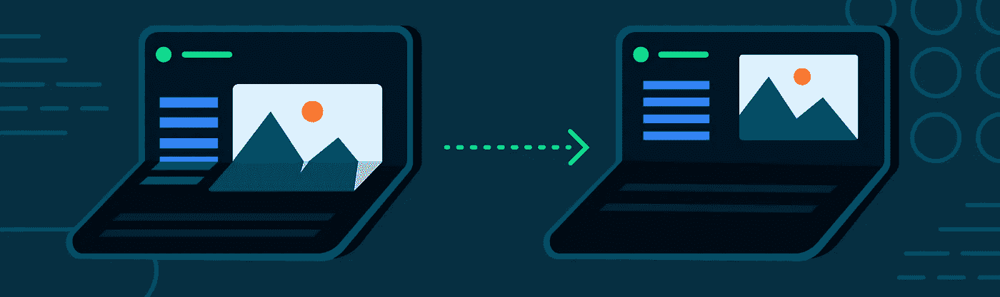
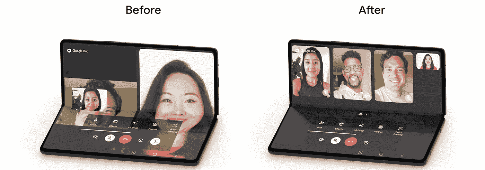
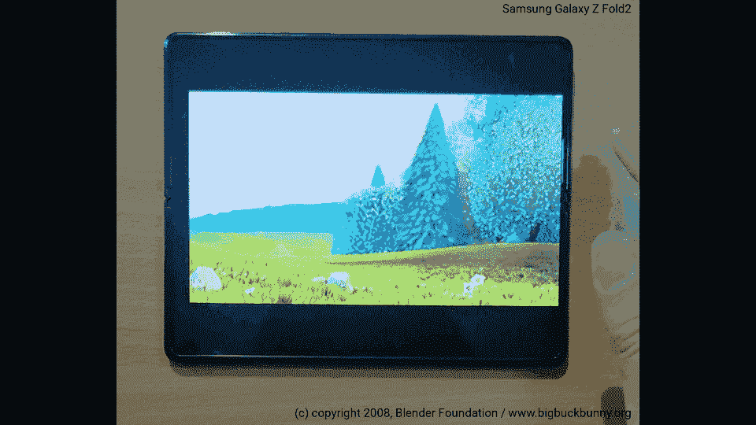

# 可折叠设备上的桌面模式

> 原文：<https://medium.com/androiddevelopers/tabletop-mode-on-foldable-devices-d091b3c500b1?source=collection_archive---------4----------------------->

*展现您的视频播放器体验*

可折叠设备为用户提供了用手机做更多事情的可能性，包括像*桌面模式、*这样的创新，手机放在一个表面上，铰链处于水平位置，折叠屏幕处于部分打开状态。

当你想不用手拿着手机使用时，桌面模式很方便。它非常适合观看媒体、进行视频通话、拍照甚至玩游戏。

一个很好的例子是[谷歌双人组](https://developer.android.com/stories/apps/google-duo)对他们的应用程序进行了优化，使其在平板电脑和可折叠设备上运行良好。

*Duo app before and after optimization*

在这篇博文中，你将学到一种简单而有效的方法来调整你的应用在可折叠设备上运行时的布局。

该示例是一个简单的媒体播放器，它自动调整其大小以避免在图像中间出现折叠，并在屏幕完全平坦时将其传输控制的位置从嵌入视频切换到设备折叠时的单独面板，如下面的视频所示:

Tabletop mode example on Samsung Galaxy Z Fold2 5G

# 佐料

示例应用程序使用了 [Exoplayer](https://github.com/google/ExoPlayer) ，一个流行的 Android 开源媒体播放库，以及这些 Jetpack 组件:

*   [MotionLayout](https://developer.android.com/reference/androidx/constraintlayout/motion/widget/MotionLayout) ，是 [ConstraintLayout](https://developer.android.com/training/constraint-layout) 的子类。它将父类的灵活性与视图在从一种姿态转换到另一种姿态时的平滑动画相结合。
*   [ReactiveGuide](https://developer.android.com/reference/androidx/constraintlayout/widget/ReactiveGuide) ，一个不可见的组件，当 SharedValue 改变时，它会自动定位自己。它与一个[指南](https://developer.android.com/reference/androidx/constraintlayout/widget/Guideline)助手一起工作。
*   [WindowManager](https://developer.android.com/jetpack/androidx/releases/window) ，一个帮助应用开发者支持新设备外形的库，为不同的窗口特性提供了一个通用的 API 表面。

要使用这些库，您必须将 [Google Maven 资源库](https://android.devsite.corp.google.com/studio/build/dependencies?skip_cache=true#google-maven)添加到您的项目中，并声明这些依赖关系:

# 布局

考虑视频播放器活动的布局，根元素是一个包含三个子视图的 [MotionLayout](https://developer.android.com/reference/androidx/constraintlayout/motion/widget/MotionLayout) 。

Exoplayer 套件中有两个视图，允许您为[播放器视图](https://exoplayer.dev/doc/reference/com/google/android/exoplayer2/ui/PlayerView.html)(显示媒体的表面)和[播放器控制视图](https://exoplayer.dev/doc/reference/com/google/android/exoplayer2/ui/PlayerControlView.html)(播放控件的容器)指定不同的布局。

第三个视图是一个[反应向导](https://android.devsite.corp.google.com/reference/androidx/constraintlayout/widget/ReactiveGuide)。它被放置在另外两个视图之间，作为[指引线](https://android.devsite.corp.google.com/reference/androidx/constraintlayout/widget/Guideline)，视图之间的分隔符。

主[播放器视图](https://exoplayer.dev/doc/reference/com/google/android/exoplayer2/ui/PlayerView.html)被约束为始终位于反应向导的顶部。这样，当您将参考线从屏幕底部移动到折叠位置时，就会发生布局转换。

您可能还希望将控件视图约束为总是位于 ReactiveGuide 底部的。这样，当屏幕平坦时，控制视图是隐藏的，但是当屏幕部分打开时，它出现在电话的底部。

注意第 28 行的属性[***layout _ constraint guide _ end***](https://developer.android.com/reference/androidx/constraintlayout/widget/ConstraintLayout.LayoutParams#guideEnd)。这是移动基准线时需要更改的值。由于 ReactiveGuide 是水平的，因此该属性表示从基准线到父项底部的距离。

# 让你的应用程序能够识别文件夹

现在最重要的部分:如何知道手机何时处于桌面模式，如何获取折叠的位置？

初始化后，WindowManager 库允许您通过收集由函数[windowinforpository . WindowLayoutInfo()](https://developer.android.com/reference/androidx/window/layout/WindowInfoRepository#windowLayoutInfo())公开的流< [WindowLayoutInfo](https://developer.android.com/reference/androidx/window/layout/WindowLayoutInfo) >来监听布局变化:

如果你想知道更多关于如何初始化和发布一个 Exoplayer 实例的信息，请看 [Exoplayer codelab](https://developer.android.com/codelabs/exoplayer-intro) 。

每当你获得一个新的布局信息时，你可以查询显示特性并检查设备在当前显示中是否有折叠或铰链:

请注意，如果您不想使用 Kotlin 流，从 [1.0.0-alpha07 版本](https://developer.android.com/jetpack/androidx/releases/window#1.0.0-alpha07)开始，您可以使用 ***window-java*** 工件，它公开 java 友好的 API 来注册和取消注册回调，或者使用***window-rxjava 2***和***window-rx Java 3***工件来注册 rx Java 适配的 API。

如果方向是水平的并且[folding feature . is separating()](https://developer.android.com/reference/androidx/window/layout/FoldingFeature#isSeparating())返回 true，则设备可以在桌面模式下使用。

在这种情况下，您可以计算折叠的相对位置，并将 ReactiveGuide 移动到该位置，否则将其移动到 0(屏幕底部)。

当你以这种方式调用函数 fire new value*时，库改变了[***layout _ constraint guide _ end***](https://developer.android.com/reference/androidx/constraintlayout/widget/ConstraintLayout.LayoutParams#guideEnd)*属性。当设备是平的时，整个屏幕应该保留给主播放器观看。**

**最后一个问题是:当设备折叠时，您应该将 ReactiveGuide 移动到哪里？**

**[***folding feature***](https://developer.android.com/reference/androidx/window/layout/FoldingFeature)对象公开字段[***bounds()***](https://developer.android.com/reference/androidx/window/layout/FoldingFeature#bounds())以在窗口坐标空间内检索特征的外接矩形。**

**如果您正在处理水平特征，大多数情况下，边界将由位于屏幕垂直中心的矩形表示，与屏幕一样宽，高度等于铰链的大小(在可折叠屏幕的情况下，该值可以是 0，或者可以等于双屏设备中屏幕之间的距离)。**

**如果您的应用程序处于全屏模式，您可以将 PlayerView 约束在***folding features . bounds . top***的顶部，将 ControlView 约束在***folding features . bounds . bottom***的底部。**

**在其他情况下(非全屏)，你需要考虑导航栏和其他 UI 组件在屏幕上占据的空间。
为了移动引导线，你必须指定它离父对象底部的距离。计算反应导向正确位置的函数的一个可能实现如下:**

# **摘要**

**在本文中，您了解了如何通过实现支持桌面模式的灵活布局来改善可折叠设备上的媒体应用程序的用户体验。**

**请继续关注关于不同外形规格的开发指南的下一篇文章！**

# **额外资源**

*   **[Exoplayer codelab](https://developer.android.com/codelabs/exoplayer-intro)**
*   **[桌面演示](https://www.youtube.com/watch?v=jIBNhxyciLQ)**
*   **[可折叠设计](https://developer.android.com/training/constraint-layout/foldables)**
*   **[为可折叠文件夹构建应用](https://developer.android.com/guide/topics/ui/foldables)**
*   **[Jetpack 窗口管理器](https://github.com/androidx/androidx/tree/androidx-main/window)**
*   **[运动布局](https://developer.android.com/training/constraint-layout/motionlayout)**

**[1]桌面模式在三星 Galaxy Z 系列可折叠智能手机上也称为 Flex 模式。**