# 利用 PyTorch 迁移学习解决多类图像分类问题

> 原文：<https://medium.com/walmartglobaltech/tackling-multi-class-image-classification-problem-with-transfer-learning-using-pytorch-50150b215fb6?source=collection_archive---------1----------------------->

图像分类是一个 [*监督学习*](https://towardsdatascience.com/a-brief-introduction-to-supervised-learning-54a3e3932590) 问题，可以通过训练模型识别图像来解决。这种分类的目的是识别和数字分析图像的特征。令人着迷的是，机器可以对甚至人类都难以分类的图像进行分类。图像分类在零售、医疗保健、安全、汽车工业等几乎每个领域都有应用。

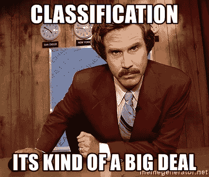

[Source](https://memegenerator.net/instance/68648391/ron-burgundy-classification-its-kind-of-a-big-deal)

在这里，我们将尝试解决一个图像分类问题，并推广解决类似问题的方法。由于我们的数据都是图像，解决这个问题的最好方法是建立一个卷积神经网络( [*CNN*](https://towardsdatascience.com/covolutional-neural-network-cb0883dd6529) )。我们将在这里使用预先训练好的 [*ResNet34*](https://towardsdatascience.com/understanding-and-visualizing-resnets-442284831be8) 模型和 PyTorch 库开发我们自己的 CNN，py torch 库是一个非常流行的构建深度学习模型的库。

我选择了取自 Kaggle 网站的 [*英特尔图像分类数据集*](https://www.kaggle.com/puneet6060/intel-image-classification) 。你可以在 [*Kaggle*](https://www.kaggle.com/datasets) *上找到很多这样有趣的数据集。*

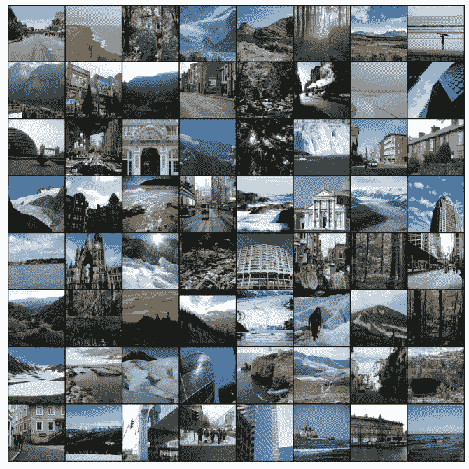

在开始解决这个问题之前，看看我们的数据集总是一个好主意。只需扫一眼，我们就可能在数据集中发现许多令人兴奋的发现或异常现象。这个数据集有 25000 个不同的标记图像，包括建筑物、森林、冰川、山脉、海洋和街道。我们将图像分为这 6 个不同的类别。大多数图像的大小为 150 X 150 像素。

# 初始设置

让我们从导入所有必需的库开始。

*Opendatasets* 是一个开源库，可以轻松地将在线数据集保存到您的笔记本上。

```
od.download('https://www.kaggle.com/puneet6060/intel-image-classification')
```

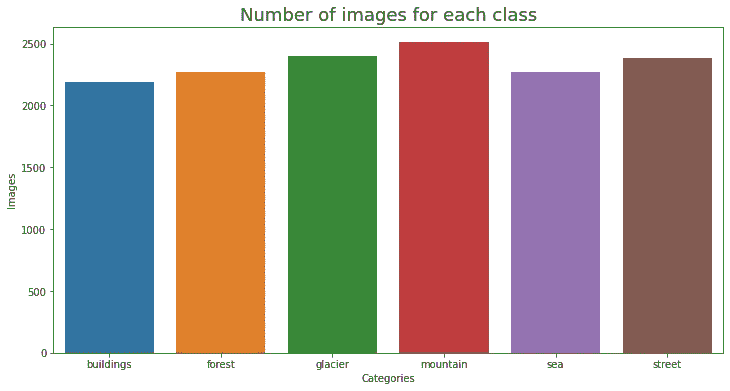

Distribution of Images

这是我们的图像在所有类别中的分布。所有图像都有自己的类别目录，并且图像的数量分布不均匀。

现在，我们需要加载我们的数据，并对图像数据进行一些转换，使其对训练我们的模型更有用。你会在 PyTorch 中发现许多图像[](https://pytorch.org/docs/stable/torchvision/transforms.html)*数据转换，但是我们将使用随机裁剪和随机水平翻转来很好地处理这个数据集。我们将所有图像的大小调整为 128 X 128 像素，并使用 [*imagenet 预训练的 stats*](https://arthurdouillard.com/post/normalization/) 对所有像素值进行归一化。我建议我们分批加载 128 个图像，以便在可用的计算能力下完成训练。*

*完成后，我们已经通过 Pytorch 数据加载器成功加载了我们的训练和验证数据，现在每个图像都将是一组使用 imagenet 预训练统计数据标准化的像素值。*

# *GPU 实用程序*

*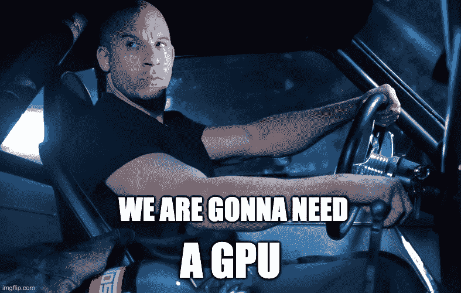*

*[Source](https://imgflip.com/i/4xck2o?herp=1612892899820)*

*卷积神经网络需要大量的计算能力来训练，因为所有图像的每个像素值都有大量的权重计算。如果我们用 CPU 工作，可能需要几个小时或几天来训练模型。但值得庆幸的是，在线平台如 [*Kaggle*](https://www.kaggle.com/) 或 [*Google Colab*](https://colab.research.google.com/) 为我们提供了免费的 [*GPU*](https://blogs.nvidia.com/blog/2009/12/16/whats-the-difference-between-a-cpu-and-a-gpu/) 设置，这大大提高了我们的训练时间。让我们创建一些有用的代码来将我们的数据推送到 GPU。*

*我们现在已经创建了一个 Python 类 DeviceLoader，它将检查 GPU 在环境中是否可用，并将数据移动到 GPU。*

# *训练我们的模型*

*现在我们都准备好开始为我们的模型训练编码了。我们将使用一个预先训练好的模型 [ResNet34](https://towardsdatascience.com/understanding-and-visualizing-resnets-442284831be8) ，该模型已经对具有 1000 个类别的图像数据进行了训练。为什么要用预先训练好的 CNN 模型？CNN 的初始层仅训练低级和中级特征，例如边缘、线条、边界等。各种图像都包含这些特征。预先训练的 CNN 的这些特征使得它非常可重复使用。因此，使用这种已经在大量数据上训练过的预训练模型是有意义的，许多公司为此投入了大量资金。这就是所谓的迁移学习。*

*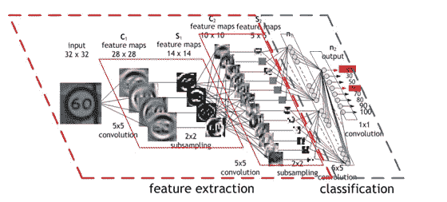*

*[Source](https://developer.nvidia.com/discover/convolutional-neural-network): How a CNN learns*

*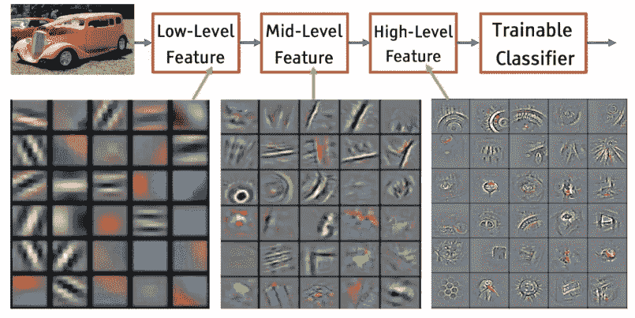*

*[Source](/analytics-vidhya/deep-learning-visualization-and-interpretation-of-neural-networks-2f3f82f501c5): Layer visualization*

*要使用预训练模型，我们需要保持所有之前的层不变，只根据我们的用例更改最后一层。ResNet34 已经在 1000 个图像类上进行了训练。我们的问题只有 6 个不同的图像类别(建筑物、森林、冰川、山脉、海洋和街道)。因此，我们将把 ResNet34 的最后一层修改为这 6 个类。迁移学习节省了工程师大量的培训时间和开发精力。*

*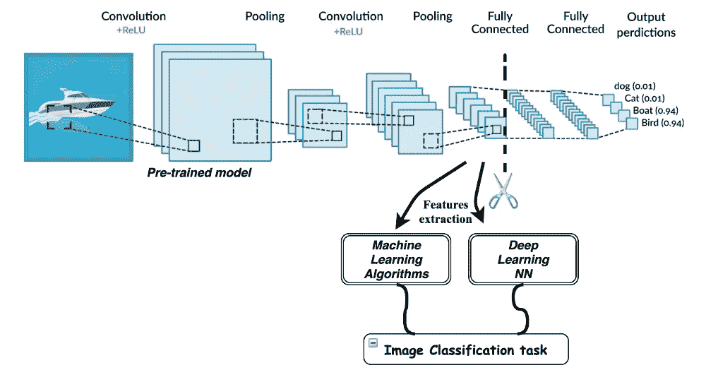*

*[Source](https://laptrinhx.com/transfer-learning-with-deep-learning-machine-learning-techniques-1499149008/): Transfer Learning*

*Pytorch 有一个`**nn.Module**`类，可以继承它来创建我们的模型类。我们将编写一些可重用的类`**ImageClassificationBase**` ，它由一些可用于任何模型的辅助函数组成。然后我们将创建我们的模型类`**MyModel**` ，它继承了 ImageClassificationBase 类，我们将在那里应用 ResNet34 的迁移学习。*

*我们模型的最后一层现在已经从最初的 1000 个类变成了我们的 6 个类。如果最后需要的话，我们可以在模型中添加更多的层，但是这里一个线性层就可以了。*

```
*self.network.fc = nn.Linear(self.network.fc.in_features, num_classes)*
```

*万岁！我们现在已经使用迁移学习成功地创建了我们的 CNN 模型。此外，我们需要创建一个训练循环来评估我们的模型，改变超参数，如学习率、时期、设置优化器等。用于培训和验证。我们将在我们的拟合函数中添加一些正则化技术，如[*【单周期学习率策略】*](https://sgugger.github.io/the-1cycle-policy.html)*[*权重衰减*](https://towardsdatascience.com/this-thing-called-weight-decay-a7cd4bcfccab)*[*渐变裁剪*](https://towardsdatascience.com/what-is-gradient-clipping-b8e815cdfb48) 来改进我们的模型训练。***

**有了这个，我们就为训练做好了一切准备。现在，我们只需要应用我们使用不同的超参数开发的函数，并将我们的模型训练到最佳状态。在使用不同的超参数进行几次迭代之后，该模型在 10-15 分钟内对验证数据进行训练，达到 90%以上的准确度。这就是将迁移学习应用到您的模型并在 GPU 上处理它以快速达到良好精度的优势。这种方法对于不允许长时间等待培训的行业应用来说非常方便。**

**让我们来看看我们的准确率、学习率以及用于训练和验证集的时期数的损失。数据可视化总是有助于更有效地理解数据。**

**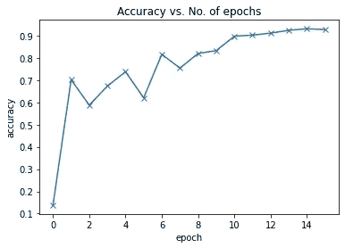**

**Rise in Accuracy**

**有趣的是，由于随机权重的原因，准确度在开始时非常低，但仅在第二个时期就上升到 70%。在变平之前，精确度最终提高到 92%。**

**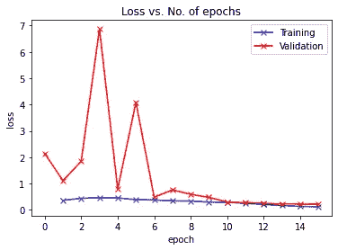**

**验证损失在开始时表现出一些起伏，但接近结束时，它开始与训练损失合并。如果它偏离训练损失，那么这将暗示模型的 [*过度拟合*](https://elitedatascience.com/overfitting-in-machine-learning) 。**

**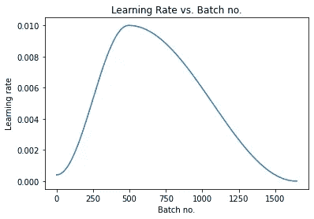**

**我们使用的正则化技术，即 [O *ne 周期学习率策略*](https://sgugger.github.io/the-1cycle-policy.html) 将初始批次数据的学习率提高到某一点，然后降低后续批次的学习率。**

**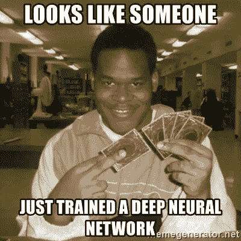**

**[Source](https://memegenerator.net/instance/63454089/you-just-activated-my-trap-card-looks-like-someone-just-trained-a-deep-neural-network)**

**还有最后一件事。我们需要看看我们的模型如何处理未标记的推理数据。我们在这里使用的 Kaggle 数据集已经有一个包含未标记图像的文件夹。我们来预测一下！我们将从推理集中随机选择图像，并将它们用于我们的预测。**

**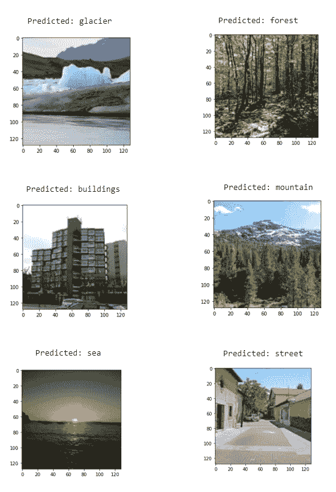**

**我们的模型能够从推理集中预测所有类别的图像。**

**恭喜你！我们现在已经使用 PyTorch 库的迁移学习成功构建了一个 CNN 模型。使用这种方法，任何多类图像分类问题都可以在短时间内以良好的精度得到解决。**