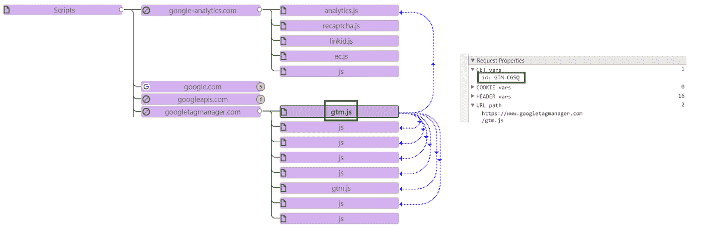
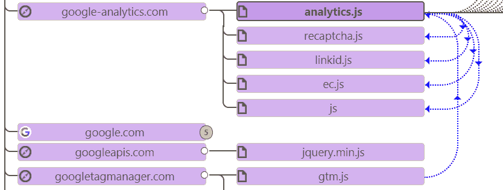
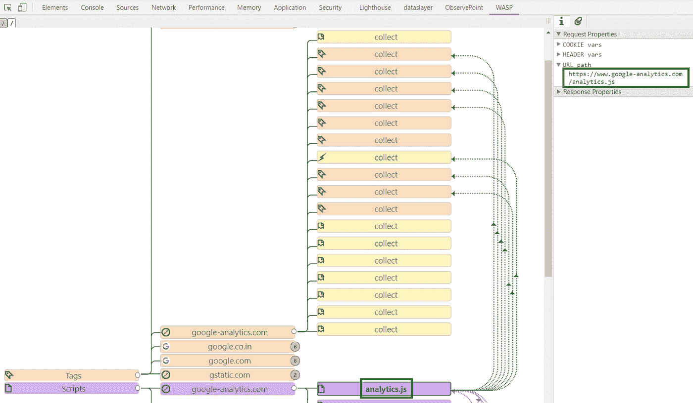
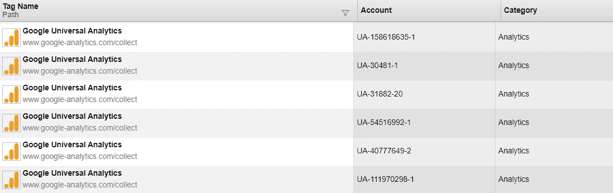
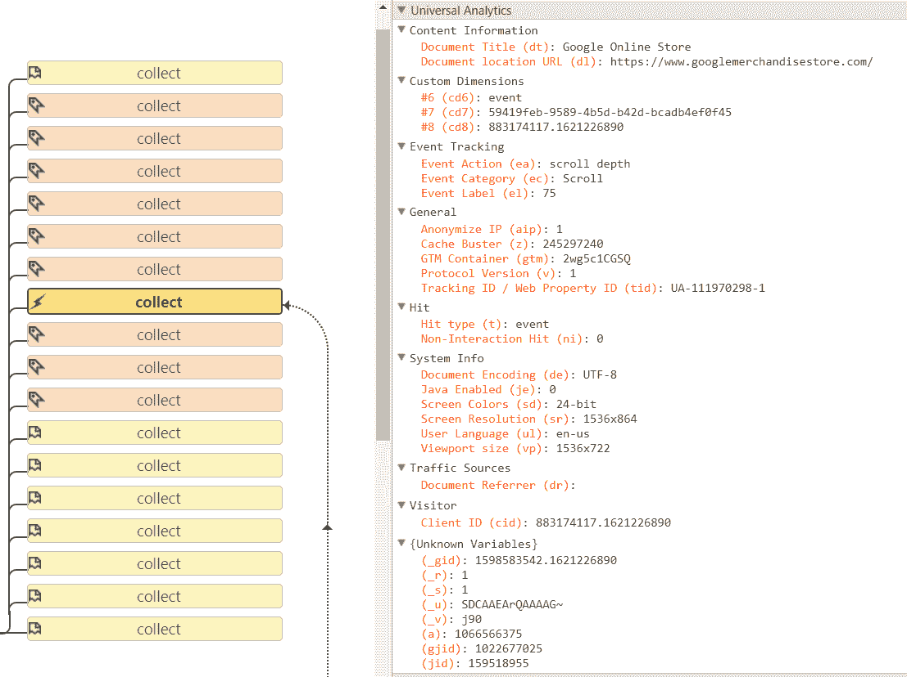
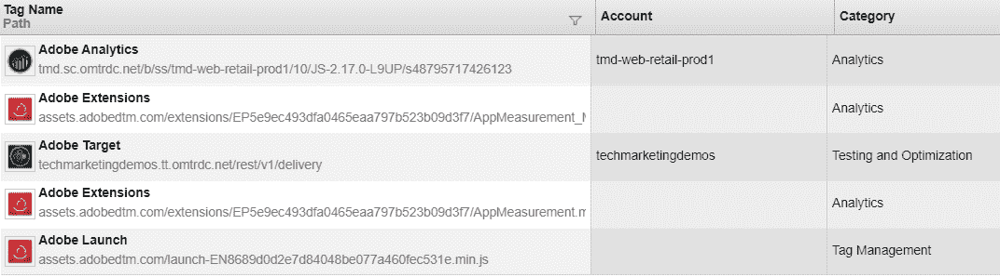
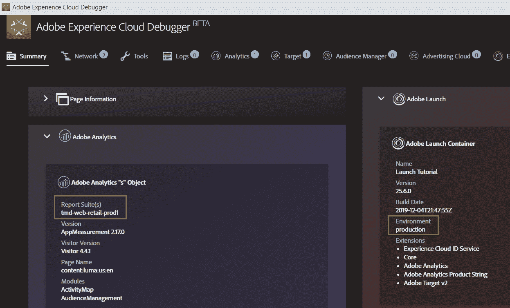
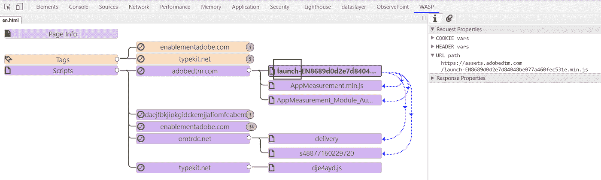
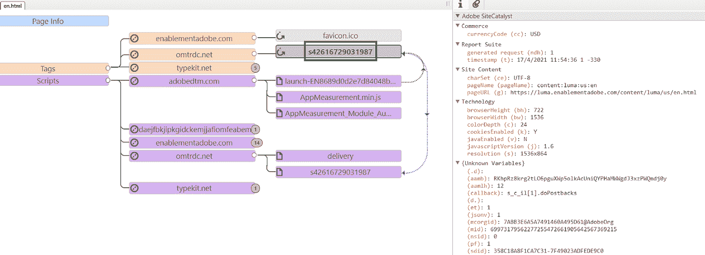
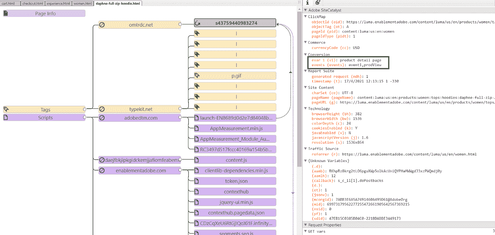

# 标签管理系统:幕后

> 原文：<https://medium.com/globant/tag-management-systems-behind-the-scenes-4de46e84259?source=collection_archive---------3----------------------->

## 深入了解 TMS 架构(标签和触发器)，将有助于在现实生活中执行简单的设置调试，并了解 TMS 运行时后台到底发生了什么。

Photo by [Josh Calabrese](https://unsplash.com/@joshcala?utm_source=medium&utm_medium=referral) on [Unsplash](https://unsplash.com?utm_source=medium&utm_medium=referral)

对于将任何网站或应用程序纳入分析系统，标签管理系统(TMS)已经成为向网站添加任何标签的事实方式。除了减少对 IT 团队的依赖，它还为营销人员提供了很多好处:性能、营销灵活性、更少的编码工作、更快的上线、成本降低、网站性能和易于调试。

对于这篇文章，我们将考虑通过 TMS 中的两个市场领导者实施分析的网站，即 **Google** 和 **Adobe** 。

# **软件需求**:

+谷歌 chrome 浏览器。

+Chrome 扩展:WASP、GA 调试器、ObservePoint、Adobe Experience Cloud 调试器。

# **谷歌标签管理器**

对于 GTM，我们将考虑商品商店[演示](https://www.googlemerchandisestore.com/)站点，我们中的许多人可能已经看到了 [GA 演示](https://support.google.com/analytics/answer/6367342?hl=en)帐户。在这里，我们将从以下几个方面来理解标签序列:

**gtm.js** 至 **analytics.js** 至**跟踪标签。**

GTM 集成[步骤](https://developers.google.com/tag-manager/quickstart)建议添加带有您的 GTM 容器 ID 的标准代码。在这个演示网站上，我们可以从源代码中看到添加到网站上的 GTM 脚本。以及它是如何在后端被触发的，可以通过 WASP 扩展看到。

然后，gtm.js 触发对 analytics.js 的调用，Google Analytics 的所有逻辑都驻留在这里。

analytics.js 脚本加载增强的电子商务、增强的链接属性等所需的各种其他脚本(如果配置了的话)。

Post analytics.js 触发器、多个 GA 页面视图和事件标签通过 GTM 配置，以将数据发送到分析服务器。

商品商店数据正被发送到 GA 的多个酒店:

页面视图标签示例:向 GA 酒店 UA-54516992–1 发送数据，可从 GA 演示帐户访问:

事件标签示例:用于滚动跟踪:

更多 GTM 细节和特性可在[这里](https://marketingplatform.google.com/about/tag-manager/)找到。

# **土坯推出**

Adobe 的最新 TMS 产品是 Adobe Launch。平台发布不收取额外费用。它适用于任何 Adobe Experience Cloud 客户。

Adobe 的老 TMS 产品是动态标签管理器 DTM，它的日落更新。

Adobe 提供的演示网站可以在[这里](https://luma.enablementadobe.com/content/luma/us/en.html)找到。该网站上部署了多个标签:

TMS 通过示例代码添加到网站，如下所示:

*<脚本 src = "//assets . adobedtm . com/****启动-*** *脚本 be 077 a 460 FEC 531 e . min . js " async></脚本>*

未缩小的版本可以通过删除“.”来查看。min”从[文件路径](https://assets.adobedtm.com/launch-EN8689d0d2e7d84048be077a460fec531e.js)中删除。

Adobe debugger chrome extension 也可用于进一步探索:

接下来我们将了解标签的顺序，从**launch-% environment _ id % . min . js**到 **AppMeasurement.min.js** 到**跟踪标签。**

页面视图标签示例:向[报表套件](https://experienceleague.adobe.com/docs/analytics-learn/tutorials/intro-to-analytics/analytics-basics/understanding-and-creating-report-suites.html?lang=en#intro-to-analytics)发送数据:tmd-web-retail-prod1

事件标签示例:

更多 Adobe 发布详情和功能可在[这里](https://business.adobe.com/in/products/experience-platform/launch.html)找到。

通过 Adobe Launch 开始使用 Adobe Analytics。

# **快速活动**:

下面的步骤可以探索另外两种流行的 TMS 产品。

*   茶叶

通过寻找标签在[https://www.munchkin.com/](https://www.munchkin.com/)上探索

https://tags.tiqcdn.com/**乌塔格**/芒奇金/芒奇金纳斯/prod/ **乌塔格**。js

*   收紧

通过寻找标签在[https://www.benenden.co.uk/](https://www.benenden.co.uk/)上探索

[https://nexus。拧紧。com/benenden/prod/ **自举**。js](https://nexus.ensighten.com/benenden/prod/Bootstrap.js)

# **关键要点**

1.  如果有任何标签停止工作，从网页的源代码开始，看看 TMS 代码是否丢失。
2.  在浏览器控制台中查找任何 JS 错误，查看我们代码的任何阻塞。
3.  所有 TMS 产品都提供调试模式或选项，充分利用它。
4.  浏览器中的网络面板会让你很好地了解 JS 文件和标签在站点上的加载顺序。

# **收尾思路**

开始理解 TMS 后端发生的 JavaScript 调用将有助于更快地识别问题，并通过有效的根本原因沟通与 IT 团队一起解决问题。

探索愉快！！！

感谢您花时间阅读我的文章。