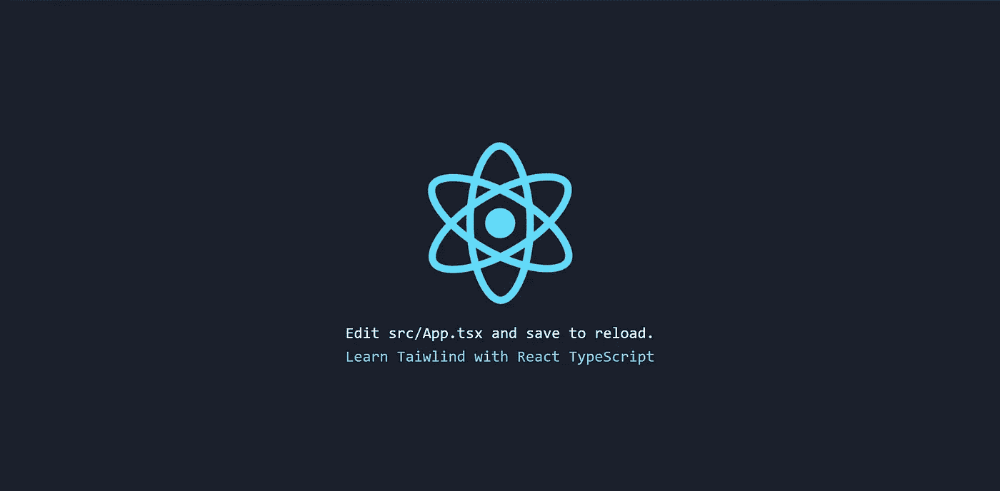

# 顺风+反应类型脚本=🔥👌😎

> 原文：<https://medium.com/quick-code/tailwind-react-typescript-a0317155e5ee?source=collection_archive---------0----------------------->



在过去的几年里， [TypeScript](https://www.typescriptlang.org) 已经开始在 [React](https://reactjs.org/) 世界中获得动力，现在，它在 [create-react-app](https://github.com/facebook/create-react-app) 中获得了官方支持。使用 TypeScript 允许我们获得智能感知的好处，以及进一步推理我们的代码的能力。

> 采用 TypeScript 很容易，因为文件可以增量升级，而不会在项目的其余部分引起问题。

**为什么顺风？大多数 CSS 框架做得太多了，它们带有各种预先设计好的组件，比如按钮、卡片和警告，这些组件一开始可能会帮助你快速移动，但当需要用定制设计让你的网站脱颖而出时，它们会带来更多的痛苦。
[顺风](https://tailwindcss.com)不同，不是固执己见的预先设计好的组件，**

> Tailwind 提供了底层的工具类，可以让你从 html 构建完全定制的设计。

让我们用这些工具来构建一些东西，看看它们如何协同工作。要开始，你应该已经安装了 [Git](https://git-scm.com/) 、 [Node.js](https://nodejs.org) 和 [Yarn](https://yarnpkg.com) (如果你喜欢 npm，这是可选的)。

打开您最喜欢的终端并运行:

```
npx create-react-app tailwind-react --typescript
```

这将在 TypeScript 中创建新的 Create React App 项目，然后我们需要安装 Tailwind CSS 作为开发依赖项。

```
cd tailwind-react
yarn add tailwindcss -D
```

安装过程完成后，我们需要创建顺风 CSS 配置文件。为此，我们需要运行以下命令:

```
npx tailwind init
```

这将在你的项目根目录下用一个新的配置文件初始化 Tailwind。现在我们设置我们的 CSS“入口点”。您可以在任何您喜欢的地方这样做，但是我是这样做的(如果您更改这些路径，您将需要在本文后面的`package.json`脚本中更改它们)。创建`src/tailwind.css`并粘贴以下内容:

```
@tailwind base;
@tailwind components;
@tailwind utilities;
```

现在我们需要在`package.json`文件中添加一个自定义脚本。姑且称之为`tailwind:css` **。**该脚本将从`src/tailwind.css` **更新`src/index.css`文件。**

```
"scripts": {
  "start": "npm run tailwind:css && react-scripts start",
  "tailwind:css": "tailwind build src/tailwind.css -c tailwind.config.js -o src/index.css",
  "build": "npm run tailwind:css && react-scripts build",
  ...
}
```

设置完成，现在您可以在终端中运行`yarn start`来启动您的应用程序。您会注意到 index.css 文件中填充了一堆 css，这是在您启动或构建应用程序时运行的`tailwind:css`脚本的结果。从编程社区推荐的[最佳 Git 教程](https://blog.coursesity.com/best-git-tutorials/)在线学习 Git。

现在让我们去掉这个`App.css`文件，使用一些顺风实用程序类。用下面代码片段中的类替换 div 和 header 中的类。

App.tsx

记住前面生成的`tailwind.config.js`文件，我将向您展示一种使用它的方法。您可以通过使用插件数组中的 addComponents 辅助函数来添加一个自定义的 tailwind 类。在下面的代码片段中，您将看到如何将 AppLogo 类创建为一个顺风组件。

tailwind.config.js

现在你可以开始了，只要重启你的应用程序，你的登陆页面将会看起来像上面的图片标题。

你可以在 [Github](https://github.com/Jaymykels/tailwind-react) 上找到源代码。

快乐编码✌