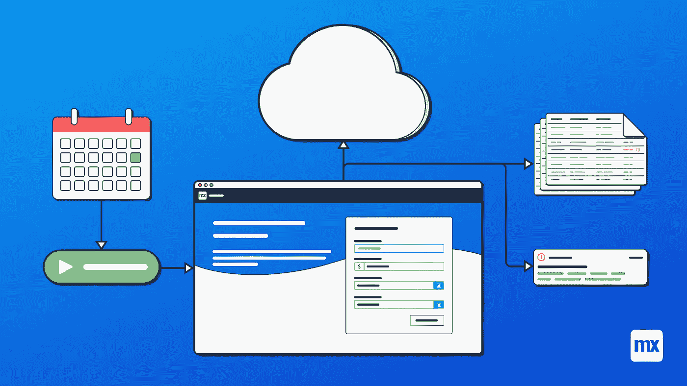
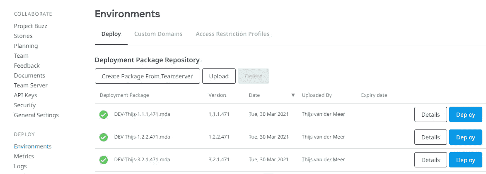
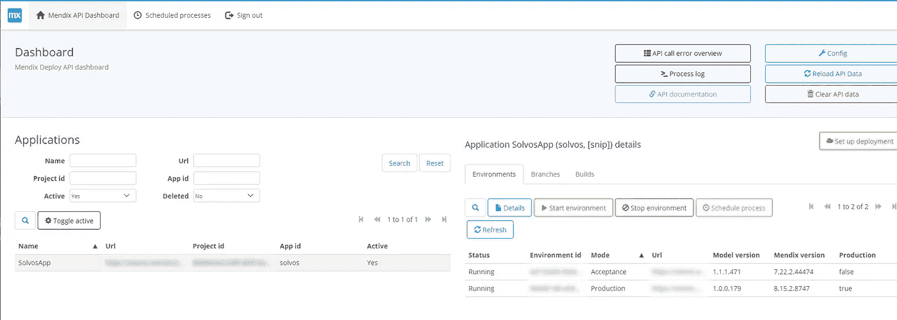
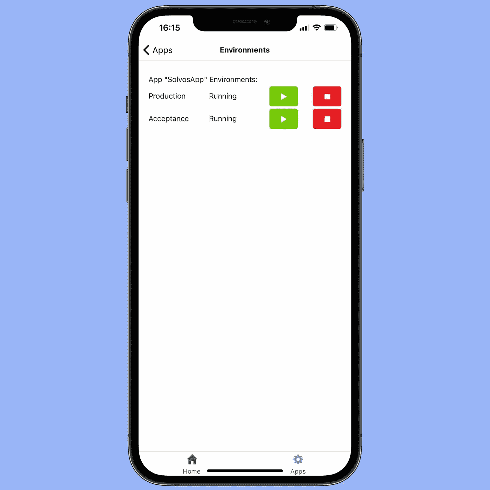

# 使用部署 API 实用程序和调度程序将应用程序部署提升到一个新的水平

> 原文：<https://medium.com/mendix/taking-application-deployment-to-the-next-level-with-the-deployment-api-utilities-scheduler-45f66e3ef516?source=collection_archive---------6----------------------->

“嘿，你能把最新版本的连接器应用程序部署到验收吗？”“当然，没问题。现在？”
“不，卡尔加里团队正在为接下来的四个小时完成他们当前的一组 API 集成测试。”
“那么……明天早上？”
“不，印度需要新的站立姿势。哦，请恢复周一的备份。”
“…嘿，谷歌，把我的闹钟定在凌晨四点半。”

听起来很熟悉？我正好有适合你的东西！

The (fresh!) Mendix Cloud Node Manager

## 按照您自己的方式部署

我们在管理 Mendix 云节点时可用的默认工具实际上相当不错。部署、备份、构建和恢复您的应用程序非常简单。自从最近的视觉大修，它甚至有彩虹进度条！但是，如果我告诉你，有一种方法可以从你自己的舒适的(Mendix)应用程序中完成所有这些维护任务，那会怎么样呢？

除了每个节点可以访问的工具集之外，还有大量的 API 端点可用。毫不夸张地说，我连一半都没读过——[*它们是那么广泛*](https://docs.mendix.com/apidocs-mxsdk/apidocs/) 。其中一个子集与部署任务有关，并使我的生活(和你的？)更简单的是，我已经将一组 API 函数打包到一个独立的模块中，我们希望将它们合并到我们自己的基于 Mendix 的 CRM 中，现在可以在 [Marketplace](https://marketplace.mendix.com/link/component/116915) 中获得。让我们深入了解一下“部署 API 实用程序&调度程序”到底是什么！

## 盒子里有什么？

该模块为您提供了使用部分部署、备份、构建和 TeamServer API 的工具。简而言之，这允许您:

*   检索您有权访问的应用程序和环境的信息。
*   停止或启动环境。
*   在单个节点内创建和恢复备份。
*   从链接到节点的分支或修订构建部署包。
*   部署这些部署包。
*   检索日志内容。

Default dashboard snippet

所有这些都被包装在一个管理仪表板片段中，该片段包含一组整洁的数据网格和微流。初始设置非常简单:从您的开发人员门户获取一个 API 密匙，填写配置，然后您就可以在自己的 Mendix 应用程序中自由运行上面提到的任务。

如果你在想“是的，那很好，但是这并没有帮我省下那么多工作！”，嗯……你说得对。为了帮助你，我增加了建立部署的可能性。选择应用程序和环境，决定是否需要创建备份，并选择部署类型。您可以选择一个特定的修订，或者某个分支的最新修订，或者已经在节点上准备好的构建包。确认，一切都会为你执行。厉害！但是现在，你仍然把闹钟设在 4:45。

[https://bit.ly/MXW21](https://bit.ly/MXW21)

## 按计划进行

嗯，我们快到了。除了到目前为止所有好的特性之外，该模块还为您提供了一个“调度进程”(SP)工具集。用于处理这些 SP 的模块默认值是一个简单的预定事件，它检查是否有任何应该执行的打开的 SP。SP 由日期和时间、任务以及配置该任务所需的任何参数组成。使用附带的管理片段所能做的几乎所有事情都可以被安排。无论您是想要安排停止环境、恢复备份、构建修订版，还是设置完整的部署，一切尽在此处！

Example of a scheduled deployment

## 日志，日志

如果这还不足以引起您的兴趣，那么每个 API 操作和每个 SP 都有一个 Process 对象，详细描述了所采取的步骤、调用和操作的状态，以及一个告诉您发生了什么的信息性注释。对您的环境完成启动需要多长时间感兴趣？想知道为什么不能为您的沙盒环境构建部署包吗？对您无权访问的 API 操作的 API 响应感到好奇？都在模块进程日志里！

## 无穷尽

到目前为止，一切都是您安装和配置模块时得到的。想象一下，如果您根据自己的意愿扩展和定制该模块，您可以做的所有有趣而实用的事情——当计划的部署失败时，您会收到电子邮件或文本警报，您的本机应用程序中的日志文件内容，甚至在应用程序不可用于常规 web 服务调用的情况下，环境仍在运行时进行轮询。如果你想到我应该在第一时间做的很棒的东西，让我知道！

Your own implementation, on native mobile? Sure!

## 市场就是那个地方

这个模块是我制作的第一个模块，目的是向公众发布。起初这有点令人生畏，因为在为市场创建模块时需要记住一套准则，并且 Mendix 的团队必须批准您的模块。回想起来，这个过程非常顺利。为发布准备一个模块既简单又直接，并且被分成几个清晰的步骤。我鼓励任何有很酷的想法并想与社区分享的人去尝试一下！

## 阅读更多

 [## Mendix World 2021 |召集您的应用开发团队 2021 年 9 月 7 日至 9 日

### 好像你需要说服…在一个全球制造商社区，他们想通过探索什么来相互学习…

bit.ly](https://bit.ly/MXW21)  [## 曲目|门迪克斯世界 2021

### 在今年 Mendix World 开幕之前，手工制作您的议程。浏览专为您量身定制的 8 个专题讲座中的 85 个以上专题讲座…

www.mendix.com](https://www.mendix.com/mendix-world/tracks/) 

*   [https://docs.mendix.com/appstore/general/app-store-overview](https://docs.mendix.com/appstore/general/app-store-overview)
*   https://docs.mendix.com/apidocs-mxsdk/apidocs/deploy-api
*   [https://docs . mendix . com/how to/integration/consume-a-rest-service](https://docs.mendix.com/howto/integration/consume-a-rest-service)

*来自发布者-*

*如果你喜欢这篇文章，你可以在我们的* [*媒体页面*](https://medium.com/mendix) *或我们自己的* [*社区博客网站*](https://developers.mendix.com/community-blog/) *找到更多类似的文章。*

*希望入门的创客，可以注册一个* [*免费账号*](https://signup.mendix.com/link/signup/?source=direct) *，通过我们的* [*学苑*](https://academy.mendix.com/link/home) *即时获取学习。*

有兴趣更多地参与我们的社区吗？你可以加入我们的 [*Slack 社区频道*](https://join.slack.com/t/mendixcommunity/shared_invite/zt-hwhwkcxu-~59ywyjqHlUHXmrw5heqpQ) *或者想更多参与的人，看看加入我们的* [*遇见 ups*](https://developers.mendix.com/meetups/#meetupsNearYou) *。*