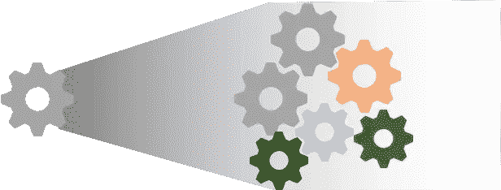

# 将大型 ML 系统引入生产——第 1 部分

> 原文：<https://medium.com/walmartglobaltech/taking-big-ml-systems-to-productions-part-1-c2d24b039bf?source=collection_archive---------5----------------------->

所有数据准备、特征工程(以下简称 FE)已经完成并经过全面测试；算法已经被设计、编码和优化。对历史数据的测试结果看起来也很有希望，但解决方案还远远不能用于生产。在研究/实验室环境中开发的数据科学(以下简称 DS)解决方案并不总是能够直接投入生产。即使在解决方案成形后，要将整个 DS 解决方案投入生产，还需要考虑许多移动部分。

人们必须记住，DS 解决方案通常是更大工程工作的一部分。有向这些 DS 解决方案提供数据的上游系统，还有利用 DS 解决方案输出的下游系统。所有的编排和握手(信息传输)都是基于某些契约在这些系统之间进行的，例如，DS 系统将接收特定格式的数据，并将生成具有给定特定列的输出 CSV。

Image Source : [Google Search](http://universdemaclasse.blogspot.com/2011/11/latelier-decriture-commencer-lannee.html)

数据科学家的思维过程中有一些根深蒂固的考虑因素，例如，功能在实时运行中的可用性、培训时间、模型的复杂性、数据的易变性。有一些统计方法可以测试和应对这些挑战。然而，并不是每个 DS 问题/竞争 DS 问题都需要考虑在一定时间内处理数十亿行数据的挑战，并对来自上游流程的错误进行故障保护，例如，上游流程可能会有一些丢失的值—DS 解决方案应该在算法上处理它，或者在这两种情况下优雅地失败并通知用户。

沃尔玛实验室的智能预测是这种数据科学工作的一个很好的例子，涉及多个复杂模型、多个故障点以及与数据工程的紧密集成。Smart Forecasting 在商店项目级别生成约 500MM 的预测，在未来 52 周内每周生成此类组合，这些预测每周更新一次。基于拓扑聚类，整个项目被分成多个组，并且这些组此后将被称为类别。

有六个主要组件需要微调，以保持 DS 解决方案在生产中的良好运行——

1.  解决方案可扩展性
2.  基础设施的可扩展性和兼容性
3.  溶液耐久性
4.  生产反馈
5.  溶液适应性
6.  解决方案的成本效益

解决方案的可伸缩性、兼容性将在本文中讨论，持久性、产品反馈、适应性和成本效益将在第 2 部分的后续文章中讨论

# 解决方案可扩展性

系统的垂直可伸缩性通常是一项困难的任务。这就是为什么数据科学家通常会考虑一些解决方案限制，例如内存要求、GPU 要求(如果有)、存储要求、算法训练和评分所需的时间，并尝试满足生产要求。通常，解决方案的可伸缩性是由未来的需求来检验的。现有解决方案无法根据未来需求进行扩展。这样的例子可以是算法在将来被提供更大的数据时失败或违反服务级别协议(SLA)。

为了应对这些挑战，开发人员/数据科学家必须找出流程中的瓶颈/速率限制步骤，并确定该步骤的最大阈值。如果输入数据大小大于该阈值，则必须有一个步骤将数据分成更小的块，例如某种聚类或分段。

在智能预测中，奇异值分解存在这样的问题。内存中的进程无法处理大于特定大小的矩阵，因此数据(类别级别的历史销售文件)必须使用项目层次结构分成较小的块。

一般来说，内存作为限速步骤出现。在有些过程中，存储也可能有速率限制，特别是当存储需要使用网络进行写入时，例如在网络文件系统(NFS)或云上的 blob 存储上。在智能预测中，对于其中一种算法，使用 python 提供的默认模型编写器编写的模型大小为几十个 GB，并且开发了一种内部方法来编写模型，新方法以几百个 MB 的速度编写整个模型，因为许多元信息已被删除。

如果服务级别协议(SLA)有时间限制，不仅是内存和存储，处理也将成为限制因素之一。很多时候，实现的解决方案可能不是全局最优的解决方案，而是运行时约束下的最优方案。这甚至可能要求不只是使用现成的软件包，而是编写一些为特定需求量身定制的本地解决方案。对于智能预测，编写并测试了新版本的随机森林，其中决策树 C4.5 的思想用于回归树。

# 基础设施的可扩展性和兼容性

Image Source: [Google Images](https://scx2.b-cdn.net/gfx/news/hires/2019/plug.jpg)

生产基础设施的设计必须能够在未来水平扩展。垂直可伸缩性的需求由代码/解决方案本身通过聚类/分段来处理。只有随着基础设施的扩展，DS 解决方案才能扩展到更大的客户群。这一部分需要与工程团队和架构师进行大量协作，因为他们将提供管理集群和协调整个流程的工具。

基础设施和解决方案还必须与可扩展性保持兼容，例如，只支持高 CUDA 版本的 GPU 卡的新升级可能会导致用旧 CUDA 版本编译的一些解决方案无用。这一点非常重要，尤其是在使用开源工具和大型贡献者社区的时候，因为一个包的需求可能会和另一个包冲突。在智能预测中，由于代码中不支持 python 库的升级，出现了一些问题。

在两个或更多相关流程的情况下，例如在智能预测——训练和评分的情况下，这个问题会进一步加剧。这两个过程独立运行，但评分使用培训中生成的模型。训练使用 GPU 进行训练，但需要以只能在 CPU 上运行的方式创建模型(因为 GPU 总是有巨大的成本)，这需要训练和评分包同步。

基础设施兼容性还包括为工作选择最佳工具。对于用于数据准备和数据工程的工具，数据科学家有时并不是最好的判断者。很多时候，他们的代码需要被翻译成最适合这个目的的工具。在智能预测中，大量的特征生成是在 Apache Spark 上完成的，这需要大量的调整，因此速度很慢。后来，在 C++中，它被转移到内存计算中，以获得更快的计算速度。

# **总结**

一个生产就绪的数据科学解决方案应该使用合理的资源，并且必须是可横向扩展的。这可能需要对整个问题进行重组。此外，整个解决方案必须是基于模块的，以便它可以很容易地与基础设施一起扩展。

关于耐久性、生产反馈、适应性和成本效益的讨论，请遵循文章的第二部分的