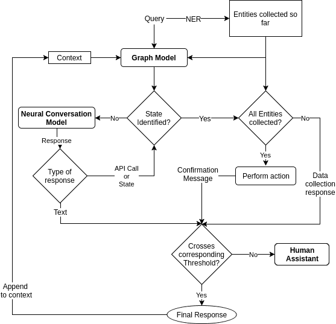

# 增强人工智能助手中的神经对话模型

> 原文：<https://medium.com/google-developer-experts/taking-neural-conversation-model-to-production-b0d2e7c190e4?source=collection_archive---------4----------------------->

就在大约 3 年前，主要由传统机器学习模块支持的多个应用程序在深度学习技术的有希望的结果的推动下，掀起了乐观主义的浪潮。一个这样的应用是机器翻译，通过引入从 [**序列到**](https://arxiv.org/pdf/1409.3215.pdf) 序列的学习方法，机器翻译得到了显著的改进。不久之后，使用 [**深度学习聊天机器人**](http://www.wildml.com/2016/04/deep-learning-for-chatbots-part-1-introduction/) 成为一个充满希望的实验领域，其中 [**神经对话模型**](https://arxiv.org/pdf/1506.05869) 成为开发人员和研究人员的起点**。**

随着大量对话数据的到位和我们对新技术的渴望， [Haptik](http://haptik.ai/) ，最大的对话式人工智能平台之一成为了这项研究的直接受益者。然而，我们经历了多次迭代才想出一个在生产中为我们工作的系统，并为最终用户体验增加了显著的价值。我们构建了一个混合模型，将**神经对话模型**与**基于图形的对话系统**结合起来，并在现有的基线系统上实现了重大改进。您也可以参考我们的研究论文， [**“生产就绪聊天机器人:如果不检索则生成”**](https://arxiv.org/pdf/1711.09684.pdf) ，该论文在[AAAI-2018](https://aaai.org/Conferences/AAAI-18/)Deepdial 研讨会上发表。

这篇文章主要关注为什么我们提出了一种混合方法，以及 Haptik 的聊天机器人如何使用这种方法以精确和智能的方式响应用户的消息。

在我们进入混合动力系统之前，让我们先了解一些基础知识。

# 构建聊天机器人的主要方法是什么？

*   **检索方法:**基于检索的模型使用预定义响应的存储库和一些基于规则的表达式匹配或机器学习分类器的集成来挑选最合适的响应。
    在这个类别中，我们使用了一个基于图形的对话系统，它可以帮助我们回复几乎 70%的用户信息。您可以参考研究论文第 3 节中的[检索方法的详细信息。](https://arxiv.org/pdf/1711.09684.pdf)
*   **生成方法:**生成模型基于人与人之间的对话历史进行训练，并从头开始构建新的响应。在我们的例子中，我们使用 seq2seq 模型，具有 3 层双向 GRU 编码器和单向解码器(同样具有 3 层和 GRU 单元),具有对编码器状态的注意设置。这种方法的详细信息可在我们研究论文的第 4 节[中找到。](https://arxiv.org/pdf/1711.09684.pdf)

你也可以在这里阅读更多关于这些方法的信息[。](http://www.wildml.com/2016/04/deep-learning-for-chatbots-part-1-introduction/)

# 为什么 Haptik 需要检索和生成方法的混合？

虽然我们的检索模型对大多数用户消息做出了响应，但它在包含大量拼写错误、偏离领域、代码混合查询等复杂用户查询上失败了。因此，我们决定尝试使用 seq2seq 模型来利用我们的历史对话数据。通过训练大约一百万次对话，我们很快就准备好了一个肮脏的原型，这是一个精神分裂的聊天机器人。这个聊天机器人积极地回答所有类型的问题，支持每一次对话，但同时表现出混乱的思维，这与改善对话期间的最终用户体验不一致。不幸的是，我们不能以这种形式使用它，因为它不符合构建成功机器人的以下先决条件:

*   **机器人的内容、语气和个性:**我们的 seq2seq 模型使用的语言和语法结构不一致；一个好的会话代理所不具备的东西。
*   **准确性:**正如预期的那样，当它响应查询时，它还试图用意外的响应来响应不熟悉的意图。这完全违背了准确反应的目的。
*   **与特定任务保持一致:**好的特定任务聊天机器人倾向于将对话保持在一个狭窄的领域内，并旨在推动其完成任务。但是我们的模型接受开放式的查询，并参与无休止的聊天。

基于上述问题，我们得出结论，我们需要一个能够响应复杂用户查询的模型。此外，这些回应的目标应该致力于让用户回到正轨。因此，导航我们的基于图形的对话系统到用户离开的地方。因此，我们开始设计一个混合系统，以可控的方式使用生成模型。

# 混合系统是如何工作的？

基于图形的系统适用于接近理想的场景，并负责 hap tik 70%的聊天机器人对话。我们引入了神经对话模型来响应用户倾向于偏离理想聊天流的剩余 30%的对话。

我们让人工代理实时响应，目的是让用户回到理想的聊天流程中。有趣的是，我们 80%的训练数据由这 30%的对话组成，而剩下的 20%来自其余 70%的聊天机器人对话。您可以参考论文的[章节 4.2](https://arxiv.org/pdf/1711.09684.pdf) 了解更多关于我们的训练数据生成的详细信息，并参考[章节 5](https://arxiv.org/pdf/1711.09684.pdf) 了解实时工作。以下是我们的混合系统实时工作的快照:

# 混合动力系统对 Haptik 有什么帮助？

Haptik 每月处理超过 500 万次聊天机器人对话。以下是混合模式的优势列表和 reminders 域的快照:

*   我们可以对图形对话系统无法处理的复杂查询做出回应:

*   混合系统迎合了 hinglish(通过混合印地语和英语生成的代码混合数据)查询，也迎合了离群值:

*   它处理印度用户在聊天中使用的拼写错误、俚语和其他聊天术语:

能够插入 seq2seq 模型的最大优势之一是，我们的聊天机器人系统的性能与数据成正比。

就像所有其他系统一样，我们的模型也有其自身的局限性，在研究论文的[第 6 节](https://arxiv.org/pdf/1711.09684.pdf)中，我们的系统的结果和分析也提到了这些局限性。

根据我们反复迭代以实现面向结果的混合模型的经验，下面是我们希望其他开发人员在构建包含生成模型使用的系统时考虑的几个关键检查点的列表。

*   **明确定义的目标**–作为一名开发人员和深度学习爱好者，构建生成模型总是很有趣，因为有时模型的行为非常酷，能带来即时的满足感。但是不用说，缩小生成系统的目标范围是很重要的，这样你就可以有效地利用你的数据。在 [Haptik](http://haptik.ai/) ，我们在构建生成系统时的主要目标是在对话偏离理想流程时保持检查。
*   **领域的选择**–领域定义了模型需要理解的词汇。而且总是越少越好。例如，如果您想要构建一个旅行机票预订模型，那么您最好为机票预订、火车预订、酒店预订和出租车预订训练一个单独的模型。
*   **数据量**–这种生成模型的一个基本事实是，它们需要大量的数据点来学习。在构建任何神经对话模型时，训练数据生成是最关键的任务之一。获得大量的数据是困难的，但要获得可测量的结果，这是必须的一步。
*   **数据标准化**–大多数聊天机器人内容丰富，消息包含静态和动态数据。因此，需要正确记录整个系统的元数据，并在源位置对关键实体进行适当标记。如果处理不当，很容易导致历史数据不可重用，或者需要大量时间来清理历史数据，以便输入到生成模型中。

当你决定在你的对话系统中插入一个生成模型时，我们希望这个博客能帮助你。当我们在 Haptik 上部署生成模型时，我们会在 Haptik 上插入更多的用例。

这里有一个很好的阅读列表，可以让你在这方面做更多的研究:

[长短期记忆网络(LSTM)](http://colah.github.io/posts/2015-08-Understanding-LSTMs/)
[用神经网络进行序列对序列学习](https://arxiv.org/abs/1409.3215)
[一个神经对话模型](https://arxiv.org/abs/1506.05869)
[一个基于角色的神经对话模型](https://arxiv.org/abs/1603.06155)
[生产就绪聊天机器人:如果没有检索就生成](https://arxiv.org/abs/1711.09684)
[Ubuntu 对话语料库:一个用于研究非结构化多回合对话系统的大型数据集(2015–06)](http://arxiv.org/abs/1506.08909)

你觉得我们做得好吗？请在下面的评论中告诉我们。

*原载于 2018 年 2 月 27 日*[*haptik . ai*](https://haptik.ai/tech/neural-conversation-model-production/)*。*

**Connect with the Raven team on** [**Telegram**](https://t.me/ravenprotocol)