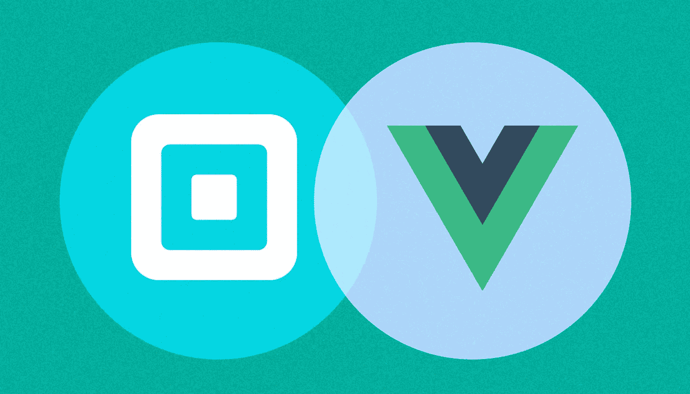
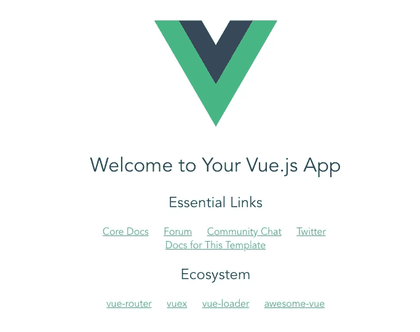
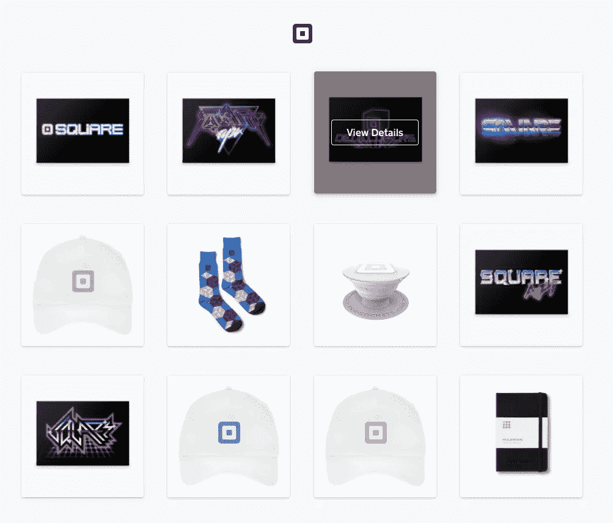
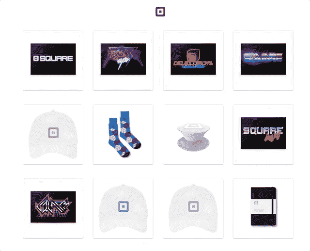
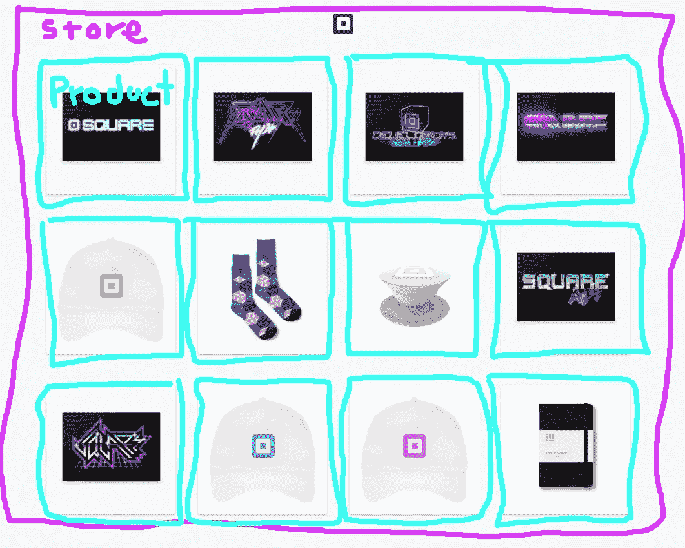
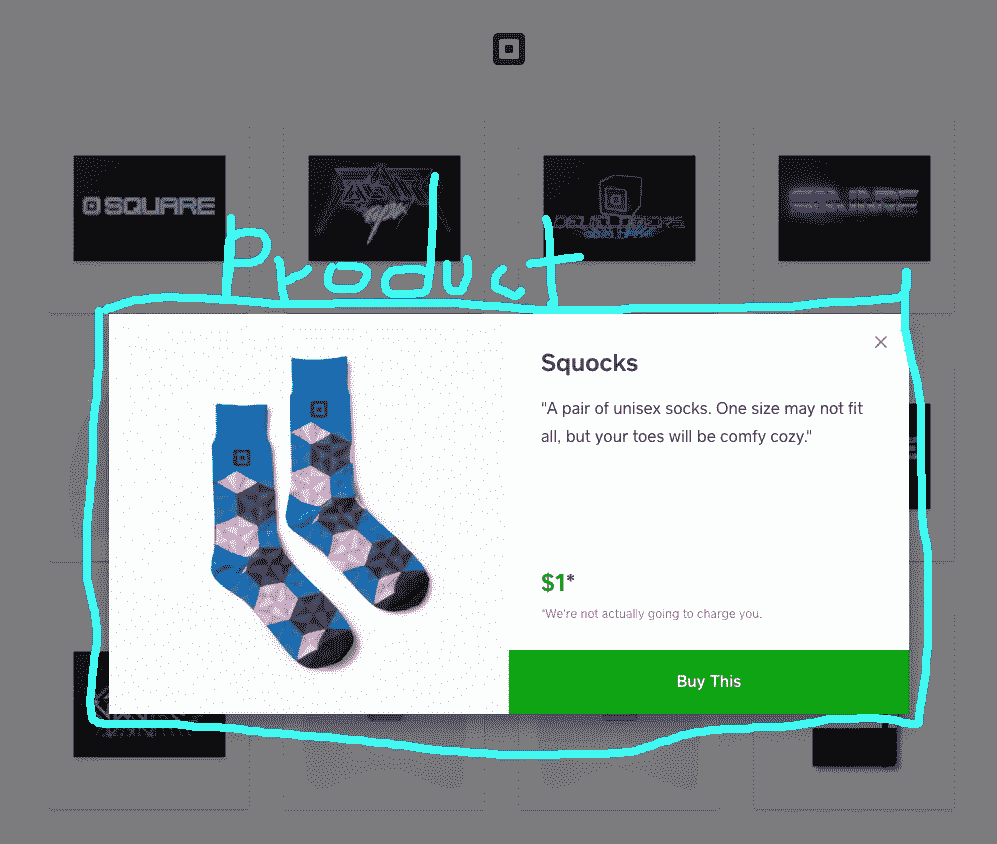
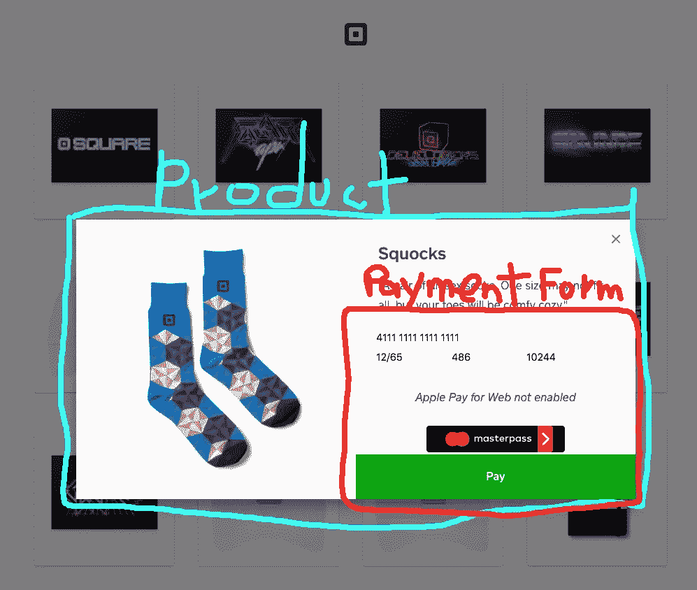
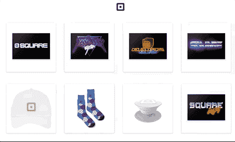

# 使用 Square 和 Vue.js 在线支付

> 原文：<https://medium.com/square-corner-blog/taking-payments-online-with-square-and-vue-js-39a15d2fb474?source=collection_archive---------0----------------------->

## 了解如何使用 Vue 和 Square 支付表单！

> 注意，我们已经行动了！如果您想继续了解 Square 的最新技术内容，请访问我们在 https://developer.squareup.com/blog[的新家](https://developer.squareup.com/blog)



[Vue.js](https://vuejs.org/) 是前端 JavaScript 框架的流行选择。它具有方便的功能，如数据绑定和开箱即用的轻松呈现控件，同时还具有您需要的性能和可扩展性。但是如果你想接受一些支付呢？在本帖中，我们将详细介绍如何将现有的电子商务网站转换为使用 Vue.js，以及如何通过包装 Square 支付表单的新组件添加支付功能。

> 你会想在 Vue 组件和条件渲染方面有所经验，以便充分利用本教程，所以如果这是你第一次看 Vue.js，看看 Vue.js 主页上的视频。

如果你想跳过教程直接跳到完成的结果，看看[tristansokol/vue-square GitHub repo](https://github.com/tristansokol/vue-square)。

# 设置

有了大量的开发工具来帮助现代 JavaScript 开发，安装和配置所有的东西本身就是一个挑战。幸运的是，一种用于搭建前端项目的新工具&帮助管理所有工具的工具已经出现:命令行界面。是可以创建各种样板文件来帮助加速开发的工具之一。我们将从 [webpack 模板](https://github.com/vuejs-templates/webpack)开始开发:

```
vue init webpack .
```

在一点点的交互配置之后，你的空目录将会用工作的 [babel](https://babeljs.io/) 、 [eslint](https://eslint.org/) 、 [webpack](https://webpack.js.org/) 等来填充你的目录。以及 Vue.js 的一系列开发工具。单独设置每样东西可能需要几个小时，所以请随意小睡片刻或阅读一本书，因为您现在已经远远超前于计划了！

快速`npm run dev`显示模板的默认登录页面:



Seriously, we are way ahead of schedule, go read a book!

# 建设商店

Fellow Square [Richard Moot](https://medium.com/u/c0592af0b7ed?source=post_page-----39a15d2fb474--------------------------------) 在一个关于 [glitch](https://glitch.com/edit/#!/square-checkout) 的项目中完成了建立电子商务商店的大部分繁重工作，我们可以用它作为我们工作的灵感:



Lets try to build this.

我们有基本店面的所有代码，以及每个产品的模型和购买链接:



我们将为这个项目使用相当多的现有样式和标记，稍加修改以更好地适应 Vue.js。我们的大部分工作将是创建一个新的支付表单组件，供人们支付(而不是当前生成结账表单的功能)。

## 成分

我们的 CLI 向导设置我们使用 Vue 的[单个文件组件](https://vuejs.org/v2/guide/single-file-components.html)，但是我们应该如何分割页面呢？一般来说，重复的项目是“组件化”的重要目标，在这个页面上，每个产品在功能上都非常相似。只有个别项目的细节会发生变化。让我们创建一个组件来保存所有产品，然后为每个产品创建一个单独的组件，如下所示:



Only the best colors for these high-tech diagrams.

有了这个设置，我们将在我们的“产品”组件中安装模型的逻辑和模板。我们需要为付款表单创建一个专用的子组件。这将让我们保持支付表单的样式和逻辑是独立的，并且在未来的项目中更加可重用。



# 付款表单组件

Square 的支付形式是你如何将希望购买的顾客转化为你银行账户中的钱。它由一些用于构建表单的 html、用于样式化的 css 和一些将它们联系在一起的 javascript 组成。如果这是您第一次使用支付表单，一定要看一下文档，了解更多的背景知识: [SqPaymentForm 概述](https://docs.connect.squareup.com/payments/sqpaymentform/sqpaymentform-overview)。创建新组件从一个新的`.vue`文件开始。让我们来看看里面有什么:



## 模板

在组件的模板中，我们为页面上呈现的内容设置了 html。对于该组件，重要的部分将是客户放置信用卡信息的表单字段，以及一个支付按钮，但我们还需要一些其他部分来完成工作:

```
<form id="nonce-form" novalidate action="*path/to/payment/processing/page*" method="post">
```

这就是支付表单中的表单得名的原因。信用卡随机数是在客户端用 JavaScript 生成的，但是为了进行支付，您需要将随机数发送到您的后端，在那里您可以安全地调用 [Charge](https://docs.connect.squareup.com/api/connect/v2/?q=charge#endpoint-charge) 端点。浏览器的默认表单功能是一种很好的方式。每当创建卡随机数时，浏览器将重定向到指定的 URL 进行处理。Vue.js 只针对客户端代码，所以我们在本帖中将跳过处理，但是你可以在[事务 API 概述](https://docs.connect.squareup.com/payments/transactions/overview)中了解更多。

```
<div class="error" v-for="error in errors">
  {{error}}
</div>
```

我们可以利用 Vue 的[列表呈现](https://vuejs.org/v2/guide/list.html)语法来遍历生成 nonce 时可能出现的任何错误，并呈现它们。

```
<div id="card-tainer">
  <div class="cardfields card-number" :id="id+'-sq-card-number'">       
  </div>
  <div class="cardfields expiration-date" :id="id+'-sq-expiration-date'">
  </div>
  <div class="cardfields cvv" :id="id+'-sq-cvv'">e</div>
  <div class="cardfields postal-code" :id="id+'-sq-postal-code'">
  </div>
</div>
```

支付表单用一系列 iframes 替换了这些元素，以处理最终用户输入的敏感卡数据。这里需要注意的一点是，每个元素的`id`都绑定到了 Vue.js 支付表单组件中的`id`变量。这个 id 是一个`prop`，对应于每个产品的 id，对于每个产品都是唯一的。唯一标识符有助于确保支付表单成功呈现每个产品，而不会呈现错误的产品。

```
<div id="sq-walletbox">
  <div v-show=!applePay class="wallet-not-enabled">
    Apple Pay for Web not enabled
  </div>
  <!-- Placeholder for Apple Pay for Web button -->
  <button v-show=applePay 
          :id="id+'-sq-apple-pay'" 
          class="button-apple-pay">
  </button> <div v-show=!masterpass class="wallet-not-enabled">
    Masterpass not enabled
  </div>
  <!-- Placeholder for Masterpass button -->
  <button v-show=masterpass 
          :id="id+'-sq-masterpass'" 
          class="button-masterpass">
  </button>
</div>
```

本部分显示 [Apple Pay](https://docs.connect.squareup.com/payments/sqpaymentform/config-apple-pay-web) 和 [Masterpass](https://docs.connect.squareup.com/payments/sqpaymentform/config-masterpass-web) 的按钮。除了元素的唯一标识符之外，我们还使用 [Vue 的条件渲染](https://vuejs.org/v2/guide/conditional.html)和`v-show`来仅在变量`masterpass` & `applePay`为真时显示按钮，这些变量是根据浏览器是否支持这些支付方式在 javascript 中设置的。

```
<button [@click](http://twitter.com/click)="requestCardNonce($event)" class='productPurchase payButton'>Pay</button>
```

为了进行购买(并启动随机数创建过程)，你需要点击一个按钮，就像这个一样。`@click`是一个 Vue.js 事件处理程序，为了防止点击表单中提交按钮的默认行为，我们需要使用特殊的 Vue `$event`变量来传递事件。

## java 描述语言

这里有相当多的代码，其中大部分在支付表单文档中有深入的解释，但这里是正在发生的事情的重点。

```
name: 'paymentForm',
data: function() {
  return {
   errors: [],
   masterpass: false,
   applePay: false
 }
},
```

Vue.js 中的每个组件都需要一个名字，这个就是`paymentForm`。支付表单的数据非常少:两个布尔值用来保存 Masterpass 和 Apple Pay 浏览器支持，一个数组用来保存 nonce 生成过程中产生的任何错误。

```
mounted: function() {
  let locationId = "75MBQ5SS3SKJK";
  let applicationId = "sq0idp-gbQhcOCpmb2X4W1588Ky7A";
  let that = this;
  this.paymentForm = new SqPaymentForm({
    autoBuild: false,
    ...
```

`mounted`创建函数时执行一个方法。一旦可用，我们就可以用它来构建我们的`paymentForm`对象。一个新的变量`that`，当我们在支付表单的代码中时，存储 Vue 实例的范围。当付款表单决定是否支持这些付款方式时，我们将使用它来指定`this.applePay` & `this.masterpass`的值。值得注意的是`**autoBuild: false**` 属性，该选项告诉支付表单等待，直到调用`paymentForm.build()`来呈现支付表单的元素。

```
watch: {
  showPaymentForm: function() {
    if (!this.showPaymentForm) {
      return 1;
    }
    this.paymentForm.build();
  }
},
```

Vue.js 的`watch`功能让我们跟踪一个变量，并根据这个值做一些事情。在这种情况下，我们使用决定支付表单可见性的变量`showPaymentForm`来执行支付表单所需的 javascript。每当`showPaymentForm`变为真时，支付表单被构建并显示给最终用户。

```
props: {
  showPaymentForm: Boolean,
  id: Number
}, 
```

该组件有两个`[props](https://vuejs.org/v2/guide/components-props.html)`，它们在父组件`product.vue`和支付表单组件之间进行通信。从其他部分来看，`showPaymentForm`听起来应该很熟悉，而`id`号是我们在 html 中用来唯一标识每个卡字段的。

```
methods: {
  requestCardNonce: function(event) {
  // Don't submit the form until SqPaymentForm returns with a nonce
    event.preventDefault(); // Request a nonce from the SqPaymentForm object
    this.paymentForm.requestCardNonce();
  },
},
```

方法是组件的函数，这个组件只有一个处理点击支付按钮的方法:默认行为是暂停(提交表单),而支付表单触发它的`requestCardNonce()`方法。

组件的其余部分只是元素的样式。Vue 中的单个文件组件使得将 css 扩展到单个组件变得容易，因此改变这些组件的样式或组织都可以在`.vue`组件文件本身中完成。

有了我们的支付表单组件，很容易将支付表单添加到现有的模式中:



并且应该很容易将其添加到任何其他 Vue.js 应用程序中。

这是你可以用 Vue.js 和 Square 为顾客建立的在线商店体验的冰山一角。看看 [GitHub](https://github.com/tristansokol/vue-square) 上的完整代码，让我知道你的想法！如果 Vue 社区有需求，我们可以发布更多帖子，展示如何用 Square 的 API 实现它。

*想要更多吗？* [*注册*](https://www.workwithsquare.com/developer-newsletter.html?channel=Online%20Social&sqmethod=Blog) *订阅我们的每月开发者简讯或来广场打招呼 dev*[*Slack channel*](https://squ.re/slack)*！*