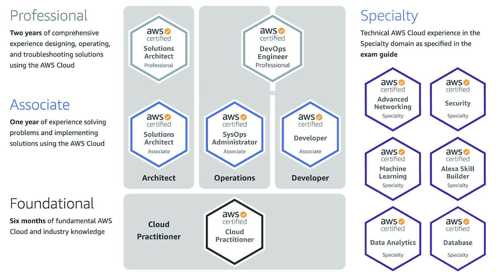
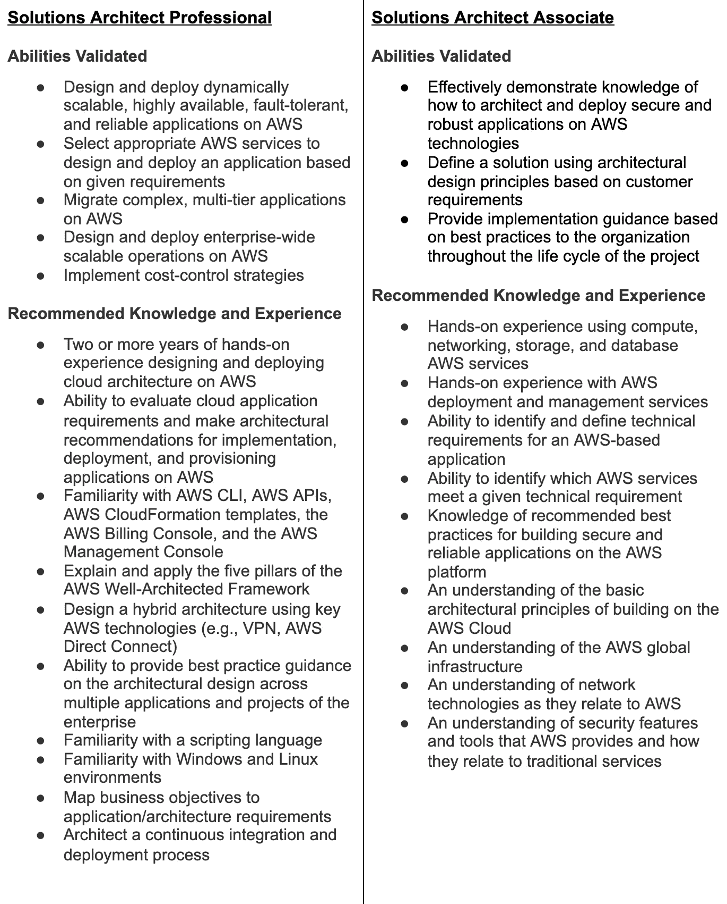

# 参加 AWS 解决方案架构师专业证书考试

> 原文：<https://medium.com/capital-one-tech/taking-the-aws-solutions-architect-professional-cert-exam-447c2f4fca8f?source=collection_archive---------1----------------------->

## 准备好应对 AWS 解决方案架构师专业认证了吗——以下是我个人考试过程中的一些提示和建议

将准备认证考试比作一次漫长的旅程可能是一种被滥用的陈词滥调——我的同事 Austen Novis 在他关于 CKA 考试的文章中使用了这一说法——但今天我确实感觉自己走过了一条漫长而曲折的道路。为什么？因为我已经参加并通过了 [AWS 解决方案架构师-专业认证](https://aws.amazon.com/certification/certified-solutions-architect-professional/)。虽然快乐是在旅程中，但我很高兴现在到达了目的地。也就是说，我希望其他人会从我学习、参加和通过认证考试的经历中受到鼓舞。

# 我会走 500 英里——我是如何决定参加 AWS 解决方案架构师专业认证的

*你听说过这句谚语:“千里之行始于足下。”*对我来说，这一步是在 2017 年 12 月获得 [AWS 解决方案架构师助理认证](https://aws.amazon.com/certification/certified-solutions-architect-associate/)。当时，我不可能参加解决方案架构师专业测试—助理级别考试已经够吓人的了！

但我花了至少三个月的时间学习助理认证，考试前的最后两周是在强化学习中度过的。在 Capital One，我们的[领导层非常支持员工获得 AWS 认证](https://aws.amazon.com/solutions/case-studies/capital-one-training/)，我的经理和我的队友也以鼓励、考试提示和请假参加考试的形式给予了我支持。谢天谢地，那次经历帮助我为通过专业水平考试做好了准备。

*The AWS certification continuum from* [*https://aws.amazon.com/certification/*](https://aws.amazon.com/certification/) *as published on 3/29/2021*

顺便说一句，如果你还没有参加助理考试，我强烈建议你先去参加。我的同事 Quinn [写了一篇非常好的关于准备助理水平考试的策略的文章](/capital-one-tech/advice-on-taking-the-aws-solutions-architect-associate-exam-from-someone-who-just-passed-eaaaabaf8c1c)，你会在这里看到他的许多建议。

快进到 2020 年年中。我的助理认证大约还有六个月就到期了。我知道我想更新，正如我之前所说，谢天谢地，Capital One 非常支持其员工获得高级认证。在与我的同事和朋友交谈后，其中一些人还持有 AWS 解决方案架构师专业认证，我个人决定这次以专业水平认证为目标。

# 助理和专业级认证之间的区别

所以你可能会问，“助理考试和专业考试有什么区别？”从 AWS 来看，这些是每次考试都要验证的能力。

*The above text is quoted verbatim from the* [*AWS certification site*](https://aws.amazon.com/certification/) *as published on 3/29/2021*

你可能会问，为什么我要花这么大力气通过这次考试？我认为对我来说，有一定数量的*“去过那里，做过那件事”*关于简单地重新参加系统架构师助理测试来重新认证我自己。我一直是一个想要不断推动自己取得越来越大成就的人，这是一个很好的方式。就我在 AWS 的经验水平而言，仅仅重新认证助理级别似乎也是在低估自己。三年多来，我每天都在与 AWS 合作一些非常深入的项目，包括我们的[云迁移之旅](https://aws.amazon.com/solutions/case-studies/capital-one-all-in-on-aws/#:~:text=Capital%20One%2C%20one%20of%20the,all%20in%20on%20the%20cloud.)的几个部分。

也就是说，我们首都一中的文化也影响了我参加专业水平考试的决定。在一个重视认证并鼓励员工获得认证的公司里，这个特殊的 AWS 认证是我从参加助理考试的同行中脱颖而出的一种方式。

# 生活是一条高速公路——安排自己参加职业资格考试

一旦我做出了决定，接下来就是*时机*了。在认证之旅中，最重要的事情之一就是注册参加考试。一旦你设定了日期，你就朝着一个具体的目标努力；在你报名参加考试并支付考试费用之前，你并没有真正参与其中。

如上所述，我最初的助理认证将于 2020 年 12 月到期，AWS 认证的有效期为三年，因此我有一些时间来准备。12 月初，我报名参加 2021 年 1 月 29 日的考试，这给了我大约两个月的学习时间。Capital One 为员工提供广泛的按需培训选择，因此我开始搜索各种 AWS 认证准备课程。我的队友推荐了一些在线课程，所以我开始学习这些课程；但事实证明，这种学习方式不适合我。

# 开始之前，了解你的学习方式

这让我想到了我能给任何人的最重要的建议，不仅仅是为了通过一次考试，而是为了生活。*认识自己。*

允许自己成为人类，犯错误和成长。了解你个人的大脑是如何工作的，你是如何学习的——也许更重要的是*你是如何不学习*——将为你节省大量的时间和挫折。在这种情况下，不仅仅是知道我如何学习，还知道我每天是如何工作的，我的时间表是什么样的，我必须承担的责任，以及那些我可以暂时停下来学习的事情。同样，Capital One 非常支持其员工，并为我们提供每月[“投资自己日”](https://www.capitalonecareers.com/how-tech-associates-invest-in-their-whole-selves-and-find-balance-cul-ben) —在工作时间学习认证考试和学习其他技能。在学习 AWS 解决方案架构师专业认证时，我肯定利用了这段时间。

我从经验中知道，我从书本中学习。我也喜欢在一天结束时读这些书，也就是说，在我睡觉前。假设我对这个话题感兴趣，随便哪一天给我一本书，我都会学到这个技能。我直接从书上学到了许多不同的技能，从编程到 3D 建模到跆拳道形式。坐着看视频——许多在线学习资源的格式——不是我喜欢的学习方法。

有趣的是，作为这次旅程的一部分，我发现了*为什么*这种学习方式不适合我——因为视频主要是回顾我已经掌握的知识。对我来说，只是为了找到我可能还不知道的小趣闻而重复已经获得的知识是令人讨厌的。相反，给我一本书，让我可以浏览，直到找到我感兴趣的部分。

作为一名 Devops 工程师，我几乎每天都要修改 IAM 和 bucket 策略、创建和启动 CloudFormation 模板、部署 Lambda 函数以及在 AWS 中设计新的应用程序。以我的背景，我不需要在这些事情上花费太多的学习时间。在这种情况下，我需要研究和学习的是直接针对我知识缺口的信息。

# 我用自己的方式做到了——开发一种适合我需要的考试学习方式

一旦我完成了视频课程，并意识到我需要更多的东西，我如何学习 AWS 解决方案架构师专业认证？一个常见的建议是阅读 AWS 提供的各种白皮书，这肯定会提供我通过考试所需的知识。也就是说，对我来说，阅读白皮书并不是一个有效的学习途径，因为它们通常会让我昏昏欲睡。白皮书倾向于相当枯燥(故意的，它们不是为了娱乐而写的)，但是它们在陈述中也倾向于有点临床，并且可能不提供您在参加测试时将会遇到的情景类型的上下文。

我最后买了一本电子书，里面有大约 300 道试题。在这本书里，问题在前面，答案在后面，问题和答案之间有超链接。除了答案，这本书还讨论了“为什么”答案是正确的，以及相关 AWS 产品页面的链接。我可以通过这本书，回答问题，看看我是否得到了正确的答案。当我得到错误的答案时，我有新的、*有针对性的*知识呈现给我。

然后，我通过创建一个电子表格来记录分数，把这个提升了一个档次。当我第一次开始阅读这本书时，我的分数是 65%——无论如何都算不上及格。当我完成这本书的第一遍时，我已经把分数提高到了 75%左右，勉强及格。

一旦我看完了整本书，我就从头开始，把它当成真正的考试。我做了第 1-75 题，然后做了第 76-150 题，全程记录分数，跟踪我做错的问题，并记下我获得的新知识。当我完成第二组 75 个问题时，我已经达到了 89%的正确率。

我应该这样说:那本书里的问题没有一个是考试题，至少不是一字不差。也就是说，这本书强化的架构模式在我参加测试时给了我很大的优势。此外，如果你参加过任何一种 AWS 认证考试，你就会知道他们喜欢以某种方式写问题，这本书帮助我思考应该期待什么。

电子书给我的另一个好处是，它让我习惯了考试中用来表示某种技术、产品或模式的关键词。例如，“高度可用”一词通常意味着正确答案将涉及多可用性区域或多区域解决方案。

# 善待自己——为考试做准备

一月份的最后两周，我非常紧张地准备考试，有趣的是，随着考试日的临近，我并不那么紧张。然而，在考试的那天，神经极度紧张。我不确定我为什么会突然紧张，但这又回到了我之前说过的一句话——了解你自己。如果你看过我的其他[文章](/capital-one-tech/music-the-original-programming-language-ca8af9c14f55)中的任何一篇，你可能会知道我有音乐表演本科学历，从 9 岁开始学习和表演音乐。我是一名表演艺术家，知道如何引导和利用紧张的能量，所以我能够利用这一点。

考试的那天早上，我起床并确保吃了一顿丰盛的早餐。我把考试安排在上午 10:30，所以我有一些时间吃饭，检查工作，做一点复习，最重要的是喝点咖啡。

> 不要试图参加不含咖啡因的 AWS 认证(或任何此类认证)。你已经被警告了。

我确保在考试前有充足的时间到达考试中心，并故意安排在一天中我知道交通会比较顺畅的时间。还是那句话，了解自己(我讨厌交通)。我到达考试中心，签到，并完成必要的文书工作。

一个重要的细节:你的考试中心**将要求两种形式的身份证明**。第一种形式必须是政府颁发的带照片的身份证，通常是驾驶执照或护照。第二种形式可以是你已经签署的东西，在我的情况下，我提供了一张信用卡。

# 没有不良行为——参加考试会有什么后果

另一个重要的注意事项:考试中心对认证机构制定的反作弊政策非常详细。确保你知道你的考试规则是什么。对于 AWS 认证，您不能将任何东西带进房间。没有电话，没有车钥匙，没有钱包，也没有水。该中心应该为你提供一个(相当小的)储物柜来放你的物品，因为我必须出示身份证并开车去检测中心，我身上有车钥匙和钱包——我把手机*藏在车里了。我的车钥匙和钱包很容易放入储物柜，我被允许在考试时随身携带储物柜的钥匙。*

> 亲提示:关掉手机；你测试的时候不需要它。

测试中心将是一个指定的安静区。请尊重其他测试人员，小声说话。我的测试中心确实提供了耳塞和降噪耳机。我习惯在有点嘈杂的环境中工作，所以我没有最终使用这些，但如果你需要它们，它们可能会可用。

在我们实现对新冠肺炎的群体免疫之前，您还需要在整个测试过程中佩戴口罩。如果你像我一样戴眼镜，这可能会是一个挑战，因为我的眼镜在戴面具时会经常起雾。我为我的眼镜购买了一些防雾湿巾，并在那天早上考试前使用，这很有帮助。

测试本身有 75 个问题，你有 180 分钟(三个小时)来完成。在这次考试中，你没有预定的休息时间。如果你需要休息一下，计时器不会停止。如果你像我一样，你可能需要休息一下，所以要做好相应的计划，并确保你知道考试中心的休息程序。在我的情况下，他们通过闭路摄像头监视我们，我只需举手。

你将和其他考生在一个房间里。他们可能会也可能不会参加和你一样的考试，因为考试中心迎合所有类型的学习。我要再说一遍，因为它值得重复，请小声点，尊重其他考生。

考试将测试的不仅仅是你的 AWS 知识。它将考验你的体力和脑力。当我参加考试的时候，我想在前五个问题之后我肯定没有通过，因为它们似乎涉及到我没有研究过的话题。与我交谈过的其他人也表达了类似的观点。

> 专业提示:继续前进！

对我来说，这是这本样题书显示其价值的地方——我如此习惯于这种考试问题的结构方式，以至于我又回到了那些模式中。我继续回答问题，很快我注意到我在第 45 题还剩 110 分钟，这意味着我有望在剩余时间内完成测试。

考试软件提供了几个不错的功能，你绝对应该好好利用。它允许您在每个问题上做“笔记”，这些笔记将在您离开问题后保留，它还允许您标记问题以供查看(屏幕右上角的旗帜图标和文本)。一旦你看到了考试中的每一个问题，你将会看到一个“复习”屏幕，显示所有的问题，并标记出你要复习的问题。在提交您的测试进行评分之前，您应该尝试留出至少 10-15 分钟的时间进行快速回顾。我很确定我有几个问题标记错了，当我通过回顾屏幕返回时，我选择了正确的答案。

在你提交你的问题后，你会得到一个关于考试的简短调查，然后*电脑会通知你是否通过*。完成测试后，请务必继续遵守考试中心的规则，并尊重房间里的其他考生。签出，上交你的材料，取回你的物品，然后上路。

我收到了一张纸，上面写着我的结果可能需要五天才能提供给我，但我的新认证第二天就出现在了 AWS 认证网站上，我一夜之间就收到了各种电子邮件。

# 如果你和我同路…

如果我不列出一些在考试时绝对会对你有帮助的技巧和策略，那我就是失职了。这毕竟是一篇关于通过认证考试的文章。

## **利用考试来参加考试**

*   通常一个问题会揭示前一个或后一个问题的答案

## **学习“关键词映射”**

*   当他们寻找一个特定的答案时，考试将使用某些关键词
*   例如，如果问题包含“持久存储”字样，他们可能会寻找包含 S3 的答案
*   这就是练习题和练习题派上用场的地方

## **尽量剔除明显不正确的答案**

*   如果你能排除一半的答案，你现在有 50%的机会答对这个问题
*   在某些情况下，你可以通过排除明显不正确的答案来选择正确的答案

## **记忆菜单**

*   了解每个服务的名称以及该服务的功能
*   也许更重要的是，知道每个服务*不做什么*
*   这些知识对于消除不正确的答案是非常宝贵的

## **构建实际模式**

*   进入 AWS 控制台，构建一个或多个这样的架构
*   浏览所有菜单，直到按下“创建”按钮
*   尤其是对于你不太熟悉的服务

## **参加一次模拟考试，用它来暴露你的知识差距**

## **在考试前两周加紧学习，巩固已经积累的知识**

## **利用测试软件的特性**

*   请务必标记要复习的问题
*   一定要在考试结束时留出一些时间来复习那些问题

## **不要被问题或考试吓倒**

## 调整自己的速度

*   每个问题大约有两分钟时间

# 不要停止相信——如果你没有通过，你可以也应该再试一次

如果你第一次没有通过，不要气馁。好好学习，再试一次。在你能再次参加考试之前有两个星期的等待期。虽然 AWS 解决方案架构师专业认证不是一个简单的考试，但它也不是不可逾越的。如果你参加过一次考试，你就会知道该期待什么，以及如何更好地准备。无论你做什么，不要停止相信自己！

如果你通过了，恭喜你！一定要花些时间把你的新证书添加到 LinkedIn 或任何其他你用于职业社交的网站上。现在你有了一些动力，给自己设定另一个目标，并开始朝着它努力。

不管你通过与否，是时候像 1999 年一样狂欢了。出去庆祝你的新知识或新证书。记住，快乐确实在旅程中，而你的快乐远未结束。

就像歌里唱的，“不要停止相信；坚持住那种感觉。”

我想祝你“好运”，但你不需要它。

# 资源和更多信息

*   [AWS 认证](https://aws.amazon.com/certification/)
*   [安排 AWS 认证考试](https://www.aws.training/certification)
*   [AWS 认证解决方案架构师助理](https://aws.amazon.com/certification/certified-solutions-architect-associate/)
*   [AWS 认证解决方案架构师—专业人员](https://aws.amazon.com/certification/certified-solutions-architect-professional/)
*   [刚刚通过](/capital-one-tech/advice-on-taking-the-aws-solutions-architect-associate-exam-from-someone-who-just-passed-eaaaabaf8c1c)考试的人对参加 AWS 解决方案架构师助理考试的建议
*   [AWS 白皮书](https://aws.amazon.com/whitepapers/)
*   [云专家:AWS 认证解决方案架构师专业课程](https://learn.acloud.guru/course/aws-certified-solutions-architect-professional/dashboard)

*披露声明:2021 资本一。观点是作者个人的观点。除非本帖中另有说明，否则 Capital One 不隶属于所提及的任何公司，也不被这些公司认可。使用或展示的所有商标和其他知识产权是其各自所有者的财产。*