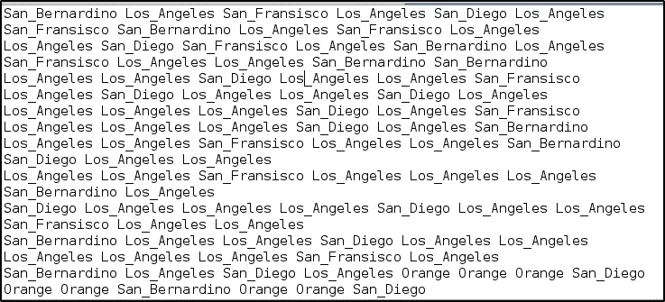
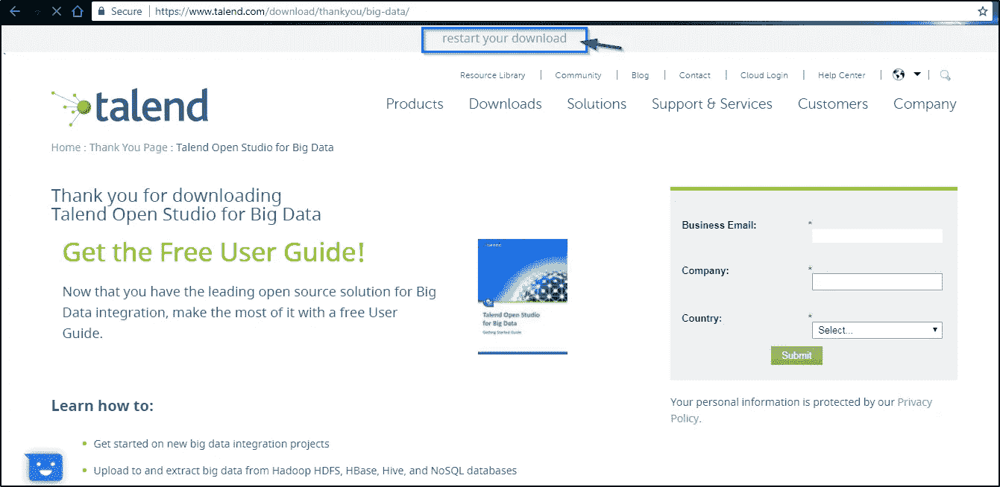

# Talend 大数据教程-如何将 Talend 与大数据技术结合使用

> 原文：<https://medium.com/edureka/talend-big-data-tutorial-7500d3b457a8?source=collection_archive---------4----------------------->


Talend Big Data Tutorial - Edureka

最近的科技市场发生了很多革命和变化。随着人们对大数据和分析越来越感兴趣，开源软件的受欢迎程度大幅上升，这已经不是什么新闻了。在市场上出现的所有开源 ETL 软件中，Talend 使用得相当普遍。在本文中，我将讨论如何将 Talend 与各种大数据技术结合使用，如 HDFS、Hive、Pig 等。

以下是我将在本文中讨论的主题:

*   大数据
*   大数据的 Talend
*   大数据组件简介
*   TOS 安装
*   Talend 如何让处理大数据变得更简单？

# 大数据

大数据是极其庞大和复杂的数据集，无法使用任何传统的数据管理工具进行处理。这些庞大的数据集可以以结构化、半结构化或非结构化的格式呈现。这些通常是数据流，可以由自动生成的报告、日志、客户行为分析结果或各种数据源的组合组成。下图显示了大数据的主要特征。他们更普遍地被称为大数据的 5 V。


为了分析这种庞大的数据集，你需要一千多台计算机的分布式计算能力，这些计算机可以并行分析这些数据并集中存储结果。开源软件框架 Hadoop 完美地满足了这一需求。它是一个分布式文件系统，将收集到的信息分成许多数据块，这些数据块又分布在网络上的多个系统中。它为几乎所有数据类型提供了巨大的存储空间、强大的处理能力以及处理几乎无限的任务或同时执行的作业的能力。

在本文的下一部分，我将讨论如何将大数据和 Talend 结合使用。

# 大数据的 Talend

Talend Open Studio(TOS)for big data 构建于 Talend 的数据集成解决方案之上。它是一个开源软件，为用户提供了一个易于使用的图形开发环境。它是一个强大的工具，利用 *Apache Hadoop 大数据*平台，帮助用户访问、转换、移动和同步大数据。它使用户与大数据源和其他目标的交互变得非常简单，因为他们不必学习或编写任何复杂的代码来使用它。

您需要做的只是配置大数据连接，然后执行简单的拖放操作。用于大数据的 Talend Open Studio (TOS)位于后端，将自动生成底层代码。现在，您可以轻松地将它们部署为服务或独立作业，在 HDFS、Hive、Pig 等大数据集群上运行。

以下是 Talend 大数据功能架构的图示。


但是，在我介绍 Talend Open Studio 之前，让我先解释一下 HDFS 和 MapReduce，以及它们在没有 Talend 的情况下是如何工作的。

# 大数据组件简介

如上所述，Hadoop 是处理大数据的强大工具。但是您是否想知道它是如何处理这些庞大的数据集的？Hadoop 由两个核心模块提供支持，这两个模块可以非常高效地处理大数据。它们是:

1.  HDFS (Hadoop 分布式文件系统)
2.  MapReduce

让我们一个一个地谈论它们:

## HDFS (Hadoop 分布式文件系统)

HDFS 是 Hadoop 平台的文件管理系统，用于跨集群中的多个服务器存储数据。在这种情况下，数据集被分解为许多块，并分布在整个集群的各个节点上。除此之外，为了保持数据的持久性，HDFS 在不同的节点上保存这些数据块的副本。因此，在一个节点出现故障的情况下，其他活动节点仍将保存数据块的副本。

## MapReduce

MapReduce 是 Hadoop 的一个数据处理框架。它用于创建应用程序，这些应用程序可以利用存储在分布式环境(如 HDFS)中的不同文件。MapReduce 应用程序主要有两个功能，它们作为任务在集群中的不同节点上运行。这两个功能是:

1.  **Mappers:** 这些函数读取并处理数据块，生成键值对作为中间输出。然后，这些输出作为输入被输送到减速器。
2.  **还原器:**这些函数从多个映射器函数接收键值对输出。然后，这些键值对被聚合成一个更小的键值对集合，这些键值对被算作最终输出。

让我们看一个简单的例子，如何使用 HDFS 和 MapReduce 从文件中提取唯一值:

这里我们有一个文本文件，其中有些单词是重复的。



使用 MapReduce，我们将尝试计算这些单词在文件中出现的次数，并将输出存储在一个新文件中。为此，您需要很好地了解 Java 编程语言。

```
package co.edureka.mapreduce;
import java.io.IOException;
import java.util.StringTokenizer;
import org.apache.hadoop.io.IntWritable;
import org.apache.hadoop.io.LongWritable;
import org.apache.hadoop.io.Text;
import org.apache.hadoop.mapreduce.Mapper;
import org.apache.hadoop.mapreduce.Reducer;
import org.apache.hadoop.conf.Configuration;
import org.apache.hadoop.mapreduce.Job;
import org.apache.hadoop.mapreduce.lib.input.TextInputFormat;
import org.apache.hadoop.mapreduce.lib.output.TextOutputFormat;
import org.apache.hadoop.mapreduce.lib.input.FileInputFormat;
import org.apache.hadoop.mapreduce.lib.output.FileOutputFormat;
import org.apache.hadoop.fs.Path;

public class WordCount
{
public static class Map extends Mapper<LongWritable,Text,Text,IntWritable> {
public void map(LongWritable key, Text value,Context context) throws IOException,InterruptedException{
String line = value.toString();
StringTokenizer tokenizer = new StringTokenizer(line);
while (tokenizer.hasMoreTokens()) {
value.set(tokenizer.nextToken());
context.write(value, new IntWritable(1));
}
}
}

public static class Reduce extends Reducer<Text,IntWritable,Text,IntWritable> {
public void reduce(Text key, Iterable<IntWritable> values,Context context) throws IOException,InterruptedException {
int sum=0;
for(IntWritable x: values)
{
sum+=x.get();
}
context.write(key, new IntWritable(sum));
}
}

public static void main(String[] args) throws Exception {

Configuration conf= new Configuration();
Job job = new Job(conf,"Counting Unique Words In A File");
job.setJarByClass(WordCount.class);
job.setMapperClass(Map.class);
job.setReducerClass(Reduce.class);
job.setOutputKeyClass(Text.class);
job.setOutputValueClass(IntWritable.class);
job.setInputFormatClass(TextInputFormat.class);
job.setOutputFormatClass(TextOutputFormat.class);
Path outputPath = new Path(args[1]);
//Configuring the input/output path from the filesystem into the job
FileInputFormat.addInputPath(job, new Path(args[0]));
FileOutputFormat.setOutputPath(job, new Path(args[1]));
//deleting the output path automatically from hdfs so that we don't have to delete it explicitly
outputPath.getFileSystem(conf).delete(outputPath);
//exiting the job only if the flag value becomes false
System.exit(job.waitForCompletion(true) ? 0 : 1);
}
}
```

哇哦。！现在你需要做大量的编码工作。尤其是如果你不熟悉编码，这可能会成为一个大问题。此外，在编码和调试这个程序时需要花费大量的精力和时间。但是不用担心！Talend 可以让您不用编写所有这些代码，并且让您的工作变得更加容易，因为您只需要在 Talend 的工作空间中拖放组件。在后端，Talend 会自动为你生成这段代码。但为此，您需要安装 Talend for Big Data。

在这篇关于 Talend 大数据教程的文章的下一部分，我将展示一步一步地安装 TOS for BD。

# TOS 安装

第一步:到[https://www.talend.com/products/talend-open-studio](https://www.talend.com/products/talend-open-studio/)。

**第二步:**点击“下载免费工具”。


**第三步:**如果下载没有开始，点击“重启下载”。



**第四步:**现在解压 zip 文件。


**第五步:**现在进入解压后的文件夹，双击 **TOS_BD-linux-gtk-x86_64** 文件。


**步骤 6:** 让安装完成。


**第 7 步:**点击“创建新项目”并为您的项目指定一个有意义的名称。


**第 8 步:**点击“完成”进入打开的 Studio GUI。

**第 9 步:**右键单击*欢迎选项卡*并选择“关闭”。


第十步:现在你应该可以看到 TOS 主页了。


# Talend 中的大数据组件

Talend 提供了广泛的组件，您可以使用这些组件与 HDFS 和 MapReduce 进行交互。


在本文中，我将解释大数据家族中最重要的组件:

## HDFS

*   ***tHDFSConnection:***该组件有助于连接到给定的 HDFS，以便其他 Hadoop 组件可以重用该连接来与 HDFS 通信。
*   该组件帮助从用户定义的目录中复制文件并粘贴到 HDFS 中，并且能够重命名它们。
*   该组件帮助从 HDFS 复制文件，并粘贴到用户自定义的目录中，还可以对其进行重命名。
*   ***tHDFSInput:*** 这个组件帮助提取 HDFS 文件中的数据，以便其他组件可以处理它。
*   ***tHDFSOutput:*** 该组件帮助将数据流传输到给定的 HDFS 文件系统中。

## 储备

*   ***thive connection:***该组件帮助建立一个配置单元连接，以便它可以被其他配置单元组件重用。
*   ***tHiveInput:*** 该组件帮助执行选择查询，提取相应的数据，并将数据发送给后面的组件。
*   ***tHiveLoad:*** 该组件帮助将不同格式的数据写入给定的配置单元表，或将数据从配置单元表导出到特定的目录。
*   ***tHiveCreatetable:***该组件帮助连接到正在使用的配置单元数据库，并创建一个配置单元表，该表专用于指定格式的数据。
*   ***tHiveClose:*** 该组件帮助关闭与配置单元数据库的连接。

## 猪

*   ***tPigLoad:*** 该组件帮助在数据被验证后，通过一个事务将原始输入数据加载到输出流中。
*   ***tPigMap:*** 该组件帮助转换来自单个或多个源的数据，然后将其路由到单个或多个目的地。
*   ***TPI aggregate:***该组件帮助将一个或多个附加列添加到分组数据的输出中，以生成可由 Pig 使用的数据。
*   ***tPigJoin:*** 该组件根据连接键帮助执行两个文件的内部连接和外部连接，以创建 Pig 使用的数据。

# Talend 如何让处理大数据变得更简单？

现在让我们尝试使用 Talend 执行相同的程序，看看 Talend 如何帮助我们轻松地执行这个程序。

**第一步:**打开 Talend Studio For Big Data，创建一份新工作。

**步骤 2:** 添加 tHDFSConnection 组件，并在其组件选项卡中提供必要的详细信息以设置连接。

**步骤 3:** 现在添加一个 tHDFSPut 组件，以便在 HDFS 上上传您的文件。转到其组件选项卡，指定必要的详细信息，如下所示:


**步骤 4:** 现在添加其余的组件，并将它们连接在一起，如图所示:


**步骤 5:** 转到 tHDFSInput 组件的组件选项卡，输入所需的详细信息。


**第 6 步:**在规格化组件的组件页签中，指定细节，如下图:


**第 7 步:**转到“聚集组件”的“组件”选项卡，提供如下所示的详细信息:


**步骤 8:** 双击 tMap 组件，在弹出窗口中，将输入表映射到所需的输出表，如下所示:


**步骤 9:** 在 tHDFSOutput 组件的组件选项卡中，指定所需的详细信息。


**第 10 步:**在“运行”选项卡中，单击“运行”来执行作业。成功执行的作业将如下所示:

**第 11 步:**它将给出 HDFS 上的输出:


所以，这就把我们带到了这篇关于 Talend 大数据教程的文章的结尾。我尽最大努力保持概念简洁明了。希望它能帮助您理解 Talend 以及它如何处理大数据。

如果你想查看更多关于人工智能、DevOps、道德黑客等市场最热门技术的文章，你可以参考 Edureka 的官方网站。

请留意本系列中的其他文章，它们将解释 Talend 的各个方面。

> 1.[什么是塔伦德？](/edureka/what-is-talend-tool-881b41fc1f5f)
> 
> 2. [Talend 教程](/edureka/talend-tutorial-data-integration-2ecf5159388e)
> 
> 3. [Talend ETL 教程](/edureka/talend-etl-tool-d08b497c33f)
> 
> 4. [Talend 架构](/edureka/talend-architecture-18dd64db2408)

*原载于 2018 年 1 月 3 日 www.edureka.co*[](https://www.edureka.co/blog/talend-big-data-tutorial/)**。**