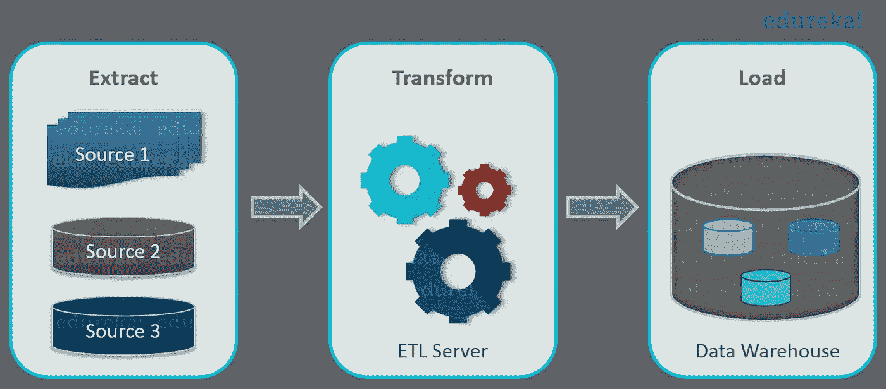
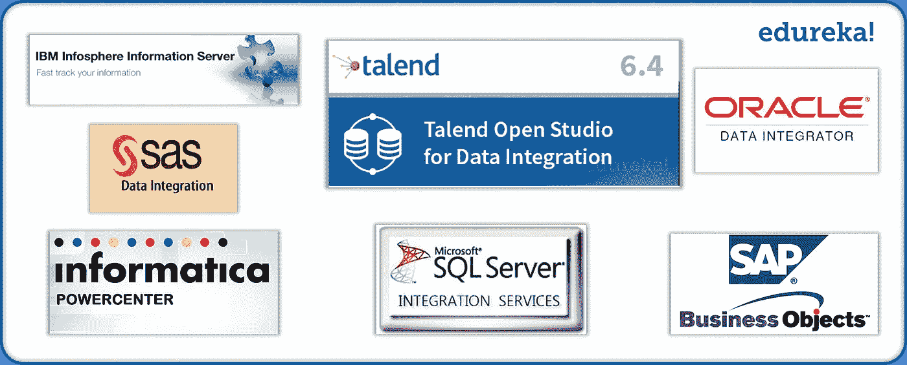
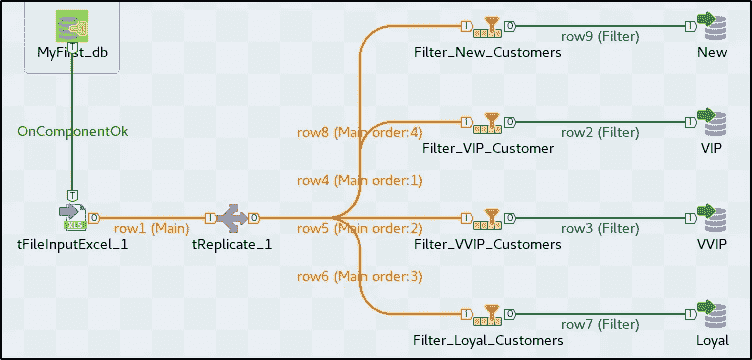
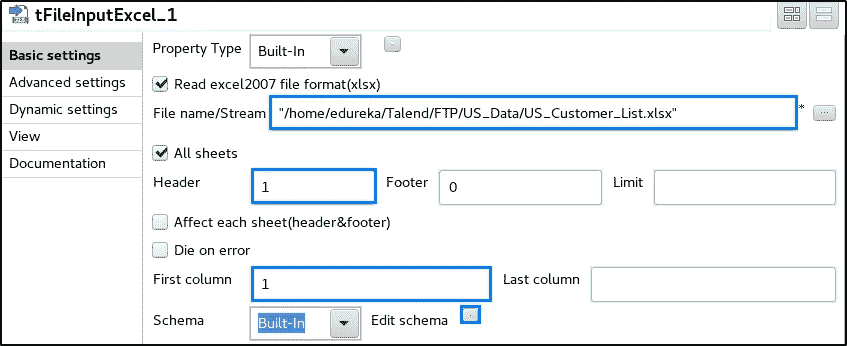
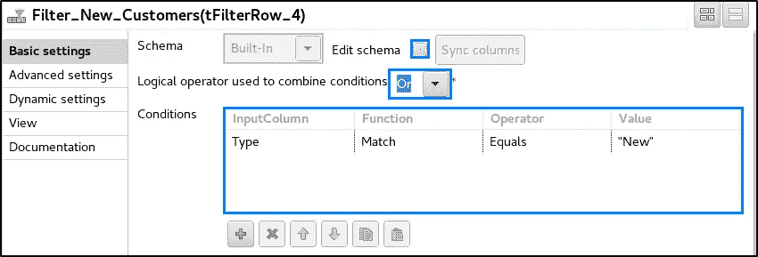
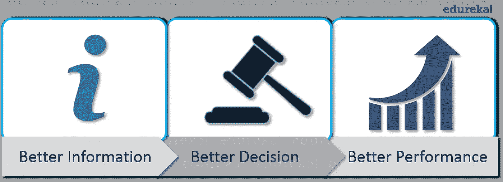

# Talend ETL 工具-了解用于数据处理的 Talend Open Studio

> 原文：<https://medium.com/edureka/talend-etl-tool-d08b497c33f?source=collection_archive---------2----------------------->

处理异构数据无疑是一项乏味的任务，但是随着数据量的增加，这只会变得更加令人厌烦。这就是 ETL 工具帮助将这些数据转换成同质数据的地方。现在，这种转换后的数据很容易分析并从中获得必要的信息。在本文中，我将讨论 Talend 作为 ETL 工具如何出色地从大数据中获取有价值的见解。

在本文中，我将讨论以下主题:

*   什么是 ETL 过程？
*   各种 ETL 工具
*   Talend ETL 工具
*   Talend Open Studio:运行 ETL 作业

# **什么是 ETL 过程？**

ETL 代表提取、转换和加载。它是指将原始数据从其来源移动到数据仓库或数据库所需的三个过程。让我详细解释一下这些过程:

## 1.提取

数据提取是 ETL 中最重要的步骤，它涉及到从所有存储系统中访问数据。存储系统可以是 RDBMS、Excel 文件、XML 文件、平面文件、ISAM(索引顺序存取方法)、分层数据库(IMS)、可视信息等。作为最重要的一步，它需要以不会对源系统产生负面影响的方式进行设计。提取过程还确保每个项目的参数都被明确识别，而不管其来源系统。

## 2.改变

转型是管道中的下一个过程。在这一步中，将分析整个数据，并对其应用各种函数，以将其转换为所需的格式。通常，用于数据转换的过程是转换、过滤、分类、标准化、清除重复、翻译和验证各种数据源的一致性。

## 3.负荷

加载是 ETL 过程的最后阶段。在该步骤中，处理后的数据，即提取和转换后的数据，然后被加载到目标数据储存库，该目标数据储存库通常是数据库。在执行这个步骤时，应该确保加载功能被准确地执行，但是使用最少的资源。此外，在加载时，您必须保持引用完整性，这样您就不会丢失数据的一致性。一旦加载了数据，您就可以选择任何数据块，并轻松地将其与其他数据块进行比较。

现在您已经了解了 ETL 过程，您可能想知道如何执行所有这些？答案很简单，使用 ETL 工具。在本文的下一部分，我将讨论各种可用的 ETL 工具。

# 各种 ETL 工具

但是在我讲 ETL 工具之前，我们先来了解一下 ETL 工具到底是什么。

正如我已经讨论过的，ETL 是执行不同功能的三个独立的过程。当所有这些过程组合在一起成为一个*单一编程工具*时，它可以帮助准备数据和管理各种数据库。这些工具具有图形界面，使用这些界面可以加速在各种源数据库和目标数据库之间映射表和列的整个过程。

***ETL 工具的一些主要好处有:***

*   使用非常简单，因为它消除了编写程序和代码的需要。
*   由于 ETL 工具是基于 GUI 的，它们提供了系统逻辑的*可视化流程*。
*   ETL 工具具有内置的错误处理功能，因此它们具有*操作弹性*。
*   当处理大而复杂的数据时，ETL 工具通过简化任务和帮助你完成各种功能来提供更好的数据管理。
*   与传统系统相比，ETL 工具提供了一套高级的清理功能。
*   ETL 工具具有*增强的商业智能*，它直接影响战略和运营决策。
*   由于 ETL 工具的使用，费用减少了很多，企业也能产生更高的收入。
*   ETL 工具的性能要好得多，因为它的平台结构简化了高质量数据仓库系统的构建。

市场上有各种 ETL 工具，它们被广泛使用。其中一些是:

在所有这些工具中，在本文中，我将讨论 Talend 如何作为一个 ETL 工具。

# Talend ETL 工具

talend open studio for data integration 是市场上最强大的数据集成 ETL 工具之一。TOS 允许您轻松管理 ETL 过程中涉及的所有步骤，从最初的 ETL 设计开始，直到 ETL 数据加载的执行。这个工具是在 Eclipse 图形开发环境上开发的。Talend open studio 为您提供了图形环境，您可以使用该环境轻松地将数据从源系统映射到目标系统。您需要做的就是将所需的组件从面板拖放到工作区，配置它们，最后将它们连接在一起。它甚至为您提供了一个元数据存储库，您可以轻松地重用和重新安排您的工作。随着时间的推移，这肯定会帮助你提高效率和生产力。

由此，您可以得出结论，Talend open studio for DI 提供了一个临时的数据集成以及强大的连接性、简单的适应性和流畅的提取和转换流程。

在本文的下一部分，让我们看看如何在 Talend 中执行 ETL 过程。

# Talend Open Studio:运行 ETL 作业

为了演示 ETL 过程，我将从 excel 文件中提取数据，通过对数据应用过滤器来转换数据，然后将新数据加载到数据库中。以下是我的 excel 数据集的格式:

从这个数据集中，我将根据客户类型过滤出数据行，并将它们存储在不同的数据库表中。要执行此操作，请遵循以下步骤:

**步骤 1:** 创建一个新任务，从调色板中拖放以下组件:

1.  tMysqlConnection
2.  tFileExcelInput
3.  副本
4.  **(**tFilterRow**X4**
5.  **(** tMysqlOutput **)X4**

**步骤 2:** 如下图所示将组件连接在一起:

**步骤 3:** 转到 tMysqlConnection 的组件选项卡，从“属性类型”中选择您正在使用的连接类型；内置或存储库。如果您使用内置连接，则必须指定以下详细信息:

1.  主持
2.  港口
3.  数据库ˌ资料库
4.  用户名
5.  密码

但是如果您使用的是存储库连接，那么默认情况下它会从存储库中获取详细信息。

**步骤 4:** 双击 tFileInputExcel，并在其组件选项卡中指定源文件的路径,“标题”字段中标题所用的行数，以及 Talend 应在“第一列”字段中开始读取数据的列数。在“编辑模式”中，根据数据集文件设计模式。

**步骤 5** :在 tReplicate 的组件选项卡中，点击“同步列”。

**步骤 6:** 转到第一个 tFilterRow 的 component 选项卡，检查模式。根据您的条件，您可以选择列，并指定函数、运算符以及数据过滤所依据的值。

步骤 7: 对所有的 tFilterRow 组件重复相同的步骤。

**步骤 8:** 最后，在 tMysqlOutput 的组件选项卡中，勾选“使用现有连接”。然后在“表”字段中指定表名，并根据需要选择“对表的操作”和“对数据的操作”。

**步骤 9:** 对所有 tMysqlOutput 组件重复相同的步骤。

**第 10 步:**完成后，转到“运行”选项卡，执行作业。

这就把我们带到了本文的结尾。我将用一个你必须遵循的简单想法来结束这篇文章:

> ***未来属于那些能掌控自己数据的人***

如果你想查看更多关于人工智能、DevOps、道德黑客等市场最热门技术的文章，你可以参考 Edureka 的官方网站。

请留意本系列中的其他文章，它们将解释 Talend 的各个方面。

> 1.[什么是塔伦德？](/edureka/what-is-talend-tool-881b41fc1f5f)
> 
> 2. [Talend 教程](/edureka/talend-tutorial-data-integration-2ecf5159388e)
> 
> 3. [Talend 大数据教程](/edureka/talend-big-data-tutorial-7500d3b457a8)
> 
> 4. [Talend 架构](/edureka/talend-architecture-18dd64db2408)

*原载于 2018 年 1 月 11 日*[*www.edureka.co*](https://www.edureka.co/blog/talend-etl-tool/)*。*