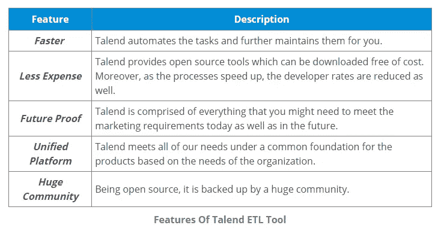
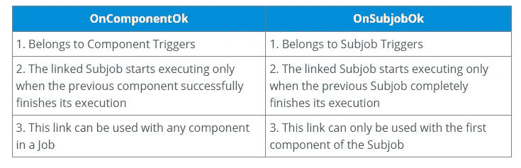
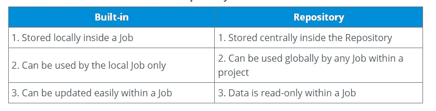
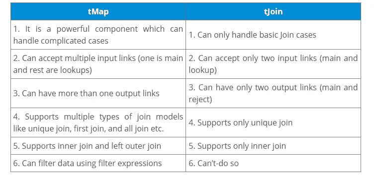
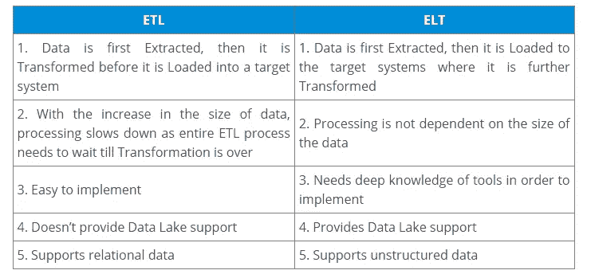
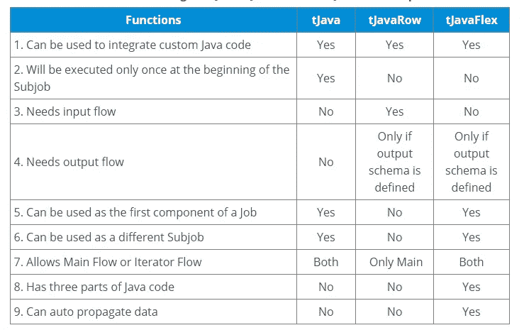

# 2021 年前 75 个面试问题和答案

> 原文：<https://medium.com/edureka/talend-interview-questions-bc9fbfcf0d34?source=collection_archive---------0----------------------->

据说 Talend 是云和数据集成软件的下一代领导者，目前占有 19.3%的市场份额。这意味着在不久的将来会有对认证专家的巨大需求。我认为这是一个抓住这个机会的好时机，让自己做好准备，在竞争中胜出。在这个 Talend 面试问题博客中，我选择了 75 个有助于你成功面试的问题。我把这个面试问题列表分成了 4 个部分:

*   一般面试问题
*   数据集成面试问题
*   大数据人才面试问题
*   多项选择问题

## 1.为什么要使用 Talend 而不是市场上的其他 ETL 工具。

以下是 Talend 的一些优势:

**2。Talend 是什么？**

Talend 是一个开源软件集成平台/供应商。

*   它提供数据集成和数据管理解决方案。
*   这家公司为大数据、云存储、数据集成、数据管理、主数据管理、数据质量、数据准备和企业应用提供各种集成软件和服务。
*   但 Talend 的第一个产品，即用于数据集成的 Talend Open Studio，更普遍地被称为 Talend。

**3。什么是 Talend Open Studio？**

Talend Open Studio 是一个基于 Eclipse RCP 的开源项目。它支持面向 ETL 的实现，通常用于内部部署。这就像一个代码生成器，生成数据转换脚本和底层 Java 程序。它提供了一个交互式的、用户友好的 GUI，允许您访问包含在 Talend 中执行的每个过程的定义和配置的元数据存储库。

**4。Talend 的项目是什么？**

“项目”是最高的物理结构，捆绑并存储所有类型的业务模型、工作、元数据、例程、上下文变量或任何其他技术资源。

**5。用 Talend 描述一个工作设计。**

作业是使用 Talend 构建的任何东西的基本可执行单元。从技术上讲，它是一个单一的 Java 类，借助图形表示定义了可用信息的工作和范围。它通过将业务需求转化为代码、例程和程序来实现数据流。

**6。Talend 中的“组件”是什么？**

组件是用于在 Talend 中执行单一操作的功能块。在调色板上，你能看到的都是组件的图形表示。您可以通过简单的拖放来使用它们。在后端，组件是作为作业的一部分生成的 Java 代码片段(基本上是一个 Java 类)。这些 Java 代码在保存作业时由 Talend 自动编译。

**7。解释 Talend 中可用的各种连接类型。**

Talend 中的连接定义了是否必须处理数据、数据输出或作业的逻辑顺序。Talend 提供的各种类型的连接有:

1.  **行:**行连接处理实际的数据流。以下是 Talend 支持的行连接类型:

*   主要的
*   检查
*   过滤器
*   拒绝
*   错误拒绝
*   输出
*   唯一/重复
*   多输入/输出

**2。Iterate:**Iterate 连接用于对目录中包含的文件、文件中包含的行或数据库条目执行循环。

**3。触发器:**触发器连接用于创建作业或子作业之间的依赖关系，这些作业或子作业根据触发器的性质依次被触发。触发器连接归纳为两类:

1.  **子作业触发**

*   OnSubjobOK
*   OnSubjobError
*   如果运行

**2。组件触发器**

*   OnComponentOK
*   OnComponentError 错误
*   如果运行

**3。Link:**Link 连接用于将表模式信息传输到 ELT 映射器组件。

**8。区分“OnComponentOk”和“OnSubjobOk”。**

**9。为什么 Talend 被称为代码生成器？**

Talend 提供了一个用户友好的 GUI，您可以在其中简单地拖放组件来设计作业。当作业被执行时，Talend Studio 会在后端自动将其翻译成 Java 类。作业中的每个组件都被分成 Java 代码的三个部分(开始、主要和结束)。这就是为什么 Talend studio 被称为代码生成器。

**10。Talend 支持哪些不同类型的模式？**

1.  Talend 支持的一些主要模式类型有:
2.  **存储库模式:**该模式可以在多个作业中重用，并且所做的任何更改都会自动反映到使用它的所有作业中。
3.  **通用模式:**该模式不依赖于任何特定的数据源&被用作跨多种类型数据源的共享资源。
4.  **固定模式:**这些是只读模式，将预定义一些组件。

11。讲解套路。

例程是可重用的 Java 代码片段。使用例程，您可以用 Java 编写自定义代码，以便优化数据处理、提高工作能力和扩展 Talend Studio 功能。

Talend 支持两种类型的例程:

*   **系统例程:**这些是只读代码，您可以在任何作业中直接调用。
*   **用户程序:**这些程序可以由用户通过创建新程序或修改现有程序来定制。

**12。能否在 Talend 中定义运行时模式？**

在运行时不能定义模式。由于模式定义了数据的移动，因此必须在配置组件时进行定义。

13。区分“内置”和“存储库”。

**14。什么是上下文变量，为什么在 Talend 中使用它们？**

上下文变量是 Talend 使用的用户定义的参数，在运行时传递到作业中。随着工作从开发升级到测试和生产环境，这些变量可能会改变它们的值。上下文变量可以用三种方式定义:

1.  嵌入式上下文变量
2.  存储库上下文变量
3.  外部环境变量

**15。能否定义一个可以从多个作业中访问的变量？**

是的，你可以通过在一个例程中声明一个静态变量来实现。然后，您需要在例程本身中为这个变量添加 setter/getter 方法。一旦完成，该变量将可从多个作业中访问。

**16。什么是子作业，如何将数据从父作业传递到子作业？**

子任务可以定义为单个组件或由*数据流*连接的多个组件。一个作业至少可以有一个子作业。要将值从父作业传递到子作业，您需要使用上下文变量。

**17。定义 TOS 中“大纲视图”的使用。**

Talend Open Studio 中的 Outline 视图用于跟踪组件中可用的返回值。这也将包括在 tSetGlobal 组件中配置的用户定义的值。

**18。解释 tMap 组件。列出您可以使用它执行的不同功能。**

*   tMap 是 Talend“处理”系列的核心组件之一。它主要用于将输入数据映射到输出数据。tMap 可以执行以下功能:
*   添加或删除列
*   对任何类型的字段应用转换规则
*   使用约束过滤输入和输出数据
*   拒绝数据
*   复用和解复用数据
*   连接和交换数据

19。区分 tMap 和 tJoin。

20。什么是调度程序？

调度程序是一种软件，它从队列中选择进程，并将其加载到内存中执行。Talend 不提供内置的调度程序。

# 数据整合—面试问题

**21。描述 ETL 过程。**

ETL 代表提取、转换和加载。它是指将原始数据从其来源移动到数据仓库、商业智能系统或大数据平台所需的三个流程。

*   ***提取:*** 这一步包括访问所有存储系统中的数据，如 RDBMS、Excel 文件、XML 文件、平面文件等。
*   ***转换:*** 在这一步中，对整个数据进行分析，并应用各种函数将其转换成所需的格式。
*   ***加载:*** 在该步骤中，通过利用最少的资源，将处理后的数据，即提取和转换后的数据，加载到目标数据储存库，该目标数据储存库通常是数据库。

**22** 。**区分 ETL 和 ELT。**

**23。我们可以在 SFTP 连接中使用 ASCII 或二进制传输模式吗？**

不，传输模式不能用于 SFTP 连接。SFTP 不支持任何类型的传输模式，因为它是 SSH 的扩展，并假设底层安全通道。

24。你如何在塔伦德安排工作？

为了在 Talend first 中安排作业，您需要将作业导出为独立程序。然后使用操作系统的本地调度工具(Windows 任务调度器、Linux、Cron 等)。)你可以安排你的工作。

25。解释 tDenormalizeSortedRow 的用途。

tDenormalizeSortedRow 属于组件的“处理”系列。它有助于合成排序的输入流，以节省内存。它将所有已排序的输入行组合成一个组，其中不同的值用项分隔符连接。

26。区分“插入或更新”和“更新或插入”。

**插入或更新:**在这个动作中，首先 Talend 试图插入一个记录，但是如果一个具有匹配主键的记录已经存在，那么它就更新那个记录。

**更新或插入:**在这个操作中，Talend 首先尝试用匹配的主键更新记录，但是如果没有匹配的主键，则插入记录。

**27。解释 tContextLoad 的用法。**

tContextLoad 属于“杂项”组件系列。该组件有助于动态修改活动上下文的值。基本上，它用于从流中加载上下文。如果在输入中定义的参数没有在上下文中定义，并且如果上下文没有在传入数据中初始化，它将发出警告。

**二十八。讨论 XMX 和 XMS 参数之间的区别。**

XMS 参数用于指定 Java 中的初始堆大小，而 XMX 参数用于指定 Java 中的最大堆大小。

**29。Talend 中的表达式编辑器有什么用？**

从表达式编辑器中，可以轻松查看和编辑所有表达式，如输入、变量或输出以及约束语句。表达式编辑器带有一个专用视图，用于编写任何函数或转换。数据转换所需的必要表达式可以直接在**表达式编辑器**中编写，或者你也可以打开**表达式生成器**对话框，在那里你可以只编写数据转换表达式。

三十岁。解释 Talend 中的错误处理。

有几种方法可以处理 Talend 中的错误:

*   对于简单的作业，可以依赖 Talend Open Studio 的*异常抛出*过程，它在运行视图中显示为红色堆栈跟踪。
*   每个子作业和组件都必须返回一个导致额外处理的代码。子任务正常/错误和组件正常/错误链接可用于将错误导向错误处理例程。
*   处理错误的基本方法是定义一个错误处理子作业，每当出现错误时，都应该执行该子作业。

**31** 。**区分 tJava、tJavaRow 和 tJavaFlex 组件的用法。**

**32。如何远程执行 Talend 作业？**

您可以从命令行远程执行 Talend 作业。您需要做的就是，导出作业及其依赖项，然后从终端访问它的指令文件。

**33。在加载数据之前，可以从输入文件中排除页眉和页脚吗？**

是的，在从输入文件加载数据之前，可以很容易地排除页眉和页脚。

**34。解释解决“堆空间问题”的过程。**

当 JVM 试图向堆空间区域添加比可用空间更多的数据时，就会出现“堆空间问题”。要解决这个问题，您需要修改分配给 Talend Studio 的内存。然后你要修改相关的工作室。ini 配置文件，根据您的系统和需要。

35。“tXMLMap”组件的用途是什么？

该组件将来自一个或多个源的数据转换并路由到一个或多个目的地。它是一个高级组件，专为转换和路由 XML 数据流而设计。尤其是当我们需要处理大量 XML 数据源时。

# **大数据— Talend 面试问题**

36。区分用于数据集成的 TOS 和用于大数据的 TOS。

Talend Open Studio for Big Data 是 Talend For Data Integration 的超集。它包含 TOS 为 DI 提供的所有功能，以及一些附加功能，如支持大数据技术。也就是说，用于 DI 的 TOS 只生成 Java 代码，而用于 BD 的 TOS 生成 MapReduce 代码和 Java 代码。

37。Talend 支持的各种大数据技术有哪些？

在面向 BD 的 TOS 中，大数据家族非常庞大，一些最常用的技术包括:

*   卡桑德拉
*   CouchDB
*   谷歌存储
*   HBase
*   HDFS
*   储备
*   MapRDB
*   MongoDB
*   猪
*   Sqoop 等。

**38。如何在 Talend 中并行运行多个作业？**

由于 Talend 是一个 java 代码生成器，所以可以执行多线程中的各种作业和子作业，以减少作业的运行时间。基本上，在 Talend 数据集成中有三种并行执行方式:

1.  *多线程*
2.  *t 并行化组件*
3.  *自动并行*

**39。连接到 HDFS 需要哪些强制配置？**

为了连接到 HDFS，您必须提供以下详细信息:

*   分配
*   URI 命名节点
*   用户名

**四十。在 Talend Studio 和 HBase 之间协调事务时，哪项服务是必需的？**

Zookeeper 服务对于协调 TOS 和 HBase 之间的事务是必需的。

**41。Pig 脚本编写使用的语言叫什么名字？**

1.  Pig 拉丁语用于 Pig 中的脚本编写。

**42。什么时候使用 tKafkaCreateTopic 组件？**

这个组件创建了一个 Kafka 主题，其他 Kafka 组件也可以使用这个主题。它允许您可视化地生成命令，以在主题级别创建具有各种属性的主题。

**43。解释 tPigLoad 组件的用途。**

一旦数据通过验证，这个组件就可以在一个事务中将原始输入数据加载到输出流中。它为当前事务建立到数据源的连接。

44。一旦主作业完成执行，您需要使用哪个组件来自动关闭配置单元连接？

使用 tPostJob 和 tHiveClose 组件，您可以自动关闭配置单元连接。

# MCQ —面试问题

45。在 Talend Studio 中，哪里可以找到创建作业所需的组件？

1.  贮藏室ˌ仓库
2.  运行视图
3.  设计师工作空间
4.  调色板

46。在组件视图中，您可以从哪里更改组件的名称？

1.  基本设置
2.  高级设置
3.  证明文件
4.  查看[答案]

47。HDFS 组件只能用于大数据批处理或大数据流作业。

1.  真实的
2.  False [Ans]

48。可以在 Talend Studio 的哪个透视图中执行对 Hive 表内容的分析？

1.  剖析[答案]
2.  综合
3.  大数据
4.  调解

49。在设计工作区中，工单名称旁边的星号表示什么？

1.  这是一项活跃的工作
2.  作业包含未保存的更改[Ans]
3.  该作业当前正在运行
4.  该作业包含错误

**50。假设您已经使用 MapReduce 框架设计了一个大数据批处理。现在您想使用 Map Reduce 在集群上执行它。在运行视图的 Hadoop 配置选项卡中，哪些配置是强制性的？**

1.  名称节点[Ans]
2.  数据节点
3.  资源管理程序
4.  工作追踪系统

**51。如何找到一个组件的配置错误信息？**

1.  右键单击组件并选择“显示问题”
2.  将鼠标悬停在设计器视图中的错误符号上[Ans]
3.  打开错误视图
4.  打开作业视图

52。在 tMap 配置窗口中连接两个输入列的过程是什么？

1.  将主输入表中的列拖到另一个输入表中的列[Ans]
2.  右键单击输入表中的一列并选择“连接”
3.  在两个不同的输入表中选择两列，右键单击，然后选择“Join”
4.  在两个不同的输入表中选择两列，并将它们拖到输出表中

**54。要从 FTP 导入文件，以下哪些是必需的组件？**

1.  tFTPConnection，tFTPPut
2.  tFTPConnection，tFTPFileList，tFTPGet
3.  tFTPConnection，tFTPGet [Ans]
4.  tFTPConnection，tFTPExists，tFTPGet

**55。假设您有三个作业，其中作业 1 和 2 是并行执行的。只有在作业 1 和作业 2 完成执行后，作业 3 才会执行。以下哪些组件可用于设置此功能？**

1.  透闪石
2.  发布工作
3.  tRunJob
4.  平行化[Ans]

**56。对于 tFileInputDelimited 组件，默认的字段分隔符参数是什么？**

1.  分号[Ans]
2.  管
3.  逗号
4.  结肠

**57。在保存对 tMap 配置的更改时，有时 Talend 会要求您确认是否传播更改。为什么？**

1.  因为您的更改会影响输出模式，并且源组件应该有匹配的模式
2.  因为您的更改会影响输出模式，并且目标组件应该有一个匹配的模式[Ans]
3.  因为您的更改会影响输入模式，并且相关的源组件应该有一个匹配的模式
4.  因为您的更改尚未保存

**58。在 Talend 中，如何将形状添加到商业模型中？**

1.  从调色板中单击并放置它
2.  从存储库中拖动它
3.  单击快速访问工具栏中的
4.  从调色板中拖放它[Ans]

**59。如何在两个组件之间创建行链接？**

1.  将目标组件拖到源组件上
2.  右键单击源组件，然后单击目标组件
3.  将源组件拖到目标组件上
4.  右键单击源组件，单击行，后跟行类型，然后单击目标组件[Ans]

60。Talend Open Studio 以下列哪种格式生成作业文档？

1.  HTML [Ans]
2.  文本
3.  战斗支援车
4.  可扩展标记语言

**61。我们可以直接在 Talend 中修改生成的代码。**

1.  真实的
2.  False [Ans]

**62。Talend Open Studio 中默认的日期模式是什么？**

1.  月-日-YY
2.  DD-MM-YY [Ans]
3.  日-月-年
4.  YY-MM-DD

63。MDM 代表

1.  元数据管理
2.  移动设备管理
3.  主数据管理[Ans]
4.  模拟数据管理

**65。为了将收集到的日志数据封装并传递给输出，哪些组件必须与 tLogCatcher 一起使用？**

1.  tWarn [Ans]
2.  tDie [Ans]
3.  tStatCatcher
4.  捕手

**66。为了从输入流中逐行读取数据并将数据条目存储到迭代全局变量中，您需要使用哪个组件？**

1.  tIterateToFlow
2.  tFileList
3.  tFlowToIterate [Ans]
4.  tLoop

**67。tMemorizeRows 属于 Talend 中的哪个组件族？**

1.  杂项[答案]
2.  管弦乐编曲
3.  互联网
4.  文件

68。存储库中定义的数据库连接可以由项目中的任何作业重用。

1.  真实[答案]
2.  错误的

69。使用哪个组件可以将个性化 Pig 代码与 Talend 程序集成在一起？

1.  tPigCross
2.  tPigMap
3.  tPigDistinct
4.  tPigCode [Ans]

70。tKafkaOutput 组件接收序列化为哪种数据类型的消息？

1.  字节
2.  字节[] [Ans]
3.  字符串[]
4.  整数

71。tHDFSProperties 组件属于哪两个双组件系列？

1.  大数据和杂项
2.  流程编排和大数据
3.  文件和大数据[Ans]
4.  大数据和互联网

72。该组件用于从高速数据存取的高速缓冲存储器中读取数据

1.  tHashInput
2.  tFileInputLDIF
3.  tHDFSInput
4.  tFileInputXML

73。使用哪个组件可以计算主作业中一个或多个子作业的加工时间？

1.  流量计
2.  tChronometerStart [Ans]
3.  tFlowMeterCatcher
4.  tStatCatcher

74。透闪石成分属于以下哪两个家族？

1.  文件和处理
2.  杂项和消息传递
3.  流程编排和消息传递
4.  编排和处理[Ans]

75。使用 tjavaFlex，您可以在工作中添加多少部分 Java 代码？

1.  一个
2.  二
3.  三个[答案]
4.  四

这就把我们带到了这个关于面试问题的博客的结尾。我希望它能增长见识。如果你想查看更多关于人工智能、DevOps、道德黑客等市场最热门技术的文章，那么你可以参考 [Edureka 的官方网站。](https://www.edureka.co/blog/?utm_source=medium&utm_medium=content-link&utm_campaign=talend-interview-questions)

请留意本系列中解释 Talend 各个方面的其他文章。

> *1。* [*Talend 教程*](/edureka/talend-tutorial-data-integration-2ecf5159388e)
> 
> *2。* [*Talend ETL 教程*](/edureka/talend-etl-tool-d08b497c33f)
> 
> *3。* [*Talend 大数据教程*](/edureka/talend-big-data-tutorial-7500d3b457a8)
> 
> *4。* [*塔伦德建筑*](/edureka/talend-architecture-18dd64db2408)

*原载于 2019 年 3 月 29 日*[*https://www.edureka.co*](https://www.edureka.co/blog/interview-questions/talend-interview-questions/)*。*