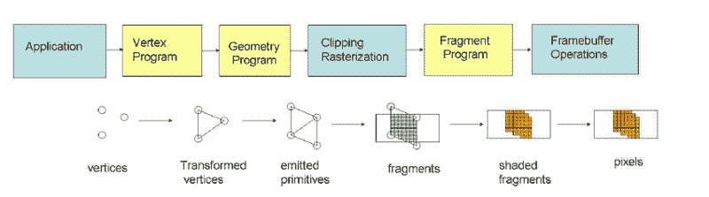
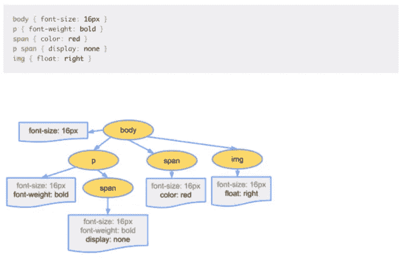
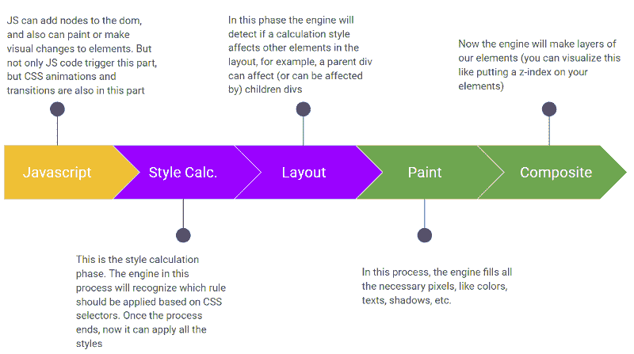
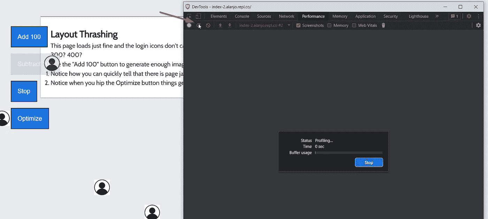
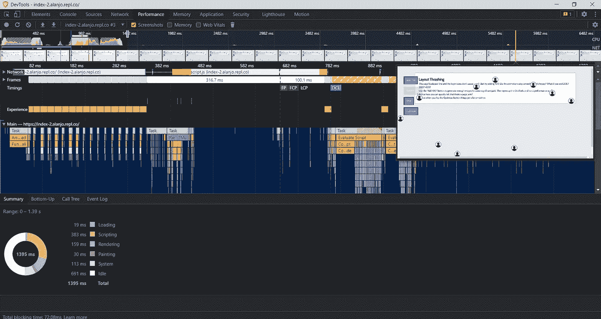

# 谈论前端和性能

> 原文：<https://medium.com/globant/talking-about-front-end-and-performance-bf6a634fcaca?source=collection_archive---------0----------------------->

Photo by [Marc-Olivier Jodoin](https://unsplash.com/es/@marcojodoin?utm_source=medium&utm_medium=referral) on [Unsplash](https://unsplash.com?utm_source=medium&utm_medium=referral)

在本文中，我们将深入探讨与 Web UI 相关的性能主题。作为前端(FE)开发人员，有时我们没有像应该的那样考虑性能，所以当我们写下一些代码时，必须记住这些主题。尽管我们将讨论普通的 JS，但是暴露的概念适用于每一个 JS 框架，因为 JS 是我们现在使用的最流行的框架的核心。

# 计算机图形渲染过程

首先，我们必须了解内容是如何被处理出现在我们的屏幕上的。为了使本文尽可能简单，我们假设内容在屏幕上的绘制方式遵循计算机图形管道，如下所示:

这个过程我不会深究太多，但是把概念记在心里是必不可少的；现在这可能没有太大的意义，但是随着文章的深入，它会变得有意义。在一个简单的世界中，这个过程的大部分是由我们的 GPU 管理的。本质上，计算机首先以三角形的形式制作点(顶点)，然后程序用线连接那些点，在这之后，它将内部区域光栅化；一旦完成，它就可以画出每个像素，当这个过程完成时，我们最终得到在屏幕上呈现的输出。

# web 渲染过程

我们刚刚看到了我们如何在屏幕上获得图形，以及大多数渲染引擎是如何工作的，但是现在我们需要了解渲染过程如何在 web 上工作。我们的网站总是包含 HTML、CSS 和 JS 文件。这个过程看起来是这样的:

*   加载网页时，服务器将所需的文件(以字节形式)发送到 web 客户端。
*   浏览器引擎根据文件的指定编码将这些字节转换为字符。这些单独的字符被转换成记号、节点，最后是对象模型。
*   浏览器将节点转换成树形结构；我们知道这是一个 DOM。DOM 是文档对象模型，是一棵逻辑树，当我们想从 JS 操作我们的 web 时，它使我们的生活变得更容易。
*   浏览器还将 CSS 代码解析为 CSSOM (CSS 对象模型)。

您可能已经看到了 DOM 结构，但这是 CSSOM 的样子:

Image by [Ilya Grigorik](https://web.dev/authors/ilyagrigorik/) from [web.dev](https://web.dev/)

上图显示了我们的 CSS 代码是如何与一个节点相关联的；这种结构非常类似于 DOM 树。本质上，CSSOM 是一棵树，其中每个节点都有我们的 CSS 属性。在这一点上，特殊性也是必不可少的，因为在这一点上，我们的 CSS 中的所有覆盖也被认为是在我们的节点内部。

既然我们有了更好的想法，我们可以进入下一个话题。

# 自然渲染像素流水线

我写这篇文章的主要目的是让读者理解**就性能而言，这是 FE 开发人员最重要的概念**。如果你作为一名开发人员采用这些概念，你将永远知道你何时打破了自然渲染像素管道。

The natural render pixel pipeline in action

在图像中，我们可以看到五个不同的阶段。在每个阶段，我们都可能无意中在渲染过程中引入瓶颈。还有我想再提一下 [**栅格化**](https://www.scratchapixel.com/lessons/3d-basic-rendering/rasterization-practical-implementation) 。首先，让我们打开测试页面上的 DevTools，转到**性能**选项卡，激活**截图选项**，如下所示:

Obtaining a technical performance report for a website

在上图中，您可以看到您可以通过单击“reload”箭头开始分析。这将开始你的网站的性能记录。一个业绩记录基本上就是一个网站的业绩简介；它将包含主线程中正在进行的所有事情、截图、web workers、FPS 和其他有趣的事情。

当你在页面上看到 paint (见下图右上角截图**)****你应该记得栅格化正在发生。这是因为要在屏幕上绘制内容(正如我们在计算机图形管道中看到的)，引擎必须创建一个绘制任务，然后填充像素。**

**下图显示了一个网站的完整性能报告(你可以在这里了解更多[)，包括 FPS 信息、网络请求、内存泄漏和一个大*等等*。](https://developer.chrome.com/docs/devtools/evaluate-performance/)**

****

**A complete performance report of a website, here you can observe scripting and painting times and other information.**

# **使用自然渲染像素管道**

**让我解释一下。当使用 JavaScript 代码操作 DOM 或一些 CSS 转换时，可能会导致页面上的回流。每当您更改与元素的几何图形相关的内容时，您将再次触发自然渲染管道。**

**让我们假设你改变了一个元素的宽度:那么你正在改变几何图形。浏览器引擎将重新计算并检查其他元素是否受其影响，这将导致回流。**

**所有受影响的元素都需要重新绘制；之后，它们将再次经历复合阶段。**

****

**如果你**改变了一些与绘画过程相关的属性**，比如一个元素的**背景颜色**，那么你只是触发了**绘画阶段**而跳过了布局阶段。**

**最后，如果你改变图层的组成，那么你只会触发那个阶段。您可以通过用 JS 或 CSS 更改`**z-index**`来触发复合层。此外，您可以通过在 transform 属性中使用`**translateZ**` 来更改图层的合成。**

**这是最轻的渲染工作，但这并不意味着不可能有问题；有时候，你可以造成一个“[层爆炸](https://www.alibabacloud.com/blog/front-end-performance-optimization-with-accelerated-compositing-part-1_594194)”(如果你不断堆叠层)，没有人希望这样。**

**值得一提的是，导致层爆炸是非常罕见的，因为浏览器的“层挤压”(阅读层爆炸参考)过程试图避免这一点。但是让我们把它留到下一篇关于性能的文章中。**

**改变覆盖(并不断更新)其他样式的类**会**导致你的网站回流，也会[布局垃圾化](https://web.dev/avoid-large-complex-layouts-and-layout-thrashing/)。另外，在修改子树节点时要小心。**

**另一个需要注意的重要事情是，触发浏览器同步计算元素的样式和布局通常会导致布局垃圾化，因此当我们计算或更改元素大小时，可能会引入一些性能瓶颈。**

# **结论**

**我们将在下面的文章中更多地讨论回流，但现在，我将列出一些可能导致网站回流的因素:**

*   **添加或移除类、元素或样式**
*   **更改视口的方向**
*   **计算或改变大小或位置(小心使用`**getBoundingClientRect**`,因为这个本地 API 同步计算元素的大小)**

**当您想使用 JS 向 DOM 添加一些节点时，请记住本文中讨论的概念。您可能在想所有这些在代码上看起来是什么样子，事实是，当我们谈论性能时，事情很简单，但这并不意味着“容易”。但是不用担心；我计划在下面的文章中回顾与前端性能相关的所有内容。在以后的章节中，我们将讨论以下内容:**

*   **DevTools、性能分析器和 JavaScript 分析器**
*   **网络进程**
*   **特性试验**
*   **布局抖动(真实示例)**
*   **内存和 CPU 泄漏**

**如果你想深入到暴露的话题，那么你可以看看这些链接:**

*   **[了解图形管道](https://www.youtube.com/watch?v=0PTBOX1HHIo&ab_channel=OscarChavez)**
*   **[前端 web 性能优化的基本要素](/@matthew.costello/frontend-web-performance-the-essentials-0-61fea500b180)**