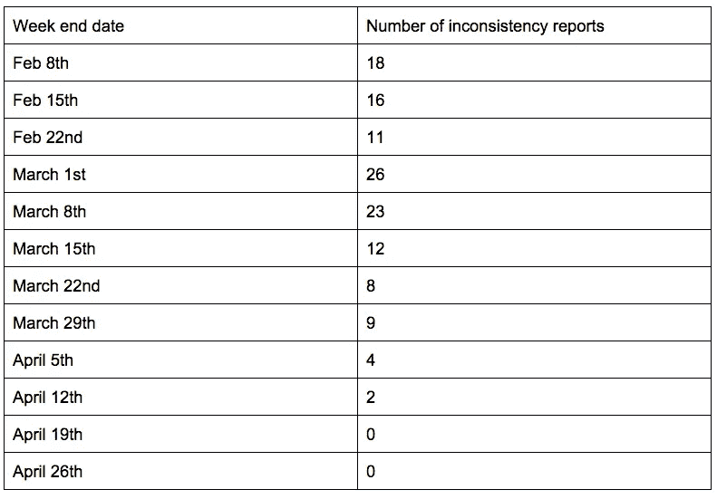

# 驯服数据不一致性

> 原文：<https://medium.com/pinterest-engineering/taming-data-inconsistencies-96ae43ced0ce?source=collection_archive---------2----------------------->

Vamsi Ponnekanti | Pinterest 工程师，基础设施

在每个 Pinner 的个人资料上，都有他们保存和喜欢的 pin 的数量。类似地，每块电路板显示保存到其中的引脚数。有时，Pinners 会报告计数不正确，因此我们构建了一个内部工具，通过重新计算计数来纠正这个问题。Pinner 运营团队使用该工具来修复报告的不一致之处，但是随着时间的推移，此类报告越来越多。这不仅是团队的负担，也可能让 Pinners 认为 Pinterest 不可靠。我们需要确定问题的根源，并大幅减少此类报告。在这里，我将详细说明为什么有些计数是错误的，可能的解决方案，我们采取的方法和我们看到的结果。

## 解决问题

深入研究这个问题后，我们发现了导致计数错误的一些原因，包括:

*   Pinner 停用:如果用户 A 喜欢用户 B 保存的 Pin，并且用户 B 停用了他们的帐户，则 Pin 不会显示给用户 A，但是 Pin 仍然包括在计数中。(注意:极少数 Pinners 会多次停用和重新激活他们的帐户。)
*   垃圾邮件/色情过滤:如果一个 Pin 被怀疑有垃圾邮件或色情内容，它不会显示出来，但仍会反映在计数中。识别垃圾邮件/色情内容的方案在不断发展，几乎每天都有域名被添加到可疑列表或从可疑列表中删除。
*   非事务性更新:一些计数在单独的事务中异步更新，以优化操作(如 Pin 创建)的延迟。在一些罕见的失败场景中，计数可能没有更新。

## 可能的解决方案

***选项一:修复根本原因***
我们首先来看修复根本原因的思路。每当 Pinner 停用/重新激活他们的帐户，我们可以更新所有可能喜欢他们的 pin 的 pin ner 的配置文件中的计数。

同样，每当色情/垃圾邮件过滤方案发生变化时，我们可以更新受影响 pin 的所有者的个人资料，以及喜欢并保存此类 pin 的 Pinners 的个人资料和公告板中的计数。

为了解决由非事务性更新引起的问题，我们需要在同一个事务中更新计数，这可能会增加 Pin 创建等操作的延迟。

这种解决方案不仅昂贵，而且也不能解决已经存在的矛盾。

***选项 2:离线分析和修复***
另一种在类似情况下常用的方法是离线分析和修复，我们可以每天将在线数据库中的数据转储到 Hadoop，并且可以从 Hive 中查询这些数据。我们可以有一个离线作业来查找不一致，另一个后台作业来修复在线数据库中的不一致。由于在线数据可能在执行离线分析后发生变化，因此需要在更新在线数据库中的计数之前对其进行重新验证。

我们发现这是一个很好的解决方案，并使用类似的方法来修复 HBase 存储中的不一致。然而，基于过去的经验，我们知道建造它的努力不是一件小事。

***方案三:在线检测快修***
我们也想过在线检测快修。如果 Pinner 检测到他们档案中的数据不一致，我们的系统也应该能够检测到。例如，如果 Pinner 滚动浏览他们喜欢的所有 pin，系统可以检查显示的喜欢的 pin 的计数是否与他们的简档中显示的计数匹配。这种检测方式比以前的解决方案简单，开销小。

一旦检测到不正确的计数，我们可以将一个作业排队以修复计数，这样我们就可以在下次显示正确的计数。我们已经有了一个框架， [PinLater](https://engineering.pinterest.com/post/91288882494/pinlater-an-asynchronous-job-execution-system) ，它可以将任意的任务排队等待以后执行。通常，此类作业在排队后几秒钟内就会运行。

修复计数的作业将具有关于修复哪个计数器的信息(例如用户 ID 或板 ID)，以及关于存储的计数(即显示的计数)和实际计数的信息。这项工作可以使用与我们的内部工具相同的逻辑来重新计算和修复计数。

计数修正作业将检查存储的计数和实际计数是否仍与排队时相同。如果是，它会将存储的计数更新为实际计数。如果存储的计数或实际计数与排队时的计数不同，则计数不会更新，因为它表示状态发生了一些变化，例如可能有新的 pin 进入。

然而，这个解决方案不能检测所有的不一致。例如，如果 Pinner 没有点击他们个人资料中的“喜欢”或“大头针”，或者如果他们没有滚动他们的整个大头针列表，它就不能检测到不一致。这种解决方案也不适用于在线读取过程中检测成本高昂的不一致性。

## 选择的解决方案

从短期来看，第三种解决方案(在线检测和快速修复)是首选，因为它可以近乎实时地修复计数中存在的不一致，并且易于实施。从长远来看，我们仍可能建立第二种解决方案。

## 结果

在部署并逐步提升解决方案以修复 1%到 100%的用户计数后，几乎所有 Pinner 关于计数不一致的报告都消失了。下表显示了大约 12 周内的报告数量，包括发布前几周、加速期和发布后几周。

