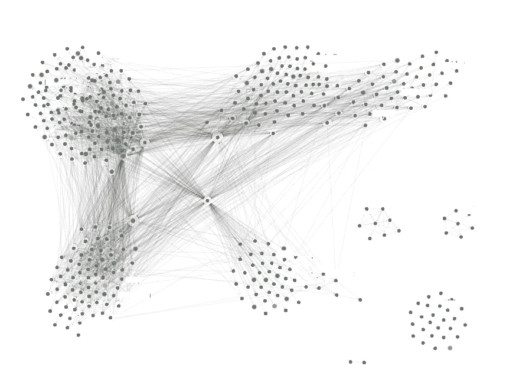

# 使用面向数据的服务网格驯服面向服务的架构

> 原文：<https://medium.com/airbnb-engineering/taming-service-oriented-architecture-using-a-data-oriented-service-mesh-da771a841344?source=collection_archive---------2----------------------->

介绍 Airbnb 面向数据的服务网格——高架桥

作者:雷米·斯塔塔、阿伦·维贾维尔吉亚、亚当·米斯杰维茨

在 10 月 22 日 Hasura 的 [Enterprise GraphQL Conf](https://hasura.io/enterprisegraphql/) 上，我们展示了高架桥，我们称之为*的面向数据的服务网格*，我们相信它将在我们基于微服务的面向服务架构(SOA)的模块化方面带来一步功能改进。在这篇博文中，我们描述了高架桥背后的哲学，并提供了其工作原理的草图。请[观看演示](https://www.youtube.com/watch?v=xxk9MWCk7cM)了解更多细节。

# 海量 SOA 依赖图

一段时间以来，面向服务的体系结构一直朝着越来越多的小型微服务发展。现代应用可以由成千上万个以不受限制的方式连接的微服务组成。因此，类似如下的依赖关系图并不少见:

这张特殊的依赖图恰好来自 Airbnb，但这并不罕见。[亚马逊](https://twitter.com/werner/status/741673514567143424)、[网飞](/refraction-tech-everything/how-netflix-works-the-hugely-simplified-complex-stuff-that-happens-every-time-you-hit-play-3a40c9be254b)和[优步](https://eng.uber.com/microservice-architecture/)是那些共享类似复杂依赖图的例子。

这些依赖图让人想起[意大利面条代码](https://en.wikipedia.org/wiki/Spaghetti_code)，只是在微服务级别。类似于意大利面条式代码随着时间的推移变得越来越难修改，意大利面条式 SOA 也是如此。为了帮助管理基于微服务的架构中固有的大量服务，我们需要组织原则以及实现这些原则的技术措施。在 Airbnb，我们努力寻找这样的原则和措施。我们的调查让我们想到了*面向数据的服务网格*、的概念，我们认为它将模块化带到了 SOA 的新高度。

# 面向过程与面向数据的设计

将大型程序组织成模块化单元在软件工程中并不是一个新问题。直到 20 世纪 70 年代，软件组织的主要范式集中在将代码分组为过程，将过程分组为模块。在这种方法中，模块发布一个公共 API 供模块外的代码使用；在这个公共 API 背后，模块隐藏了它们的内部、助手过程和其他实现细节。Pascal 和 C 等语言就是基于这种范式。

从 80 年代开始，范式转变为主要围绕数据而不是过程来组织软件。在这种方法中，模块定义了对象的类，这些类封装了通过对象上的方法的公共 API 访问的对象的内部表示。像 Simula 和 Clu 这样的语言开创了这种组织形式。

SOA 是向更加面向过程的设计的倒退。今天的微服务是程序端点的集合——一个经典的、20 世纪 70 年代风格的模块。我们相信 SOA 需要发展以支持面向数据的设计，并且这种发展可以通过将我们的服务网格从面向过程转变为面向数据来实现。

# 高架桥:面向数据的服务网

现代可伸缩 SOA 应用的核心是一个*服务网格*(例如 [Istio](https://istio.io/) ， [Linkerd](https://linkerd.io/) )，它将服务调用路由到能够处理它们的微服务实例。服务网格的当前行业标准是专门围绕远程过程调用进行组织，而不了解组成应用程序架构的任何数据。我们的愿景是用围绕*数据组织的服务网格取代这些面向过程的服务网格。*

在 Airbnb，我们正在使用™️graph QL 建立一个名为高架桥的面向数据的服务网络。高架桥服务网格根据 GraphQL 模式定义，包括:

*   *类型*(和*接口*)描述在您的服务网格中管理的数据
*   *查询*(和*订阅*)提供了访问数据的方法，这些数据是从提供数据的服务入口点抽象出来的
*   *突变*提供更新数据的方法，同样是从服务入口点抽象出来的

模式中的类型(和接口)定义了跨服务网格中管理的所有数据的单一图形。例如，在一家电子商务公司，服务网格的模式可以定义一个返回类型为`Product`的结果的字段`productById(id: ID)`。从这个起点开始，单个查询允许数据消费者导航到关于产品制造商的信息，例如`productById { manufacturer }`；产品评论，如`productById { reviews }`；甚至那些评论的作者，如`productById { reviews { author } }`。

这种查询所请求的数据元素可能来自许多不同的微服务。在面向过程的服务网格中，数据消费者需要将这些服务视为显式依赖。在我们面向数据的服务网格中，是服务网格，即高架桥，而不是数据消费者，知道哪个服务提供哪个数据元素。高架桥抽象了任何单一消费者的服务依赖。

# 将模式放在中心

在我们的演讲中，我们将讨论如何不同于其他分布式 GraphQL 系统，如 [GraphQL 模块](https://graphql-modules.com/)或 [Apollo Federation](https://www.apollographql.com/docs/federation/) ，viaclaus 将模式作为单个工件处理，并实现了几个原语，使我们能够保持一个统一的模式，同时仍然允许许多团队在该模式上进行富有成效的协作。随着高架桥越来越多地取代我们的底层面向过程的服务网格，它的模式越来越完整地捕获由我们的应用程序管理的数据。我们已经利用了这个“中心模式”，我们称之为定义我们的一些微服务的 API 的地方。特别是一些微服务的 API，我们已经开始使用 GraphQL。对于这些微服务，它们的 GraphQL 模式被定义为中央模式的子集。将来，我们希望进一步发展这一思想，使用中心模式来定义存储在数据库中的数据的模式。

此外，使用中心模式来定义我们的 API 和数据库模式将解决大规模 SOA 应用程序的更大挑战之一:数据敏捷性。在当今的 SOA 应用程序中，对数据库模式的更改通常需要手动反映在两层、三层甚至更多层微服务的 API 中，然后才能暴露给客户端代码。这样的改变可能需要多个团队数周的协调。通过从单个中央模式中派生服务 API 和数据库模式，这样的数据库模式更改可以通过单次更新传播到客户端代码。

# 走向无服务器

通常在大型 SOA 应用程序中，有许多无状态的“派生数据”服务和“后端对前端”服务，它们从较低级别的服务中获取原始数据，并将其转换为更适合在客户端呈现的数据。像这样的无状态逻辑非常适合无服务器计算模型，它完全消除了微服务的运营开销，而是将逻辑托管在“云功能”结构中。

高架桥有一种机制来计算我们所说的“衍生字段”,使用无服务器的云函数，在不知道底层服务的情况下，在图的顶部运行。这些函数允许我们将转换逻辑移出服务网格，移入无状态容器，保持我们的图形整洁，减少我们需要的服务的数量和复杂性。

# 结论

高架桥构建在 [graphql-java](https://www.graphql-java.com/) 之上，支持通过 graphql 选择集进行细粒度的字段选择。它使用现代数据加载技术，采用可靠性技术，如短路和软依赖，并实现了请求内缓存。高架桥提供了*数据的可观察性，*允许我们理解，下至现场级别，什么服务消费什么数据。作为一个 GraphQL 接口，高架桥允许我们利用开源工具的大型生态系统，包括实时 ide、模拟服务器和模式可视化器。

一年多前，高架桥开始为 Airbnb 的生产流程提供动力。我们从零开始，用一个由少数实体组成的清晰的模式，将它扩展到包括 80 个核心实体，能够支持我们 75%的现代 API 流量。

正如引言中提到的，关于高架桥背后的动机和技术的更多细节可以在我们的[展示](https://www.youtube.com/watch?v=xxk9MWCk7cM)中找到。