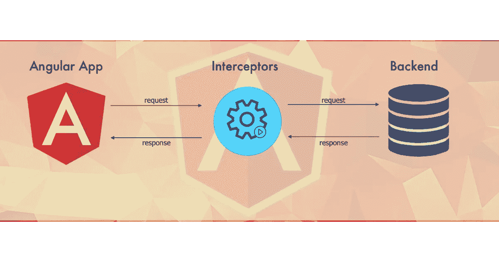
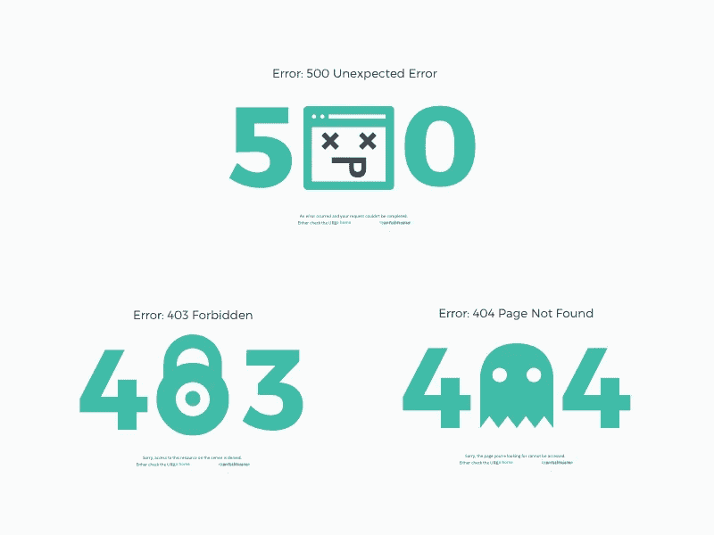

# 接入拦截器

> 原文：<https://medium.com/globant/tapping-into-the-interceptor-8b40980ba436?source=collection_archive---------1----------------------->

The presentational flow for Interceptor

这里有很多在 angular 中使用拦截器的方法。您可以使用它们来操作 URL、显示加载程序、改变 API 响应、操作标题，咻！这个清单还在继续。我相信我们大多数人只看到了它的一小部分。

我打算展示角度拦截器的扩展功能，除了基本的用途，比如将承载令牌传递给请求的 API。我最常用的是错误处理、缓存和链接。我将在这篇文章中解释这一点。

> *先决条件:*角度 4+，API 请求流模式

# **错误处理**

borrowed from [https://in.pinterest.com/pin/432627107954879374/](https://in.pinterest.com/pin/432627107954879374/)

> 作为一个用户，你在加载页面时遇到过多少次错误。盯着写着“过一段时间再试一次”的错误页面可能会令人沮丧，或者还记得过去在网吧反复点击刷新图标吗？？

截击机来拯救我们，同时在一定程度上处理这个问题。

处理错误是任何应用程序的重要和关键部分。Angular 为此提供了 [ErrorHandler](https://angular.io/api/core/ErrorHandler#errorhandler) 类。可以扩展该类来创建一个全局错误处理程序。基本上，您可以处理发生的所有错误，但它主要用于跟踪错误日志。

有时，如果不能像 ErrorHandler 类那样根据错误采取行动，仅仅跟踪错误是不够的。很多时候，应用程序会因为网络相关的问题或中断而失败。由于现在移动设备的使用越来越多，这种情况经常发生，因此故障保护解决方案变得不可避免。

因此，重试请求变得很重要，如果仍然失败，则在必要时根据具体情况处理错误。

**我们可以将请求重试作为下面代码片段**中的示例

**处理错误&API 请求成功**

这里，自定义类 **APICallsInterceptor** 扩展了处理 API 请求的 [HttpInterceptor](https://angular.io/api/common/http/HttpInterceptor) 。一旦在将响应发送到原始资源点之前捕获到响应，就会在 **intercept** 方法中对其进行处理，我们可以在自己的自定义函数中触发所需的操作，如 **myCustomFunc** ()所示。

但并不局限于此。您可以添加一个函数来解析响应字符串，并通过函数将其显示为一条消息。此外，让我们在应用程序级别扩展一个全局服务，我们也可以手动触发它来显示一些消息。

> 拦截器可以改变请求和响应，但有趣的是 [HttpRequest](https://angular.io/api/common/http/HttpRequest) 和 [HttpResponse](https://angular.io/api/common/http/HttpResponse) 类是只读的，应该被克隆。所以这使得这些类基本上是不可变的。—角度 IO

# 贮藏

考虑这样一个场景，您正在开发一个像“我的个人资料”和“名字”这样的功能，应用程序中的所有页面都需要来自个人资料的响应。每次调用 API 来获取信息都会降低性能。

所以 [HttpInterceptor](https://angular.io/api/common/http/HttpInterceptor) 又来救我们了！在拦截器的范围内操纵和处理请求是可能的，而无需将其传递给 **next.handle()** 。这正是我们可以用来缓存请求的东西。我们可以创建一个键-值映射，其中请求 URL 是键。在键值映射中搜索响应，一旦找到，就通过下一个函数返回该响应的可观察值。

这对性能有积极的影响，因为响应已被缓存，不再需要访问后端。

> 是的，很明显，在实现时，必须考虑时间戳，并在响应数据更新时使缓存失效。为此，我们可以使用来自 RxJS 的方法，但这是另一个时间的讨论！！

# 链接

Photo by [Brandon Mowinkel](https://unsplash.com/@bmowinkel?utm_source=medium&utm_medium=referral) on [Unsplash](https://unsplash.com?utm_source=medium&utm_medium=referral)

您可以在您的应用程序中为不同的目的使用多个拦截器。就像上面的例子，我们刚刚经历了。但是，如果您需要从错误拦截器中的身份验证拦截器获得身份验证信息，或者从概要分析拦截器中的缓存拦截器获得缓存信息，该怎么办呢？

Angular 为拦截器提供了链接支持。因此，您需要做的就是使用***HTTP _ INTERCEPTORS***来注册所有的拦截器，这是一个多提供者令牌，它表示已注册的 HttpInterceptors 的数组。瞧啊。！

**next.handle()** 将控制传递给链中的下一个拦截器。

创建一个拦截器数组并在应用程序模块中使用它也是清理代码的好方法。

在下面的例子中**拦截器数组**包含了所有需要的拦截器。然后，这个文件被导入到 app 模块文件中，数组被传递到提供者中，用于注册拦截器。

**提供**:HTTP _ INTERCEPTORS——它是用于识别的角度令牌

**useClass** :应该添加到 HttpInterceptors 数组中的类

**multi** : true —这是必需的设置，告诉 angular 令牌是多提供者。如果为 false，应用程序将抛出一个错误。

> 拦截器的角度链适用于它们被创建和注册的顺序。如果它们被注册——X，然后 Y，然后 Z，请求将按照 X 后 Y 后 Z 的顺序，而响应将是——Z 后 Y 后 X。

这是理解拦截器的一个重要的关键概念，因为它也可以消除许多不必要的冲突问题。

# **闭幕词**

我们讨论了拦截器的 3 种常用方式。理解和实现起来非常简单，不是吗？

我希望这能让你对拦截器有更多的了解，你会发现这些内容很有用。请随时提供您的反馈或您在示例中发现的任何改进之处。感谢阅读:)

下面列出了一些我认为是 Angular 的好读物，如果你感兴趣的话。快乐阅读！！！

[https://blog . angular-university . io/angular-jwt-authentic ation/](https://blog.angular-university.io/angular-jwt-authentication/)

[https://www . udemy . com/course/angular-authentic ation-tutorial-mastering-the-basics/](https://www.udemy.com/course/angular-authentication-tutorial-mastering-the-basics/)

[https://medium . com/@ zeljkoradic/loader-bar-on-every-http-request-in-angular-6-60d 8572 a 21 a9](/@zeljkoradic/loader-bar-on-every-http-request-in-angular-6-60d8572a21a9)

[https://indepth . dev/insiders-guide-into-interceptors-and-http client-mechanics-in-angular/](https://indepth.dev/insiders-guide-into-interceptors-and-httpclient-mechanics-in-angular/)

> “让它工作，让它正确，让它快。”—肯特·贝克