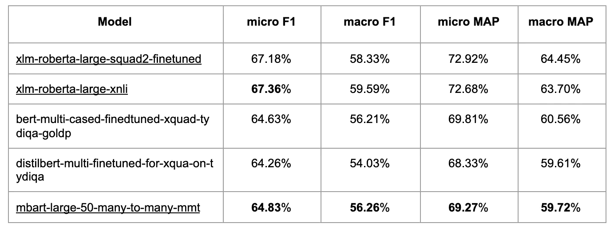

# Airbnb 客户支持中面向任务的对话式人工智能

> 原文：<https://medium.com/airbnb-engineering/task-oriented-conversational-ai-in-airbnb-customer-support-5ebf49169eaa?source=collection_archive---------1----------------------->

Airbnb 如何为自动化支持提供动力，以增强主人和客人的体验

[李剑锋](https://www.linkedin.com/in/gavin-li-64354117/)，[米娅赵](https://www.linkedin.com/in/mia-zhao-964a9213/)

客户支持(CS)可以成就或破坏游客的旅行体验。为了支持 Airbnb 的客人和主人社区，我们一直在大力投资开发智能 CS 解决方案，利用最先进的自然语言处理(NLP)、机器学习(ML)和人工智能(AI)技术。

在这篇博文中，我们将通过最近推出的一项名为“相互取消”的功能来介绍 Airbnb 的自动支持系统，该系统采用了最新的面向任务的对话式人工智能技术。我们将详细描述我们如何将业务问题框定为人工智能问题，我们如何收集和标记训练数据，我们如何设计和构建 ML 模型，以及这些模型如何部署在在线系统中。在每个步骤中，我们将讨论我们在该项目中面临的一些技术挑战，以及我们为应对这些挑战而创新的解决方案。

## 案例研究:相互抵消

在开发相互取消模式之前，客人需要涉及 CS 代理，即使他们已经与主人达成了取消预订的协议。这意味着问题需要更长的时间来解决，并且浪费了 CS 代理的宝贵时间。为了解决这个问题，我们开发了人工智能模型，帮助客人和主人自行解决取消和退款问题，而不涉及 CS 代理。这使主人和客人能够决定什么是最适合他们的，同时允许我们将 CS 代理的工作时间集中在最需要他们的地方。

在帖子的其余部分，我们将以相互取消功能为例，描述 Airbnb 面向任务的 AI 系统的技术组件。

# 系统结构

Airbnb 的智能支持平台团队开发尖端的人工智能技术，以最有效的方式帮助客人和主人解决他们的问题。基于我们建立的聊天机器人平台， [ATIS](/airbnb-engineering/using-chatbots-to-provide-faster-covid-19-community-support-567c97c5c1c9) ，我们的人工智能模型旨在学习和模仿人类代理如何提供热情有效的客户服务。热情而有效的客户关怀体验始于个性化和智能化的问题识别，旨在以最小的摩擦快速了解用户的情况、需求、问题和顾虑..一旦清楚地识别出问题，我们就动态地生成响应，并引导用户通过各种产品工作流来解决他们的问题，或者将他们发送给人工代理。

我们的智能客户支持产品被设计为“面向任务的对话系统”([臧等人 2020](https://arxiv.org/abs/2007.12720) ，[马多托等人 2020](https://arxiv.org/abs/2008.06239) )。近年来，面向任务的对话系统正获得越来越多的兴趣，为从虚拟助理到智能扬声器的人工智能产品提供动力。这些模型可以理解用户的意图(例如，“播放音乐”)，从对话中提取所需的参数(例如，“艺术家姓名和歌曲名称”)，提出问题以澄清细节(例如，“这首歌有两个版本，你喜欢播放哪一个？”)，并完成任务——同时与用户进行看似完全自然的对话。

Figure 1\. Airbnb’s Chatbot as a task-oriented dialog system. It detects user intent and generates appropriate responses and completes the task through actions.

# 作为面向任务的对话问题的客户支持

在现实世界的机器学习应用中，最关键的难题是如何将问题公式化。问题公式化比模型本身对产品的长期性能有更大的影响。在编写一行代码之前，需要做出许多决定和权衡。我们设计了一个多层问题检测和决策系统，以允许客户支持问题的可扩展性和领域特异性，如图 2 所示。

Figure 2\. A multi-layer user issue detection and decision-making model structure.

当用户在 Airbnb 聊天机器人中发送消息时，消息由第一层处理，即域分类模型。域分类模型确定消息属于哪个域，例如，旅行重新预订请求、取消退款请求或可以通过帮助文章推荐来回答的问题。如果相互取消域被预测为最可能的域，则系统触发相互取消流并进入第二层以进一步理解用户的意图并检查相互取消的资格。

对于相互取消，第二层有两个模型:基于问答的意向理解模型和“预期退款比例预测”模型。问答意图模型是在人工标记的数据集上训练的。“预期退款率预测”模型基于历史取消数据和代理商决定的退款率进行训练。退款率捕捉了旅行的许多重要特征，这些特征对于人工智能系统代表人类代理做出决定至关重要。

多层结构具有以下优点:

*   **可扩展**:允许系统扩展到新的领域，现有领域的特定领域模型不会受到新领域的影响。
*   **有效**:顶层模型是在人工标注的数据上训练出来的，这些数据通常是高质量的，但是收集起来往往很困难，也很昂贵。特定领域的模型大多是从历史数据中训练出来的，容易收集但有噪音，偏向于过去的用户行为。多层结构允许我们利用人为标记的数据来训练顶层域预测模型，并利用历史数据来训练特定于域的模型。

# 收集和标记训练数据

典型的面向任务的对话系统构建意图分类树，其中每个节点代表一些意图，并且节点是互斥的。Airbnb 的客户支持与其他共享经济客户支持类似，用户的问题包含复杂的问题，不像典型的在线市场那样结构化。如果可能的话，定义一个清晰的分类树来捕获所有用户的问题并将它们划分到一个分层树中是一个挑战。

此外，分类树通常意味着我们需要沿着一条路径从根节点遍历到叶节点。沿着路径，系统询问问题(例如，“您想取消预订吗？”)或收集更多信息(例如，“用户是客人还是主人？”)来决定继续哪个分支。在 Airbnb 的案例中，用户的问题要复杂得多，可能需要不同的问题序列来有效地识别问题。对于相互取消，第一个问题(“如果主人和客人彼此同意”)和第二个问题(“谁发起取消”)抓住了取消和退款过程的不同方面。设计一个简单明了的树形结构分类来涵盖所有用户问题并依靠沿树向下的路径来有效收集所需信息可能是一个挑战。相反，我们将意图理解建模为一个问答问题。

## 理解用户意图的问答模型

给定用户给我们 CS 平台的初始消息，我们问几个关于用户意图的问题，然后让人工代理/标签员回答这些问题。通过这种设置，我们收集数据并训练问答模型。经过训练的问答模型能够类似地回答这些问题。用户的问题可能有多个答案，用户经常试图从不同的角度描述问题。在某些情况下，问题可能是互斥的，而在其他情况下，问题可能包含冗余信息。

以下是我们询问贴标机团队的几个例子:

***用户给 Airbnb 的留言:***

*您好！我预订错了。以为是整个公寓出租，其实只是一个房间。我没注意。我立即与我的主机通话，她同意给我退款，并让我从应用程序中请求退款，但我找不到选项。*

***问题:谁发起的注销？***

***答案:***

1.  *主持人发起取消，或者主持人无法容纳客人*
2.  *客人发起取消*
3.  *未提及*

***问题:主客约定退款吗？***

***答案:***

1.  *主办方同意退款，退款金额*
2.  *主人和客人在退款金额上有些分歧*
3.  *主持人不同意退款或已经拒绝退款*
4.  *未提及退款的协议*
5.  *根本没有提到退款*

***问题:客人是在问如何才能得到自己想要的东西吗？(如何获得退款、做什么等)***

***答案:***

1.  *是*
2.  *否*

***问题:客人是在问怎么才能退款，如果可能，或者能退多少钱？***

***答案:***

1.  *是*
2.  *否*

具有多项选择答案的问答问题通常被建模为多类分类问题，其中每个类映射到一个问题。而[姜等(2020)](https://arxiv.org/abs/2011.03292) 提出了将 Q & A 问题建模为单项选择二分类问题的思想。在以这种方式建模问题时，问题的难度增加了。从多个选项中选择正确的答案已经不够了——模型必须将正确的选择预测为肯定的，将所有其他选择预测为否定的。这种方法使整合多个 Q & A 问题变得更加容易，使我们能够增加预训练规模。 [Khashabi 等人(2020)](https://arxiv.org/abs/2005.00700) 同样发现，统一多个预训练数据集有助于提高模型性能。

我们遵循单选二进制设置，这使我们能够统一来自不同领域的相关用户意图训练标签，以增加我们的训练数据的规模并提高性能。如上所述，我们不断审查数据标注质量，完善标注问卷设计。于是，就有了很多版本的标注问题，以及每个版本的答案。单选设置允许我们在培训中混合所有不同版本的培训问题。

图 3 和图 4 显示了单项选择和多项选择设置之间的差异，例如消息“*我的主办方同意全额退款，那么如果我现在取消，我可以获得全额退款吗？*”

Figure 3\. Single-choice Q&A model setup

Figure 4\. Multi-choice Q&A setup

图 5 显示了我们实验中的模型性能差异。单一选择问答设置在离线标注预测准确性和在线转换预测方面都优于传统的多类意图分类设置。

Figure 5\. Accuracy of single-choice vs. multi-class intent classification.

## 意向预测作为问答的优势和挑战

与传统的多类分类相比，问答设置使得数据标注更加易于管理。我们可以不断细化问卷设计，灵活合并不同维度、不同角度或者有冗余的问题。

在现实问题中应用机器学习的最大挑战之一是缺乏高质量的训练数据。从少量学习的角度来看，单项选择问答设置允许我们将许多功能构建到模型中，即使训练数据很少。该设置训练模型在用户消息、问题和答案中编码信息。该模型还可以从其他领域的相关问题中学习。由于这个原因，它有能力理解训练标签中的问题和一些新构造的、看不见的问题。

这种设置的缺点是它给服务延迟带来了很大的压力。例如，如果我们想使用模型回答五个问题，然后根据这五个问题采取行动，我们必须运行模型五次。在这篇文章的后面，我们将讨论如何减少模型延迟，包括使用 GPU。

# 模型设计和实现

我们使用自动编码器变压器作为模型架构。我们测试了各种型号选择作为主干。结果如下所示:

Figure 6\. Results on out-of-sample data from various intent classification models.

对于我们的大多数使用案例，Roberta 表现最好。然而，Roberta-base 和 Roberta-large 的表现因训练标签的规模而异。在我们的在线产品案例中，我们有大约 20K 个标签，Roberta-large 模型实现了最佳性能，是我们在生产中部署的模型。然而，对于 335M 参数，在给定延迟预算的情况下在线运行该模型非常具有挑战性。

为了提高该模型的性能，我们利用了三种关键技术:

*   用迁移学习预先训练我们的变压器模型；
*   翻译培训标签以利用多语言模型；和
*   结合多圈意图预测。

## 预培训

深度学习最近最关键的发展可能是迁移学习和预训练。它在几乎所有种类的 NLP、计算机视觉(CV)和自动语音识别(ASR)领域中支配着大多数最先进的模型。

我们广泛试验了不同的预训练方法，发现两种预训练方法在提高模型性能方面特别有效:

*   **领域内无监督掩蔽语言模型(MLM)预训练:**基于用户与我们的客户服务平台的对话、列表描述和帮助文章，我们构建了 1.08GB (152M 单词标记)的无监督训练语料库。这个语料库包含 14 种不同的语言，其中 56%是英语。如图 7 中的实验结果所示，域内 MLM 预训练有助于提高我们任务的模型性能。
*   **跨域任务 Finetune 预训练:**基于跨域数据集预训练 transformer 模型通常对许多任务都有帮助。在我们的用例中，它还能有效地提高意图检测的准确性。实验结果可以在图 8 和图 9 中找到。

Figure 7\. In-domain pre-training performance

Figure 8\. cross-domain task finetune pre-training performance.

Figure 9\. Multilingual task finetune pre-training performance.

在我们的意图理解问题中，许多具有挑战性的情况要求模型具有某种逻辑推理能力。类似于[于等(2020)](https://arxiv.org/abs/2002.04326) 在逻辑推理公开数据集上的发现，在 RACE 数据集上进行预训练对提高性能帮助最大。

## 多语言模型

Airbnb 客户支持服务于来自世界各地的用户，目前支持 14 种语言。包括法语、西班牙语、德语和葡萄牙语在内的顶级非英语语言约占请求的 30%。由于我们的模型面向说所有语言但标注数据主要是英语的用户，因此我们利用翻译的注释数据集和多语言模型 XLM-罗伯塔来提高所有语言的模型性能。

将训练标签翻译成其他语言是一种无监督的数据增强技术，在许多深度学习训练案例中被证明是有效的([谢等人，2020](https://arxiv.org/abs/1904.12848) )。我们将标记的英语训练语料库和标记的问题和答案翻译成其他顶级语言，并将其包括在训练数据中，以训练 XLM-罗伯塔模型。

我们还尝试在翻译文本上训练单语模型，以便基于公共预训练单语模型进行比较。结果显示，在翻译数据集上训练的多语言模型明显优于仅英语的训练数据集。模型性能与由翻译的注释数据集训练的单语模型相当。

Figure 10\. Multilingual vs. monolingual model performance.

## 结合多圈意图预测

当用户向 chatbot 提出相互取消请求时，我们从用户以前的对话中提取所有文本序列，并将以前消息和当前请求消息的文本序列连接在一起，作为输入到 transformer 模型的新文本序列。这作为一个**对话状态跟踪** ( [高等，2019](https://arxiv.org/abs/1908.01946) )模块来整合来自用户过去交互的信号，以更好地理解用户意图。我们试验了两种离线方法来更好地消耗该信号:1)将最后 N 轮消息作为附加特征添加到当前模型，以及 2)在每个消息阈值上计算多轮意向预测，并将最大意向得分添加到下游模型。

一个挑战是变换器模型的计算复杂度是序列长度的 O(n⁴，包括所有先前的转换。这种复杂性使得实时在线推断变得不可能。为了解决这个问题，我们提前离线异步处理历史对话，并存储预先计算的分数。在在线服务期间，该模型直接查询与用户相关联的预先计算的分数。

Figure 11\. Multi-turn intent prediction performance and latency.

# 在线服务

在线部署机器学习模型会带来一些重大挑战，需要以不同于离线世界的方式进行管理。

## 在线推理 GPU 服务

在线服务的一个挑战是模型在生产中的延迟。我们采取了两个关键步骤来解决延迟要求:1)支持 GPU 服务，以及 2)利用迁移学习。与上一节的讨论类似，迁移学习技术(如师生模型)用于减少在线推理所需的计算量。在本节中，我们主要关注 GPU 服务如何帮助我们应对这一挑战。

为了支持 GPU 推理，我们在三种不同的实例类型上使用 282M 参数对 transformer 模型进行了离线基准测试，这三种实例类型是 *g4dn.xlarge、p3.2xlarge 和 r5.2xlarge* 。图 12 显示了这些不同实例类型的延迟结果。随着输入消息长度的增长，CPU 和 GPU 之间延迟的总体趋势如图 13 所示。转移到 GPU 服务对在线延迟有显著影响，并且更具成本效益。

Figure 12\. GPU online serving latency for various instance types.

Figure 13\. Latency using CPU vs. GPU with input message length increasing.

我们后来的在线实验结果(图 14)也显示了在 transformer 模型上从转换到 GPU 推理的延迟改进。使用大约 1.1B 的参数和 100 字的平均输入消息长度，我们能够在 p95 上实现大约 60 毫秒，单次转换快 3 倍，批量转换快 5 倍。

Figure 14\. Model latency in production before and after switching from CPU to GPU .

切换到 GPU 不仅改善了延迟，还允许我们并行运行多模型评分。我们利用 PyTorch 平台获得更好的可伸缩性，该平台内置了对非阻塞模型评分的支持。

## 情境强盗和强化学习

在线服务的第二个挑战是根据新用户的在线行为调整和优化 ML 模型。正如我们在前面的章节中所描述的，初始模型的训练数据是在模型部署之前从产品流中的历史用户交互中收集的。部署模型后，与收集训练数据时的体验相比，用户与系统的交互方式非常不同。如果每天的流量足够大，我们总是可以重新标记新数据，并使用反映更新的用户行为的新数据来更新模型，或者直接对 N 个策略执行多变量测试。但是 Airbnb 的 CS 聊天机器人流量相对于搜索排名等其他 ML 系统来说还是比较小的。需要很长时间才能看到任何模型变化的影响(使用新数据重新训练模型或超参数变化)。

为了解决低流量的挑战，我们使用**基于上下文土匪的强化学习** ( [比提等人，2019](https://arxiv.org/abs/1802.04064)； [Agarwal et al .，2017](https://arxiv.org/abs/1606.03966) )选择最佳模型和最合适的阈值。情境强化学习通过最大化回报和最小化遗憾来探索所有的替代问题。这允许我们通过动态平衡探索和利用来学习新的行为。

我们通过产品中的三种不同行为来看待这个问题:

*   a0:用户未被引导通过相互取消流程
*   a1:用户被引导到已经与主人就退款达成一致的客人的相互取消用户界面
*   a2:如果不清楚主人和客人是否达成了共同协议，用户将被定向到共同取消用户界面

我们的奖励函数是*相互取消流量进入率*和*接受率*。对于任何给定的动作，在时间步长𝑡的回报可以被表示为:

其中 c 表示是否没有进入/接受相互取消流程。

然后我们利用 greedy-epsilon 作为我们的第一个勘探策略。如果处于探索模式，我们会根据策略的偏好计算每个动作的概率，并根据机会选择它。如果处于剥削模式，我们选择最佳策略。我们基于一组记录的(x，a，r，p)元组来计算模型的阈值。我们使用自我标准化的反向倾向评分(IPS)估计值( [Swaminathan 和 Joachims 2015](https://papers.nips.cc/paper/2015/hash/39027dfad5138c9ca0c474d71db915c3-Abstract.html) )来评估每项政策:

在生产中，这种方法成功地帮助我们探索了许多不同的模型和参数选项，并充分利用了有限的在线流量。

# 结论

在这篇文章中，我们介绍了我们如何利用最先进的机器学习和人工智能模型来构建支持产品，以更好地满足客人和主人的需求。我们描述了如何利用基于单一选择问答的模型、大规模预训练、多语言模型、多回合对话状态跟踪和 GPU 服务，并成功应对技术挑战。

有兴趣应对机器学习和人工智能领域的挑战吗？

我们邀请您访问我们的[职业页面](https://careers.airbnb.com)或申请以下相关机会:

[**员工数据架构师，**社区支撑平台](https://grnh.se/36f092141us)

[**员工软件工程师—机器学习建模平台**](https://grnh.se/ae09e08b1us)

[**机器学习工程师，搜索排名**](https://grnh.se/6648b3961us)

# 承认

感谢 Cassie Cao、、Bo Zeng、、Young、Shahaf Abileah、Pratik Shah、Brian Wang、Hwanghah Jeong、Amy Guo、Vita Papernov、Courtney Nam、Aliza Hochsztein、Mike Hinckley、Dong、Jan Castor、Ivy Cui、Lucia Ciccio 对相互撤销工作流开发、ERF 分析和产品发布做出的巨大贡献。特别感谢 Alex Deng 对上下文相关的 bandit 和强化学习工作的帮助；很多设计最初都是 Alex 的想法。我们还要感谢 Atul Ktal、Bahador Nooraei、Su、Alfredo Luque 对 ML 基础设施在 GPU 推理方面的支持。另外还要感谢 PyTorch、HuggingFace Transformers 等开源 ML 库的贡献者，让我们受益匪浅。最后，我们要感谢 Ari Balogh、Tina Su、Andy Yasutake 和 Joy Zhang 在客户支持平台上利用机器学习方面的领导支持。

# 参考资料:

1.  Zang X，Rastogi A，Sunkara S，Gupta R，Zhang J，Chen J (2020) MultiWOZ 2.2:具有附加注释校正和状态跟踪基线的对话数据集。更正 abs/2007.12720
2.  蒋，吴，龚，程，孟，林，陈，李(2020)用单项选择决策和迁移学习提高机器阅读理解能力。CoRR abs/2011.03292
3.  哈沙比 D，闵 S，Khot T，萨巴瓦尔 A，塔菲德 O，克拉克 P，哈吉希尔兹 H (2020) UnifiedQA:用单一质量保证系统跨越格式界限。载于:Cohn T，He Y，Liu Y(eds)2020 自然语言处理经验方法会议论文集:发现，EMNLP 2020，在线活动，2020 年 11 月 16-20 日。计算语言学协会，第 1896-1907 页
4.  俞伟，江泽，董毅，冯军(2020) ReClor:一个需要逻辑推理的阅读理解数据集。参加:第八届学习代表国际会议，ICLR 2020，埃塞俄比亚亚的斯亚贝巴，2020 年 4 月 26-30 日。OpenReview.net
5.  Madotto A，Liu Z，Lin Z，Fung P (2020)将语言模型作为面向任务的对话系统的少量学习器。更正 abs/2008.06239
6.  谢 Q，戴 Z，Hovy EH，Luong T，乐 Q (2020)用于一致性训练的无监督数据增强。《神经信息处理系统的进展》第 33 卷:2020 年神经信息处理系统年会，NeurIPS 2020，2020 年 12 月 6 日至 12 日，虚拟
7.  比提、阿尔贝托、阿莱克·阿加瓦尔和约翰·兰福德。一场有背景的强盗烘焙比赛。微软研究院。2019 年 3 月 21 日
8.  Agarwal、Alekh、Sarah Bird、Markus Cozowicz、Luong Hoang、John Langford、斯蒂芬·李、李甲玑、Dan Melamed、Gal Oshri、Oswaldo Ribas、Siddhartha Sen 和 Alex Slivkins。以较低的技术负债做出上下文决策。ArXiv.org。2017 年 5 月 9 日
9.  Swaminathan A，Joachims T (2015)反事实学习的自标准化估计量。在:Cortes C，Lawrence ND，Lee DD，Sugiyama M，Garnett R (eds)《神经信息处理系统进展》第 28 卷:2015 年神经信息处理系统年会，2015 年 12 月 7 日至 12 日，加拿大魁北克省蒙特利尔。第 3231-3239 页
10.  高，Sethi A，Agarwal S，Chung T，Hakkani-Tür D (2019)对话状态跟踪:一种神经阅读理解方法。In: Nakamura S，Gasic M，Zuckerman I，Skantze G，Nakano M，Papangelis A，Ultes S，吉野 K(eds)2019 年 9 月 11 日至 13 日在瑞典斯德哥尔摩举行的 SIGdial 2019 年第 20 届年度会议关于话语和对话的会议录。计算语言学协会，第 264-273 页

所有产品名称、标识和品牌都是其各自所有者的财产。本网站中使用的所有公司、产品和服务名称仅用于识别目的。使用这些名称、标志和品牌并不意味着认可