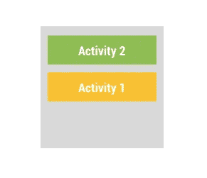

# 任务和后台堆栈

> 原文：<https://medium.com/androiddevelopers/tasks-and-the-back-stack-dbb7c3b0f6d4?source=collection_archive---------1----------------------->

当你点击应用程序的启动器图标时，实际上会发生什么？如果你说“我的应用启动了”，你在技术上是正确的，最好的一种正确。为了更深入一点，理解什么是**任务**以及它如何与一个叫做后退按钮的小东西交互是有帮助的。

# 任务

任务是围绕一堆活动的**的元数据和信息的集合(通过查看 [*RecentTaskInfo*](http://developer.android.com/reference/android/app/ActivityManager.RecentTaskInfo.html?utm_campaign=android_series_tasks_back_stack_051216&utm_source=medium&utm_medium=blog) 类，您可以看到确切的数据类型)。**

因此，当你点击应用程序的启动器图标时，系统实际上正在做的是寻找一个先前存在的任务(由它指向的意图和活动决定)来恢复——让你回到你刚才所在的位置。如果没有找到现有的任务，那么创建一个新的任务，使用您新启动的活动作为任务的**后台堆栈**上的基本活动。

# 背面堆栈

正如您可能想象的那样，任务的 back stack 与 back 按钮绑定在一起，但是它是双向的。当您使用[*start Activity()*](http://developer.android.com/reference/android/content/Context.html?utm_campaign=android_series_tasks_back_stack_051216&utm_source=medium&utm_medium=blog#startActivity(android.content.Intent))开始一个新的活动时，也就是(默认情况下)将新的活动推送到您的任务上，导致前一个活动暂停(如果新的活动完全掩盖了前一个活动，则停止)。



A simple back stack

“后退”按钮(默认情况下)然后“弹出”堆栈，在最顶层的活动上调用[*【finish()*](http://developer.android.com/reference/android/app/Activity.html?utm_campaign=android_series_tasks_back_stack_051216&utm_source=medium&utm_medium=blog#finish())，销毁它并将其从后面的堆栈中移除，然后返回到上一个活动。重复这个过程，直到后面的堆栈里什么都没有了，你又回到了发射器。

# 后面的堆栈和片段

后台堆栈不仅适用于活动:它也适用于[片段](http://developer.android.com/guide/components/fragments.html?utm_campaign=android_series_tasks_back_stack_051216&utm_source=medium&utm_medium=blog)。当您提供一个[片段事务](http://developer.android.com/guide/components/fragments.html?utm_campaign=android_series_tasks_back_stack_051216&utm_source=medium&utm_medium=blog#Transactions)来添加、替换或删除 UI 中的片段时，您可以使用 [addToBackStack()](http://developer.android.com/reference/android/support/v4/app/FragmentTransaction.html?utm_campaign=android_series_tasks_back_stack_051216&utm_source=medium&utm_medium=blog#addToBackStack(java.lang.String)) 来有效地将[片段事务](http://developer.android.com/reference/android/support/v4/app/FragmentTransaction.html?utm_campaign=android_series_tasks_back_stack_051216&utm_source=medium&utm_medium=blog)添加到后台堆栈中。

这样，当点击 back 按钮时，FragmentTransaction 被反转(删除添加的片段，恢复替换的片段，或者重新添加删除的片段)。添加到后台堆栈的每个事务都被依次反转，直到它们都被删除，这时默认的活动结束行为再次生效。

# 后退不是唯一的导航按钮

当然，后退按钮并不是现代 Android 设备上唯一的导航按钮(不，我们不再谈论[菜单按钮](http://android-developers.blogspot.com/2012/01/say-goodbye-to-menu-button.html?utm_campaign=android_series_tasks_back_stack_051216&utm_source=medium&utm_medium=blog))。

home**按钮可能是最简单的，因为它只有一个焦点:它把当前的任务放到后台，带你回到你的启动器。**

> **注意:**将您的任务移到后台不会**而**杀死您的任务(尽管最顶层的活动肯定是暂停+停止的):它将继续存在，直到**进程**被杀死。在 [**“谁生谁死？”中了解更多关于流程优先级以及何时可以终止您的应用的信息**博文](/google-developers/who-lives-and-who-dies-process-priorities-on-android-cb151f39044f?utm_campaign=android_series_tasks_back_stack_051216&utm_source=medium&utm_medium=blog)。

如你所想，**总览**按钮(以前的 recents)将你带到[总览屏幕](http://developer.android.com/guide/components/recents.html?utm_campaign=android_series_tasks_back_stack_051216&utm_source=medium&utm_medium=blog)。这是 Android 世界的“应用切换器”——在这里，你可以看到你最近的任务，并能够选择一个将其带回前台。

# 好吧，就这样。没什么可看的了。

整洁，*、startActivity()* 或 *addToBackStack()* 以及默认的后退按钮行为。这里没有什么特别的，但也没有什么令人困惑的——这些对称的、一致的行为作为缺省值。在大多数情况下，**你应该使用这个默认行为**。

在您运行并直接覆盖[*on back pressed()*](http://developer.android.com/reference/android/app/Activity.html?utm_campaign=android_series_tasks_back_stack_051216&utm_source=medium&utm_medium=blog#onBackPressed())之前，您可能需要考虑一些特定的情况:

## 防止后退按钮疲劳

当然，当你需要按 10 次以上才能离开你所在的位置时，后退按钮就失去了一些光彩。很容易避免这种情况的一种情况是，当您正在启动与当前相同的活动时。

您的活动可以在 Android 清单中使用***launch mode = " single top "***或者您可以添加 [*Intent，而不是创建同一活动的多个副本的堆栈(从内存压力和后退按钮疲劳的角度来看，这都不太有趣)。*](http://developer.android.com/reference/android/content/Intent.html?utm_campaign=android_series_tasks_back_stack_051216&utm_source=medium&utm_medium=blog#FLAG_ACTIVITY_SINGLE_TOP)FLAG _ ACTIVITY _ SINGLE _ TOP 达到你的意图。

这可以防止在后台堆栈的顶部出现同一活动的多个副本。相反，您将得到一个对[*onNewIntent()*](http://developer.android.com/reference/android/app/Activity.html?utm_campaign=android_series_tasks_back_stack_051216&utm_source=medium&utm_medium=blog#onNewIntent(android.content.Intent))的回调，带有新的*意图*和任何附加内容。

> **注意**:仔细阅读 *onNewIntent()* 上的文档:[*getIntent()*](http://developer.android.com/reference/android/app/Activity.html?utm_campaign=android_series_tasks_back_stack_051216&utm_source=medium&utm_medium=blog#getIntent())*仍然会返回原来的意图，除非你用 [*setIntent()*](http://developer.android.com/reference/android/app/Activity.html?utm_campaign=android_series_tasks_back_stack_051216&utm_source=medium&utm_medium=blog#setIntent(android.content.Intent)) 覆盖它。*

## *后台堆栈和通知*

*如果你正在创建一个指向应用程序内部某个活动的通知，有一种情况你应该避免:点击返回按钮直接退出到启动程序。当您提供的*pending content*启动一个只有一个活动的新任务时，就会出现这种情况。除非你的通知是打开你的启动器活动，那不是你想要的。**用户应该在他们应该在的确切位置，就像他们自己导航到应用程序的那个部分一样。**你的通知正好给他们省了中间步骤。*

*对于如此重要的事情，有一个为你做所有工作的类是很好的。进入[*TaskStackBuilder*](http://developer.android.com/reference/android/support/v4/app/TaskStackBuilder.html?utm_campaign=android_series_tasks_back_stack_051216&utm_source=medium&utm_medium=blog):一个专门为你处理标志和回栈的类，正是这种情况；*

```
*// Construct the Intent you want to end up at
Intent detailActivity = new Intent(this, DetailActivity.this);
// Construct the PendingIntent for your Notification
TaskStackBuilder stackBuilder = TaskStackBuilder.create(this);
// This uses android:parentActivityName and
// android.support.PARENT_ACTIVITY meta-data by default
stackBuilder.addNextIntentWithParentStack(detailActivity);PendingIntent pendingIntent = stackBuilder
  .getPendingIntent(0, PendingIntent.FLAG_UPDATE_CURRENT);*
```

*您会注意到使用了[*addNextIntentWithParentStack()*](http://developer.android.com/reference/android/support/v4/app/TaskStackBuilder.html?utm_campaign=android_series_tasks_back_stack_051216&utm_source=medium&utm_medium=blog#addNextIntentWithParentStack(android.content.Intent))方法——这是构建整个任务堆栈的捷径，只需传入您已经从中创建了 *PendingIntent* 的正常意图。但是它有一个要求:每个活动都需要在 Android 清单中声明其父活动(参见文档中的[示例)。](http://developer.android.com/training/notify-user/navigation.html?utm_campaign=android_series_tasks_back_stack_051216&utm_source=medium&utm_medium=blog#DirectEntry)*

*如果默认设置在您的情况下不起作用，您也不需要扔掉*TaskStackBuilder*:[edit intentat()](http://developer.android.com/reference/android/support/v4/app/TaskStackBuilder.html?utm_campaign=android_series_tasks_back_stack_051216&utm_source=medium&utm_medium=blog#editIntentAt(int))允许您检索特定的意图并设置动作、设置数据 URI 或添加额外内容。如果您需要更多的定制，您可以完全放弃使用 **ParentStack()* 方法，而使用 [*addNextIntent()*](http://developer.android.com/reference/android/support/v4/app/TaskStackBuilder.html?utm_campaign=android_series_tasks_back_stack_051216&utm_source=medium&utm_medium=blog#addNextIntent(android.content.Intent)) 来直接添加您特定情况下所需的确切意图。*

> ***注意:**如[文档](http://developer.android.com/training/notify-user/navigation.html?utm_campaign=android_series_tasks_back_stack_051216&utm_source=medium&utm_medium=blog#ExtendedNotification)中所述，您可以从通知中启动的另一种类型的活动是特定于通知的活动(即，不是您的正常应用程序流中的活动)。这方面的一个例子可能是 Hangout 在 Android N 之前使用的类似直接回复的活动。这些活动通常是半透明的——你可以在你的活动下面看到其他应用程序——通常没有任何合成的后台堆栈或新任务与之相关联。*

# *任务和后台堆栈一起工作*

*记住这里最重要的部分是可预测的。如果你在搞乱你的 back stack，确保非常彻底地测试*以确保最好的用户体验。**

**# BuildBetterApps**

**关注 [Android 开发模式集](https://plus.google.com/collection/sLR0p?utm_campaign=android_series_tasks_back_stack_051216&utm_source=medium&utm_medium=blog)了解更多！**

****