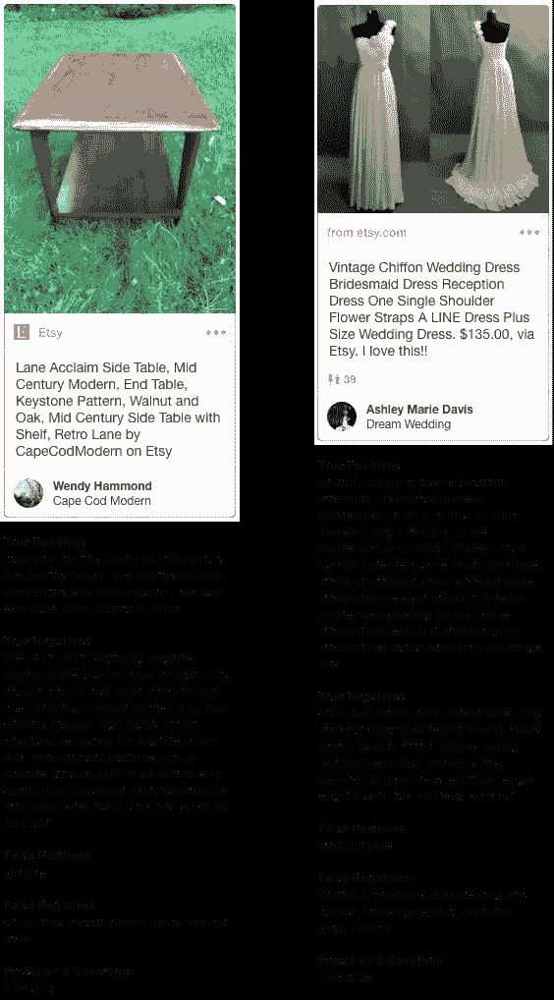

# 品味图第 1 部分:给大头针分配兴趣

> 原文：<https://medium.com/pinterest-engineering/taste-graph-part-1-assigning-interests-to-pins-9158b4c25906?source=collection_archive---------1----------------------->

布莱恩·约翰逊| Pinterest 知识工程主管

品味图是一个技术和数据的集合，它定义了一个用于理解我们的内容、用户和合作伙伴的通用词汇。它帮助我们了解一个人的兴趣和偏好如何随着时间的推移在食物、时尚、家居装饰等方面发生变化。拥有超过 1000 亿个 pin 和每月超过 2 亿活跃用户的不断增长的用户群，口味图每天都在深化和扩展。多年来，我们进行了大量投资，以更好地了解图钉以及它们与保存过图钉的用户之间的关系。使用品味图来提高我们的理解，使我们能够在我们的应用程序中提供更多相关的推荐，无论是在[首页反馈](/@Pinterest_Engineering/pinnability-machine-learning-in-the-home-feed-64be2074bf60)、[相关引脚](/the-graph/applying-deep-learning-to-related-pins-a6fee3c92f5e)还是[推广引脚](https://business.pinterest.com/en/targeting)。

我们最近重建了我们对口味图中内容的理解方式，这样我们不仅可以根据人们感兴趣的内容，还可以根据他们的*口味*来提供更加个性化的推荐和其他结果。今天，我们宣布，我们正在利用在整个 Pinterest 上实现个性化的相同技术来增强我们广告的相关性和针对性。通过将品味图技术融入到我们的兴趣定位中，我们将广告客户可以定位的兴趣数量扩大到了 5000 多个，增长了 10 倍。在早期测试中，许多广告商看到点击率增加了 50%以上，而点击费用下降了 20%以上。

在本帖中，我们将讨论品味图的一个基本部分——我们如何给大头针分配兴趣。

## 味觉图组件

就上下文而言，有 3 个主要部分组成了味觉图:

1.  图钉:我们需要了解图钉是什么。我们做到这一点的方法之一是对每个 Pin 的元数据信号进行关联和评分，包括用户活动、兴趣、类别关系、人口统计相似性、图遍历和向量空间嵌入。
2.  **用户**:我们对每个用户的信号进行关联、聚合和评分，了解他们的兴趣所在。这些信号被用户与图钉接触的新近性和频率增强。
3.  **兴趣**:我们创建一个多层次的兴趣图。这些是经常遇到的兴趣的子集(数千个)，按照相似性和用户活动组织成层次结构。

## 将兴趣分配给图钉

兴趣是 Pinterest 的基本信号之一，会在我们所有的产品表面产生涟漪效应。我们将兴趣定义为单词，比如“树”，或者短语，比如“苹果电视”或者“浪漫的旅行目的地”在将[利益](/@Pinterest_Engineering/building-the-interests-platform-73a3a3755c21)分配给图钉的[之前](/@Pinterest_Engineering/creating-serving-amp-storing-data-for-discovery-3f9f9ce7c139)工作的基础上，团队近期的重点领域包括:

*   提高精度
*   扩大个人兴趣
*   扩大语言覆盖面
*   提高空间效率

概括地说，我们用于为 pin 分配兴趣的流程是:

*   **提取引脚连接中所有引脚的**文本(引脚连接是具有相同图像的引脚的集合)
*   **通过标记化和词条化来规范化**文本片段
*   **用机器学习模型对**兴趣评分

让我们来看一下这些步骤。

## 提取

图钉不仅仅是图像。它们是来自不同网页的动态、丰富的数据集合，元数据随着时间的推移而演变。


一个引脚连接可能包含数千个共享同一图像的引脚。对于每个 Pin，我们收集以下文本及其来源。文本是机器学习分类器中的一个重要特征，我们将在下面进一步讨论。

**Pin 文本**

*   标题
*   描述
*   链接文本
*   董事会名称
*   链接替代文本
*   图像标题
*   页面标题
*   页面元标题
*   页面元描述
*   页面元关键字

结构化数据，如[Schema.org 文本](http://schema.org/Recipe)，Pinterest 支持多个类别特定模式，对于食谱，该数据可能包括:


这里的要点不是要完全列举一个 Pin 的所有可能的文本来源，而是要说明一个 Pin 是一个丰富的文本数据源。

## 使标准化

我们处理 PinJoin 中每个 Pin 的文本，并创建一组适合机器学习评分的特征。

```
for each pin in pinjoin: for each text_source in pin: extract interests from text_source
```

我们通过对文本进行词条化，然后将其与字典进行匹配，从文本中提取兴趣。例如，“汽车”、“汽车”、“汽车的”和“汽车的”都被解释为汽车。

这里有一个来自 nlp.stanford.edu 的非常简短的词汇化示例:

```
am, are, is => becar, cars, car's, cars' => carthe boy's cars are different colors => the boy car be differ color
```

一旦我们将文本词条化，我们就将它与兴趣词典进行匹配。这允许我们只匹配高质量、频繁的文本，并丢弃随机文本和黑名单文本，如垃圾邮件。这给了我们一组(兴趣 ID，来源，频率)三元组。


我们也对空间效率感兴趣。在管道的这一点上，我们删除了兴趣文本和语言(上面的*斜体*)。仅使用 ID 继续处理和存储。数字标识显著提高了处理速度，减少了存储空间需求。兴趣原文和语言可以在兴趣词典中通过 ID 查找。我们的英语词典目前有大约 300 万人感兴趣，其中大约 50%在使用。

还有其他技术可以用来进一步扩展或折叠与 PinJoin 相关的兴趣集(我们将在以后的文章中介绍)。这些包括同义词、相似大头针、相邻大头针和向量空间嵌入。

## 得分

现在，我们准备为 PinJoin 选择最佳兴趣。在 PinJoin 级别，我们可能有数千个 pin 和数万个兴趣。我们使用监督机器学习对这些兴趣进行评分。我们要寻找的是每个 PinJoin 的每种语言的前 N 个兴趣。我们根据经验选择了 N=25，因为从成本/收益的角度来看<10 provides a sparse signal and more than 25 is too expensive. At our scale, data of low value takes too much time and space to process, serve and store.

Model training is based on a crowdsourced human judgment data set where we ask people to tell us whether a keyword is relevant to a particular Pin. For example, in the image below, a human judge would say that “San Francisco” is relevant to the Pin, “island” would be judged irrelevant.


**兴趣评分功能(示例)**

*   单词嵌入(内聚)
*   Pin、公告板和链接文本的频率计数(流行度)
*   标准化 TF-IDF 得分(唯一性)
*   类别相似性——兴趣属于相同或相似的类别吗(内聚性)
*   文本中的位置(重要性)
*   白名单(维基百科标题、垂直词汇表/分类法、实体词典)
*   图形查询(内聚)
*   多元化(规范化)
*   黑名单
*   主要问题(重要性)

**建模** 我们尝试了各种模型，包括逻辑回归、支持向量机、决策树、随机森林和简单的前馈网络。为了简单和结果质量，我们选择使用逻辑回归。

**错误分析和评估度量** 离线度量是必不可少的。我们使用人类判断数据来促进快速离线迭代和评估。我们总是在全面投产前进行在线实验，以验证离线结果并衡量现实世界的收益。

**样本结果**



## 结果

结果不错，但仍有改进的余地。我们将精确度从 71%提高到了 79%。平均来说，我们对每种语言的每种 Pin 码有 8 个兴趣，对我们更受欢迎的 Pin 码有更高的覆盖率。我们目前有 32 种语言的趣味词典，其中 23 种语言正在生产中。

## 包裹

让我们用一点幽默来结束吧。大型数据集、出色的人类监管、自然语言处理和机器学习可以提供巨大的兴趣标签和 Pinterest 上可见的优秀推荐。


敬请关注 Taste Graph 博客的后续文章，我们将介绍如何为用户分配兴趣，以及如何将兴趣映射到一个层次结构中。

鸣谢:感谢所有帮助过这个项目并提供了宝贵反馈的同事。这些团队包括但不限于 John、Andrew、Arun、Heath、Poorvi、Luke、Davina、Jason、知识团队和内容团队。布莱恩于 2017 年加入 Pinterest，担任知识主管。他之前在易贝、Handspring、Excite@Home、Synopsys 和 T 贝尔实验室工作。Brian 在马里兰大学获得了计算机科学博士学位。

这篇博客文章详述了以下文章:

*   [搭建利益平台](/@Pinterest_Engineering/building-the-interests-platform-73a3a3755c21)，2014 年 5 月 16 日
*   [创建、服务&为发现存储数据](/@Pinterest_Engineering/creating-serving-amp-storing-data-for-discovery-3f9f9ce7c139)2014 年 3 月 6 日