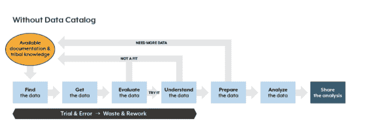

# 测试数据目录

> 原文：<https://medium.com/globant/tasting-a-data-catalog-2099b44a2cc0?source=collection_archive---------0----------------------->

# 介绍

如今，人们普遍认为，与其他投资和信息技术使用相比，采用数据驱动决策的公司可以提高 5-6%的生产率。(1)

尽管世界各地生成和收集的数据量呈指数级增长(一些报告预测，到 2025 年，随着 IP 流量的大规模增加，全球数据将增长 61%，这主要是由于物联网设备流量的使用(2) (3))，但人们担心公司比以往任何时候都更少受数据驱动。

随着可用数据越来越多，获取和处理数据的成本越来越低，是什么阻止了组织使用技术来提高组织的数据驱动力？

这是当今数据挑战与回收行业每天必须面对的问题之间的一个很好的对比。

由于**清理**倾倒在回收厂的袋装塑料、纸板、垃圾和金属的混合垃圾的高成本，生产可用物品的成本非常高。这里最大的错误是假设一个企业可以接受你给它的任何东西，并用它产生一个有利可图的产品。(4)

证据表明，更精确和准确的信息应该有助于在决策中更多地使用信息，并最终导致更高的绩效。能够收集更多信息或促进组织内更有效的信息传播的技术应该能够降低成本并提高绩效。

在这种情况下，数据目录作为一种基本工具应运而生，以确保用于组装新数据产品的材料适合这一预期用途，从而生产出高质量的最终产品。

# 定义数据目录

数据目录有多种定义。

从商业角度来看:

“数据目录通过数据集的发现、描述和组织来维护**数据资产**的清单。该目录为数据分析师、数据科学家、数据管家和其他数据消费者**提供了上下文，以找到并理解相关数据集，从而提取业务价值**(5)

或者从更技术性的角度来看:

数据目录被定义为元数据的集合，与数据管理和搜索工具相结合，充当可用数据的清单，**提供信息来评估数据的预期用途健康状况**。

一个定义是对另一个定义的补充。如果数据对于预期用途是正确的，那么它应该被视为需要评估的资产。这意味着特定数据集可能是特定数据产品的正确输入，但没有足够的数据或质量用于另一个产品。

**数据目录需要什么？**

由于任何组织中的数据都分布在多个来源中，并且具有不同程度的可访问性，因此捕获相关元数据的集中式目录是必不可少的。该目录应包含:

*   数据在哪里(例如数据库、excel 文件、blob 存储)
*   含义(例如，列描述、数据质量注释)
*   如何使用它(例如，建议的连接、示例查询)
*   谁生产/使用/了解它？

许多目录已经开始使用来自源系统的事务日志来发现谁在产生/使用特定的数据集。这是一种不同的方式来找到一些数据的参考对象，并了解生态系统是否使用了数据集，以及使用了多少，而不需要任何人为干预。(4)

数据目录的一些例子是:Collibra，Waterline，Alation，Amundsen。

下面是一个类似 Alation 的数据目录的示例:

# 为什么需要数据目录？

如果没有目录，分析师通过检查文档、与同事交谈、依靠人们的知识或简单地使用熟悉的数据集(因为他们知道这些数据集)来寻找数据。

由于元数据提供了上下文和信息，这使得组织可以根据它的含义进行调整。缺乏与数据含义相关的协议是减缓新的有价值的数据产品的创造的原因之一。

数据目录充当桥梁，将多个数据工具、数据库和系统链接在一起，绑定数据生态系统。(7)

这是因为企业数据目录是数据赋能的真正基础，而不仅仅是索引所有信息的地方。企业数据目录统一了人员、数据和分析，使得构建数据驱动的文化更加容易。(6)

借助数据目录，分析人员能够快速搜索和查找数据，查看所有可用的数据集，评估和明智地选择要使用的数据，并高效、自信地执行数据准备和分析。有了这一点，就有可能开始梦想将典型的 80/20 数据科学问题变成 20/80，即分析师 20%的时间用于寻找和准备数据，80%用于分析。(8)

# 数据目录是如何构建的？

*   评估组织所有数据库中的元数据，以确定数据表、文件和数据库，然后将元数据合并到数据目录中。
*   将所有数据点的描述放入数据目录并创建配置文件，以便数据消费者能够理解数据。
*   确定跨数据库的数据之间的关系，以在数据目录中创建链接，从而使查询结果更加可靠。
*   跟踪数据沿袭以了解原始数据及其随时间向当前状态的转换。这有助于解决分析错误。
*   通过直观的系统组织数据，按照用户类型或使用频率进行标记和/或排序。
*   实施数据安全措施，如访问控制和数据去标识，以确保正确的用户在正确的时间访问正确的信息。(11)

# 数据目录的优势

*   提高数据效率
*   改进的数据环境
*   降低出错风险
*   改进的数据分析
*   建立一种通用的商业语言

下图详细描述了这些优势。

如您所见，数据目录避免了与对可用数据了解不多或“一无所知”相关的重复工作和时间浪费。

# 推论

传统的数据库系统要求用户知道数据源文档的位置，以便理解其预期用途。很多时候这种信息是没有的。

数据目录是自文档化的，文档与其所记录的数据并存，而不是在单独的系统中。(10)

然而，最大的价值通常体现在对分析活动的影响上。但是，今天的业务和数据分析师经常盲目工作，看不到现有的数据集、这些数据集的内容以及每个数据集的质量和有用性。他们花费太多时间寻找和理解数据，经常重新创建已经存在的数据集。他们经常处理不充分的数据集，导致不充分和不正确的分析，当然，需要在获得不充分的数据产品后再次开始该过程。

数据目录通过为数据消费者提供单一参考源和访问所需数据的简单方式，支持自助式分析的数据发现和探索。

此外，数据目录是生态系统中需要记录数据质量的地方。

数据质量是我们目前面临的挑战之一，在数据产品创建过程中，这是一项非常耗时的活动。

将它作为数据操作的一部分包含在开发生命周期中，将会提高任何想要成为数据驱动的公司的生产力。

# 参考

1.  [https://ssrn.com/abstract=1819486](https://ssrn.com/abstract=1819486)。
2.  [https://www . network world . com/article/3325397/IDC-expect-175-zettabytes-of-data-world wide-by-2025 . html](https://www.networkworld.com/article/3325397/idc-expect-175-zettabytes-of-data-worldwide-by-2025.html)。
3.  [https://www . network world . com/article/3323063/Cisco-predicts-near-5-zetta bytes-of-IP-traffic-year-by-2022 . html](https://www.networkworld.com/article/3323063/cisco-predicts-nearly-5-zettabytes-of-ip-traffic-per-year-by-2022.html)。
4.  [https://medium . com/swlh/empower-data-owners-to-be-a-data-driven-enterprise-39a 1271 ce4f](/swlh/empower-data-owners-to-become-a-data-driven-enterprise-39a1271ce4f)。
5.  [https://www . Gartner . com/doc/3837968/data-catalogs-new-black-data](https://www.gartner.com/doc/3837968/data-catalogs-new-black-data)
6.  https://data.world/blog/what-is-a-data-catalog/
7.  [https://data . world/blog/Gartner-names-data-world-a-challenger-in-the-magic-quadrant-for-metadata-management-2020/](https://data.world/blog/gartner-names-data-world-a-challenger-in-the-magic-quadrant-for-metadata-management-2020/)
8.  [https://www . infoworld . com/article/3228245/the-80-20-data-science-dilemma . html](https://www.infoworld.com/article/3228245/the-80-20-data-science-dilemma.html)。
9.  [https://www.alation.com/blog/what-is-a-data-catalog/](https://www.alation.com/blog/what-is-a-data-catalog/)
10.  [https://www.alation.com/modern-data-catalog-features/](https://www.alation.com/modern-data-catalog-features/)
11.  [https://www.immuta.com/articles/what-is-data-catalog/](https://www.immuta.com/articles/what-is-data-catalog/)